<properties 
    pageTitle="Mithilfe von Azure Portal Azure Ressourcen | Microsoft Azure" 
    description="Verwenden Sie Azure-Portal und Azure Ressourcen verwalten, um Ihre Ressourcen zu verwalten. Arbeiten mit Dashboards Ressourcen überwacht werden" 
    services="azure-resource-manager,azure-portal" 
    documentationCenter="" 
    authors="tfitzmac" 
    manager="timlt" 
    editor="tysonn"/>

<tags 
    ms.service="azure-resource-manager" 
    ms.workload="multiple" 
    ms.tgt_pltfrm="na" 
    ms.devlang="na" 
    ms.topic="article" 
    ms.date="09/12/2016" 
    ms.author="tomfitz"/>

# Azure-Portal verwalten

> [AZURE.SELECTOR]
- [Azure PowerShell](../powershell-azure-resource-manager.md)
- [Azure CLI](../xplat-cli-azure-resource-manager.md)
- [Portal](resource-group-portal.md) 
- [REST-API](../resource-manager-rest-api.md)

In diesem Thema veranschaulicht, wie mit [Azure-Portal](https://portal.azure.com) mit [Azure Ressourcenmanager](../azure-resource-manager/resource-group-overview.md) Azure Ressourcen verwalten. Zum Bereitstellen von Ressourcen über das Portal finden Sie unter [Bereitstellen von Ressourcen mit Ressourcen-Manager und Azure-Portal](../resource-group-template-deploy-portal.md).

Derzeit unterstützt nicht alle Service Portal oder Ressourcen-Manager. Für diese Dienste müssen Sie das [Verwaltungsportal](https://manage.windowsazure.com). Der Status jedes Diensts finden Sie unter [Azure Portal Verfügbarkeitsdiagramm](https://azure.microsoft.com/features/azure-portal/availability/).

## Ressourcengruppen verwalten

1. Wenn Sie alle auswählen Ressourcengruppen in Ihrem Abonnement **Ressourcengruppen**.

    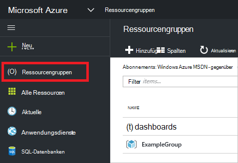

1. Um eine leere Ressourcengruppe zu erstellen, wählen Sie **Hinzufügen**.

    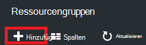

1. Geben Sie einen Namen und Speicherort für die neue Ressourcengruppe. Wählen Sie **Erstellen**.

    

1. Möglicherweise müssen die zuletzt erstellte Ressource Gruppe **Aktualisieren** auswählen.

    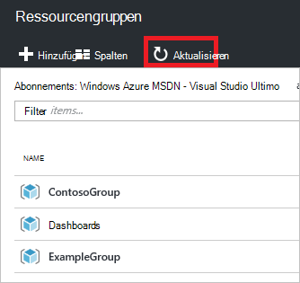

1. Informationen für die Ressourcengruppen anpassen, wählen Sie **Spalten aus**

    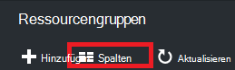

1. Wählen Sie hinzufügen, und wählen Sie **Aktualisieren**.

    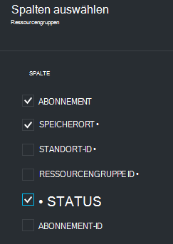

1. Zum Bereitstellen von Ressourcen in die neue Ressourcengruppe finden Sie [Ressourcen mit Ressourcen-Manager und Azure-Portal bereitstellen](../resource-group-template-deploy-portal.md).

1. Für den schnellen Zugriff einer Ressourcengruppe können Sie das Blade in Ihr Dashboard anheften.

    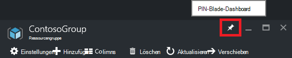

1. Das Dashboard zeigt die Ressourcengruppe und die Ressourcen. Wählen Sie die Ressourcengruppen oder ihre Ressourcen zu dem Element navigieren.

    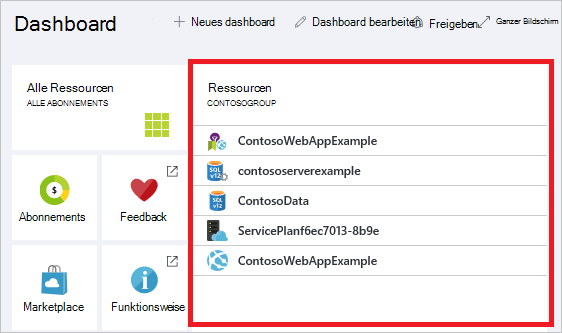

## Tag-Ressourcen

Sie können Ressourcengruppen und Ressourcen logisch organisiert Ihre Tags zuweisen. Informationen zum Arbeiten mit Tags finden Sie unter [Tags Azure Ressourcen zu verwenden](../resource-group-using-tags.md).

[AZURE.INCLUDE [resource-manager-tag-resource](../../includes/resource-manager-tag-resources.md)]

## Überwachen von Ressourcen

Wenn Sie eine Ressource auswählen, stellt Blade Ressource standardmäßig Diagramme und Tabellen für die Überwachung dieser Ressourcentyp.

1. Wählen Sie eine Ressource aus, und beachten Sie Abschnitt **Überwachen** . Sie enthält Diagramme für den Ressourcentyp. Das folgende Bild zeigt die Überwachungsdaten für ein Speicherkonto.

    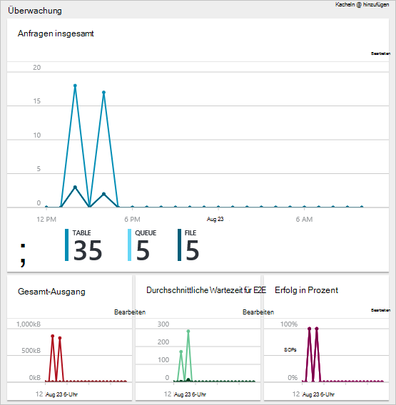

1. Einen Abschnitt des Blades in Ihr Dashboard zu fixieren durch Auslassungspunkte (...) über dem Bereich auswählen. Auch können Sie die Größe im Abschnitt Blatt oder vollständig entfernen. In der folgenden Abbildung veranschaulicht die pin, anpassen oder Entfernen der CPU und Arbeitsspeicher.

    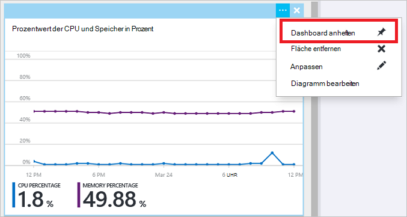

1. Nach dem Befestigen des Abschnitts Dashboard, sehen Sie die Zusammenfassung auf dem Dashboard. Und sofort wählen Sie weitere Details zu den Daten.

    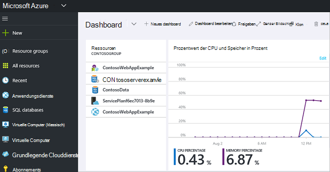

1. Vollständig die Daten anpassen, die Sie über das Portal überwachen Standarddashboard navigieren Sie, und wählen Sie **Neues Dashboard**.

    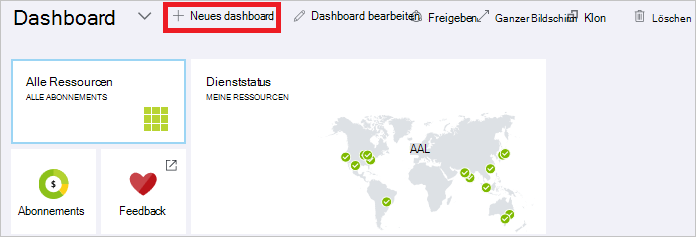

1. Benennen Sie dem neuen Dashboard und das Dashboard ziehen Sie Kacheln. Kacheln werden unterschiedliche Optionen gefiltert.

    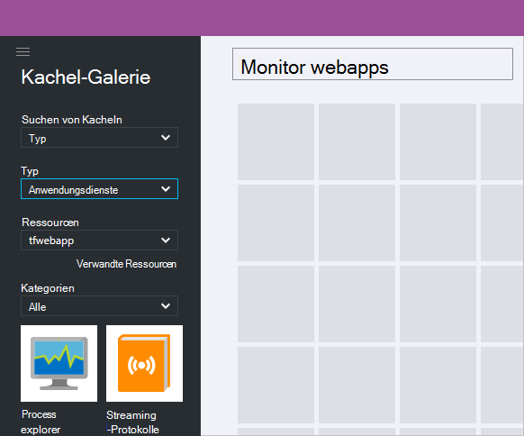

     Arbeiten mit Dashboards finden Sie unter [Erstellen und Freigeben von Dashboards in Azure-Portal](azure-portal-dashboards.md).

## Verwalten von Ressourcen

Blatt für eine Ressource finden Sie unter den Optionen für die Verwaltung der Ressource. Das Portal stellt Optionen für diesen bestimmten Ressourcentyp. Sie sehen die Befehle oben Blade-Ressource und auf der linken Seite.

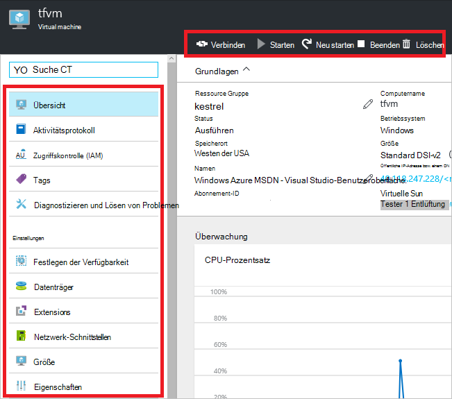

Führen Sie diese Optionen wie starten und Beenden einen virtuellen Computer oder die Eigenschaften der virtuellen Maschine neu.

## Ressourcen verschieben

Wenn Sie Ressourcen in einer anderen Ressourcengruppe oder ein anderes Abonnement verschieben müssen, finden Sie unter [Ressourcen neue Ressourcengruppe oder Abonnement](../resource-group-move-resources.md).

## Lock-Ressourcen

Sie können ein Abonnement, Ressourcengruppe oder Ressource, um zu verhindern, dass andere Benutzer in Ihrer Organisation versehentlich löschen oder Ändern von kritischen Ressourcen sperren. Weitere Informationen finden Sie unter [Sperrenressourcen mit Azure-Ressourcen-Manager](../resource-group-lock-resources.md).

[AZURE.INCLUDE [resource-manager-lock-resources](../../includes/resource-manager-lock-resources.md)]

## Ihr Abonnement und Kosten anzeigen

Sie können Informationen über Ihr Abonnement und die mehrstufigen Kosten für alle Ressourcen anzeigen. Wählen Sie **Abonnements** und das Abonnement, das Sie anzeigen möchten. Sie müssen nur ein Abonnement auswählen.

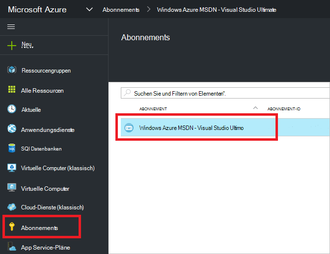

In Blade Abonnement ein Verbrauchsrate angezeigt.

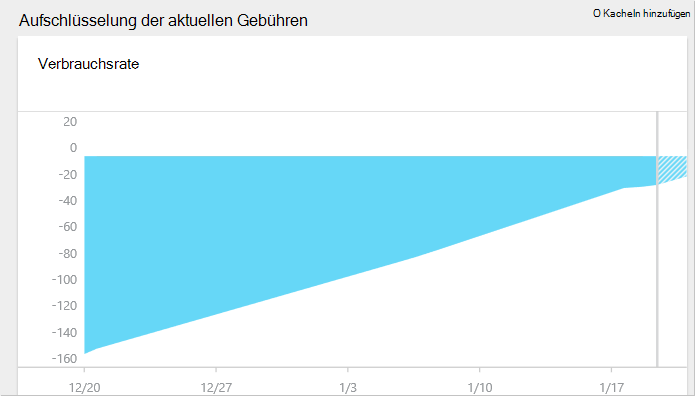

Und eine Aufschlüsselung der Kosten nach der Ressourcenart.

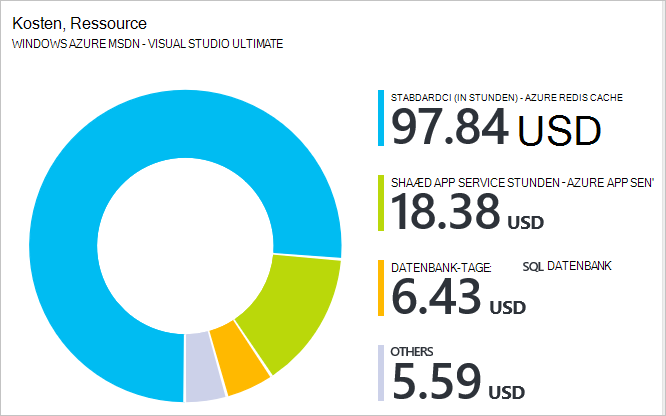

## Vorlage exportieren

Nach dem Einrichten der Ressourcengruppe, sollten Sie die Ressourcen-Manager-Vorlage für die Ressourcengruppe anzeigen. Exportieren der Vorlage bietet zwei Vorteile:

1. Zukünftige Bereitstellung der Lösung können problemlos automatisieren, die Vorlage enthält die vollständige Infrastruktur.

2. Sie können mit vertraut Vorlagensyntax anhand der in der Notation JSON (JavaScript Object), das Ihre Lösung darstellt.

Schrittweise Anleitung finden Sie unter [Exportieren von Azure Ressourcenmanager Vorlage von vorhandenen Ressourcen](../resource-manager-export-template.md).

## Ressourcengruppe oder Ressourcen löschen

Eine Ressourcengruppe löschen, alle darin enthaltenen Ressourcen. Sie können auch einzelne Ressourcen innerhalb einer Ressourcengruppe. Vorsicht eine Ressourcengruppe löschen, da möglicherweise Ressourcen anderen Ressourcengruppen, die verknüpft werden sollen. Ressourcenmanager verknüpfte Ressourcen nicht löschen, aber sie funktionieren möglicherweise nicht ordnungsgemäß ohne die erwarteten Ressourcen.

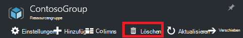

## Nächste Schritte

- Überwachungsprotokolle finden Sie unter [Überwachen von Vorgängen mit Ressourcen-Manager](../resource-group-audit.md).
- Um Fehler der Bereitstellung finden Sie unter [Problembehandlung Ressource Gruppe Deployments mit Azure-Portal](../resource-manager-troubleshoot-deployments-portal.md).
- Zum Bereitstellen von Ressourcen über das Portal finden Sie unter [Bereitstellen von Ressourcen mit Ressourcen-Manager und Azure-Portal](../resource-group-template-deploy-portal.md).
- Um Zugriff auf Ressourcen zu verwalten, finden Sie unter [verwenden Arbeitsaufträge für Benutzerrollen Zugriff auf Ihre Ressourcen Azure-Abonnement verwalten](../active-directory/role-based-access-control-configure.md).

