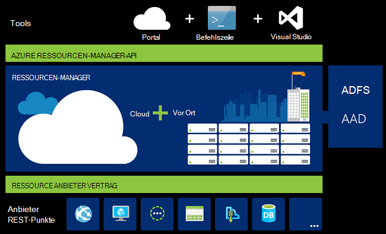
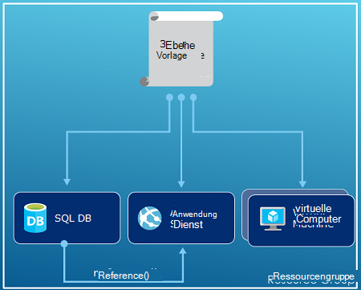
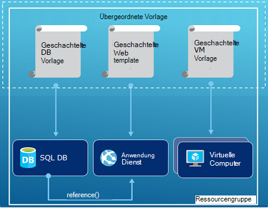
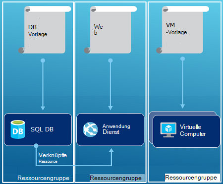

<properties
   pageTitle="Azure Ressourcenmanager Übersicht | Microsoft Azure"
   description="Beschreibt, wie Azure-Ressourcen-Manager für die Bereitstellung, Verwaltung und Kontrolle von Ressourcen in Azure."
   services="azure-resource-manager"
   documentationCenter="na"
   authors="tfitzmac"
   manager="timlt"
   editor="tysonn"/>

<tags
   ms.service="azure-resource-manager"
   ms.devlang="na"
   ms.topic="get-started-article"
   ms.tgt_pltfrm="na"
   ms.workload="na"
   ms.date="10/21/2016"
   ms.author="tomfitz"/>

# Azure-Ressourcen-Manager (Übersicht)

Die Infrastruktur für die Anwendung normalerweise viele Komponenten – vielleicht einen virtuellen Computer Speicherkonto und virtuelles Netzwerk oder eine Webanwendung, Datenbank, Datenbankserver und 3. Dienste besteht. Diese Komponenten nicht als separate Entitäten angezeigt, stattdessen angezeigt werden als verwandte und wechselseitig abhängige Teile einer einzelnen Entität. Bereitstellen, verwalten und als Gruppe überwachen möchten. Azure Ressourcenmanager können Sie die Ressourcen in der Projektmappe als Gruppe arbeiten. Bereitstellen, aktualisieren oder löschen Sie die Ressourcen für die Lösung in einer einzigen koordinierten Operation. Verwenden Sie eine Vorlage für die Bereitstellung und die Vorlage kann für verschiedene Unternehmen testen, Staging und Produktion. Ressourcen-Manager bietet Sicherheit, Überwachung und Kennzeichnung von Funktionen zum Verwalten von Ressourcen nach der Bereitstellung. 

## Terminologie

Wenn Sie zu Azure Resource Manager sind, sind einige Begriffe, die Sie möglicherweise nicht vertraut.

- **Ressource** – eine verwaltbare Artikel über Azure verfügbar ist. Einige gemeinsamen Ressourcen sind einem virtuellen Speicherkonto, WebApp, Datenbank und virtuelles Netzwerk, aber es gibt viele weitere.
- **Gruppe** - ein Container, der zugehörige Ressourcen für ein Azure-Lösung enthält. Die Ressourcengruppe gehören alle Ressourcen für die Lösung oder den Ressourcen, die Sie als Gruppe verwalten möchten. Sie möchten wie Sie Zuordnen von Ressourcen zu Ressourcengruppen, die Grundlage für Ihre Organisation am meisten Sinn macht. [Ressourcengruppen](#resource-groups)anzeigen
- **Ressourcenanbieter** - ein Dienst, der die Ressourcen bereitstellt, bereitstellen und Verwalten über Ressourcen-Manager. Jede Ressource Anbieter Operationen für das Arbeiten mit Ressourcen bereitgestellt werden. Einige allgemeine Ressourcenprovider sind Microsoft.Compute, die die VM-Ressource bereitstellt, Microsoft.Storage Konto Speicherressourcen bereitstellt und Microsoft.Web webapps Ressourcen bereitstellt. [Ressourcen](#resource-providers)anzeigen
- **Ressourcen-Manager-Vorlage** - A JavaScript Object Notation (JSON)-Datei, definiert eine oder mehrere Ressourcen einer Ressourcengruppe bereitgestellt. Außerdem werden Abhängigkeiten bereitgestellten Ressourcen definiert. Die Vorlage kann verwendet werden, die Ressourcen konsistent und wiederholt bereitstellen. [Bereitstellung von](#template-deployment)anzeigen
- **deklarative Syntax** - Syntax Zustand "Hier ist möchte ich erstellen" ohne die Reihenfolge der Programmierung schreiben können Befehle um zu erstellen. Die Ressourcen-Manager-Vorlage ist ein Beispiel deklarative Syntax. In der Datei definieren Sie die Eigenschaften für die Infrastruktur in Azure bereitstellen. 

## Vorteile der Verwendung von Ressourcen-Manager

Ressourcen-Manager bietet mehrere Vorteile:

- Sie können bereitstellen, verwalten und überwachen alle Ressourcen für Ihre Lösung als eine Gruppe diese Ressourcen einzeln behandeln.
- Sie können wiederholt bereitstellen die Projektmappe während des Entwicklungszyklus und Vertrauen in einem konsistenten Zustand Ihrer Ressourcen bereitgestellt werden.
- Sie können Ihre Infrastruktur deklarativen Vorlagen als Skripts verwalten.
- Sie können die Abhängigkeit zwischen Ressourcen, damit sie in der richtigen Reihenfolge bereitgestellt werden.
- Sie können Zugriffskontrolle auf alle Dienste in der Ressourcengruppe anwenden, da Role-Based Access Control (RBAC) direkt in die Management-Plattform integriert ist.
- Sie können Ressourcen alle Ressourcen in Ihrem Abonnement logisch zu Tags anwenden.
- Kosten für eine Gruppe von Ressourcen, die gemeinsame Nutzung des gleichen Tags anzeigen, um Ihrer Organisation Rechnung zu klären.  

Ressourcen-Manager bietet eine neue Möglichkeit zum Bereitstellen und Verwalten von Projektmappen. Wenn Sie frühere Bereitstellungsmodell und über die Änderung informieren möchten, finden Sie unter [Understanding Ressourcenmanager und klassischen Bereitstellung](../resource-manager-deployment-model.md).

## Konsistente Management-Ebene

Ressourcen-Manager bietet eine konsistente Management für die Aufgaben durch Azure PowerShell Azure CLI, Azure-Portal, REST-API und Entwicklungstools. Die Tools verwenden einen gemeinsamen Satz von Operationen. Sie verwenden die Tools funktionieren am besten für Sie und können sie austauschbar ohne Verwirrung. 

Das folgende Bild zeigt wie alles mit derselben Azure-Ressourcen-Manager-API. Die API übergibt Anfragen an den Ressourcen-Manager-Dienst, der authentifiziert und autorisiert die Anfragen. Ressourcenmanager leitet dann die Anfragen an die entsprechende Ressource.

## Anleitung

Die folgenden Vorschläge können Sie Ressourcen-Manager nutzen beim Arbeiten mit Projektmappen.

1. Definieren Sie und Bereitstellen Sie Ihrer Infrastruktur durch die deklarative Syntax Ressourcenmanager Vorlagen nicht durch Befehle.
2. Definieren Sie alle Schritte für Bereitstellung und Konfiguration in der Vorlage. Sie haben keine manuelle Schritte zum Einrichten der Lösung.
3. Führen Sie Befehle zu Ressourcen, z. B. starten oder Beenden einer Anwendung oder Computer.
4. Ordnen Sie Ressourcen mit dem gleichen Lebenszyklus in einer Ressourcengruppe. Verwenden Sie Tags für alle anderen Organisieren von Ressourcen.

Weitere Vorschläge finden Sie unter [Best Practices für Azure-Ressourcen-Manager Vorlagen erstellen](../resource-manager-template-best-practices.md).

## Ressourcengruppen

Es gibt einige wichtigen Faktoren bei der Ressourcengruppe definieren:

1. Alle Ressourcen in der Gruppe sollten den gleichen Lebenszyklus freigeben. Bereitstellen, aktualisieren und löschen Sie sie zusammen. Wenn eine Ressource wie einen Datenbankserver auf eine andere Bereitstellung muss sollte es in einer anderen Ressourcengruppe.
2. Jede Ressource kann nur einer Ressourcengruppe vorhanden sein.
3. Sie können hinzufügen oder Entfernen einer Ressource einer Ressourcengruppe zu einem beliebigen Zeitpunkt.
4. Sie können eine Ressource aus einer Ressourcengruppe in eine andere Gruppe verschieben. Weitere Informationen finden Sie unter [Ressourcen neue Ressourcengruppe oder Abonnement](../resource-group-move-resources.md).
4. Eine Ressourcengruppe kann Ressourcen enthalten, die in unterschiedlichen Regionen befinden.
5. Eine Ressourcengruppe kann Zugriffskontrolle für Verwaltungsvorgänge Umfang verwendet werden.
6. Eine Ressource kann mit Ressourcen in anderen Ressourcengruppen interagieren. Diese Interaktion wird häufig die Ressourcen sind jedoch keine gleichen Lebenszyklus (z. B. webapps mit einer Datenbank verbinden).

Beim Erstellen einer Ressourcengruppe müssen Sie einen Speicherort für die Gruppe bereitstellen. Sie wundern sich vielleicht, "Warum eine Ressourcengruppe einen Speicherort benötigt? Und Ressourcen Standorten als Ressourcengruppe besitzen, warum den Speicherort der Ressource überhaupt?" Die Ressourcengruppe speichert Metadaten zu den Ressourcen. Daher, wenn Sie einen Speicherort für die Ressourcengruppe angeben, legen Sie fest, in dem die Metadaten gespeichert. Aus Gründen der Kompatibilität müssen Sie sicherstellen, dass Ihre in einem bestimmten Bereich Daten.

## Ressourcen

Jede Ressourcenanbieter bietet eine Reihe von Ressourcen und Operationen für die Arbeit mit Azure Service. Beispielsweise wenn Sie Schlüssel und geheime Informationen speichern möchten, bearbeiten Sie Ressourcenanbieter **Microsoft.KeyVault** Diese Ressourcenanbieter bietet einen Ressourcentyp namens **Depots** für Key Vault und einen Ressourcentyp namens **Depots-Schlüssel** für eine geheime Schlüssel Depot erstellen. 

Zunächst mit Ressourcen bereitstellen, sollten Sie Anbieter verfügbaren Ressourcen kennen. Die Namen von Ressourcen und Ressourcen können Sie die Ressourcen definieren, die Sie in Azure bereitstellen möchten.

Sie rufen alle Ressourcenprovider mit dem folgenden PowerShell-Cmdlet:

    Get-AzureRmResourceProvider -ListAvailable

Oder mit Azure CLI alle Ressourcenprovider mit dem folgenden Befehl abrufen:

    azure provider list

Die zurückgegebene Liste finden der Ressourcenanbieter, die Sie verwenden möchten.

Der Befehl zu Details ein Ressourcenanbieter fügen Sie Anbieternamespace hinzu. Der Befehl gibt die unterstützten Ressourcentypen der Ressourcenanbieter, unterstützten Speicherorte und API-Versionen für jeden Ressourcentyp. Das folgende PowerShell-Cmdlet Ruft Informationen Microsoft.Compute:

    (Get-AzureRmResourceProvider -ProviderNamespace Microsoft.Compute).ResourceTypes

Oder, bei Azure CLI unterstützten Ressourcentypen, Speicherorte und API-Versionen für Microsoft.Compute, mit dem folgenden Befehl:

    azure provider show Microsoft.Compute --json > c:\Azure\compute.json

Weitere Informationen finden Sie unter [Ressourcen-Manager-Anbieter, Regionen, API-Versionen und Schemas](../resource-manager-supported-services.md).

## Bereitstellung

Mit Ressourcen-Manager können Sie eine Vorlage (im JSON-Format) erstellen, die die Infrastruktur und die Konfiguration von Azure-Lösung definiert. Mithilfe einer Vorlage können Sie wiederholt bereitstellen die Projektmappe während des gesamten Lebenszyklus und vertrauen, Ressourcen in einem konsistenten Zustand bereitgestellt werden. Wenn Sie eine Lösung aus dem Portal erstellen, enthält die Lösung automatisch eine Bereitstellungsvorlage. Sie haben nicht die Vorlage mit der Vorlage für Ihre Lösung starten und Ihre spezifischen Bedürfnisse anpassen erstellen. Exportieren den aktuellen Status der Ressourcengruppe oder die Vorlage für eine bestimmte Bereitstellung anzeigen können Sie eine Vorlage für eine vorhandene Ressourcengruppe abrufen. Anzeigen der [exportierten Vorlage](../resource-manager-export-template.md) ist richtig die Vorlagensyntax erfahren.

Weitere Informationen über das Format der Vorlage und das Erstellen finden Sie unter [Azure Resource Manager Vorlagen erstellen](../resource-group-authoring-templates.md) und [Ressourcenmanager Vorlage Exemplarische Vorgehensweise](../resource-manager-template-walkthrough.md).

Ressourcen-Manager die Vorlage wie andere Anforderung verarbeitet (siehe Bild für [konsistente Management-Ebene](#consistent-management-layer)). Die Vorlage analysiert und konvertiert die Syntax in REST API-Vorgänge für die entsprechende Ressourcenanbieter. Beispielsweise erhält als Ressource eine Vorlage mit den folgenden Ressourcen:

    "resources": [
      {
        "apiVersion": "2016-01-01",
        "type": "Microsoft.Storage/storageAccounts",
        "name": "mystorageaccount",
        "location": "westus",
        "sku": {
          "name": "Standard_LRS"
        },
        "kind": "Storage",
        "properties": {
        }
      }
      ]

Die Definition wird in folgenden REST API Vorgang an dem Ressourcenanbieter Microsoft.Storage konvertiert:

    PUT
    https://management.azure.com/subscriptions/{subscriptionId}/resourceGroups/{resourceGroupName}/providers/Microsoft.Storage/storageAccounts/mystorageaccount?api-version=2016-01-01
    REQUEST BODY
    {
      "location": "westus",
      "properties": {
      }
      "sku": {
        "name": "Standard_LRS"
      },   
      "kind": "Storage"
    }

Überlassen Sie und wie Sie Ihre Lösung ist wie Vorlagen und Ressourcen definieren. Beispielsweise können Sie einen einzelnen Ressourcengruppen drei Ebenen die Anwendung einer Vorlage bereitstellen.

Aber Sie haben nicht die gesamte Infrastruktur in einer Vorlage definieren. Häufig ist es sinnvoll, Ihre bereitstellungsanforderungen in eine Reihe von gezielten und zweckgebundene Vorlagen unterteilen. Sie können Vorlagen für andere Projektmappen problemlos wiederverwenden. Eine bestimmte Lösung bereitstellen möchten, erstellen Sie eine master-Vorlage, die die erforderlichen Vorlagen verknüpft. Die folgende Abbildung zeigt eine Lösung drei Ebenen einer übergeordneten Vorlage bereitstellen, die drei verschachtelte Vorlagen enthält.

Wenn Sie die Ebenen mit separaten Lebenszyklen vorstellen, können Sie die drei Ebenen separate Ressourcengruppen bereitstellen. Beachten Sie, dass die Ressourcen weiterhin auf Ressourcen in anderen Ressourcengruppen verknüpft werden können.

Weitere Vorschläge zum Entwerfen von Vorlagen finden Sie unter [Muster zum Entwerfen von Azure-Ressourcen-Manager-Vorlagen](../best-practices-resource-manager-design-templates.md). Informationen zu verschachtelten Vorlagen finden Sie unter [verknüpfte Vorlagen mit Azure-Ressourcen-Manager](../resource-group-linked-templates.md).

Azure Ressourcenmanager analysiert Abhängigkeiten, um sicherzustellen, dass Ressourcen in der richtigen Reihenfolge erstellt werden. Wenn eine Ressource einen Wert aus einer anderen Ressource (z. B. virtuelle Computer benötigen ein Speicherkonto für Datenträger) erforderlich ist, legen Sie eine Abhängigkeit. Weitere Informationen finden Sie unter [Abhängigkeiten in Azure Ressourcenmanager Vorlagen definieren](../resource-group-define-dependencies.md).

Sie können auch die Vorlage Updates für die Infrastruktur. Beispielsweise können Sie der Projektmappe eine Ressource hinzufügen und Variantenregeln für die Ressourcen, die bereits bereitgestellt wurden, hinzufügen. Wenn die Vorlage eine Ressource erstellen gibt, aber diese Ressource bereits vorhanden ist, führt Azure-Ressourcen-Manager ein Update anstatt eine neue Anlage. Azure Ressourcenmanager aktualisiert die bestehende Anlage in demselben Zustand, wie neue.  

Ressourcenmanager bietet Extensions für Szenarien sollen weitere Vorgänge wie bestimmte Installation, die nicht im Setup enthalten. Verwenden Sie bereits einen Konfiguration Verwaltungsdienst DSC, Chef oder Marionette, können Sie mit diesem Dienst weiterarbeiten mit Extensions. Informationen zu virtuellen Extensions finden Sie unter [virtuelle Computer Extensions und Funktionen](../virtual-machines/virtual-machines-windows-extensions-features.md). 

Schließlich wird die Vorlage Teil des Quellcodes für Ihre Anwendung. Sie können in Ihrem Quellcode-Repository Einchecken und Aktualisieren Ihrer Anwendung entwickelt. Sie können die Vorlage durch Visual Studio bearbeiten.

Nach der Vorlage definieren, können Sie die Ressourcen in Azure bereitstellen. Die Befehle der Ressourcen finden Sie unter:

- [Bereitstellen von Ressourcen mit Ressourcen-Manager und Azure PowerShell](../resource-group-template-deploy.md)
- [Bereitstellen von Ressourcen mit Ressourcen-Manager und Azure-CLI](../resource-group-template-deploy-cli.md)
- [Bereitstellen von Ressourcen mit Ressourcen-Manager und Azure-portal](../resource-group-template-deploy-portal.md)
- [Bereitstellen von Ressourcen mit Ressourcen-Manager und Ressourcenmanager REST-API](../resource-group-template-deploy-rest.md)

## Tags

Ressourcen-Manager bietet eine Kennzeichnung, die Sie entsprechend zu verwalten oder Rechnungsadresse kategorisieren können. Verwenden Sie Tags, wenn Sie eine komplexe von Ressourcengruppen und Ressourcen Sammlung und müssen die Ressourcen wie anzeigen, die für Sie am sinnvollsten ist. Sie könnten z. B. Ressourcen tag, die eine ähnliche Rolle in der Organisation oder Abteilung gehören. Ohne Tags können Benutzer in Ihrer Organisation mehrere Ressourcen erstellen, die möglicherweise schwierig, später identifizieren und verwalten. Beispielsweise können Sie die Ressourcen für ein bestimmtes Projekt gelöscht. Wenn die Ressourcen für das Projekt nicht markiert sind, müssen Sie manuell suchen. Tags können eine wichtige Möglichkeit zu unnötigen Kosten für Ihr Abonnement. 

Ressourcen müssen nicht in derselben Ressourcengruppe freigeben ein Tags befinden. Erstellen Sie eigene Taxonomie Tag, um sicherzustellen, dass alle Benutzer in Ihrer Organisation häufig verwendete Tags als Benutzer versehentlich etwas andere Tags (z. B. "Abteilung" statt "Abteilung") anwenden.

Das folgende Beispiel zeigt ein Tag auf einen virtuellen Computer angewendet.

    "resources": [    
      {
        "type": "Microsoft.Compute/virtualMachines",
        "apiVersion": "2015-06-15",
        "name": "SimpleWindowsVM",
        "location": "[resourceGroup().location]",
        "tags": {
            "costCenter": "Finance"
        },
        ...
      }
    ]

Um die Ressourcen mit dem Tag-Wert abzurufen, verwenden Sie das folgende PowerShell-Cmdlet:

    Find-AzureRmResource -TagName costCenter -TagValue Finance

Oder folgenden Azure CLI-Befehl:

    azure resource list -t costCenter=Finance --json

Sie können auch markierte Ressourcen über Azure-Portal anzeigen.

[Nutzungsbericht](../billing/billing-understand-your-bill.md) für Ihr Abonnement enthält Namen und Werte der Kosten nach Kategorien aufteilen können. Weitere Informationen zu Tags finden Sie unter [Tags Azure Ressourcen zu verwenden](../resource-group-using-tags.md).

## Zugriffskontrolle

Ressourcen-Manager können Sie steuern, wer Zugriff auf bestimmte Aktionen für Ihre Organisation. Systemeigene Management-Plattform integriert rollenbasierte Zugriffskontrolle (RBAC) und alle Dienste in der Ressourcengruppe, Zugriffskontrolle für. 

Es gibt zwei Hauptkonzepte verstehen beim Arbeiten mit rollenbasierte Zugriffskontrolle:

- Rollendefinitionen - Berechtigungen beschreiben und viele Aufgaben verwendet werden.
- Arbeitsaufträge für Benutzerrollen - zuordnen Definition mit einer Identität (Benutzer oder Gruppe) für einen bestimmten Bereich (Abonnement, Ressourcengruppe oder Ressource). Die Zuordnung wird von niedrigeren Gültigkeitsbereichen geerbt.

Sie können vordefinierte Plattform und spezifische Rollen Benutzer hinzufügen. Beispielsweise können Sie nutzen die vordefinierte Rolle Leser, die Anwender Ressourcen jedoch nicht ändern. Hinzufügen von Benutzern in der Organisation diese Zugriffsart Rolle und Funktion des Abonnements, Ressourcengruppe oder Ressource.

Azure bietet die folgenden vier Plattform Rollen:

1.  Besitzer - Verwaltung alles, einschließlich
2.  Contributor - Verwaltung alles Zugriff
3.  Reader - alles anzeigen, jedoch keine Änderungen
4.  Benutzer Access Administrator - können Zugriff auf Azure Ressourcen verwalten

Azure bietet außerdem verschiedene spezifische Rollen. Einige allgemeine sind:

1.  Virtual Machine Contributor - Verwaltung virtueller Computer aber nicht gewähren Zugriff auf sie und nicht verwaltet werden das virtuelle Netzwerk- oder Speicher Konto mit dem sie verbunden sind
2.  Contributor Netzwerk - können alle Netzwerk-Ressourcen zu verwalten, aber nicht darauf zugreifen
3.  Storage-Konto Contributor - Speicher verwalten können Zugriff auf diese
4. SQL Server Contributor - können SQL Server und Datenbanken, jedoch nicht deren sicherheitsbezogener Richtlinien verwalten
5. Website Contributor - können verwalten, Websites, aber nicht Web Pläne mit dem sie verbunden sind

Die vollständige Liste der Rollen und zulässige Aktionen finden Sie unter [RBAC: integrierte Rollen](../active-directory/role-based-access-built-in-roles.md). Weitere Informationen über rollenbasierte Zugriffskontrolle finden Sie in [Azure Role-based Access Control](../active-directory/role-based-access-control-configure.md). 

In einigen Fällen auszuführende Code oder Skripts, die auf Ressourcen zugreift, jedoch nicht unter den Anmeldeinformationen des Benutzers ausgeführt werden soll. Stattdessen soll eine Identität bezeichnet einen Dienst für die Anwendung principal erstellen und die entsprechende Rolle für den Service principal zuweisen. Ressourcen-Manager können Sie Anmeldeinformationen für die Anwendung erstellen und die Anwendung programmgesteuert authentifizieren. Zum Erstellen von Dienstprinzipale finden Sie unter folgenden Themen:

- [Mithilfe von Azure PowerShell Dienstprinzipalnamen Zugriff auf die Ressourcen erstellen](../resource-group-authenticate-service-principal.md)
- [Azure-CLI Dienstprinzipalnamen Zugriff auf die Ressourcen zu verwenden](../resource-group-authenticate-service-principal-cli.md)
- [Verwenden Sie Portal Active Directory Anwendung und Dienstprinzipalnamen, die auf Ressourcen zugreifen können](../resource-group-create-service-principal-portal.md)

Wichtige Ressourcen zu verhindern, dass Benutzer löschen oder ändern sie können auch explizit gesperrt. Weitere Informationen finden Sie unter [Sperrenressourcen mit Azure-Ressourcen-Manager](../resource-group-lock-resources.md).

## Aktivitätsprotokolle

Ressourcen-Manager protokolliert alle Vorgänge, die erstellen, ändern oder Löschen einer Ressource. Können die Aktivitätsprotokolle Fehler bei der Problembehandlung oder überwachen, wie Benutzer in Ihrer Organisation eine Ressource geändert. Wählen Sie die Protokolle finden **Aktivitätsprotokolle** in Blatt **Einstellungen** für eine Ressourcengruppe. Filtern der Protokolle durch viele verschiedene Werte, einschließlich die Benutzer den Vorgang initiiert hat. Informationen zum Arbeiten mit Aktivitätsprotokollen anzeigen Sie [Überwachungsvorgänge mit Ressourcen-Manager](../resource-group-audit.md)

## Benutzerdefinierte Richtlinien

Ressourcen-Manager können Sie benutzerdefinierte Richtlinien für die Verwaltung Ihrer Ressourcen zu erstellen. Die Richtlinien, die Sie erstellen können unterschiedliche Szenarien umfassen. Erzwingen Sie eine Namenskonvention Ressourcen, Begrenzung der Typen und Instanzen der Ressourcen bereitgestellt werden kann oder Beschränkung der Bereiche eine Art von Ressource hosten können. Sie können Tagwert Abrechnung nach Abteilung organisiert Ressourcen benötigen. Strategien zur Kostensenkung und Konsistenz in Ihrem Abonnement erstellen. 

Definieren Sie Richtlinien mit JSON und wenden Sie die Richtlinien für Ihr Abonnement oder innerhalb einer Ressourcengruppe. Richtlinien sind anders als rollenbasierte Zugriffskontrolle Ressourcentypen zugewiesen werden.

Das folgende Beispiel zeigt eine Richtlinie, die garantiert Konsistenz angeben, dass alle Ressourcen einen CostCenter-Tag enthalten.

    {
      "if": {
        "not" : {
          "field" : "tags",
          "containsKey" : "costCenter"
        }
      },
      "then" : {
        "effect" : "deny"
      }
    }

Es gibt viele weitere Arten von Richtlinien, die Sie erstellen können. Weitere Informationen finden Sie unter [Verwenden von Richtlinien zum Verwalten von Ressourcen und Zugriffskontrolle](../resource-manager-policy.md).

## SDKs

Azure SDKs sind für mehrere Sprachen und Plattformen verfügbar.
Jede dieser Sprache Implementierungen ist Ökosystem Paketmanager und GitHub verfügbar.

Der Code in jeder dieser SDKs wird von Azure RESTful API-Spezifikationen generiert.
Diese Spezifikationen sind open Source und basierend auf der Swagger 2.0-Spezifikation.
Der Code SDK ist über eine Open-Source-Projekt namens AutoRest erstellt.
AutoRest wandelt diese RESTful API-Spezifikationen in Clientbibliotheken in mehreren Sprachen.
Möchten Sie alle Aspekte des generierten Codes in den SDKs, der gesamte Satz von Tools zum Erstellen von SDKs sind öffnen frei und auf eine verbreitete Spezifikation API-Format.

Hier sind unsere Open Source-SDK-Repositories. Wir begrüßen, Problemen und Anfragen ziehen.

[.NET](https://github.com/Azure/azure-sdk-for-net) | [Java](https://github.com/Azure/azure-sdk-for-java) | [Node.js](https://github.com/Azure/azure-sdk-for-node) | [PHP](https://github.com/Azure/azure-sdk-for-php) | [Python](https://github.com/Azure/azure-sdk-for-python) | [Ruby](https://github.com/Azure/azure-sdk-ruby)

> [AZURE.NOTE]Wenn das SDK nicht die erforderliche Funktionalität bereitstellen, können Sie auch direkt [Azure REST-API](https://msdn.microsoft.com/library/azure/dn790568.aspx) aufrufen.

## Beispiele

### .NET

- [Verwalten von Azure-Ressourcen und Ressourcengruppen](https://azure.microsoft.com/documentation/samples/resource-manager-dotnet-resources-and-groups/)
- [Bereitstellen einer SSH aktiviert VM mit einer Vorlage](https://azure.microsoft.com/documentation/samples/resource-manager-dotnet-template-deployment/)

### Java

- [Azure Ressourcen](https://azure.microsoft.com/documentation/samples/resources-java-manage-resource/)
- [Verwalten von Azure Ressourcengruppen](https://azure.microsoft.com/documentation/samples/resources-java-manage-resource-group/)
- [Bereitstellen einer SSH aktiviert VM mit einer Vorlage](https://azure.microsoft.com/documentation/samples/resources-java-deploy-using-arm-template/)

### Node.js

- [Verwalten von Azure-Ressourcen und Ressourcengruppen](https://azure.microsoft.com/documentation/samples/resource-manager-node-resources-and-groups/)
- [Bereitstellen einer SSH aktiviert VM mit einer Vorlage](https://azure.microsoft.com/documentation/samples/resource-manager-node-template-deployment/)

### Python

- [Verwalten von Azure-Ressourcen und Ressourcengruppen](https://azure.microsoft.com/documentation/samples/resource-manager-python-resources-and-groups/)
- [Bereitstellen einer SSH aktiviert VM mit einer Vorlage](https://azure.microsoft.com/documentation/samples/resource-manager-python-template-deployment/)

### Ruby

- [Verwalten von Azure-Ressourcen und Ressourcengruppen](https://azure.microsoft.com/documentation/samples/resource-manager-ruby-resources-and-groups/)
- [Bereitstellen einer SSH aktiviert VM mit einer Vorlage](https://azure.microsoft.com/documentation/samples/resource-manager-ruby-template-deployment/)

Neben diesen Beispielen können Sie Samples Gallery durchsuchen.

[.NET](https://azure.microsoft.com/documentation/samples/?service=azure-resource-manager&platform=dotnet) | [Java](https://azure.microsoft.com/documentation/samples/?service=azure-resource-manager&platform=java) | [Node.js](https://azure.microsoft.com/documentation/samples/?service=azure-resource-manager&platform=nodejs) | [Python](https://azure.microsoft.com/documentation/samples/?service=azure-resource-manager&platform=python) | [Ruby](https://azure.microsoft.com/documentation/samples/?service=azure-resource-manager&platform=ruby)

## Nächste Schritte

- Eine einfache Einführung in die Verwendung von Vorlagen finden Sie unter [Exportieren eine Vorlage Azure Resource Manager von vorhandenen Ressourcen](../resource-manager-export-template.md).
- Eine ausführlichere Anleitung zum Erstellen einer Vorlage finden Sie unter [Exemplarische Vorgehensweise Ressourcenmanager Vorlage](../resource-manager-template-walkthrough.md).
- Die Funktionen in einer Vorlage verwendete finden Sie unter [Vorlagenfunktionen](../resource-group-template-functions.md)
- Informationen über Visual Studio mit Ressourcen-Manager finden Sie unter [Erstellen und Bereitstellen von Azure Ressourcengruppen über Visual Studio](../vs-azure-tools-resource-groups-deployment-projects-create-deploy.md).
- Informationen mit VS mit Ressourcen-Manager finden Sie unter [Arbeiten mit Azure Ressourcenmanager Vorlagen in Visual Studio Code](../resource-manager-vs-code.md).

Hier ist eine Videodemonstration dieser Übersicht:

[AZURE.VIDEO azure-resource-manager-overview]

[powershellref]: https://msdn.microsoft.com/library/azure/dn757692(v=azure.200).aspx
