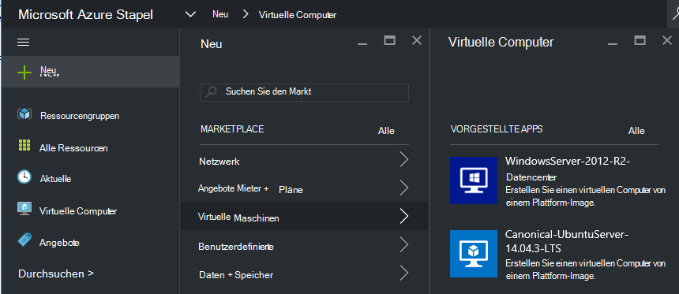
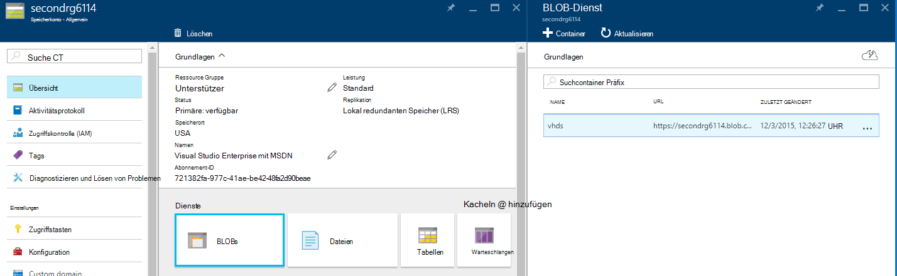
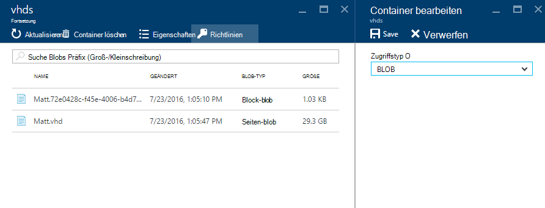
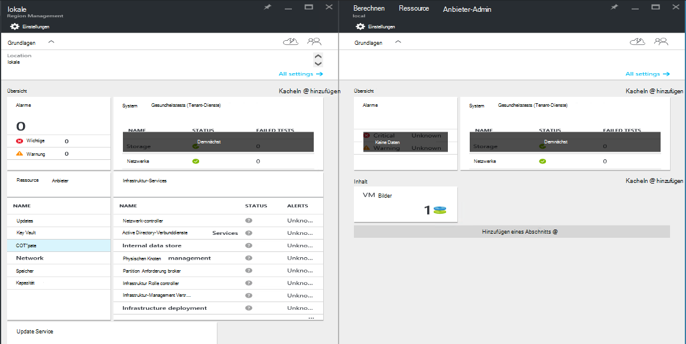
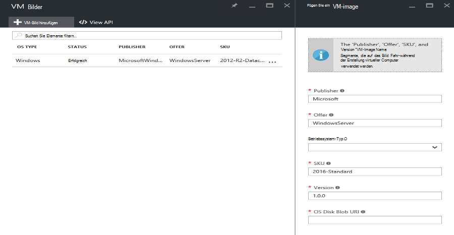

<properties
    pageTitle="Azure Stapel einem VM-Image hinzufügen | Microsoft Azure"
    description="Fügen Sie Ihrer Organisation benutzerdefinierte Windows oder Linux VM Bild Mieter verwenden"
    services="azure-stack"
    documentationCenter=""
    authors="mattmcg"
    manager="darmour"
    editor=""/>

<tags
    ms.service="azure-stack"
    ms.workload="na"
    ms.tgt_pltfrm="na"
    ms.devlang="na"
    ms.topic="get-started-article"
    ms.date="09/26/2016"
    ms.author="mattmcg"/>

# <a name="make-a-custom-virtual-machine-image-available-in-azure-stack"></a>Machen Sie benutzerdefinierte VM-Image in Azure Stapel verfügbar


Azure Stapel kann Administratoren den Mietern VM Bilder, wie ihre Organisation benutzerdefinierte VHD zur Verfügung. Bilder können Ressourcenmanager Azure Vorlagen verweist oder Azure Marketplace-Benutzeroberfläche mit einer Marketplace-Element hinzugefügt. Windows Server 2012 R2 Bild ist standardmäßig in Azure Stapel Technical Preview enthalten.

> [AZURE.NOTE] VM-Images mit Markt können in der Benutzeroberfläche **neu** auswählen, und wählen Sie die **virtuellen Computer** Kategorie bereitgestellt werden. VM Image-Elemente werden angezeigt.


## <a name="add-a-vm-image-to-marketplace-with-powershell"></a>Mit PowerShell VM-Image hinzufügen

Wenn VM-Image VHD lokal auf der VM-Konsole (oder einem anderen externen Gerät) verfügbar ist, gehen Sie folgendermaßen vor:

1. Vorbereiten einer Windows oder Linux Betriebssystem virtuelle Festplatte VHD-Format (nicht VHDX).
    -   Für Windows-Abbilder enthält Artikel [ein Bild VM Windows Azure für Ressourcenmanager Bereitstellungen hochladen](virtual-machines-windows-upload-image.md) Bild Vorbereitung Anweisungen im Abschnitt **Vorbereiten der VHD-Datei für den Upload** .
    -   Gehen Sie für Linux Bilder bereiten das Abbild oder ein vorhandenes Azure Stapel Linux Bild gemäß Artikel [Linux Bereitstellen von virtuellen Maschinen auf Azure Stapel](azure-stack-linux.md).

2. [Azure Stapel Tools Repository](https://aka.ms/azurestackaddvmimage)Klonen Sie und importieren Sie das **ComputeAdmin** -Modul

    ```powershell
    Import-Module .\ComputeAdmin\AzureStack.ComputeAdmin.psm1
    ```

3. VM-Image durch Aufrufen des Add-VMImage-Cmdlets hinzugefügt.
    -  Enthalten Sie Publisher, Angebot, SKU und die Version der VM-Image. Diese Parameter werden von Azure-Ressourcen-Manager Vorlagen verwendet, die VM-Image zu verweisen.
    -  Geben Sie OsType als Windows oder Linux.
    -  Ihre Azure Active Directory Mandanten-ID in das Formular einschließen * &lt;Myaadtenant&gt;*. onmicrosoft.com.
    - Es folgt ein Beispiel-Aufruf des Skripts:

    ```powershell
       Add-VMImage -publisher "Canonical" -offer "UbuntuServer" -sku "14.04.3-LTS" -version "1.0.0" -osType Linux -osDiskLocalPath 'C:\Users\AzureStackAdmin\Desktop\UbuntuServer.vhd' -tenantID <myaadtenant>.onmicrosoft.com
    ```

    > [AZURE.NOTE] Das Cmdlet fordert Anmeldeinformationen für die VM-Image hinzufügen. Anmeldeinformationen der Administrator Azure Active Directory, wie serviceadmin@ * &lt;Myaadtenant&gt;*. onmicrosoft.com Sie die Frage.  

Der Befehl führt Folgendes aus:
- Authentifiziert den Azure-Stack-Umgebung
- Uploads die lokale virtuellen Festplatte neu erstellten temporären Speicher-Konto
- VM-Bildspeicher hinzugefügt VM-image
- Erstellt ein Element Marketplace

Um sicherzustellen, dass der Befehl erfolgreich ausgeführt wurde, zum Markt im Portal und stellen Sie sicher, dass VM-Image im Bereich **virtuelle Computer** verfügbar ist.

> 

Es folgt eine Beschreibung der Befehlsparameter.


| Parameter | Beschreibung |
|----------| ------------ |
|**tenantID** | Mitgliedsnamen Mieter Azure Active Directory in der Form * &lt;AADTenantID*. onmicrosoft.com&gt;. |
|**Publisher** | Publisher Namen Segment VM-Image, das mit Mieter bei der Bereitstellung des Abbilds. Ein Beispiel ist 'Microsoft'. Schließen Sie ein Leerzeichen oder andere Sonderzeichen nicht in dieses Feld.|
|**Angebot** | Angebot Namen Segment VM-Image, das mit Mieter bei der Bereitstellung des Abbilds VM. Ein Beispiel ist 'WindowsServer'. Schließen Sie ein Leerzeichen oder andere Sonderzeichen nicht in dieses Feld. |
| **SKU** | SKU Name Segment VM-Image, das mit Mieter bei der Bereitstellung des Abbilds VM. Ein Beispiel ist "Datacenter2016". Schließen Sie ein Leerzeichen oder andere Sonderzeichen nicht in dieses Feld. |
|**Version** | Die Version der VM-Image, das mit Mieter bei der Bereitstellung des Abbilds VM. Diese Version hat das Format * \#.\#. \#*. Ein Beispiel ist 1.0.0". Schließen Sie ein Leerzeichen oder andere Sonderzeichen nicht in dieses Feld.|
| **osType** | OsType des Bildes muss 'Windows' oder 'Linux' sein. |
|**osDiskLocalPath** | Der lokale Pfad zu Betriebssystemdatenträger VHD-Datei, die Sie als Bild VM Azure Stapel hochladen. |
|**dataDiskLocalPaths**| Ein optionales Array von lokalen Pfade für Datenträger, die als Teil des VM-Image hochgeladen werden können.|
|**CreateGalleryItem**| Ein boolesches Flag, das bestimmt, ob ein Element im Markt zu erstellen. Die Standardeinstellung True.|
|**Titel**| Der Anzeigename der Marketplace-Element. Die Standardeinstellung der Publisher-Angebot-Sku VM-Image zu.|
|**Beschreibung**| Die Beschreibung des Artikels Marketplace. |
|**osDiskBlobURI**| Optional akzeptiert dieses BLOB-Speicher URI für OsDisk.|
|**dataDiskBlobURIs**| Dieses Skript nimmt optional auch ein Array von BLOB-Speicher URIs Bild Datenträger hinzufügen.|


## <a name="add-a-vm-image-through-the-portal"></a>Ein VM Bild über das Portal hinzufügen

> [AZURE.NOTE] Diese Methode erfordert das Marketplace-Element separat erstellen.

Eine Anforderung von Bildern ist von BLOB-Speicher-URI verwiesen werden kann. Bereiten Sie einer Windows oder Linux Betriebssystem virtuelle Festplatte VHD-Format (nicht VHDX vor), und Laden Sie das Bild auf ein Speicherkonto in Azure oder Azure Stapel. Wenn das Bild bereits in Azure oder Stapel Azure BLOB-Speicher geladen wird, können Sie diesen Schritt überspringen.

Gehen Sie Artikel Schritt **an das Speicherkonto VM Bild** [Hochladen ein Bild VM Windows Azure für Ressourcen-Manager-Installationen](https://azure.microsoft.com/documentation/articles/virtual-machines-windows-upload-image/) . Beachten Sie Folgendes:

-   Gehen Sie für ein Bild Linux zu dem Bild, oder verwenden Sie ein vorhandenes Bild Azure Stapel Linux gemäß Artikel [Linux Bereitstellen von virtuellen Maschinen auf Azure Stapel](azure-stack-linux.md).

- Es ist effizienter, ein Bild in Azure Stapel BLOB-Speicher als Azure Blob-Speicher hochgeladen werden, da weniger Zeit, VM-Image Abbildrepository Azure Stapel abgelegt. Während der Upload Instruktionen unbedingt [Authentifizieren PowerShell mit Microsoft Azure](azure-stack-deploy-template-powershell.md) Schritt für Schritt "Login in Azure" ersetzen.

- Notieren Sie die BLOB-Speicher URI, das Bild hochzuladen. Hat Folgendes Format: * &lt;StorageAccount&gt;/&lt;BlobContainer&gt;/&lt;TargetVHDName&gt;*VHD

2.  Damit das Blob anonym zugegriffen werden kann, gehen Sie Speicher Konto BLOB-Container, VM-Image VHD auf **Blob** hochgeladen wurde und dann **Zugriffsrichtlinie**. Gegebenenfalls können stattdessen SAS für den Container erstellen und Einfügen von Blob-URI.





1.  Melden Sie sich bei Azure Stapel als Administrator an. Wechseln Sie zur **Region Verwaltung**. Wählen Sie unter **RPs** **Ressourcenanbieter Compute** > **VM Bilder** > **Hinzufügen**

    

2.  Die folgenden Blade Geben Sie Publisher, Angebot, SKU und Version der VM-Image. Diese Namen Segmente finden Sie in der VM-Image in Azure Ressourcenmanager Vorlagen. Stellen Sie sicher **OsType** aktivieren. Geben Sie für **OsDiskBlobURI**in Schritt 1 den URI, wo das Bild hochgeladen wurde. Klicken Sie auf **Erstellen** , um die VM-Image erstellen.

    

3.  VM-Image-Status wechselt zu "Erfolgreich", wenn das Bild hinzugefügt.

4.  Mandanten können VM-Image Angabe von Publisher, Angebot, SKU Version der VM-Image in Azure-Ressourcen-Manager-Vorlage bereitstellen. Um die VM-Image leichter Mieter Verbrauch in der Benutzeroberfläche verfügbar sind, empfiehlt sich die [Marketplace Element erstellen](azure-stack-create-and-publish-marketplace-item.md).
