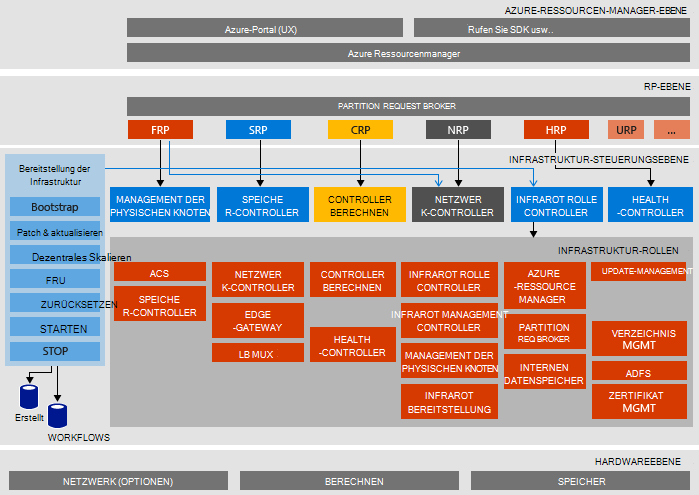

<properties
    pageTitle="Microsoft Azure Stapel Prüfung des Konzepts (POC) Architektur | Microsoft Azure"
    description="Anzeigen der Microsoft Azure Stapel POC-Architektur."
    services="azure-stack"
    documentationCenter=""
    authors="heathl17"
    manager="byronr"
    editor=""/>

<tags
    ms.service="azure-stack"
    ms.workload="na"
    ms.tgt_pltfrm="na"
    ms.devlang="na"
    ms.topic="article"
    ms.date="10/25/2016"
    ms.author="helaw"/>

# Microsoft Azure Stapel POC-Architektur

POC Stapel Azure ist eine Bereitstellung auf einem Knoten von Azure Stapel Technical Preview 2. Alle Komponenten sind in virtuellen Maschinen auf einem einzigen Host-Computer installiert. 

## Logisches Diagramm
Das folgende Diagramm veranschaulicht die logische Architektur des POC-Stack Azure und seiner Komponenten.

## VM-Rollen
POC Stapel Azure bietet POC-Host über die folgenden virtuellen Computer:

 - **MAS-ACS01** Virtuellen Computers Stapel Azure-Speicherdienste.

 - **MAS-ADFS01** Virtual Machine Active Directory Federation Services hosten.  Dieser virtuelle Computer wird nicht im Technical Preview 2 verwendet.  

 - **MAS-ASQL01**  Virtual Machine Azure Stapel Infrastruktur Rollen für einen internen Datenspeicher.  

 - **MAS-BGPNAT01** Virtuelle Maschine als ein Edge-Router und Azure Stack NAT und VPN-Funktionen bereit.

 - **MAS-CA01** Virtual Machine Certificate Authority Dienstleistungen für Azure Stapel Rollendienste.

 - **MAS-CON01** Virtual Machine Entwickler für PowerShell, Visual Studio und andere Tools installieren.

 - **MAS DC01** Virtuelle Computer hosten von Active Directory, DNS und DHCP-Dienste für Microsoft Azure.

 - **MAS-GWY01** Virtual Machine Dienstleistungen Edge Gateway wie VPN-Standort-zu-Standort-Verbindungen für Mieter Netzwerke.

 - **MAS-NC01**  Virtuellen Computers Netzwerkcontroller der Azure-Stapel Netzwerkdienste verwaltet.  

 - **MAS-SLB01**  Virtual Machine bietet Lastenausgleich Dienste in Azure Stapel für Mieter und Azure Stack Infrastrukturdienste.  

 - **MAS-SUS01**  Virtuelle hosting Windows Server Update Services und verantwortlich für die Bereitstellung von Updates für andere Azure Stack virtuelle Computer.

 - **MAS-WAS01**  Virtuellen Computers Portal und Ressourcenmanager Azure Services.

 - **MAS-XRP01** VM, die zentrale Ressourcenanbieter von Microsoft Azure-Stack und Ressourcenprovider Computing-, Netzwerk- und Speicher hostet.

## Speicher-services
Speicher-Services auf dem physischen Host gehören:

 - **ACS BLOB-Dienst** Azure konsistente BLOB-Speicher Service BLOB- und Storage Services bietet.

 - **SoFS** Dezentrales Skalieren der Dateiserver.

 - **ReFS CSV** Robustes Datei freigegebene System Datenträger.

 - **Virtuelles Laufwerk** **Speicherplatz**und **Storage Spaces direkte** sind zugrunde liegenden Speicher Technik in Windows Server Microsoft Azure Stapel zentrale Ressource Speicheranbieter aktivieren.

## Nächste Schritte

[Bereitstellen von Azure Stapel](azure-stack-deploy.md)

[Erste Testszenarios](azure-stack-first-scenarios.md)

