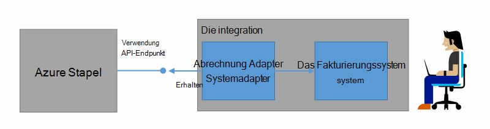
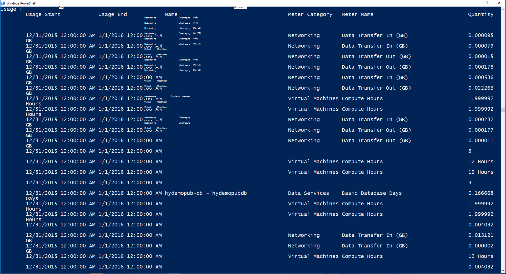

<properties
    pageTitle="Kunden Abrechnung und Chargeback Azure Stack | Microsoft Azure"
    description="Informationen Sie zum Abrufen von Informationen aus Azure Stapel."
    services="azure-stack"
    documentationCenter=""
    authors="AlfredoPizzirani"
    manager="byronr"
    editor=""/>

<tags
    ms.service="azure-stack"
    ms.workload="na"
    ms.tgt_pltfrm="na"
    ms.devlang="na"
    ms.topic="article"
    ms.date="10/18/2016"
    ms.author="alfredop"/>

# Kunden und Chargeback in Azure Stapel

Da Azure Stack verwenden, ist es sollten Sie darüber nachdenken, wie nachzuvollziehen. Dienstanbieter abhängig Informationen um ihre Kunden und die Kosten zu verstehen.
Unternehmen leicht nachverfolgen, normalerweise nach Abteilung.

Azure Stack ist kein Abrechnungssystem. Es wird nicht der Mieter für Ressourcen verwenden sie berechnen. Aber, Azure Stapel Infrastruktur sammeln und Aggregieren von Daten für jeden einzelnen Ressourcenanbieter. Sie können Zugriff auf diese Daten in ein Abrechnungssystem mit Abrechnung Adapter exportieren und Business Intelligence-Tools wie Microsoft Power BI exportieren.

## Welche Verwendungsinformationen können gefunden werden, und wie?

Azure Stapel Ressourcenprovider Einträge in stündlichen Abständen generieren. Den Betrag der einzelnen Ressourcen verbraucht, und welches Abonnement verbrauchte Ressource anzeigen Datensätze Diese Daten werden gespeichert. Sie können die Daten über die REST-API zugreifen.

Dienstadministratoren kann Daten für alle Mandanten Abonnements abrufen. Einzelne Mandanten können nur ihre eigenen Informationen abrufen.

Einträge müssen Informationen über Speicher, Netzwerk und Computing Auslastung. Eine Liste der Messgeräte finden Sie in [diesem Artikel](azure-stack-usage-related-faq.md).

## Informationen abrufen

Um Datensätze zu generieren, muss Ressourcen und aktiv System haben. Wenn Sie unsicher sind, ob alle Ressourcen verfügen, Azure Stapel Marketplace bereitstellen und Ausführen einer virtuellen Maschine (VM). Betrachten der VM Blade Überwachung sicherzustellen wird ausgeführt.

Wir empfehlen Windows PowerShell-Cmdlets zum Anzeigen von Daten ausführen.
PowerShell ruft Ressource: Einsatz APIs.

1.  [Installieren und Konfigurieren von Azure PowerShell](https://azure.microsoft.com/en-us/documentation/articles/powershell-install-configure/).

2.  Verwenden Sie zum Anmelden an Azure-Ressourcen-Manager das PowerShell-Cmdlet **Login-AzureRmAccount**.

3.  Um das Abonnement auswählen, mit der Sie Ressourcen erstellen, geben Sie "Sub" Get-AzureRmSubscription-SubscriptionName **| Wählen Sie AzureRmSubscription**.

4.  Verwenden Sie zum Abrufen der Daten das PowerShell-Cmdlet [**Get-UsageAggregates**](https://msdn.microsoft.com/en-us/library/mt619285.aspx).
    Wenn Daten verfügbar ist, wird es wie im folgenden Beispiel in PowerShell zurückgegeben. PowerShell gibt 1.000 Zeilen pro Aufruf.
    Das Argument *Fortsetzung* können Sie Linien über die ersten 1.000 abrufen. Weitere Informationen zu Daten finden Sie unter der [Ressource: Einsatz-API-Referenz](azure-stack-provider-resource-api.md).

    

## Nächste Schritte

[Anbieter-Ressourcenverwendung API](azure-stack-provider-resource-api.md)

[Ressourcenverwendung API Mieter](azure-stack-tenant-resource-usage-api.md)

[Verwendung-bezogene häufig gestellte Fragen](azure-stack-usage-related-faq.md)
