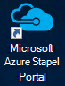
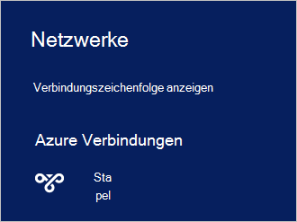

<properties
    pageTitle="Verbinden mit Azure Stapel | Microsoft Azure"
    description="Informationen Sie zum Verbinden von Azure Stapel"
    services="azure-stack"
    documentationCenter=""
    authors="ErikjeMS"
    manager="byronr"
    editor=""/>

<tags
    ms.service="azure-stack"
    ms.workload="na"
    ms.tgt_pltfrm="na"
    ms.devlang="na"
    ms.topic="get-started-article"
    ms.date="10/18/2016"
    ms.author="erikje"/>

# <a name="connect-to-azure-stack"></a>Verbinden mit Azure Stapel
Um Ressourcen zu verwalten, müssen Sie auf Azure Stapel POC-Computer verbinden. Verwenden Sie eines der folgenden Verbindungsoptionen:

 - Remote Desktop: ermöglicht einen einzelnen gleichzeitigen Benutzer schnell die POC-Computer herstellen.
 - Virtuelles privates Netzwerk (VPN): ermöglicht mehrere gleichzeitige Benutzer von Clients außerhalb der Azure-Stapel-Infrastruktur herstellen (Konfiguration erforderlich).

## <a name="connect-with-remote-desktop"></a>Verbinden mit Remotedesktop
Mit einer Remotedesktopverbindung kann im Ressourcen-Portal ein einzelnen gleichzeitiger Benutzer arbeiten. Sie können auch Tools auf dem virtuellen Computer MAS-CON01.

1.  Melden Sie sich bei Azure Stapel POC-Rechner.

2.  Öffnen Sie eine Remotedesktopverbindung und MAS-CON01 an. Geben Sie den Benutzernamen und das Administratorkennwort Azure Stapel Setup bereitgestellten **AzureStack\AzureStackAdmin** .  

3.  Doppelklicken Sie auf dem Desktop MAS CON01 auf **Microsoft Azure Stapel Portal** (https://portal.azurestack.local/) um das [Portal](azure-stack-key-features.md#portal)zu öffnen.

    

4.  Melden Sie sich mit den Azure Active Directory-Anmeldeinformationen während der Installation angegeben.

## <a name="connect-with-vpn"></a>Verbinden mit VPN
Virtuelle privates Netzwerk Verbindungen können mehrere gleichzeitige Benutzer von Clients außerhalb der Azure-Stapel-Infrastruktur herstellen. Das Portal können Sie Ressourcen verwalten. Sie können auch Tools wie Visual Studio und PowerShell auf dem lokalen Client.

1.  Installieren Sie das Modul AzureRM mit dem folgenden Befehl:
   
    ```PowerShell
    Install-Module -Name AzureRm -RequiredVersion 1.2.6 -Scope CurrentUser
    ```   
   
2. Download-Skripten Azure Stack-Tools.  Diese Dateien können [GitHub Repository](https://github.com/Azure/AzureStack-Tools)durchsuchen oder Ausführen des folgenden Windows PowerShell-Skripts als Administrator unterstützt:
    
    >[AZURE.NOTE]  Die folgenden Schritte erfordern PowerShell 5.0.  Überprüfen Sie die Version $PSVersionTable.PSVersion ausführen und "Hauptversion" vergleichen.  

    ```PowerShell
       
       #Download the tools archive
       invoke-webrequest https://github.com/Azure/AzureStack-Tools/archive/master.zip -OutFile master.zip

       #Expand the downloaded files. 
       expand-archive master.zip -DestinationPath . -Force

       #Change to the tools directory
       cd AzureStack-Tools-master
    ````

3.  Navigieren Sie in derselben Sitzung PowerShell zum Ordner **Verbinden** und importieren Sie des AzureStack.Connect.psm1-Moduls:

    ```PowerShell
    cd Connect
    import-module .\AzureStack.Connect.psm1
    ```

4.  Um Azure Stapel VPN-Verbindung zu erstellen, führen Sie folgende Windows PowerShell. Vor dem Ausführen, füllen Sie Administratorkennwort und Azure Stack Host Adressfelder auf. 
    
    ```PowerShell
    #Change the IP Address below to match your Azure Stack host
    $hostIP = "<HostIP>"

    # Change password below to reference the password provided for administrator during Azure Stack installation
    $Password = ConvertTo-SecureString "<Admin Password>" -AsPlainText -Force

    # Add Azure Stack One Node host & CA to the trusted hosts on your client computer
    Set-Item wsman:\localhost\Client\TrustedHosts -Value $hostIP -Concatenate
    Set-Item wsman:\localhost\Client\TrustedHosts -Value mas-ca01.azurestack.local -Concatenate  

    # Update Azure Stack host address to be the IP Address of the Azure Stack POC Host
    $natIp = Get-AzureStackNatServerAddress -HostComputer $hostIP -Password $Password

    # Create VPN connection entry for the current user
    Add-AzureStackVpnConnection -ServerAddress $natIp -Password $Password

    # Connect to the Azure Stack instance. This command (or the GUI steps in step 5) can be used to reconnect
    Connect-AzureStackVpn -Password $Password 
    ```

5. Wenn Sie aufgefordert werden, vertrauen des Azure-Stack-Hosts.

6. Wenn Sie aufgefordert werden, installieren Sie ein Zertifikat (Aufforderung erscheint hinter dem Powershell-Sitzung).

7. Navigieren Sie zum Testen der Verbindungs Portal in einem Internetbrowser zu *https://portal.azurestack.local*.

8. Überprüfen der Azure-Stapel Verbindung und verwenden Sie **Netzwerke** auf dem Client:

    

>[AZURE.NOTE] Diese VPN-Verbindung bietet keine Konnektivität auf VMs oder andere Ressourcen. Informationen Verbindung mit Ressourcen finden Sie unter [Einem Knoten VPN-Verbindung](azure-stack-create-vpn-connection-one-node-tp2.md)


## <a name="next-steps"></a>Nächste Schritte
[Erste Aufgaben](azure-stack-first-scenarios.md)

[Installieren und Verbinden mit PowerShell](azure-stack-connect-powershell.md)

[Installieren und Verbinden mit CLI](azure-stack-connect-cli.md)


