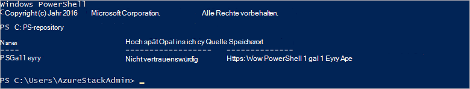

<properties
    pageTitle="Verbinden mit Azure Stapel mit PowerShell | Microsoft Azure"
    description="Verwalten Sie Azure-Stapel mit PowerShell"
    services="azure-stack"
    documentationCenter=""
    authors="HeathL17"
    manager="byronr"
    editor=""/>

<tags
    ms.service="azure-stack"
    ms.workload="na"
    ms.tgt_pltfrm="na"
    ms.devlang="na"
    ms.topic="article"
    ms.date="10/19/2016"
    ms.author="helaw"/>

# Installieren Sie PowerShell und Azure Stack an
In diesem Handbuch schrittweise wir für die Verbindung mit Azure Stapel mit PowerShell. Abschluss können folgendermaßen dazu verwalten und Bereitstellen von Ressourcen.

## Azure Stapel PowerShell-Cmdlets installieren

1.  AzureRM-Cmdlets werden aus der Galerie PowerShell installiert. Zunächst öffnen Sie eine Konsole PowerShell MAS CON01 und führen Sie folgenden Befehl eine Liste von PowerShell Repositories verfügbar zurückgeben:

        Get-PSRepository

      

2.  Führen Sie den folgenden Befehl AzureRM Modul installiert:

        Install-Module -Name AzureRM -RequiredVersion 1.2.6 -Scope CurrentUser

    >[AZURE.NOTE] *-Bereich CurrentUser* ist optional. Ggf. mehr als den aktuellen Benutzer Zugriff auf die Module belegen und lassen Sie *den Bereichsparameter* .

3.  Bestätigen Sie die Installation von AzureRM Module Befehle:

        Get-Command -Module AzureRM.AzureStackAdmin

## Verbinden mit Azure Stapel
Ein Modul ist heruntergeladen, die Konfiguration von PowerShell Verbindung Azure Stapel behandelt.  Modul und zusätzliche Schritte finden Sie unter [Azure Stack-Tools](http://aka.ms/ConnectToAzureStackPS) . 

## Abrufen einer Liste von Abonnements
In diesem Abschnitt überprüfen Sie, dass PowerShell-Cmdlets abrufen und Auswählen eines Abonnements für die Verwendung auf Azure Stapel ausführen.

Führen Sie den folgenden Befehl zum Abrufen einer Liste mit Ihrem Konto verbundene Azure Stapel Abonnements:

    Get-AzureRmSubscription

## Nächste Schritte
[Bereitstellen von Vorlagen mit PowerShell](azure-stack-deploy-template-powershell.md)

[Verbinden mit Azure CLI](azure-stack-connect-cli.md)

[Bereitstellen von Vorlagen mit Visual Studio](azure-stack-deploy-template-visual-studio.md)

