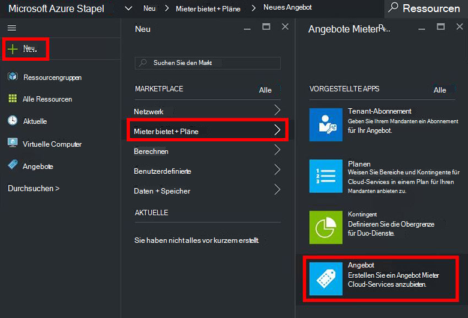
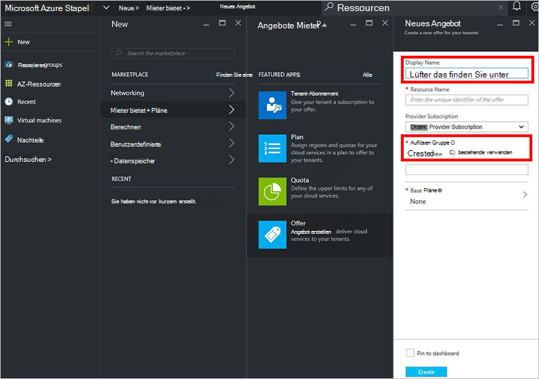
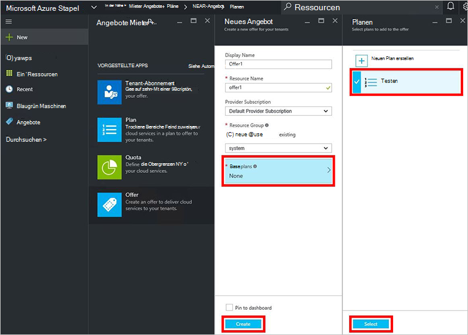
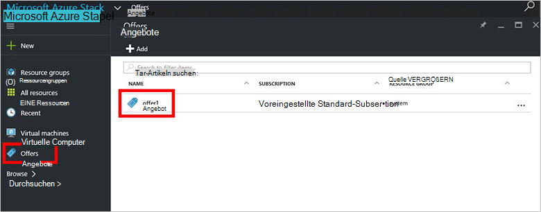
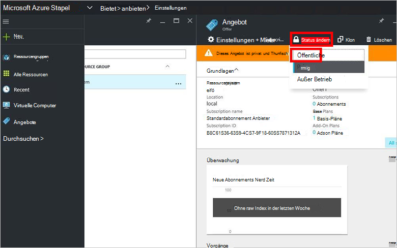

<properties
    pageTitle="Erstellen Sie ein Angebot in Azure Stapel | Microsoft Azure"
    description="Als Administrator Service erfahren Sie einen Preisvorschlag für Ihren Mandanten in Azure Stapel erstellen."
    services="azure-stack"
    documentationCenter=""
    authors="ErikjeMS"
    manager="byronr"
    editor=""/>

<tags
    ms.service="azure-stack"
    ms.workload="na"
    ms.tgt_pltfrm="na"
    ms.devlang="na"
    ms.topic="get-started-article"
    ms.date="09/26/2016"
    ms.author="erikje"/>

# Erstellen Sie ein Angebot in Azure Stapel

[Bietet](azure-stack-key-features.md#services-plans-offers-and-subscriptions) sind ein oder mehrere Pläne, die Anbieter erwerben oder Mieter präsentieren. Dieses Dokument veranschaulicht, wie ein Angebot erstellen [Erstellung Plan](azure-stack-create-plan.md) im letzten Schritt. Dieses Angebot kann Abonnenten auf virtuellen Computern bereitstellen.

1.  Als Administrator Service-Portal [Anmelden](azure-stack-connect-azure-stack.md#log-in-as-a-service-administrator) und dann auf **neu** > **Mieter bietet + Pläne** > **bieten**.
    

2.  Das **Neue** Blatt füllen Sie **Anzeigenamen** und **Ressourcennamen**und wählen Sie eine neue oder vorhandene **Ressourcengruppe**. Der Anzeigename ist das Angebot Anzeigenamen. Der Administrator kann den Ressourcennamen anzeigen Es ist der Name, mit dem Administratoren das Angebot als Ressource Azure-Ressourcen-Manager arbeiten.

    

3.  Auf **Basis plant** , wählen Sie das Blade **Planen** Pläne in das Angebot aufnehmen möchten und klicken Sie auf **auswählen**. Klicken Sie auf **Erstellen** , um das Angebot zu erstellen.

    
    
4. **Bietet** auf, und klicken Sie dann auf das Angebot, das Sie gerade erstellt haben.

    

5.  Klicken Sie auf **Status ändern**und dann auf **öffentlich**.
  
    

Angebote für Mandanten zu der vollständigen Ansicht bei erfolgt. Angebote sind möglich:

- **Öffentlich**: Mieter angezeigt.

- **Privat**: nur die Administratoren sichtbar. Hilfreich bei der Ausarbeitung des Plans oder Angebot oder Dienstadministrator möchte jedem Abonnement.

- **Listenrichtlinien**: neue Abonnenten geschlossen. Die Dienstadministratoren können stillgelegt Abonnement verhindern jedoch Abonnenten unverändert belassen.

Änderung des Angebots sind nicht sofort Pächter. Die Änderungen finden Sie möglicherweise Abmeldung an das neue Abonnement Element in der "Abonnement" beim Ressourcen-Ressourcen erstellen.

## Nächste Schritte

[Abonnieren Sie ein Angebot und Bereitstellung einer VM](azure-stack-subscribe-plan-provision-vm.md)
