<properties
    pageTitle="Erstellen eines Plans in Azure Stapel | Microsoft Azure"
    description="Als ein Dienstadministrator erstellen Sie einen Plan, der Abonnenten Bereitstellung virtueller Maschinen kann."
    services="azure-stack"
    documentationCenter=""
    authors="ErikjeMS"
    manager="byronr"
    editor=""/>

<tags
    ms.service="azure-stack"
    ms.workload="na"
    ms.tgt_pltfrm="na"
    ms.devlang="na"
    ms.topic="get-started-article"
    ms.date="09/26/2016"
    ms.author="erikje"/>

# Erstellen eines Plans in Azure Stapel

[Pläne](azure-stack-key-features.md#services-plans-offers-and-subscriptions) sind Gruppen von mindestens ein. Erstellen Sie als Anbieter der Mieter anbieten. Ihre Angebote Pläne und Dienste aufgeführt, abonnieren die Mieter. Dieses Beispiel zeigt, wie einen Plan erstellen Computing-, Netzwerk- und Speicher Ressourcenprovider. Dies ermöglicht Abonnenten auf virtuellen Computern bereitstellen.

1.  Navigieren Sie in einem Internetbrowser zu https://portal.azurestack.local.

2.  Azure-Stapel eines Portal [Anmelden](azure-stack-connect-azure-stack.md#log-in-as-a-service-administrator) Anmeldeinformationen Service Administrator (das Konto, das Sie in Schritt 5 des Abschnitts [PowerShell Skript](azure-stack-run-powershell-script.md) erstellt), und klicken Sie auf **Anmelden**.

    Administratoren können Pläne und Angebote erstellen und Verwalten von Benutzern.

3.  Erstellen eines Plans und Angebot Mieter abonnieren können, klicken Sie auf **neu** > **Mieter bietet + Pläne** > **Plan**.

    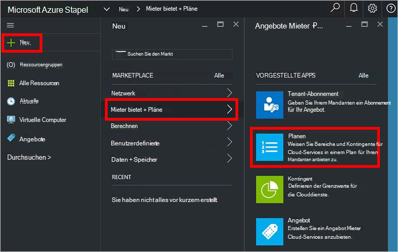

4.  Füllen Sie in Blade **Neuen** **Anzeigenamen** und **Ressourcennamen**. Der Anzeigename ist Anzeigenamen des Plans, der Mieter angezeigt. Der Administrator kann den Ressourcennamen anzeigen Es ist der Name, mit dem Administratoren den Plan als Ressource Azure-Ressourcen-Manager arbeiten.

    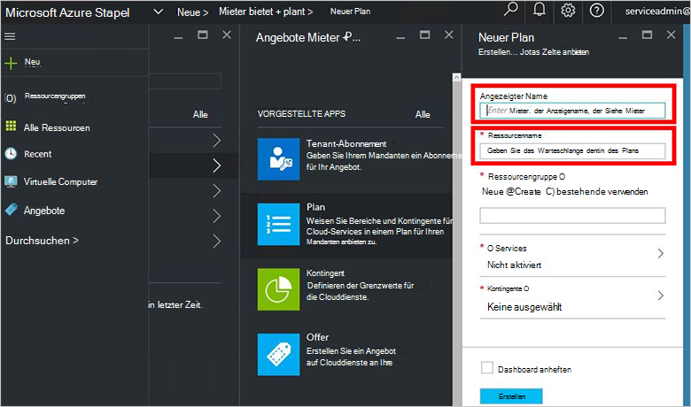

5.  Erstellen Sie eine neue **Ressourcengruppe**, oder wählen Sie eine vorhandene als Container für den Plan (z. B. "OffersAndPlans")

    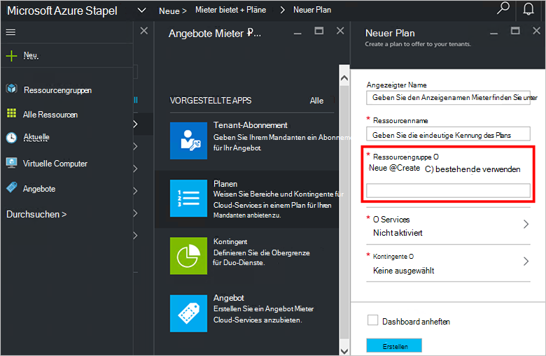

6.  Klicken Sie auf **Dienste**, wählen Sie **Microsoft.Compute**, **Microsoft.Network**und **Microsoft.Storage**und klicken Sie auf **auswählen**.

    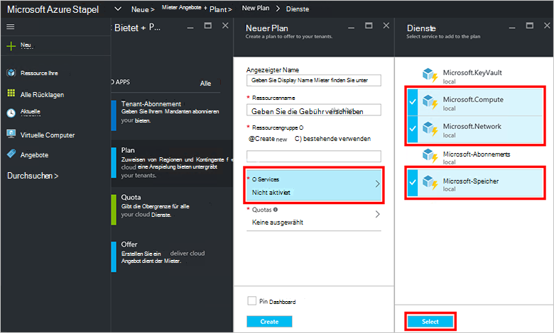

7.  Klicken Sie auf **Kontingente**, klicken Sie auf **Microsoft.Storage (lokal)**, und wählen Sie das Standardkontingent oder klicken Sie auf **neue Kontingent erstellen** Anpassen des Kontingents.

    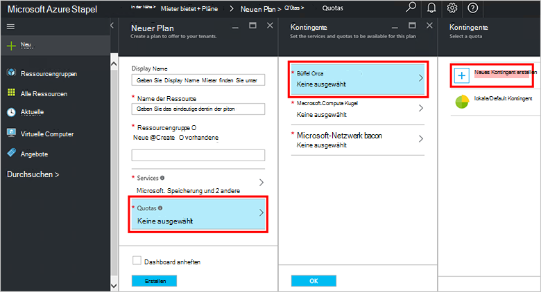

8.  Einen Namen für das Kontingent auf **Kontingentvorlage**, legen Sie die Werte der und klicken Sie auf **OK**, und klicken Sie auf **Erstellen**.

    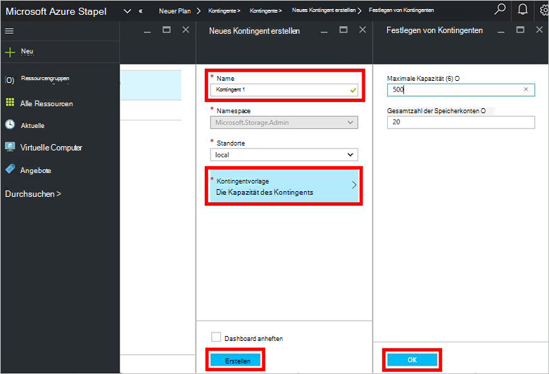

9. Klicken Sie auf **Microsoft.Network (lokal)**, und wählen Sie das Standardkontingent oder klicken Sie auf **neue Kontingent erstellen** das Kontingent anpassen.

    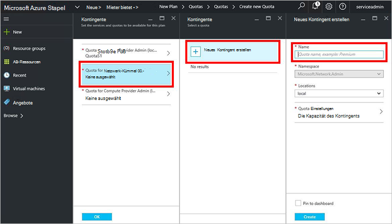

10. Einen Namen für das Kontingent auf **Kontingentvorlage**, legen Sie die Werte der und klicken Sie auf **OK**, und klicken Sie auf **Erstellen**.

    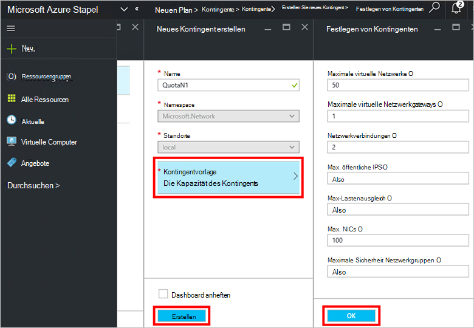

11. Klicken Sie auf **Microsoft.Compute (lokal)**, und wählen Sie das Standardkontingent oder klicken Sie auf **neue Kontingent erstellen** das Kontingent anpassen.

    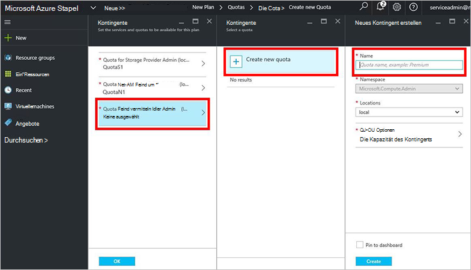

12.  Einen Namen für das Kontingent auf **Kontingentvorlage**, legen Sie die Werte der und klicken Sie auf **OK**, und klicken Sie auf **Erstellen**.

    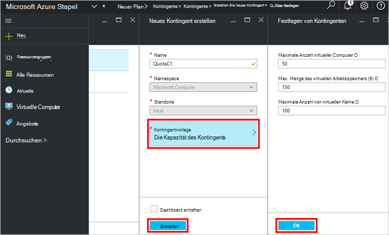

13. Blatt **Kontingente** klicken Sie auf **OK**und dann im **Neuen Plan** Blade auf **Erstellen** , um den Plan erstellen.

    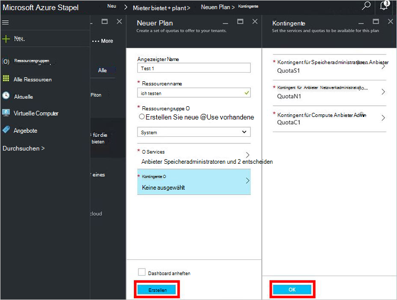

14. Klicken Sie auf **alle Ressourcen**, neuen finden suchen nach Plan und klicken Sie auf seinen Namen.

    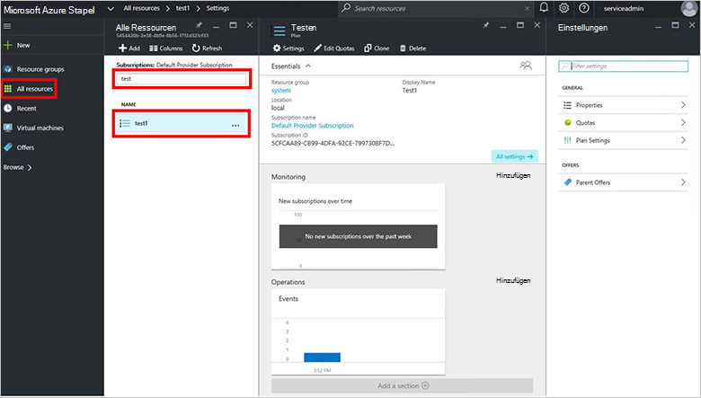

## Nächste Schritte

[Erstellen eines Angebots](azure-stack-create-offer.md)
