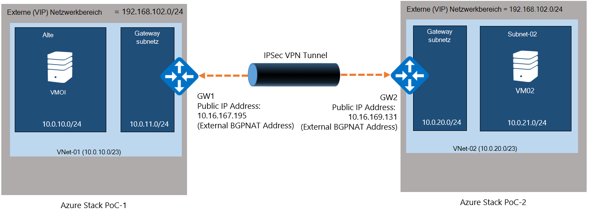
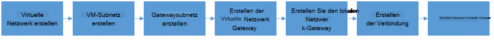
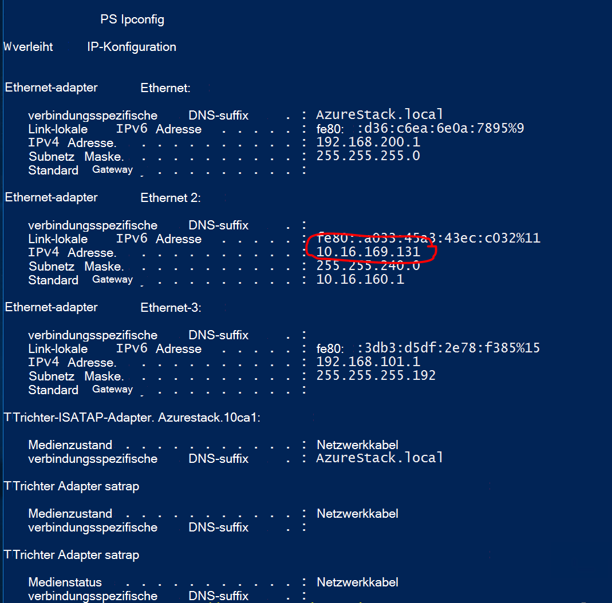
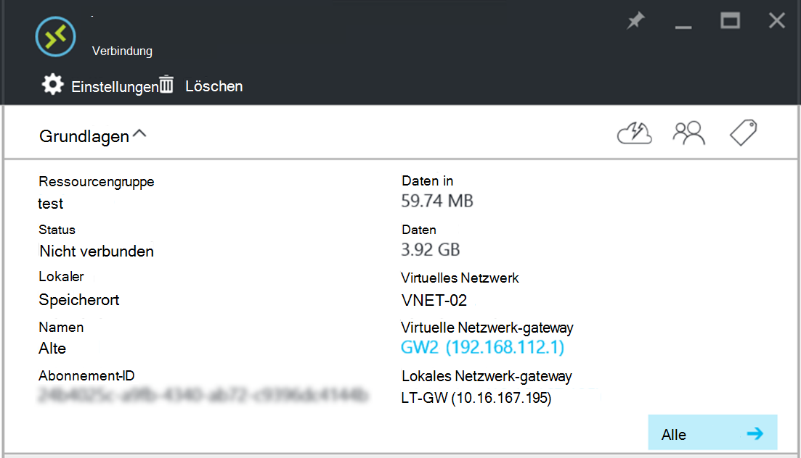

<properties
    pageTitle="Eine Standort-zu-Standort-VPN-Verbindung zwischen zwei virtuelle Netzwerke in verschiedenen Azure Stapel PoC-Umgebung | Microsoft Azure"
    description="Anleitung, mit der einen Cloud-Administrator eine Standort-zu-Standort-VPN-Verbindung zwischen zwei Knoten eine POC Umgebungen TP2 erstellen kann."
    services="azure-stack"
    documentationCenter=""
    authors="ScottNapolitan"
    manager="darmour"
    editor=""/>

<tags
    ms.service="azure-stack"
    ms.workload="na"
    ms.tgt_pltfrm="na"
    ms.devlang="na"
    ms.topic="get-started-article"
    ms.date="09/26/2016"
    ms.author="scottnap"/>

# Eine Standort-zu-Standort-VPN-Verbindung zwischen zwei virtuelle Netzwerke in verschiedenen Azure Stapel PoC-Umgebung

## Übersicht

Dieser Artikel führt Sie durch die Schritte zum Erstellen einer Standort-zu-Standort-VPN-Verbindungs zwischen zwei virtuellen Netzwerken in zwei separaten Azure Stapel Prüfung des Konzepts (POC) Umgebung. Dies dient zu von Standort zu Standort evaluieren Gateways verstehen VPN-Verbindungen zwischen virtuellen Netzwerken in zwei verschiedenen Azure Stapel Bereitstellungen einrichten.  Dabei werden Sie verstehen wie VPN-Gateways in Azure Stack arbeiten.

>[AZURE.NOTE] Dieses Dokument bezieht sich ausdrücklich auf Azure Stapel TP2 POC.

### Diagramm

Es folgt Abbildung zeigt die Konfiguration sollte aussehen wie wenn wir fertig sind.

### Bevor Sie beginnen

Um diese Konfiguration abzuschließen, benötigen Sie die folgenden Elemente müssen Sie diese Dinge haben zunächst.

-   Zwei Server, die von [Azure Stapel Deployment Prerequisites](azure-stack-deploy.md)Anforderungen Azure Stapel POC Hardware und der anderen erforderlichen Komponenten dieses Dokument definiert entsprechen.

-   Das Bereitstellungspaket von Azure Stapel Technical Preview 2.

## Bereitstellen der POC-Umgebung

Sie werden zwei Azure Stapel POC-Umgebung zum Abschließen dieser Konfiguration bereitstellen.

-   Für jede Prüfung des Konzepts, die Sie bereitstellen, können Sie bereitstellungsanweisungen im Artikel [Bereitstellen von Azure Stapel POC](azure-stack-run-powershell-script.md)folgen.
    Wir verweisen auf jeden POC-Umgebung in diesem Dokument im Allgemeinen als POC1 und POC2.

## Konfigurieren von Kontingenten für Computing-, Netzwerk- und Speicher

Sie müssen Kontingente für Compute, Netzwerk und Speicher, damit diese Dienste einem Plan zugeordnet werden können und dann ein Mieter Angebot abonnieren kann.

>[AZURE.NOTE] Sie müssen diese Schritte für jede Azure Stapel POC-Umgebung.

Erfahrung Kontingente für Services Erstellen von TP1 geändert. Die Schritte zum Erstellen von Kontingenten in TP2 finden unter <http://aka.ms/mas-create-quotas>. Sie können die Standardwerte für alle Kontingentvorlage für diese Übung übernehmen.

## Erstellen Sie einen Plan und Angebot

[Pläne](azure-stack-key-features.md) sind Gruppen von mindestens ein. Erstellen Sie als Anbieter der Mieter anbieten. Ihre Angebote Pläne und Dienste aufgeführt, abonnieren die Mieter.

>[AZURE.NOTE] Sie müssen diese Schritte für jede Azure Stapel POC-Umgebung.

1.  Erstellen Sie zunächst einen Plan. Hierzu können Sie den [Plan erstellen](azure-stack-create-plan.md) online Artikel Schritte.

2.  Erstellen Sie ein Angebot [erstellen ein Angebot in Azure Stapel](azure-stack-create-offer.md)beschriebenen Schritte.

3.  Melden Sie sich beim Portal als Tenant-Administrator und [erstellten Angebot abonnieren] (Azure-Stapel-abonnieren-Plan-Bereitstellung-vm.md.

## Erstellen Sie die Netzwerkressourcen im POC-1

Wir werden jetzt wir unsere Konfiguration müssen die Ressourcen tatsächlich erstellen. Die folgenden Schritte veranschaulichen, was wir tun. Diese Anleitung zeigt Ressourcen über das Portal erstellen, aber dasselbe über PowerShell durchgeführt werden kann.

### Melden Sie sich als Mieter

Dienstadministratoren kann als Mieter Pläne, Angebote und Abonnements Mieter verwenden testen anmelden. Haben Sie bereits einen [mieterkonto erstellen](azure-stack-add-new-user-aad.md) , bevor Sie sich anmelden.

### Virtuelles Netzwerk & VM Subnetz erstellen

1.  Ein Mieter Konto anmelden.

2.  Klicken Sie auf das Symbol **neu** in Azure-Portal.

     
3.  Wählen Sie **Netzwerke** aus Marketplace.

4.  Klicken Sie im Menü **Virtual Network** .

5.  Klicken Sie **Erstellen** am unteren Rand der Ressource Beschreibung Blade. Geben Sie die folgenden Werte in die entsprechenden Felder dieser Tabelle.

  	| **Feld**             | **Wert** |
  	|----------------------- | ------ |
  	| Name                  |Vnet-01 |
  	| Adressbereich         | 10.0.10.0/23 |
  	| Subnet-name           | Subnet-01 |
  	| Subnet-Adressbereich  | 10.0.10.0/24 |

6.  Das Abonnement sollte im Feld **Abonnement** zuvor gefüllt erstellt angezeigt werden.

7.  Für Ressourcengruppe können Sie eine neue Ressourcengruppe erstellen oder wenn, noch bestehende verwenden.

8.  Überprüfen Sie das Standardverzeichnis.

9.  Klicken Sie auf die Schaltfläche **Erstellen** .

### Gatewaysubnetz erstellen

1.  Öffnen Sie die virtuellen Netzwerkressource (Vnet-01) direkt aus dem Dashboard erstellt.

2.  Wählen Sie auf dem Blatt Einstellungen Subnets

3.  Klicken Sie auf **Gateway-Subnetz** , um ein dem virtuellen Netzwerk hinzufügen.

     
4.  Die Standardeinstellung für des Namens des Teilnetzes ist **Subnetzname** .
    Gateway Subnetze sind besondere und müssen bestimmten Namen ordnungsgemäß funktionieren.

5.  Geben Sie im Feld **Adresse** **10.0.11.0/24**.

6.  Klicken Sie auf **Create** gatewaysubnetz erstellen.

### Virtuelle Netzwerk-Gateway erstellen

1.  Azure-Portal klicken Sie auf das Symbol **neu** .

    

2.  Wählen Sie **Netzwerke** aus Marketplace.

3.  Wählen Sie aus der Liste der Netzwerkressourcen **virtuellen Netzwerk-Gateway** .

4.  Überprüfen Sie die Beschreibung, und klicken Sie auf **Erstellen**.

5.  Geben Sie im Feld **Name** **GW1**.

6.  Klicken Sie zum Auswählen eines virtuellen Netzwerks **virtuelle Netzwerk** .
    Wählen Sie aus der Liste **Vnet-01** .

7.  Klicken Sie auf das Menüelement **öffentliche IP-Adresse** . Wählen Sie öffentliche IP-Adresse Blade öffnet klicken Sie auf die Schaltfläche neu erstellen.

8.  Geben Sie im Feld **Name** **GW1 PiP** und auf **Ok.**

9.  **Gateway-Typ** soll **VPN** standardmäßig aktiviert sein. Diese Einstellung beibehalten.

10. **VPN-Typ** müssen **Route basiert** standardmäßig aktiviert.
    Diese Einstellung beibehalten.

11. Überprüfen Sie **Abonnements** und **Speicherort** richtig sind. Die Ressource dem Dashboard kann ggf. angeheftet werden. Klicken Sie auf **Erstellen**.

### Erstellen des lokalen Netzwerk-Gateways

Die Netzwerk-Gateway-Ressource ist in diesem Szenario ein wenig seltsam.
In Azure es normalerweise eine physische, lokale Gerät darstellen soll Verwendung Gateway des virtuellen Netzwerks in Azure Verbindung ist dieselbe Ressource in Azure finden. In unserem Beispiel sind beide Enden der Verbindung tatsächlich virtuelle Netzwerkgateways!

Eine Möglichkeit, allgemeineren davon ist die Netzwerk-Gateway-Ressource immer soll das Gateway am anderen Ende der Verbindung angeben. Aufgrund der Art die POC wurde, müssen wir tatsächlich die Adresse des externen Netzwerkadapters auf NAT VM die POC als öffentliche IP-Adresse des lokalen Gateways bieten. Erstellen wir NAT Mappings auf NAT VM zu beiden Enden korrekt angeschlossen sind.

### Die IP-Adresse des externen Adapters NAT-VM

1.  Melden Sie sich bei Azure Stack-Rechner für POC2.

2.  [Windows-Taste] + R Menü **Ausführen** und geben Sie **Mstsc** und drücken Eingabe.

3.  Geben Sie im **Feld** Namen **MAS-BGPNAT01** , und klicken Sie auf die Schaltfläche **Verbinden** .

4.  Klicken Sie auf Start und auf PowerShell Maustaste, und wählen Sie **Als Administrator ausführen**.

5.  Typ **IPConfig/all**.

6.  Suchen Sie Ethernet-Adapter, der mit dem lokalen Netzwerk verbunden ist, und notieren Sie die IPv4-Adresse an den Adapter gebunden. In meiner Umgebung wird ist **10.16.167.195** Ihnen jedoch anders.

7.  Notieren Sie diese Adresse. Dies ist was wir öffentliche IP-Adresse des Netzwerk-Gateway-Ressource verwenden, die wir in POC1 erstellen.

### Die lokale Gateway Netzwerkressource erstellen

1.  Melden Sie sich bei Azure Stack-Rechner für POC1.

2.  Geben Sie in das Feld **Computer** **MAS-CON01 ein** , und klicken Sie auf die Schaltfläche **Verbinden** .

3.  Klicken Sie auf das Symbol **neu** in Azure-Portal.

    

4.  Wählen Sie **Netzwerke** aus Marketplace.

5.  Wählen Sie aus der Liste der Ressourcen **LAN Gateway** .

6.  Geben Sie im Feld **Name** **POC2 GW**.

7.  Wir wissen unsere Gateway die IP-Adresse noch nicht, aber das ist ok, da wir wieder und später ändern. Jetzt geben Sie in das **Feld IP-Adresse** **10.16.167.195** .

8.  Geben Sie im Feld **Adressraum** Adressraum des Vnet, die wir in POC2 erstellen. Dies wird **10.0.20.0/23** so geben.

9.  Überprüfen Sie Ihr **Abonnement**, **Ressourcengruppe** und **Standort** alle und klicken Sie auf **Erstellen**.

### Erstellen der Verbindung

1.  Klicken Sie auf das Symbol **neu** in Azure-Portal.

     

2.  Wählen Sie **Netzwerke** aus Marketplace.

3.  Wählen Sie die **Verbindung** aus der Liste der Ressourcen.

4.  **Grundlegende** Einstellungen Blatt wählen Sie als **Verbindungstyp** **- Standorten (IPSec)** .

5.  Wählen Sie **Abonnements**, **Ressourcengruppe** und **Speicherort** und klicken Sie auf **Ok**.

6.  Wählen Sie im Blatt **Einstellungen** **Virtuellen Netzwerk-Gateway** (**GW1**) bereits erstellt.

7.  Wählen Sie **Lokales** **Netzwerk-Gateway** (**POC2 GW**) Sie zuvor erstellt haben.

8.  Geben Sie im Feld **Name der Verbindung** **POC1 POC2**.

9.  Geben Sie im Feld **Freigegebenen Schlüssel (PSK)** **12345**. Klicken Sie auf **Ok**.

### Erstellen Sie einen virtuellen Computer

Überprüfen von Daten durch die VPN-Verbindung benötigen Sie VMs zum Senden und Empfangen von Daten in jeder POC. Wir erstellen eine VM in POC1 und in unserem VM Subnetz im virtuellen Netzwerk platziert.

1. Azure-Portal klicken Sie auf das Symbol  **neu** .

     

2.  Wählen Sie **virtuellen Maschinen** aus Marketplace.

3.  Wählen Sie in der Liste der virtuellen Computerimages das **Windows Server 2012 R2 Datacenter** Bild.

4.  Geben Sie **Grundlagen** Blade im Feld **Name** den Wert **VM01**.

5.  Geben Sie einen gültigen Benutzernamen und ein Kennwort. Sie verwenden dieses Konto die VM anmelden, nachdem sie erstellt wurde.

6.  Einen **Abonnement**, **Ressourcengruppe** und **Speicherort** und klicken Sie dann auf **Ok**.

7.  -Blade **Größe** VM Größe für diese Instanz, und klicken Sie auf **auswählen**.

8.  Auf dem Blatt Einstellungen Sie übernehmen Sie die Standardeinstellungen, stellen Sie nur sicher, dass ausgewählte virtuelle Netzwerk **VNET-01** und das Subnetz auf **10.0.10.0/24**festgelegt ist. Klicken Sie auf **Ok**.

9.  Überprüfen Sie die Einstellungen auf die **Zusammenfassung** und klicken Sie auf **Ok**.

## Erstellen Sie die Netzwerkressourcen im POC-2

### Melden Sie sich als Mieter

Dienstadministratoren kann als Mieter Pläne, Angebote und Abonnements Mieter verwenden testen anmelden. Haben Sie bereits einen [mieterkonto erstellen](azure-stack-add-new-user-aad.md) , bevor Sie sich anmelden.

### Virtuelles Netzwerk & VM Subnetz erstellen

1. Ein Mieter Konto anmelden.

2. Azure-Portal klicken Sie auf das Symbol  **neu** .

     

3.  Wählen Sie **Netzwerke** aus Marketplace.

4.  Klicken Sie im Menü auf der **virtuellen Netzwerk** .

5.  Klicken Sie **Erstellen** am unteren Rand der Ressource Beschreibung Blade. Geben Sie die folgenden Werte für die entsprechenden Felder in der folgenden Tabelle aufgeführt.

  	|**Feld**              |**Wert** |
  	| ----------------------|----------|
  	| Name                  | Vnet-02 |
  	| Adressbereich         | 10.0.20.0/23 |
  	| Subnet-name           | Subnet-02 |
  	| Subnet-Adressbereich  | 10.0.20.0/24 |

6.  Das Abonnement sollte im Feld **Abonnement** zuvor gefüllt erstellt angezeigt werden.

7.  Für Ressourcengruppe können Sie eine neue Ressourcengruppe erstellen oder wenn, noch bestehende verwenden.

8.  Überprüfen Sie den standardmäßigen **Speicherort**. Wenn Sie möchten, können Sie das virtuelle Netzwerk Dashboard für den einfachen Zugriff anheften.

9.  Klicken Sie auf die Schaltfläche **Erstellen** .

### Gatewaysubnetz erstellen

1.  Öffnen Sie die virtuellen Netzwerkressource (**Vnet-02**) aus dem Dashboard erstellt.

2.  Wählen Sie Blatt **Einstellungen** **Subnetze.**

3.  Klicken Sie auf **Gateway-Subnetz** , um ein dem virtuellen Netzwerk hinzufügen.

     

4.  Die Standardeinstellung für des Namens des Teilnetzes ist **Subnetzname** .
    Gateway Subnetze sind besondere und müssen bestimmten Namen ordnungsgemäß funktionieren.

5.  Geben Sie im Feld **Adresse** **10.0.20.0/24**.

6.  Klicken Sie auf **Erstellen** , um die Gateway-Subnetz erstellen.

### Virtuelle Netzwerk-Gateway erstellen

1. Klicken Sie auf das Symbol  **neu** in Azure-Portal.

     

2.  Wählen Sie **Netzwerke** aus Marketplace.

3.  Wählen Sie aus der Liste der Netzwerkressourcen **virtuellen Netzwerk-Gateway** .

4.  Überprüfen Sie die Beschreibung, und klicken Sie auf **Erstellen**.

5.  Geben Sie im Feld **Name** **GW2**.

6.  Klicken Sie zum Auswählen eines virtuellen Netzwerks **virtuelle Netzwerk** .
    Wählen Sie aus der Liste **Vnet-02** .

7.  Klicken Sie auf das Menüelement **öffentliche IP-Adresse** . Wählen Sie öffentliche IP-Adresse Blade öffnet klicken Sie auf die Schaltfläche neu erstellen.

8.  Geben Sie im Feld **Name** **GW2 PiP** und auf **Ok.**

9.  **Gateway-Typ** soll **VPN** standardmäßig aktiviert sein. Diese Einstellung beibehalten.

10. **VPN-Typ** müssen **Route basiert** standardmäßig aktiviert.
    Diese Einstellung beibehalten.

11. Überprüfen Sie **Abonnements** und **Speicherort** richtig sind. Die Ressource dem Dashboard kann ggf. angeheftet werden. Klicken Sie auf **Erstellen**.

### Erstellen des lokalen Netzwerk-Gateways

#### Die IP-Adresse des externen Adapters NAT-VM

1.  Melden Sie sich bei Azure Stack-Rechner für POC1.

2.  Drücken und halten [Windows-Taste] + R Menü **Ausführen** und geben Sie **Mstsc** Treffer eingeben.

3.  Geben Sie im **Feld** Namen **MAS-BGPNAT01** , und klicken Sie auf die Schaltfläche **Verbinden** .

4.  Klicken Sie auf das Startmenü und PowerShell Maustaste, und wählen Sie **Als Administrator ausführen**.

5.  Typ **IPConfig/all**.

6.  Suchen Sie Ethernet-Adapter, der mit dem lokalen Netzwerk verbunden ist, und notieren Sie die IPv4-Adresse an den Adapter gebunden. In meiner Umgebung ist es **10.16.169.131** werden Ihnen etwas anderes.

7.  Notieren Sie diese Adresse. Dies ist was wir später als öffentliche IP-Adresse der Ressource Netzwerk-Gateway verwenden, wir POC1 erstellen.

#### Die lokale Gateway Netzwerkressource erstellen

1.  Melden Sie sich bei Azure Stack-Rechner für POC2.

2.  Geben Sie im **Feld** Namen **MAS-CON01** , und klicken Sie auf die Schaltfläche **Verbinden** .

3. Klicken Sie auf das Symbol **neu** in Azure-Portal.

     

4.  Wählen Sie **Netzwerke** aus Marketplace.

5.  Wählen Sie aus der Liste der Ressourcen **LAN Gateway** .

6.  Geben Sie im Feld **Name** **POC1 GW**.

7.  Nun brauchen wir es erfasst die öffentliche IP-Adresse für das virtuelle Netzwerk-Gateway in POC1. Geben Sie in das **Feld IP-Adresse** **10.16.169.131** .

8.  Geben Sie im Feld **Adressraum** Adressraum **Vnet -** 01 von POC1 - **10.0.0.0/16**.

9.  Überprüfen Sie Ihr **Abonnement**, **Ressourcengruppe** und **Standort** alle und klicken Sie auf **Erstellen**.

## Erstellen der Verbindung

1. Klicken Sie auf das Symbol  **neu** in Azure-Portal.

     

2.  Wählen Sie **Netzwerke** aus Marketplace.

3.  Wählen Sie die **Verbindung** aus der Liste der Ressourcen.

4.  **Grundlegende** Einstellungen Blatt wählen Sie als **Verbindungstyp** **- Standorten (IPSec)** .

5.  Wählen Sie **Abonnements**, **Ressourcengruppe** und **Speicherort** und klicken Sie auf **Ok**.

6.  Wählen Sie im Blatt **Einstellungen** **Virtuellen Netzwerk-Gateway** (**GW1**) bereits erstellt.

7.  Wählen Sie **Lokales** **Netzwerk-Gateway** (**POC1 GW**) Sie zuvor erstellt haben.

8.  Geben Sie im Feld **Name der Verbindung** **POC2 POC1**.

9.  Geben Sie im Feld **Freigegebenen Schlüssel (PSK)** **12345**. Wenn Sie einen anderen Wert auswählen, beachten Sie, dass sie den Wert für Shared Key übereinstimmen muss, in POC1 zugewiesen. Klicken Sie auf **Ok**.

## Erstellen Sie einen virtuellen Computer

Erstellen einer VM in POC1 und in unserem VM Subnetz im virtuellen Netzwerk platziert.

1.  Azure-Portal klicken Sie auf das Symbol **neu** .

     

2.  Wählen Sie **virtuellen Maschinen** aus Marketplace.

3.  Wählen Sie in der Liste der virtuellen Computerimages das **Windows Server 2012 R2 Datacenter** Bild.

4.  Geben Sie **Grundlagen** Blade im Feld **Name** den Wert **VM02**.

5.  Geben Sie einen gültigen Benutzernamen und ein Kennwort. Sie verwenden dieses Konto die VM anmelden, nachdem sie erstellt wurde.

6.  Einen **Abonnement**, **Ressourcengruppe** und **Speicherort** und klicken Sie dann auf **Ok**.

7.  -Blade **Größe** VM Größe für diese Instanz, und klicken Sie auf **auswählen**.

8.  Auf dem Blatt Einstellungen Sie übernehmen Sie die Standardeinstellungen, stellen Sie nur sicher, dass ausgewählte virtuelle Netzwerk **VNET-02** und das Subnetz auf **20.0.0.0/24**festgelegt ist. Klicken Sie auf **Ok**.

9.  Überprüfen Sie die Einstellungen auf die **Zusammenfassung** und klicken Sie auf **Ok**.

## Jede POC Gateway Traversierung konfigurieren Sie VM NAT

Da die POC entwickelt wurde, eigenständig und von dem Netzwerk auf dem physische Host bereitgestellt wird, "Extern" VIP-Netzwerks, die Gateways verbunden sind, ist nicht tatsächlich externe aber Router (Network Address Translation, NAT) ausführen hinter. Der Router ist tatsächlich eine Windows Server-VM (**MAS-BGPNAT01**) die Funktion Routing und RAS (RRAS) im POC-Infrastruktur ausgeführt. Wir müssen NAT auf MAS BGPNAT01 VM zu Standort-zu-Standort-VPN-Verbindung für die Verbindung an beiden Enden.

>[AZURE.NOTE] Diese Konfiguration ist für die POC-Umgebung erforderlich.

### Konfigurieren von NAT

Sie müssen diese Schritte sowohl POC-Umgebung.

1.  Melden Sie sich bei Azure Stack-Rechner für POC1.

2.  Drücken und halten [Windows-Taste] + R Menü **Ausführen** und geben Sie **Mstsc** Treffer eingeben.

3.  Geben Sie im **Feld** Namen **MAS-BGPNAT01** , und klicken Sie auf die Schaltfläche **Verbinden** .

4.  Klicken Sie auf das Startmenü und PowerShell Maustaste, und wählen Sie **Als Administrator ausführen**.

5.  Typ **IPConfig/all**.

6.  Suchen Sie Ethernet-Adapter, der mit dem lokalen Netzwerk verbunden ist, und notieren Sie die IPv4-Adresse an den Adapter gebunden. In meiner Umgebung ist **10.16.169.131** (rot eingekreist) Ihnen werden jedoch anders.

     

7.  Geben Sie den folgenden PowerShell-Befehl zum externe NAT-Adresse für die Ports angeben, die die IKE-Authentifizierung. Denken Sie daran, die IP-Adresse ändern, der Ihrer Umgebung entspricht.

        Add-NetNatExternalAddress -NatName BGPNAT -IPAddress 10.16.169.131 PortStart 499 -PortEnd 501

8. Als Nächstes erstellen wir eine statische Zuordnung NAT Gateway öffentliche IP-Adresse zuordnen ISAKMP-Port 500 für IPSec-Tunnel PHASE 1 externe Adresse zuzuordnen.

        Add-NetNatStaticMapping -NatName BGPNAT -Protocol UDP -ExternalIPAddress 10.16.169.131 -InternalIPAddress 192.168.102.1 -ExternalPort 500 -InternalPort 500

9.  Schließlich müssen wir NAT Traversal Port 4500 verwendet erfolgreich abgeschlossen IPEC Tunnel über NAT-Geräte herstellen möchten.

         Add-NetNatStaticMapping -NatName BGPNAT -Protocol UDP -ExternalIPAddress 10.16.169.131 -InternalIPAddress 192.168.102.1 -ExternalPort 4500 -InternalPort 4500

10.  Wiederholen Sie die Schritte 1 bis 9 in POC2.

## Testen der Verbindung

Da der Standort-zu-Standort-Verbindung, wir überprüft werden sollte erhalten wir Datenverkehr fließt. Diese Aufgabe ist einfach dabei nur Anmelden eines VMs wir entweder POC-Umgebung erstellt und Ping VM wir in der Umgebung erstellt. Um sicherzustellen, dass wir den Datenverkehr über die Verbindung zwischen Standorten bereitstellen, möchten wir sicherstellen, dass wir die direkte IP (DIP) Adresse der VM auf dem entfernten Subnetz nicht die VIP-Adresse pingen. Dazu müssen wir erfahren die Adresse am anderen Ende der Verbindung.

### Der Mieter VM POC1 anmelden

1.  Melden Sie sich bei Azure Stack-Rechner für POC1 und Portal ein Mieter Konto anmelden.

3.  Klicken Sie auf **virtuellen Maschinen** , in der linken Navigationsleiste.

4.  **VM01** , die weiter oben in der Liste der VMs erstellt und klicken Sie darauf.

5. Klicken Sie auf die für den virtuellen Computer **Verbinden**.

     

6.  Öffnen Sie ein Eingabeaufforderungsfenster von VM und Typ **IPConfig/all**.

7.  Suchen Sie die **IPv4-Adresse** in der Ausgabe und nehmen Sie Kenntnis. Dies ist die Adresse, die Sie aus POC2 ping. In dieser Umgebung die Adresse ist **10.0.10.4**, aber in Ihrer Umgebung kann es anders sein. Es sollte jedoch im Subnetz **10.0.10.0/24** fallen, die zuvor erstellt wurde.

### Der Mieter VM POC2 anmelden

1.  Melden Sie sich Azure Stack-Rechner für POC2 und melden Sie sich mit einem mieterkonto Portal.

3.  Klicken Sie auf **virtuellen Maschinen** , in der linken Navigationsleiste.

4.  **VM02** , die weiter oben in der Liste der VMs erstellt und klicken Sie darauf.

5.  Klicken Sie auf die für den virtuellen Computer **Verbinden**.

     

6.  Öffnen Sie ein Eingabeaufforderungsfenster von VM und Typ **IPConfig/all**.

7.  10.0.20.0/24 fällt sollte eine IPv4-Adresse angezeigt werden. In meinem Test-Lab die Adresse ist 10.0.20.4, aber Ihnen möglicherweise unterschiedlich.

8.  Jetzt soll die VM POC2 VM in POC1, durch den Tunnel ping. Wollen wir DIP ping, die wir von VM01 aufgezeichnet.
    Mein Labor ist 10.0.10.4, aber unbedingt die Adresse pingen im Labor gefunden. So sieht sollte ein Ergebnis angezeigt werden.

     

9.  Antwort von remote VM gibt einen erfolgreichen Test! Schließen Sie das Fenster Verbinden VM und können, wenn Sie möchten, probieren Sie einige andere Datenübertragung zum Testen der Verbindungs (z. B. eine Datei).

### Datenübertragung Anzeigen von Statistiken über die gatewayverbindung

Möchten Sie wissen, wie viele Daten durch die Standort-zu-Standort-Verbindung geleitet werden, gibt die Verbindung Blatt. Dieser Test ist auch eine andere gute Möglichkeit sicherzustellen, dass nur gesendeten Ping tatsächlich über die VPN-Verbindung ging.

1.  Während noch **ClientVM** in POC2 mit Ihrem mieterkonto **Microsoft Azure Stapel POC-Portal** anmelden angemeldet.

2.  Klicken Sie auf das Menüelement **Durchsuchen** und wählen Sie **Connections**.

3.  Klicken Sie auf die **POC2-POC1** -Verbindung in der Liste.

4.  Auf die Verbindung sehen Sie Statistiken für Daten und Daten. In der folgenden Abbildung sehen Sie einige mehr als nur Ping berücksichtigt wird. Deshalb haben wir einige Dateien übertragen. Einige NULL Werte vorhanden sind, sollte angezeigt werden.

     
