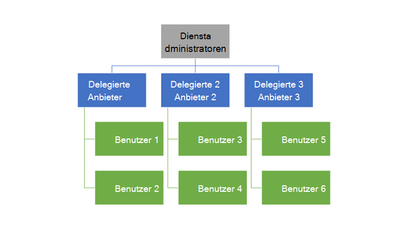
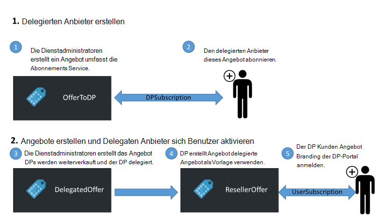
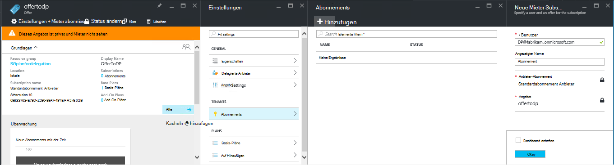
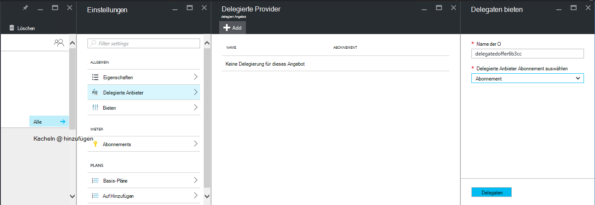
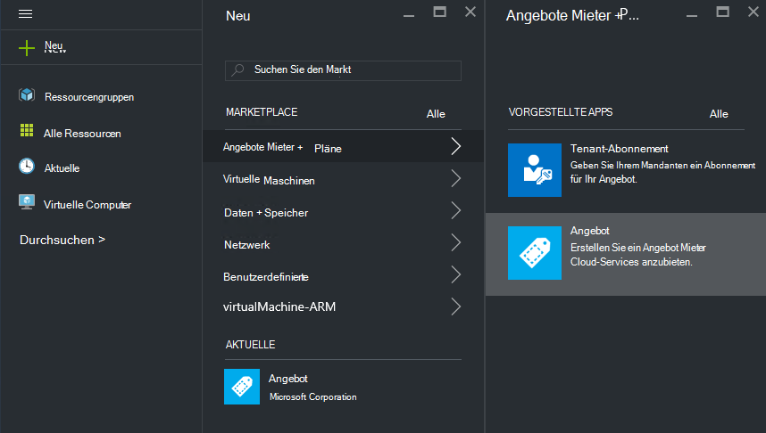
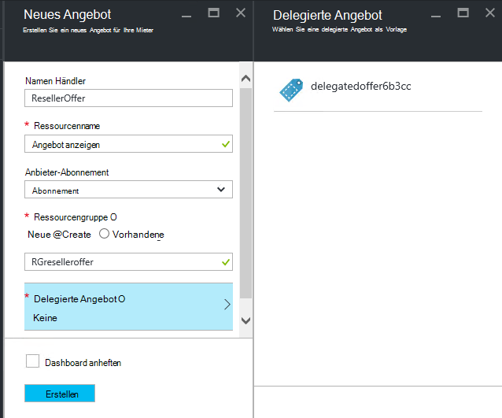
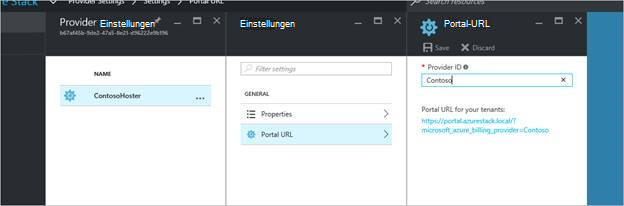
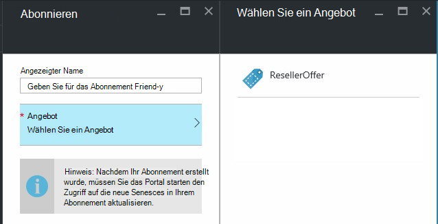

<properties
    pageTitle="Delegieren der Angebote in Azure Stapel | Microsoft Azure"
    description="Erfahren Sie, wie andere Angebote und Benutzer zur Anmeldung."
    services="azure-stack"
    documentationCenter=""
    authors="AlfredoPizzirani"
    manager="byronr"
    editor=""/>

<tags
    ms.service="azure-stack"
    ms.workload="na"
    ms.tgt_pltfrm="na"
    ms.devlang="na"
    ms.topic="article"
    ms.date="10/07/2016"
    ms.author="alfredop"/>

#Angebote in Azure Stapel delegieren

Als Service-Administrator können Sie andere Angebote und Benutzer zur Anmeldung zu. Beispielsweise kann dies sind Service Provider und Händler, Kunden und in Ihrem Namen verwalten möchten. Es kann auch in einem Unternehmen geschehen, wenn Sie einer zentralen IT-Gruppe Teil und Unternehmensbereiche oder Tochtergesellschaften sich Benutzer ohne Ihr Zutun.

Delegierung können Sie diese Aufgaben zu erreichen und Sie direkt können mehr Benutzer verwalten. Die folgende Abbildung zeigt eine Delegierung aber Azure Stapel unterstützt mehrere Ebenen. Delegierte Anbieter können wiederum andere Anbieter bis zu fünf Ebenen delegieren.

Administratoren können die Erstellung von Angeboten delegieren und andere Benutzer mit der Delegierung.

##Rollen und Schritte bei der Delegierung

Um Delegierung zu verstehen, sollten Sie daran, dass es drei Rollen:

-   Der **Dienstadministrator** verwaltet die Infrastruktur Azure Stack, ein Angebot erstellt und anderen Benutzern anbieten delegiert.

-   Der delegierte Benutzer heißen **Provider delegiert**. Sie können an andere Unternehmen (wie andere Mandanten Azure Active Directory) gehören.

-   **Benutzer** für die Angebote registrieren und Verwalten von Arbeitslasten VMs erstellen, speichern usw. verwenden.

Wie in der folgenden Abbildung dargestellt, umfasst zwei Schritte Delegierung einrichten.

1.  Die delegierte Anbieter zu identifizieren. Dazu einen Plan, der nur den Abonnementsdienst enthält ein Angebot abonnieren.
    Benutzer, die dieses Angebot abonnieren erhalten Service-Administrator-Funktionen einschließlich der Möglichkeit, Angebote erweitern und Benutzer für sie.

2.  Delegieren Sie Angebot an den delegierten Provider. Dieses Angebot fungiert als Vorlage für delegierte Anbieter bieten. Delegierte Anbieter kann jetzt das Angebot, wählen einen Namen ein (nicht jedoch Dienstleistungen und Kontingente) und Kunden anzubieten.

Fungieren als delegierte Anbieter müssen Benutzer eine Beziehung mit der wichtigsten Anbieter. in anderen Worten, müssen sie ein Abonnement erstellen. In diesem Szenario gibt dieses Abonnement die delegierten Anbietern mit Angebote für den Hauptanbieter.

Sobald diese Beziehung kann vom Systemadministrator ein Angebot delegierte Anbieter delegieren. Delegierte Anbieter kann jetzt das Angebot, Umbenennen (nicht jedoch seinen Inhalt) und seinen Kunden anbieten.

Zum Einrichten eines delegierten Angebot delegieren und ob Benutzer können sich für sie, die Anweisungen in den folgenden Abschnitten.

##Einrichten von Rollen

Finden eines delegierten am Arbeitsplatz benötigen Sie zusätzliche Azure Active Directory-Konten neben Ihrem Dienstadministratorkonto. Wenn Sie nicht verfügen, erstellen Sie zwei Konten. Die Konten können AAD-Mandanten angehören. Wir verweisen Sie als delegierte Anbieter (DP) und der Benutzer.

| **Rolle** | **Organisatorische Rechte** |
| -------------------- | ----------------------- |
|  Delegierte Anbieter | Benutzer |
| Benutzer | Benutzer |

##Identifizieren der delegierten Anbieter

1.  Melden Sie sich als Dienstadministrator an.

2.  Erstellen Sie das Angebot, das Mieter delegierte Anbieter zu ermöglichen. Hierfür erstellen Sie einen Plan und ein Angebot auf:

    ein.  [Plan erstellen](azure-stack-create-plan.md).
        Dieser Plan sollte nur den Abonnementsdienst enthalten. In diesem Artikel verwenden wir einen Plan PlanForDelegation aufgerufen.

    b.  [Erstellen Sie ein Angebot](azure-stack-create-offer.md) 
     auf der Grundlage dieses Plans. In diesem Artikel verwenden wir ein OfferToDP Angebot.

    c.  Nach Abschluss die Erstellung eines Angebots können Sie die Benutzer-ID des Anbieters delegierte als Mieter für dieses Angebot hinzufügen, indem Sie     **Abonnements** &gt; **Hinzufügen** &gt; **Neue Tenant-Abonnement**.

  

> [AZURE.NOTE]Wie mit allen Azure Stapel, die Möglichkeit, das Angebot öffentlichen und dass Benutzer anmelden, oder privat zu halten und Dienstadministratoren die Anmeldung verwalten. Delegierte Anbieter sind in der Regel eine kleine Gruppe und steuern, wer damit geheim dieses Angebot in den meisten Fällen sinnvoll ist, zugelassen werden soll.

##Dienstadministratoren erstellt delegierte Angebot

Sie haben jetzt delegierte Dienstanbieter hergestellt. Der nächste Schritt ist die Erstellung Plan und bieten, die Sie delegieren möchten und die Ihre Kunden verwenden. Definieren Sie dieses Angebot wie die Kunden, gewünscht da delegierte Anbieter nicht ändern Pläne und Kontingente, die es enthält.

1.  Als Dienstadministrator, [Erstellen Sie einen Plan](azure-stack-create-plan.md) und [ein Angebot](azure-stack-create-offer.md) basieren. Für diesen Artikel verwenden wir ein DelegatedOffer Angebot.
> [AZURE.NOTE]Dieses Angebot muss nicht öffentlich gemacht werden. Können veröffentlicht, wenn Sie wählen, aber in den meisten Fällen Sie nur delegierte Anbieter zugreifen möchten. Nachdem Sie privates Angebot delegieren, wie in den folgenden Schritten beschrieben, müssen der delegierte Anbieter auf.

2.  Delegieren Sie das Angebot. Gehen Sie zu DelegatedOffer, und im Bereich Einstellungen, klicken Sie auf **Provider delegiert** &gt; **Hinzufügen**.

3.  Wählen Sie der delegierte Anbieter Abonnement aus dem Dropdown-Listenfeld aus und auf **Delegaten**.

> 

##Delegierte Anbieter passt das Angebot

Als delegierte Anbieter anmelden und ein neues Angebot mit delegierten Angebot als Vorlage erstellen.

1.  **Klicken Sie auf** &gt; **Mieter bietet + plant** &gt; **bieten**.

    

2.  Benennen Sie das Angebot. Hier wählen Sie ResellerOffer. Wählen Sie das delegierte Angebot zu Basis **Erstellen**.
    
    

    >[AZURE.NOTE] Beachten Sie den Unterschied im Vergleich zu erstellen wie vom Administrator Service bieten. Der delegierte Anbieter erstellt keine Angebot von Basis- und Add-On-Pläne; Sie können nur Angebote, die sie übertragen und werden Sie nicht ändern.

3. Veröffentlichen Sie das Angebot durch Klicken auf **Durchsuchen** &gt; **bietet**das Angebot auswählen und auf **Status ändern**.

4. Delegierte Provider stellt diese Angebote über eigene Portal URL. Beachten Sie, dass diese Angebote nur mit delegierter Portal angezeigt werden. Suchen und diese URL ändern:

    ein.  Klicken Sie auf **Durchsuchen** &gt; **Anbieter** &gt; **Portal-URL**.

    b.  Ändern Sie die Provider-ID bei Bedarf.

    c.  Kopieren Sie das Portal URL an einen anderen Speicherort, wie z. B. Editor.

    
<!-- -->
Erstellen einer delegierten Angebot als delegierte Anbieter ist abgeschlossen. Melden Sie sich als delegierter Anbieter. Schließen Sie die Registerkarte, die Sie verwendet haben.

##Melden Sie sich für das Angebot

1.  In einem neuen Browserfenster zum delegierten Portal URL im vorherigen Schritt gespeichert. Melden Sie sich als Benutzer im Portal an. Hinweis: Sie müssen für diesen Schritt delegierte Portal verwenden. Delegierte Angebot wird andernfalls nicht angezeigt.

2.  Klicken Sie im Dashboard auf **Abonnieren**. Sie werden feststellen, dass die delegierten bietet nur den delegierten Anbieter erstellt für den Benutzer angezeigt werden:

> 

Der Vorgang Angebot Delegierung abgeschlossen. Der Benutzer kann nun für dieses Angebot anmelden bekommen ein Abonnement für sie.

##Mehrschichtige delegation

Mehrschichtige Delegierung ermöglicht die delegierte Angebot an andere Personen delegieren. Dies ermöglicht z. B. das Erstellen von tiefer Händlerkanäle, in denen der Anbieter Verwalten von Azure Stapel ein Angebot zu einem Verteiler delegiert wiederum Fachhändler delegiert.
Azure Stack unterstützt bis zu fünf Ebenen der Delegierung.

Erstellen Sie mehrere Ebenen von Angebot Delegierung delegiert delegierte Anbieter wiederum das Angebot an Anbieter weiter. Der Prozess gilt für delegierte Anbieter wie Dienstadministrator (siehe [Dienstadministratoren delegierte Angebot erstellt](#service-admin-creates-the-delegated-offer)).

##Nächste Schritte
[Bereitstellung einer VM](azure-stack-provision-vm.md)
