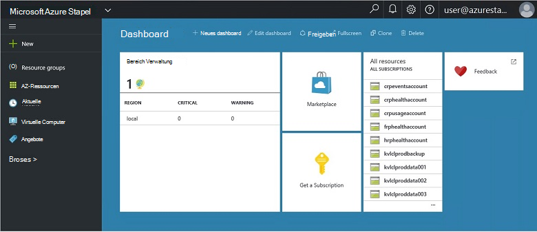
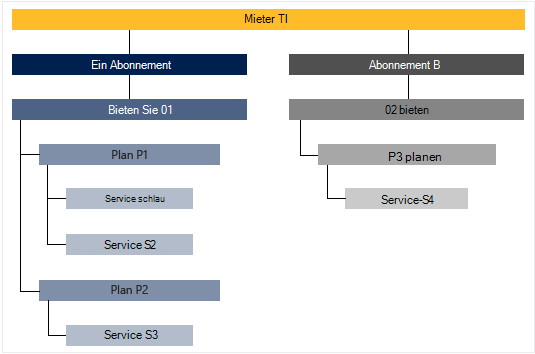

<properties
    pageTitle="Wichtige Features und Konzepte in Azure Stapel | Microsoft Azure"
    description="Erfahren Sie mehr über die wichtigsten Funktionen und Konzepte in Azure Stapel."
    services="azure-stack"
    documentationCenter=""
    authors="Heathl17"
    manager="byronr"
    editor=""/>

<tags
    ms.service="azure-stack"
    ms.workload="na"
    ms.tgt_pltfrm="na"
    ms.devlang="na"
    ms.topic="article"
    ms.date="10/25/2016"
    ms.author="helaw"/>

# Wichtige Features und Konzepte in Azure Stapel

Wenn Sie mit Microsoft Azure Stapel sind, können dieser Begriffe und Beschreibungen hilfreich sein.

## Rollen

Es gibt zwei Arten von Benutzern für Microsoft Azure Stapel Dienstadministrator und Mieter (Kunde).

-  **Dienstadministratoren** können konfiguriert und verwaltet Ressourcenprovider, Pächter bietet Pläne, Services, Quoten und Preise.
-  Ein **Mieter** erwirbt oder kauft Dienstadministrator bietet Services. Mieter können bereitstellen, überwachen und Verwalten von Services, wie Web Apps, Speicher und virtuelle Computer abonniert haben.

## Portal

Die wichtigsten Methoden für die Interaktion mit Microsoft Azure ist das Portal und PowerShell.

Microsoft Azure Stack-Portal ist eine Instanz der Azure-Portal auf Ihren Servern. Es ist eine Website, die ein Self-service-Erlebnis für Dienstadministratoren und Mieter rollenbasierte Zugriffskontrolle (RBAC) Ressourcen und ermöglicht schnelle Anwendung und Entwicklung und Bereitstellung Cloud-Kapazität bietet.

## Regionen, Services, Pläne, Angebote und Abonnements

Dienste werden in Azure Stapel Mieter mit Regionen, Abonnements, Angebote und Pläne zugestellt. Mehrere Angebote können Mieter abonnieren. Angebote können einen oder mehrere Pläne und Pläne können ein oder mehrere Dienste haben.

Beispiel-Hierarchie des Mieters Abonnements für Angebote mit unterschiedlichen Pläne und services.

### Regionen
Azure Stapel Bereiche sind Grundelement und Management.  Eine Organisation kann mehrere Bereiche mit Ressourcen in jeder Region verfügen.  Bereiche müssen auch andere Service-Angebote.

### Dienste

Microsoft Azure Stapel können Anbieter bieten eine Vielzahl von Diensten und Clientanwendungen wie virtuelle Maschinen, SQL Server-Datenbanken, SharePoint, Exchange und mehr.

### Pläne

Pläne sind Gruppen von mindestens ein. Als Anbieter können Ihre Mieter anbieten. Ihre Angebote Pläne und Dienste aufgeführt, abonnieren die Mieter.

Jeder Dienst einen Plan hinzugefügt kann mit Kontingentvorlage zur Cloud-Kapazität Verwaltung konfiguriert werden. Kontingente können Beschränkungen VM, RAM und CPU-Limits und pro Abonnement angewendet. Kontingente können nach Standort unterscheiden. Beispielsweise hätte ein Plan mit Compute-Diensten aus ein Kontingent von zwei virtuellen Maschinen, 4 GB RAM und 10 CPU-Kerne.

Beim Erstellen eines Angebots kann Dienstadministrator **Basis**vorgesehen. Diese Basis Pläne sind standardmäßig enthalten, wenn das Angebot Mieter abonniert. Als privat und das Abonnement erstellt hat der Benutzer Zugriff auf alle Ressourcenprovider Vorhaben Basis (mit den entsprechenden Kontingente) angegeben.

Dienstadministrator kann auch **zusätzliche Pläne** im Angebot enthalten. Add-On-Pläne sind nicht standardmäßig im Abonnement enthalten. Add-On-Pläne sind weitere Pläne (Kontingente) in ein Angebot, die Ihrem Besitzer ihrer Abonnements hinzufügen kann.

### Angebote

Angebote sind ein oder mehrere Pläne, die Anbieter Mieter kaufen präsentieren (Abonnieren). Beispielsweise können bieten Alpha Plan ein (Region 1 mit Compute-Dienste) und Plan B (von Bereich 2 mit Speicher- und Services) enthalten.

Ein Angebot enthält eine Reihe von base Pläne und Administratoren zu Add-on-Pläne Mieter Abonnement hinzufügen können.

### Abonnements

Ein Abonnement ist wie Mieter Ihre Angebote kaufen. Ein Abonnement ist eine Kombination von Mandanten mit. Ein Mieter können Abonnements für mehrere Angebote. Jedes Abonnement gilt nur ein Angebot. Ein Mieter Subskriptionen bestimmen, welche Pläne/Dienste zugreifen können.

Abonnements können Anbieter Zugriff und Nutzung von Cloudressourcen und Dienste verwalten.

## Azure Ressourcenmanager

Mithilfe von Azure-Ressourcen-Manager können Sie Ihre Infrastruktur in vorlagenbasierten, declaritive Modell Ressourcen arbeiten.   Es bietet eine einzige Schnittstelle, die Sie bereitstellen, verwalten und Überwachen der Lösungskomponenten wie virtuelle Maschinen, Speicherkonten webapps und Datenbanken verwenden können. Vollständige Informationen und Hinweise finden Sie unter [Übersicht über Azure Ressource-Manager](../azure-resource-manager/resource-group-overview.md).

### Ressourcengruppen

Ressourcengruppen sind Sammlungen von Ressourcen und Dienstleistungen – und jede Ressource verfügt über einen Typ, z. B. virtuelle Computer, virtuelle Netzwerke, öffentliche IPs, Speicherkonten und Websites. Jede Ressource in einer Ressourcengruppe und Ressourcengruppen logisch helfen organisieren Ressourcen, z. B. nach Arbeitslast oder Standort.

Hier sind einige wichtige Dinge zu berücksichtigen eine Ressourcengruppe definieren:

-   Jede Ressource kann nur einer Ressourcengruppe vorhanden sein.

-   Sie bereitstellen, aktualisieren und Löschen von Elementen in einer Ressourcengruppe zusammen. Wenn eine Ressource wie einen Datenbankserver auf eine andere Bereitstellung vorhanden muss, sollte es in einer anderen Ressourcengruppe.

-   Sie können hinzufügen oder Entfernen einer Ressource einer Ressourcengruppe zu einem beliebigen Zeitpunkt.

-   Sie können eine Ressource aus einer Ressourcengruppe in eine andere Gruppe verschieben.

-   Eine Ressourcengruppe kann Ressourcen enthalten, die in unterschiedlichen Regionen befinden.

-   Eine Ressourcengruppe kann Zugriffskontrolle für Verwaltungsvorgänge Umfang verwendet werden.

-   Eine Ressource kann auf eine Ressource in einer anderen Ressourcengruppe, zwei Ressourcen müssen miteinander als Teile des gleichen Lebenszyklus nicht verknüpft werden. Beispielsweise mehrere apps müssen mit einer Datenbank verbinden, aber die Datenbank muss nicht aktualisiert oder gelöscht Tempo wie die apps.

-   Microsoft Azure Stack verwaltete Ressourcen wie Pläne und Angebote sind auch in Ressourcengruppen.

-   Sie können eine Ressourcengruppe erneut bereitstellen.  Dies ist nützlich für Tests oder Entwicklungszwecke.  

### Azure Ressourcenmanager Vorlagen

Mit Azure-Ressourcen-Manager können Sie eine einfache Vorlage (im JSON-Format) erstellen, die Bereitstellung und Konfiguration der Anwendung definiert. Diese Vorlage wird als Vorlage Azure-Ressourcen-Manager bezeichnet und ermöglicht das deklarative Definieren der Bereitstellung. Mithilfe einer Vorlage können Sie wiederholt die Anwendung im gesamten Lebenszyklus der Anwendung bereitstellen und vertrauen, Ressourcen in einem konsistenten Zustand bereitgestellt werden.

## Ressourcenprovider (RPs) – Netzwerk RP RP berechnen Speicher RP

Ressourcen sind, die die Grundlage für alle Azure-basierte IaaS und PaaS Webdienste. Azure Ressourcen-Manager basiert auf unterschiedliche RPs ein Hoster Dienste zugreifen.

Es gibt drei wichtigsten RPs: Netzwerk-, Speicher- und Compute. Jedes dieser RPs können Sie konfigurieren und zugehörigen Ressourcen steuern. Administratoren können auch neue benutzerdefinierte Ressourcenprovider hinzufügen.

### RP berechnen

Berechnen Ressource Anbieter (CFK) ermöglicht Azure Stapel Mieter eigene virtuelle Computer erstellen. Darüber hinaus Funktionen zum Einrichten und Konfigurieren der Ressourcenanbieter Mieter Dienstadministrator. CRP bietet die Möglichkeit, virtuelle Maschinen sowie Virtual Machine Extensions. Virtual Machine Erweiterung Service bietet IaaS-Funktionen für virtuellen Computer Windows und Linux.

### Netzwerk RP

Anbieter für Ressourcen (NRP) bietet eine Reihe von Funktionen für die private Cloud Netzwerk Funktion Virtualisierung (NFV) Software definiert Networking (SDN). Diese Funktionen entsprechen Azure öffentliche Cloud, damit Anwendungsvorlagen einmal geschrieben und Azure öffentliche Cloud oder lokalen Microsoft Azure Stack bereitgestellt werden können. Netzwerk-RP bietet detailliertere Netzwerkkontrolle, Metadaten-Tags schneller Konfiguration, schnelle und wiederholbare Anpassung und mehrere Schnittstellen (einschließlich PowerShell .NET SDK Node.JS SDK, REST-basierten API). NFP können Software Load Balancers öffentliche IP netzwerksicherheitsgruppen virtuelle Netzwerke unter anderem erstellt.

### Storage RP

RP Storage bietet vier konsistente Azure Speicherdienste: Blob, Tabelle, Warteschlange und Account-Management. Es bietet auch Storage Cloud Administration Service-Verwaltung von Azure konsistente Storage Services erleichtern. Azure-Speicher bietet die Flexibilität zum Speichern und Abrufen von große Mengen an unstrukturierten Daten, z. B. Dokumente und Mediendateien mit Azure-Blobs und strukturierte NoSQL mit Azure Tabellen basiert. Weitere Informationen zu Azure-Speicher finden Sie unter [Einführung in Microsoft Azure-Speicher](../storage/storage-introduction.md).

#### BLOB-Speicher

BLOB-Speicher speichert alle Daten festlegen. Ein Blob kann beliebigen Text oder Binärdaten, Dokument, Datei oder Anwendung Installer. Tabellenspeicher speichert strukturierte Datasets. Tabellenspeicher ist ein NoSQL Schlüsselattribut Datenspeicher, schnelle Entwicklung und schnellen Zugriff auf große Mengen von Daten ermöglicht. Warteschlange bietet zuverlässiges messaging für Workflow-Verarbeitung und Kommunikation zwischen Komponenten eines Cloud-Dienste.

Jedes Blob ist in einem Container organisiert. Container stellen auch eine praktische Möglichkeit, Sicherheitsrichtlinien Objekte zuweisen. Ein Speicherkonto kann eine beliebige Anzahl von Containern enthalten und Container dürfen eine beliebige Anzahl von Blobs bis 500 TB Kapazitätsgrenze des Speicherkontos. BLOB-Speicher bietet drei Arten von Blobs Blobs blockieren, Blobs und Seitenblobs (Datenträger) anfügen. Block-Blobs für streaming und Cloud-Objekte speichern optimiert und eignen sich gut zum Speichern von Dokumenten, Mediendateien, Backups etc.. Append Blobs Block-Blobs ähneln, sind aber für Vorgänge anfügen. Ein Blob anhängen kann aktualisiert werden, werden am Ende einen neuen Block hinzufügen. Append Blobs sind eine gute Wahl für Szenarien wie Protokollierung, wo neue Daten nur bis zum Ende des Blobs geschrieben werden. Seitenblobs für die Darstellung von IaaS Festplatten optimiert und zufällige schreibt und kann bis zu 1 TB groß sein. Ein Azure virtuellen Netzwerk angefügt IaaS Datenträger eine virtuelle Festplatte als Seitenblob gespeichert ist.

#### Tabelle speichern

Tabellenspeicher ist Microsofts NoSQL Key-Attribut Speicher-Design ohne Schemas, wodurch sich von herkömmlichen relationalen Datenbanken ist. Da Schemas fehlen die Daten speichert, ist es einfach Daten müssen Ihre Anwendung entwickeln. Tabellenspeicher ist benutzerfreundlich, damit Entwickler Programme erstellen können. Tabellenspeicher ist ein Schlüsselattribut Speicher bedeutet, dass jeder Wert in einer Tabelle mit einem typisierten Eigenschaftennamen gespeichert wird. Der Eigenschaftenname kann zum Filtern und Auswahlkriterien verwendet werden. Eine Auflistung von Eigenschaften und deren Werten besteht eine Entität aus. Seit Speicherschemas fehlende Tabelle zwei Entitäten in derselben Tabelle enthalten verschiedene Sammlungen von Eigenschaften und Eigenschaften können verschiedener Art sein. Table Storage können Sie flexible Datasets wie Benutzerdaten für Web Applications, Adressbücher, Informationen und eine andere Art von Metadaten, die der Dienst benötigt speichern. Sie können eine beliebige Anzahl von Entitäten in einer Tabelle speichern und ein Speicherkonto kann eine beliebige Anzahl von Tabellen, bis die Kapazitätsgrenze des Speicherkontos enthalten.

#### Warteschlangenspeicher
Azure Queue Storage bietet Cloud messaging zwischen Anwendungskomponenten. Entwerfen Sie Applikationen für Skalierung, Anwendungskomponenten oft entkoppelt, damit sie unabhängig voneinander skaliert werden können. Warteschlangenspeicher bietet asynchrones messaging für die Kommunikation zwischen Komponenten, ob sie in der Cloud, auf dem Desktop auf einem lokalen Server oder auf einem mobilen Gerät ausgeführt werden. Warteschlangenspeicher unterstützt asynchrone Aufgaben und Arbeitsabläufe erstellen.

## Rollenbasierte Zugriffskontrolle (RBAC)

RBAC können Zugriff autorisierten Benutzer, Gruppen und Dienste gewähren, indem sie bei Abonnements, Ressourcengruppe oder Ressourcenebene zuweisen. Jede Rolle definiert die Zugriffsebene Benutzer, Gruppe oder Dienst Microsoft Azure Stapel Ressourcen hat.

Azure RBAC hat drei grundlegende Funktionen, die für alle Ressourcentypen gelten: Eigentümer, Mitwirkende und Leser. Besitzer hat vollen Zugriff auf alle Ressourcen, einschließlich der Zugriff auf andere Benutzer übertragen. Teilnehmer kann erstellen und Management aller Arten von Azure Ressourcen aber den anderen nicht möglich. Leser kann nur vorhandene Azure Ressourcen anzeigen. Die restlichen RBAC-Rollen in Azure Verwaltung von Azure Ressourcen zulassen. Virtual Machine Teilnehmerrolle Erstellung und Verwaltung virtueller Computer ermöglicht jedoch, lässt sich nicht auf die Verwaltung von virtuellen Netzwerk oder Subnetz, dem mit dem virtuellen Computer verbunden.

## Daten

Microsoft Azure Stapel erfasst und sammelt Daten über alle Ressourcenprovider einen präzisen Bericht pro Benutzer. Daten kann die Anzahl der verwendeten Ressource einfach oder so komplex wie Performance und Skalierung Indikatoren. Die Daten sind über REST API verfügbar. Gibt ein Azure konsistente Tenant-API sowie Anbieter und Anbieter-APIs delegiert Daten für alle Mandanten Abonnements erhalten. Diese Daten können verwendet werden, ein externes Tool oder für Rechnung oder Chargeback integrieren.

## Nächste Schritte

[Bereitstellen von Azure Stapel Technical Preview 2 (POC)](azure-stack-deploy.md)
