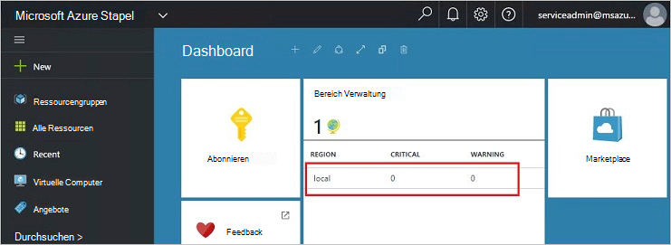
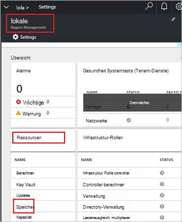
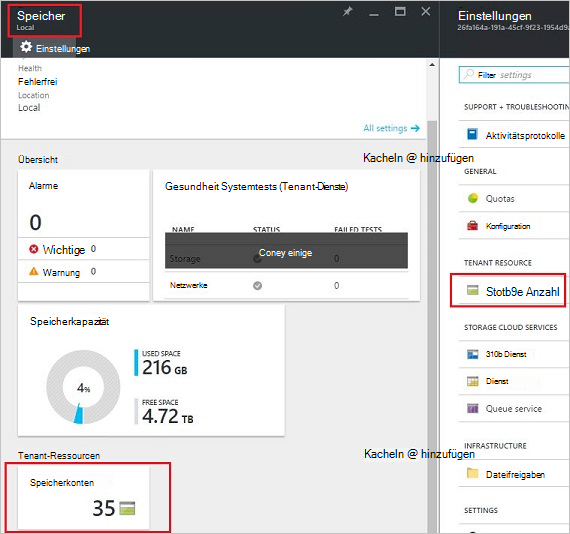
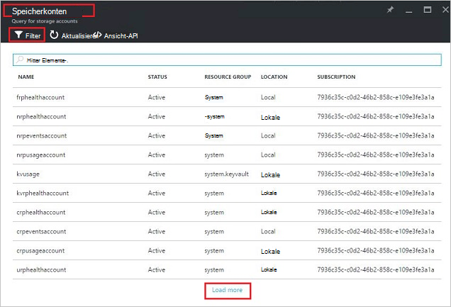
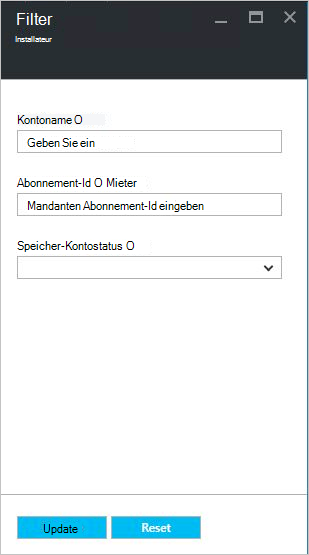
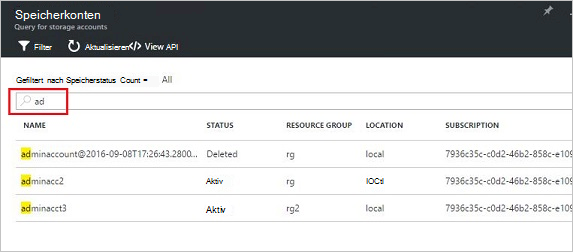
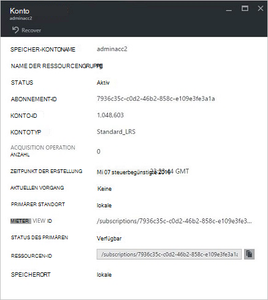
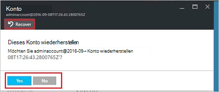
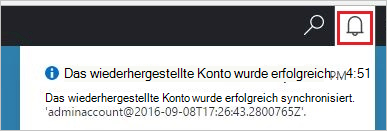
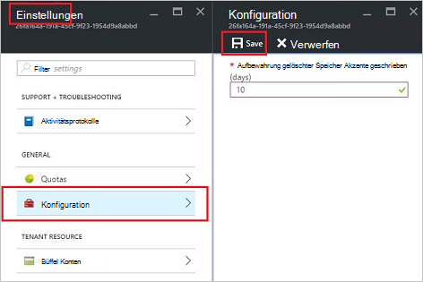

<properties
    pageTitle="Stapel von Azure-Speicherkonten verwalten | Microsoft Azure"
    description="Informationen Sie zum Suchen, verwalten, wiederherstellen und Stapel von Azure-Speicherkonten freigeben"
    services="azure-stack"
    documentationCenter=""
    authors="AniAnirudh"
    manager="darmour"
    editor=""/>

<tags
    ms.service="azure-stack"
    ms.workload="na"
    ms.tgt_pltfrm="na"
    ms.devlang="na"
    ms.topic="get-started-article"
    ms.date="09/26/2016"
    ms.author="anirudha"/>

# <a name="manage-storage-accounts-in-azure-stack"></a>Speicherkonten in Azure Stapel verwalten

Informationen Sie zu Speicherkonten in Azure Stapel finden, wiederherstellen und Rückgewinnung von Speicherkapazität auf Unternehmen basiert.

## <a name="find-a-storage-account"></a>Ein Speicherkonto suchen

Die Liste der Speicherkonten im Bereich kann in Azure Stapel angezeigt:

1.  Navigieren Sie in einem Internetbrowser zu [https://portal.azurestack.local](https://portal.azurestack.local/).

2.  Melden Sie sich bei Azure Stack-Portal als Administrator (unter Verwendung der Anmeldeinformationen während der Bereitstellung bereitgestellt)

3.  Finden Sie auf der Standard-Dashboard – **Region** Verwaltungsliste und Region zu – beispielsweise soll auf **(lokales**).

    

4.  Wählen Sie **Speichern** aus **Ressourcenanbieter** .

    

5.  Jetzt auf Storage Resource Provider Admin Blade – Registerkarte "Speicherkonten" und klicken Sie darauf.

    
    
    Die resultierende Seite ist die Liste der Speicherkonten in diesem Bereich.

    

Standardmäßig werden die ersten 10 Konten angezeigt. Sie können mehr abrufen "mehr laden" Link am unteren Rand der Liste auf <br>
ODER <br>
Wenn Sie ein bestimmtes Speicherkonto – interessieren können Sie **Filtern und die entsprechenden Konten abrufen** .<br>

So filtern Sie für Konten

1. Klicken Sie auf die Filterschaltfläche oben das Blade.

2. -Blade Filter können Sie an **Kontonamen**,  **Abonnement-ID** oder **Status** Feinabstimmung die Liste Speicherkonten angezeigt werden. Verwenden sie.

3. Klicken Sie auf aktualisieren. Die Liste sollte entsprechend aktualisieren.

    

4. Um den Filter zurücksetzen, klicken auf die Filterschaltfläche, Auswahl löschen und aktualisieren.

Suchtextfeld auf Blade-Speicher Konten Liste können Sie den markierten Text in die Liste der Konten zu markieren. Dies ist sehr praktisch bei wird der vollständige Name oder Id nicht zugänglich.<br>
Freien Text Hier können Sie um das Konto zu finden, die, dem Sie interessieren.




## <a name="look-at-account-details"></a>Konto anzeigen

Wenn Sie die Konten, die Sie anzeigen möchten gefunden haben, können Sie auf das Konto bestimmte Details anzeigen klicken. Die Details wie die Art des Kontos, Erstellung, Ort usw. Öffnet ein neues Blatt.




## <a name="recover-a-deleted-account"></a>Ein gelöschtes Konto wiederherzustellen

In einer Situation möglicherweise, wo Sie ein gelöschtes Konto wiederherstellen möchten.<br>
In AzureStack ist eine sehr einfache Möglichkeit dazu.

1.  Wechseln der Speicherliste Konten durchsuchen. [Finden Sie ein Speicherkonto suchen](#find-a-storage-account)

2.  Suchen Sie, insbesondere in der Liste. Möglicherweise müssen filtern.

3.  Überprüft den Status des Kontos. Er möchte "gelöscht".

4.  Klicken Sie auf das Konto, das Konto Details Blade wird geöffnet.

5.  Suchen Sie auf diesem Blatt – die Schaltfläche "Wiederherstellen", und klicken Sie darauf.

6.  Bestätigen Sie mit "Ja"

    

7.  Die Wiederherstellung ist jetzt im Vorgang warten darauf hin, dass diese erfolgreich war.
    Sie können auch auf das Symbol "Glocke" am Anfang des Portals Fortschritt Angaben anzeigen klicken.

    

  Wenn das wiederhergestellte Konto erfolgreich synchronisiert wurde, kann eine zurück verwenden.

### <a name="some-gotchas"></a>Einige Probleme

- Ein gelöschtes Konto zeigt Status als "aus Retention".

  Dies bedeutet, dass das gelöschte Konto die Aufbewahrungsdauer überschritten und nicht wiederhergestellt mehr werden kann.

- Ein gelöschtes Konto wird nicht in der Kontenliste anzeigen

  Dies bedeutet, dass das gelöschte Konto Garbage collection bereits. In diesem Fall kann nicht mehr wiederhergestellt werden. Siehe "Rückgewinnung".

## <a name="set-retention-period"></a>Aufbewahrungszeitraum

Archivierung festlegen kann Administrator an einen Zeitraum in Tagen (zwischen 0 und 9999 Tage) während der gelöschtes Konto möglicherweise wiederhergestellt werden kann. Die Standardarchivierungszeit wird auf 15 Tage festgelegt. Der Wert "0" bedeutet, dass gelöschtes Konto sofort von Aufbewahrung werden und periodische Garbage Collection markiert.

Die Aufbewahrungsdauer ändern

1.  Navigieren Sie in einem Internetbrowser zu [https://portal.azurestack.local](https://portal.azurestack.local/).

2.  Melden Sie sich bei Azure Stack-Portal als Administrator (unter Verwendung der Anmeldeinformationen während der Bereitstellung bereitgestellt)

3.  Finden Sie auf der Standard-Dashboard – **Region** Verwaltungsliste und Region zu – beispielsweise soll auf **(lokales**).

4.  Wählen Sie **Speichern** aus **Ressourcenanbieter** .

5.  Klicken Sie auf das Symbol oben Blade Einstellung geöffnet.

6.  Klicken Sie auf Konfiguration - Aufbewahrungsdauer.

7.  Sie können den Wert bearbeiten und speichern.

 Dieser Wert wird sofort und spiegeln die gesamte Region.



## <a name="reclaim-capacity"></a>Rückgewinnung von Kapazitäten

Nebenwirkungen nach Aufbewahrungsdauer gehört, dass ein gelöschtes Konto Kapazität verbraucht weiterhin, bis es aus der Aufbewahrungsdauer. Jetzt gelöscht als Administrator benötigen eine Möglichkeit, diese freizugeben Konten Speicherplatz, obwohl die Aufbewahrungszeit noch nicht abgelaufen ist. Derzeit können Sie eine Befehlszeile die Aufbewahrungsdauer explizit zu überschreiben und sofort Kapazitäten zurückzugewinnen. Dazu –

1.  Angenommen, Sie haben Azure PowerShell installiert und konfiguriert. Andernfalls befolgen Sie die Anleitung: Installieren der neuesten Version von Azure PowerShell Azure-Abonnement zugeordnet und Informationen [zur Installation und Konfiguration von Azure PowerShell](http://azure.microsoft.com/documentation/articles/powershell-install-configure/).
    Weitere Informationen zu Azure-Ressourcen-Manager-Cmdlets finden Sie unter [Verwendung von Azure PowerShell mit Azure-Ressourcen-Manager](http://go.microsoft.com/fwlink/?LinkId=394767)

2.  Dieses Cmdlet ausführen:

    ```
    PS C:\\>; Clear-ACSStorageAccount -ResourceGroupName system
    -FarmName <your farmname>
    ```

> Weitere Informationen finden Sie in [AzureStack-Powershell-Dokumentation](https://msdn.microsoft.com/library/mt637964.aspx)

> [AZURE.NOTE] Dieses Cmdlet ausführen, wird das Konto und seinen Inhalt löschen. Nicht mehr werden wiederhergestellt. Mit Vorsicht verwenden.

