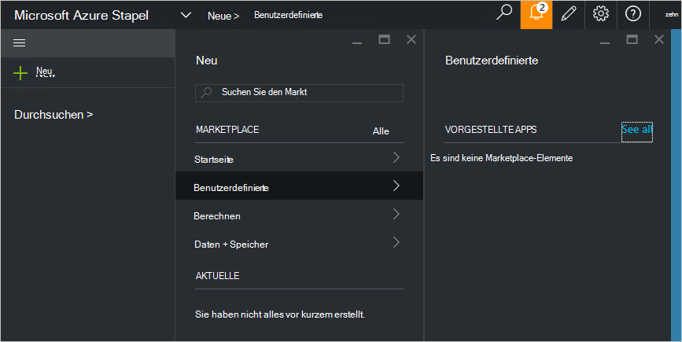

<properties
    pageTitle="Benutzerdefinierte Marketplace Element in Azure Stapel (Dienstadministratoren) veröffentlichen | Microsoft Azure"
    description="Als Dienstadministrator erfahren Sie, wie ein Element benutzerdefinierte Markt in Azure Stapel veröffentlichen."
    services="azure-stack"
    documentationCenter=""
    authors="rupisure"
    manager="byronr"
    editor=""/>

<tags
    ms.service="azure-stack"
    ms.workload="na"
    ms.tgt_pltfrm="na"
    ms.devlang="na"
    ms.topic="article"
    ms.date="09/26/2016"
    ms.author="rupisure"/>

# Azure Stack-Markt

Der Marketplace ist eine Auflistung von Elementen für Azure, Dienstleistungen, Programme und Ressourcen angepasst. Es ist Mieter kommen neue Ressourcen erstellen und Bereitstellen neue Applikationen. Administratoren können benutzerdefinierte Elemente Marketplace und Mieter sofort gesehen werden.

Um dem Markt zu öffnen, klicken Sie auf **neu**.

Der Markt wird alle fünf Minuten aktualisiert.

## Marketplace-Elemente

Jedem Element Marketplace ist:

-   Eine Vorlage Azure-Ressourcen-Manager für die Bereitstellung von Ressourcen

-   Metadaten wie Zeichenfolgen, Symbole und andere Marketingmaterialien

-   Informationen zum Anzeigen des Elements im portal

Jedes Element auf dem Markt veröffentlicht verwendet ein Format namens Azure Gallery-Paket (Azpkg). Bereitstellung oder Laufzeit Ressourcen (z. B. Code, Zip-Dateien mit Software oder virtuellen Computerimages) sollten Azure Stack, nicht als Teil der Marketplace-Element hinzugefügt werden. 

## Nächste Schritte

[Erstellen und Veröffentlichen einer Marketplace-Element](azure-stack-create-and-publish-marketplace-item.md)
