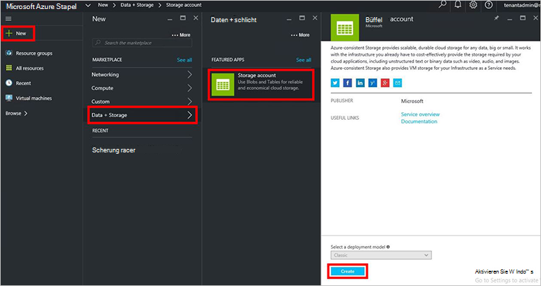
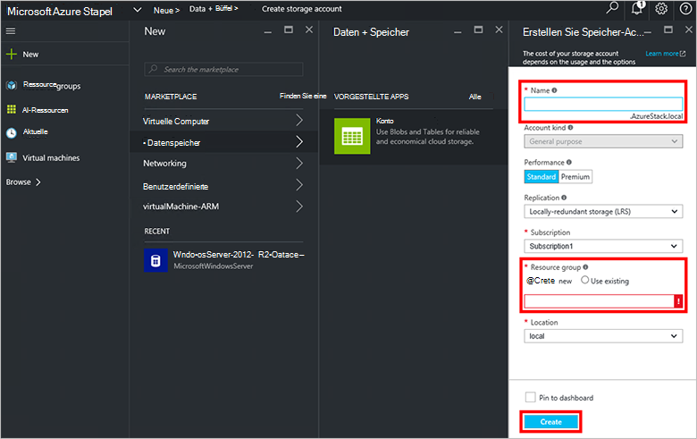
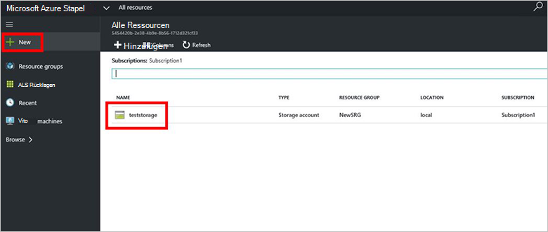

<properties
    pageTitle="Speicherkonten in Azure Stapel | Microsoft Azure"
    description="Erfahren Sie, wie ein Speicherkonto Azure Stapel erstellen."
    services="azure-stack"
    documentationCenter=""
    authors="ErikjeMS"
    manager="byronr"
    editor=""/>

<tags
    ms.service="azure-stack"
    ms.workload="na"
    ms.tgt_pltfrm="na"
    ms.devlang="na"
    ms.topic="get-started-article"
    ms.date="09/26/2016"
    ms.author="erikje"/>

# Speicherkonten in Azure Stapel

Speicherkonten zählen BLOB- und Dienste und eindeutigen Namespace für Datenobjekte Speicher. Standardmäßig werden die in Ihrem Konto nur zur Verfügung, der Kontobesitzer Speicher.

1.  Computer Azure Stapel POC melden `https://portal.azurestack.local` als [Administrator](azure-stack-connect-azure-stack.md#log-in-as-a-service-administrator), und klicken Sie dann auf **neu** > **Daten + Speicher** > **Speicherkonto**.

    

2.  Geben Sie einen Namen für das Speicherkonto Blatt **Speicherkonto erstellen** . Erstellen Sie neue **Ressourcengruppe**oder eine vorhandene, klicken Sie auf **Erstellen** , um das Speicherkonto erstellen.

    

3. Klicken Sie auf **alle Ressourcen**neue Speicherkonto finden das Speicherkonto suchen Sie und klicken Sie auf seinen Namen.

    
    
## Nächste Schritte

[Azure-Ressourcen-Manager verwenden](azure-stack-arm-templates.md)

[Azure-Speicherkonten erfahren](../storage/storage-create-storage-account.md)

[Azure Stapel Azure einheitliche Speicher Validierung Handbuch herunterladen](http://aka.ms/azurestacktp1doc)
