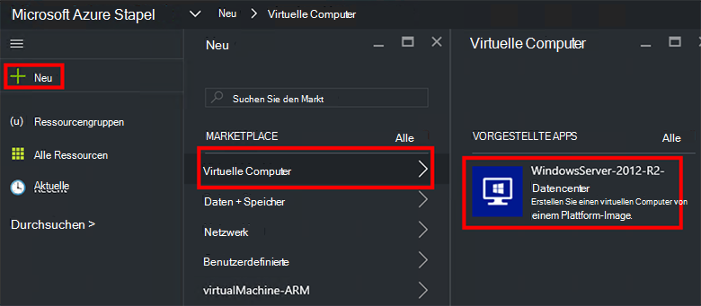
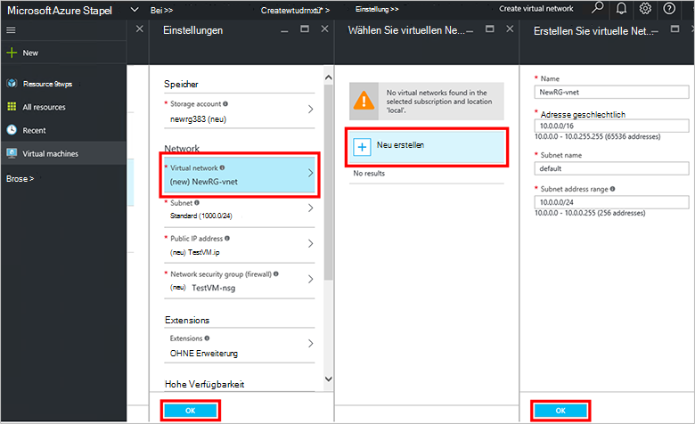
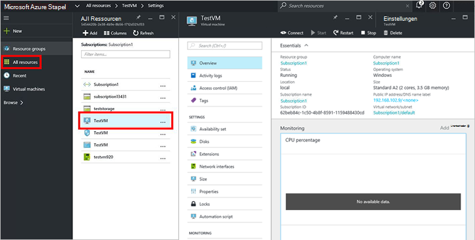

<properties
    pageTitle="Bereitstellen eine VM in Azure Stapel (Mandant) | Microsoft Azure"
    description="Ein Mieter erfahren Sie VM in Azure Stapel bereit."
    services="azure-stack"
    documentationCenter=""
    authors="ErikjeMS"
    manager="byronr"
    editor=""/>

<tags
    ms.service="azure-stack"
    ms.workload="na"
    ms.tgt_pltfrm="na"
    ms.devlang="na"
    ms.topic="get-started-article"
    ms.date="10/12/2016"
    ms.author="erikje"/>

# Bereitstellen einer virtuellen Maschine

Als Administrator können Sie virtuelle Maschinen Ressourcen zu evaluieren, bevor Sie Pläne mit erstellen.

## Bereitstellen einer virtuellen Maschine

1.  Computer Azure Stapel POC melden `https://portal.azurestack.local` als [Administrator](azure-stack-connect-azure-stack.md#log-in-as-a-service-administrator) **Klicken** > **virtuellen Computer** > **WindowsServer 2012 R2 Datencenter**.  

    

2.  Geben Sie in das Blade **Grundlagen** **Name**, **Benutzername**und **Kennwort**. **VM-Datenträgertyp**wählen Sie **Festplatte aus** Wählen Sie ein **Abonnement**. Eine **Ressourcengruppe**erstellen oder bestehende auswählen und klicken Sie dann auf **OK**.  

3.  Blatt **Wählen Sie eine Größe** auf **Grundlegende A1**und klicken Sie auf **auswählen**.  

4.  Klicken Sie auf **Virtual Network** **Settings** Blatt. **Virtuelles Netzwerk wählen Sie** Blatt klicken Sie auf **neu erstellen**. Blade **virtuelles Netzwerk erstellen** übernehmen Sie die Standardeinstellungen, und klicken Sie auf **OK**. Blatt **Einstellungen** klicken Sie auf **OK**.

    

5.  Blatt **Zusammenfassung** klicken Sie auf **OK** , um den virtuellen Computer erstellen.  

6. Finden Sie den neuen virtuellen Computer klicken Sie auf **alle Ressourcen**für den virtuellen Computer suchen Sie, und klicken Sie auf seinen Namen.

    

## Nächste Schritte

[Speicherkonten](azure-stack-provision-storage-account.md)
