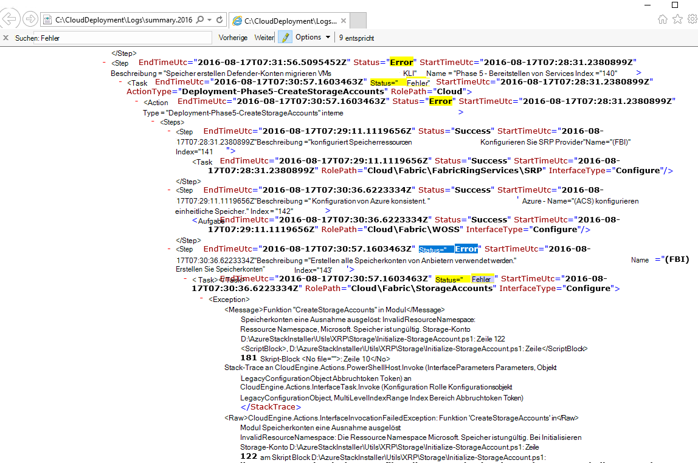
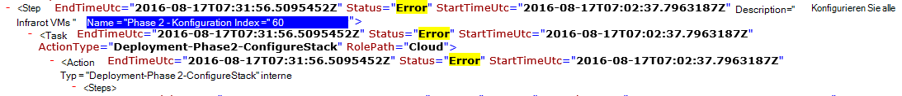

<properties
    pageTitle="Bereitstellung von einem fehlgeschlagenen Schritt erneut | Microsoft Azure"
    description="Wenn einen Fehler während der Bereitstellung auftreten, können Sie die folgenden Schritte aus, um die Bereitstellung von dem Fehler erneut versuchen."
    services="azure-stack"
    documentationCenter=""
    authors="ErikjeMS"
    manager="byronr"
    editor=""/>

<tags
    ms.service="azure-stack"
    ms.workload="na"
    ms.tgt_pltfrm="na"
    ms.devlang="na"
    ms.topic="get-started-article"
    ms.date="09/26/2016"
    ms.author="erikje"/>
    
# Bereitstellung von einem fehlgeschlagenen Schritt erneut ausführen
  
Wenn einen Fehler während der Bereitstellung auftreten, können Sie die folgenden Schritte aus, um die Bereitstellung von dem Fehler erneut versuchen.

## Suchen Sie den Fehler

Beachten Sie Fehler speziell der Teil, der bei welchem Schritt den Aufruf ruft ist fehlgeschlagen. Zum Beispiel

**2016-08-17 00:30:57 Fehler 1 > 1 > Aktion: Fehler beim Aufruf von Schritt 60.140.143. Aufruf des Aktionsplans beendet.**

Dies ist der Bereitstellungsschritt Wo soll die Wiederholung der Bereitstellung beginnen.

## Finden Sie weitere Details zum Fehler

Wenn Sie weitere Einzelheiten zu dem Fehler zugeordneten finden **Zusammenfassung. YYYY-MM-DD.tt.N.log.xml** in der **C:\CloudDeployment\Logs\* * Ordner.
Suchen nach der Zeichenfolge "Fehler", und folgen Sie durch die Ausgabe bis eine große Menge von nicht-XML-formatierten Text enthält (in diesem Abschnitt entspricht oft die letzte Instanz der Zeichenfolge "Fehler") Fehlermeldung angezeigt. Zum Beispiel:

Sie können auch dazu führen Schritt verfolgen, Zahlen "Index", letzter Fehler nachverfolgen. Bild oben können Sie entnehmen (von unten beginnend): 143, 140 und dann einen Bildlauf nach oben, 60 angezeigt:

Setzen diese alle zusammen (jetzt von oben nach unten), erhalten Sie 60.140.143, wie die Konsolenausgabe PS aus (wie im Abschnitt "Fehler suchen").

## Die Bereitstellung in einem bestimmten Schritt erneut

Jetzt haben Sie den Schritt, der Fehler bei der Bereitstellung auf versuchen-Bereitstellung von diesem Schritt erneut ausführen.

> [AZURE.IMPORTANT] Die folgenden Befehle müssen vom richtigen Benutzer im Zusammenhang mit dem Fehler ausgeführt werden, die aufgetreten sind. Der Fehler aufgetreten ist, bevor der HOST mit der Domäne verbunden wurde, diese Schritte unter dem lokalen Administratorkonto ausgeführt werden. Wenn der Fehler nach der HOST zur Domäne hinzugefügt wurde, führen Sie Schritte als Domänenadministrator (Azurestack\azurestackadmin).

### Führen Sie den Befehl EceAction aufrufen

1. Importieren Sie erhöhten PS-Konsole die folgenden Module:

        Import-Module C:\CloudDeployment\CloudDeployment.psd1 -Force
        Import-Module C:\CloudDeployment\ECEngine\EnterpriseCloudEngine.psd1 -Force 

2. Führen Sie den folgenden Befehl (Beispiel oben verwendete hier):

        Invoke-EceAction -RolePath Cloud -ActionType Deployment -Start 60.140.143 -Verbose

3.  Die Bereitstellung von Schritt identifiziert wird gestartet-Start-Parameter des Befehls Invoke-EceAction

### Ergebnisse - Wiederholung /-Start

Unabhängig von der Option Sie auswählen, beginnt die Bereitstellung erneut aus dem angegebenen - Parameter zu starten.

1.  Wiederhergestellt ist, wird die Bereitstellung durch Abschluss fortgesetzt.

2.  Schlägt die Bereitstellung wieder an.
    
    - am selben Ort: der Fehler ist wahrscheinlich nicht wiederherstellbaren und Untersuchung ist erforderlich.

    - Stelle nach, diesmal Fehler: dieselben Schritte es erneut zu versuchen.

    - Stelle vor, es dieses Mal nicht: etwas schief mit einer Idempotent, die weitere Untersuchung erfordert.

## Nächste Schritte

[Verbinden mit Azure Stapel](azure-stack-connect-azure-stack.md)

