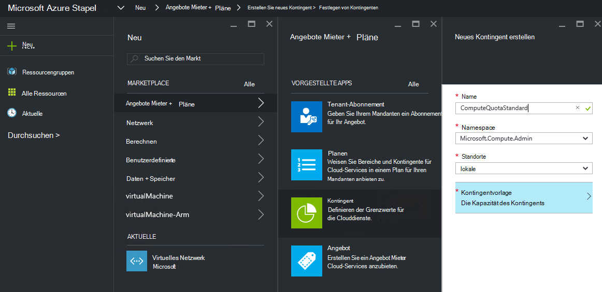
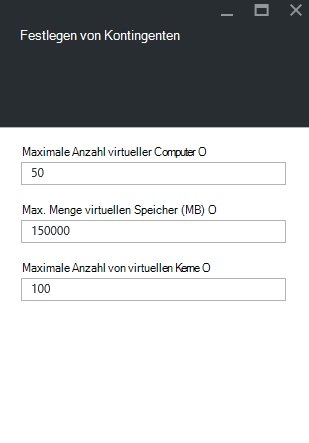
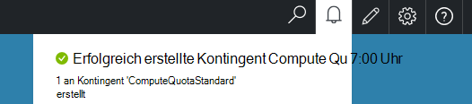

<properties
    pageTitle="Kontingente in Azure Stapel | Microsoft Azure"
    description="Administratoren legen Kontingente maximal Ressourcen beschränken, Mieter auf."
    services="azure-stack"
    documentationCenter=""
    authors="mattmcg"
    manager="byronr"
    editor=""/>

<tags
    ms.service="azure-stack"
    ms.workload="na"
    ms.tgt_pltfrm="na"
    ms.devlang="na"
    ms.topic="get-started-article"
    ms.date="09/26/2016"
    ms.author="mattmcg"/>

# Festlegen von Kontingenten in Azure Stapel

Kontingente definieren die Grenzen der Ressourcen, die ein Abonnement Mieter bereitstellen oder nutzen kann. Beispielsweise können ein Kontingent Mieter bis zu fünf VMs zu erstellen. Um einen Dienst auf einen Plan hinzuzufügen, muss der Administrator die Kontingentvorlage für diesen Dienst konfigurieren.

Kontingente sind konfigurierbare pro Service und Standort ermöglicht Administratoren eine genau abgestimmte Steuerung der Ressourcenverbrauch zu. Eine oder mehrere Ressourcen Kontingent erstellen können und Pläne zuordnen d.h. sie differenzierte Angebote für ihre Dienste bereitstellen können. Kontingente für einen bestimmten Dienst können aus dem **Ressourcenanbieter** Verwaltung Blade für diesen Dienst erstellt werden.

Alle Ressourcen können in jeden Plan verfügbaren Mieter Angebot abonniert, die mehrere Pläne.

## Erstellen ein Kontingents IaaS

1.  Wechseln Sie in einem Browser [https://portal.azurestack.local](https://portal.azurestack.local/).

    Melden Sie Portal Azure Stapel als Administrator an (mit den Anmeldeinformationen, die während der Bereitstellung bereitgestellt).

2.  Wählen Sie **neu**und dann **Kontingent**.

3.  Wählen Sie den ersten Dienst, für den Sie ein Datenträgerkontingent erstellen möchten. Ein Kontingent IaaS folgendermaßen Sie berechnen, Netzwerk und Speicher.
In diesem Beispiel erstellen wir zunächst ein Kontingent für den Compute-Dienst. Wählen Sie in der Liste **Namespace** den Namespace **Microsoft.Compute.Admin** .

    > 

4.  Wählen Sie, wo das Kontingent (z. B. 'local') definiert ist.

5.  Für den Artikel **Kontingentvorlage** sagt **Kapazität Kontingent festgelegt**. Klicken Sie auf diese Option, um das Kontingent zu konfigurieren.

6.  Blade **Kontingente festlegen** sehen Sie alle Serverressourcen für die Limits konfigurieren können. Jeder hat einen Standardwert zugeordnet wurde. Sie können diese Werte ändern oder wählen Sie die Schaltfläche **Ok** unten Blade, die Standardeinstellungen zu übernehmen.

    > 

7.  Nachdem die Werte konfiguriert und auf **Ok**geklickt wird **Kontingentvorlage** Element als **konfiguriert**. Klicken Sie auf **Ok** um **Kontingent** Ressource zu erstellen.

    Sehen Sie eine Benachrichtigung, dass die Ressource Kontingent erstellt wird.

8.   Nach festgelegten Kontingent erfolgreich erstellt wurde, erhalten Sie eine zweite Benachrichtigung. Compute-Dienst Kontingent kann jetzt einen Plan zugeordnet werden. Wiederholen Sie diese Schritte mit dem Netzwerk und Speicher und können einen IaaS-Plan erstellen!

    >   

## Kontingenttypen berechnen

|**Typ**                    |**Standardwert**| **Beschreibung**|
|--------------------------- | ------------------------------------|------------------------------------------------------------------|
|Maximale Anzahl virtueller Computer   |50|Die maximale Anzahl von virtuellen Maschinen, die ein Abonnement an diesem Speicherort erstellen können. |
|Maximale Anzahl von virtuellen Kerne              |100|Die maximale Anzahl von Kernen, die ein Abonnement an diesem Speicherort erstellen können (z. B. eine VM A3 hat vier Kerne).|
|Max. Menge virtuellen Speicher (GB)         |150|Der maximale RAM in Megabyte bereitgestellt werden (z. B. ein A1-VM 1,75 GB RAM benötigt).|

> [AZURE.NOTE] Compute-Kontingente in dieser technischen Vorschau nicht erzwungen werden.

## Kontingent Speichertypen

|**Artikel**                           |**Standardwert**   |**Beschreibung**|
|---------------------------------- |------------------- |-----------------------------------------------------------|
|Maximale Kapazität (GB)              |500                 |Die Speicherkapazität, die durch ein Abonnement an dieser Stelle verwendet werden kann.|
|Gesamtzahl der Speicherkonten   |20                  |Die maximale Anzahl Speicherkonten ein Abonnement an diesem Speicherort erstellen kann.|

## Kontingent Netzwerktypen

|**Artikel**                                                   |**Standardwert**   |**Beschreibung**|
|----------------------------------------------------------| ------------------- |--------------------------------------------------------------------------------------------------------------------------------------------------------------------|
| Max. öffentliche IP-Adressen                         |50                  |Die maximale Anzahl von öffentlichen IPs ein Abonnement an diesem Speicherort erstellen kann. |
| Maximale virtuelle Netzwerke                   |50                  |Die maximale Anzahl von virtuellen Netzwerken, die ein Abonnement an diesem Speicherort erstellen können. |
| Maximale virtuelle Netzwerkgateways           |1                   |Die maximale Anzahl der virtuellen Netzwerkgateways (VPN-Gateways), die ein Abonnement an diesem Speicherort erstellen können. |
| Netzwerk-Verbindungen                |2                   |Die maximale Anzahl der Netzwerkanschlüsse (Punkt oder zwischen Standorten), die ein Abonnement über alle virtuellen Netzwerkgateways an diesem Speicherort erstellen können. |
| Max-Lastenausgleich                     |50                  |Die maximale Anzahl der Lastenausgleich ein Abonnement an diesem Speicherort erstellen kann. |
| Max-Netzwerkkarten                               |100                 |Die maximale Anzahl der Netzwerkschnittstellen, die an dieser Stelle ein Abonnement erstellen können. |
| Max. Sicherheitsgruppen            |50                  |Die maximale Anzahl von Netzwerk-Sicherheitsgruppen, die ein Abonnement an diesem Speicherort erstellen kann. |
