<properties
    pageTitle="Bereitstellen der SQL Server-Ressourcenanbieter Azure Stapel | Microsoft Azure"
    description="Detaillierte Schritte zum Bereitstellen einer SQL Server-Anbieter Ressourcenadapter Azure Stapel."
    services="azure-stack"
    documentationCenter=""
    authors="Dumagar"
    manager="byronr"
    editor=""/>

<tags
    ms.service="multiple"
    ms.workload="na"
    ms.tgt_pltfrm="na"
    ms.devlang="na"
    ms.topic="article"
    ms.date="09/26/2016"
    ms.author="dumagar"/>

# Bereitstellen der SQL Server-Anbieter Ressourcenadapter Azure Stapel

> [AZURE.NOTE] Folgendes gilt nur für Azure Stapel TP1 Bereitstellungen.

Verwenden Sie in diesem Artikel die detaillierte Schritte zum Einrichten der SQL Server-Anbieter Ressourcenadapter im Stapel Azure Machbarkeitsstudie (POC). Finden Sie unter Ressource Anbieterfunktionen und Architektur [Datenbanken SQL Azure Stapel verwenden](azure-stack-sql-rp-deploy-short.md) .

## Schritte vor der Bereitstellung einrichten

Vor dem Bereitstellen des Ressourcenanbieters müssen:

- Haben Sie Standard Windows Server-Abbilds mit .NET 3.5
- Deaktivieren Sie verstärkte Sicherheitskonfiguration von Internet Explorer (IE)
- Installieren Sie die neueste Version von Azure PowerShell

### Erstellen Sie ein Abbild von Windows Server, einschließlich .NET 3.5

Sie können diesen Schritt überspringen, wenn Bits Azure Stapel nach 23/2/2016 heruntergeladen, da das standardmäßige Windows Server 2012 R2 Basisabbild .NET 3.5 Framework in diesem Download und höher enthalten.

Wenn 23/2/2016 heruntergeladen müssen Sie eine Windows Server 2012 R2 Datacenter VHD mit .NET 3.5 erstellen und Standardbild Plattformimage Repository ist.

### Deaktivieren Sie IE verstärkte Sicherheit und Aktivieren von cookies

Um ein Ressourcenanbieter bereitzustellen, führen Sie PowerShell Integrated Scripting Environment (ISE) als Administrator müssen Sie Cookies und JavaScript in Internet Explorer Profil ermöglichen Azure Active Directory Administrator und Benutzer anmelden bei verwenden.

**IE deaktivieren verbesserte Sicherheit:**

1. Melden Sie sich bei Azure Stack Proof of Concept (PoC) Computer als AzureStack/Administrator und öffnen Sie Server-Manager.

2. **Verstärkte Sicherheitskonfiguration für Internet Explorer** für Administratoren und Benutzer deaktivieren.

3. **ClientVM.AzureStack.local** virtuellen Computer als Administrator melden Sie an und öffnen Sie Server-Manager.

4. **Verstärkte Sicherheitskonfiguration für Internet Explorer** für Administratoren und Benutzer deaktivieren.

**So aktivieren Sie Cookies:**

1. Startbildschirm klicken Sie auf **Alle apps**, **Windows**Zubehör, Maustaste **Internet Explorer**, auf **Weitere**, und klicken Sie dann auf **als Administrator ausführen**.

2. Ggf. **empfohlen Sicherheit**überprüfen Sie und klicken Sie dann auf **OK**.

3. Klicken Sie in Internet Explorer auf **Extras (gear) Symbol** &gt; **Optionen** &gt; Registerkarte **Datenschutz** .

4. Klicken Sie auf **Erweitert**, stellen Sie sicher, dass beide **akzeptieren** Schaltflächen ausgewählt sind, klicken Sie auf **OK**und klicken Sie erneut auf **OK** .

5. Schließen Sie Internet Explorer und starten Sie PowerShell ISE als Administrator.

### Installieren Sie eine Azure-Stapel-kompatible Version von Azure PowerShell

1. Deinstallieren Sie alle vorhandenen Azure PowerShell von VM-Client.

2. Melden Sie sich bei Azure Stapel POC-Maschine als AzureStack/Administrator an.

3. Mit Remote Desktop melden Sie **ClientVM.AzureStack.local** virtuellen Computer als Administrator an.

4. Öffnen Sie das Bedienfeld, klicken Sie auf **Programm deinstallieren** &gt; klicken Sie auf **Azure PowerShell** &gt; klicken Sie auf **Deinstallieren**.

5. [Herunterladen der neuesten Azure PowerShell, der Azure-Stapel unterstützt](http://aka.ms/azstackpsh) , und installieren Sie es.

    Nach der Installation von PowerShell führen Sie diese Überprüfung PowerShell-Skript, um sicherzustellen, dass Ihre Azure Stack-Instanz hergestellt werden kann (eine Login-Webseite erscheint).

## Bootstrap-Bereitstellung der Ressource PowerShell

1. ClientVm.AzureStack.Local mit Azure Stapel POC-Remotedesktop und melden Sie sich als Azurestack\\Azurestackuser.

2. Datei [SQLRP Binärdateien herunterladen](http://aka.ms/massqlrprfrsh) . Sie müssen Internet Download Sicherheit Block entfernen, indem Sie mit der rechten Maustaste auf die Datei **Eigenschaften** auswählen und auf der Registerkarte **Allgemein** Tick **Zulassen**, **OK**. Dies sollte 'Konnte keine Datei oder Assembly laden' Ausnahmen DeploymentTelemetry.dll und nachfolgenden Trace-Bereitstellung Ausnahmen verhindern.

3. Extrahieren Sie die Dateien auf Laufwerk D:\\SQLRP.

4. D: Ausführen\\SQLRP\\Bootstrap.cmd Datei als Administrator (Azurestack\\Administrator).

    Daraufhin wird die Datei Bootstrap.ps1 in der PowerShell ISE.

5. Wenn PowerShell ISE Fenster Laden abgeschlossen ist, klicken Sie auf die Wiedergabeschaltfläche, oder drücken Sie F5.

    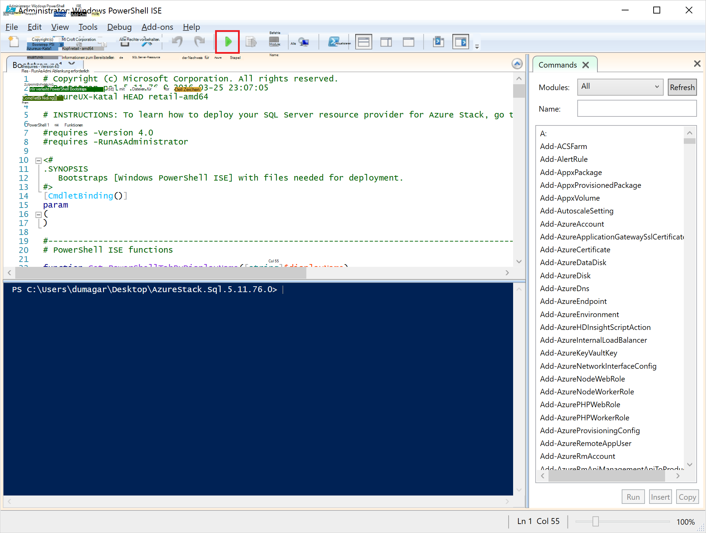

    Zwei wichtige Registerkarten lädt, jeweils alle Skripts und Dateien zur Bereitstellung des Ressourcenanbieters.

## Erforderliche Vorbereitung

Klicken Sie auf die Registerkarte **Komponenten vorbereiten** :

- Erstellen der erforderlichen Zertifikate
- Hochladen Sie Artefakte auf ein Speicherkonto Stapel Azure
- Galerie-Elemente veröffentlichen

### Erstellen Sie die erforderlichen Zertifikate
Dieses **Neue SslCert.ps1** fügt die \_. AzureStack.local.pfx SSL-Zertifikat D:\\SQLRP\\Komponenten\\BlobStorage\\Containerordner. Das Zertifikat sichert die Kommunikation zwischen dem Ressourcenanbieter und die lokale Instanz von Azure-Ressourcen-Manager.

1. **Erforderliche Vorbereitung** großen Registerkarte klicken Sie auf die Registerkarte **Neu SslCert.ps1** und ausführen.

2. Geben Sie bei der Aufforderung, die angezeigt wird, ein PFX-Kennwort, das den privaten Schlüssel und **Notieren Sie dieses Kennwort**schützt. Sie werden ihn später benötigen.

### Hochladen Sie alle Elemente in ein Speicherkonto Stapel Azure

1. Klicken Sie auf **Upload-Microsoft.Sql-RP.ps1** und ausgeführt werden.

2. Geben Sie im Dialogfeld Anmeldeinformationen Anforderung Windows PowerShell die Anmeldeinformationen des Dienstadministrators Azure Stapel.

3. Für die Azure Active Directory Mandanten-ID geben den Azure Active Directory Mieter vollqualifizierten Domänennamen ein: zum Beispiel microsoftazurestack.onmicrosoft.com.

    Ein Popup-Fenster fordert Anmeldeinformationen.

    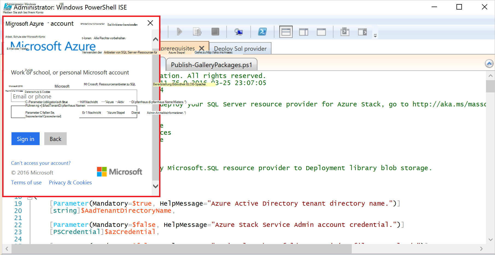

    > [AZURE.TIP] Wenn das Popup-Fenster angezeigt wird, Sie, die entweder noch nicht Internet Explorer deaktiviert, erweiterte Sicherheit aktivieren Sie JavaScript auf diesem Computer und Benutzer oder Cookies in Internet Explorer noch nicht akzeptiert. Finden Sie die [Schritte vor der Bereitstellung einrichten](#set-up-steps-before-you-deploy).

4. Geben Sie Ihre Anmeldeinformationen Azure Stapel Dienstadministratoren und klicken Sie auf **Anmelden**.

### Galerieartikel für spätere Ressource erstellen veröffentlichen

Wählen Sie die Registerkarte **Veröffentlichen GalleryPackages.ps1** und ausgeführt werden. Dieses Skript hinzugefügt Azure Stapel POC Portal Marketplace, mit denen Sie Ressourcen wie Marketplace Elemente bereitstellen zwei Marketplace Elemente.

## Bereitstellen des SQL Server-Ressourcenanbieters VM

Azure Stapel PoC mit der erforderlichen Zertifikate und Marketplace vorbereitet haben, können Sie eine SQL Server-Ressourcenproviders bereitstellen. Klicken Sie auf der Registerkarte **Bereitstellung SQL Provider** zu:

   - Geben Sie Werte in einer JSON-Datei, die der Bereitstellungsprozess verweist
   - Den Ressourcenanbieter bereitstellen
   - Der lokale DNS-Aktualisierung
   - Der SQL Server-Anbieter-Ressourcenadapter registrieren

### Geben Sie Werte in der JSON-Datei

Klicken Sie auf **Microsoft.Sqlprovider.Parameters.JSON**. Diese Datei enthält Parameter die Azure-Ressourcen-Manager-Vorlage ordnungsgemäß Stapel Azure bereitgestellt werden muss.

1. Füllen Sie die **leeren** Parameter in der JSON-Datei:

    - Stellen Sie sicher, dass die **Adminusername** und **Adminpassword** für SQL Ressource Anbieter VM:

        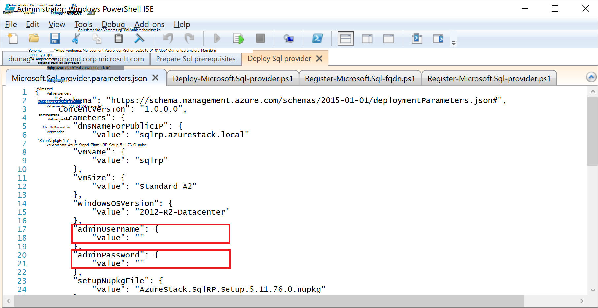

    - Stellen Sie sicher, dass Sie das Kennwort für den **SetupPfxPassword** -Parameter angeben, die eine [Prepare Prequisites](#prepare-prerequisites) Schritt vorgenommen:

    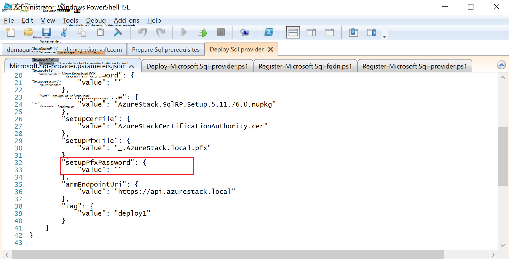

2. Klicken Sie auf **Speichern** , um die Datei zu speichern.

### Den Ressourcenanbieter bereitstellen

1. Klicken Sie auf **Deploy-Microsoft.sql-provider.PS1** , und führen Sie das Skript.
2. Geben Sie Ihren Namen Mieter in Azure Active Directory Aufforderung.
3. Senden Sie im Popupfenster Ihre Azure Stapel Admin Dienstanmeldeinformationen.

Die vollständige Bereitstellung dauert zwischen 25 und 55 Minuten auf einige stark ausgelastete Azure Stapel Machbarkeitsstudien. Die längste Schritte werden die gewünschten Zustand Konfiguration (DSC) Erweiterung und der PowerShell, ist der letzte Schritt. Jeder kann 10-25 Minuten dauern.

### Der lokale DNS-Aktualisierung

1. Klicken Sie auf der Registerkarte **Journal-Microsoft.SQL-fqdn.ps1** , und führen Sie das Skript.
2. Aufforderung zur Azure Active Directory-Mandanten-ID Eingabe Azure Active Directory Mieter vollqualifizierten Domänennamens: z. B. **microsoftazurestack.onmicrosoft.com**.

### Registrieren Sie SQL-RP-Ressourcenproviders##

1. Klicken Sie auf der Registerkarte **Journal-Microsoft.SQL-provider.ps1** , und führen Sie das Skript.

2. Verwenden Sie nach Anmeldeinformationen gefragt die folgenden Werte für Benutzername und Kennwort:

   - **sqlRpUsername**
   - **sqlRpPassw0rd**

   > [AZURE.IMPORTANT] Dies sind die *Literale* Werte für die Eingabe aufgefordert, Anmeldeinformationen einzugeben. Dies sind keine Platzhalter. * *Sind *nicht* Typ ** Username\password Sie vor der Bereitstellung der VM in der Parameterdatei gespeichert.

## Überprüfen Sie die Bereitstellung mithilfe von Azure Stack-Portal

1. Die ClientVM melden, und melden Sie sich erneut als **AzureStack\AzureStackUser**.

2. Auf dem Desktop auf **Azure Stapel POC-Portal** und das Portal Dienstadministrators anmelden

3. Stellen Sie sicher, dass die Bereitstellung war erfolgreich. Klicken Sie auf **Durchsuchen** &gt; **Ressourcengruppen** &gt; klicken Sie auf die Ressourcengruppe, die Sie verwendet (Standard ist **SQLRP**), und stellen sicher, dass der wesentliche Teil Blade (obere Hälfte) **Bereitstellung erfolgreich**gelesen.

      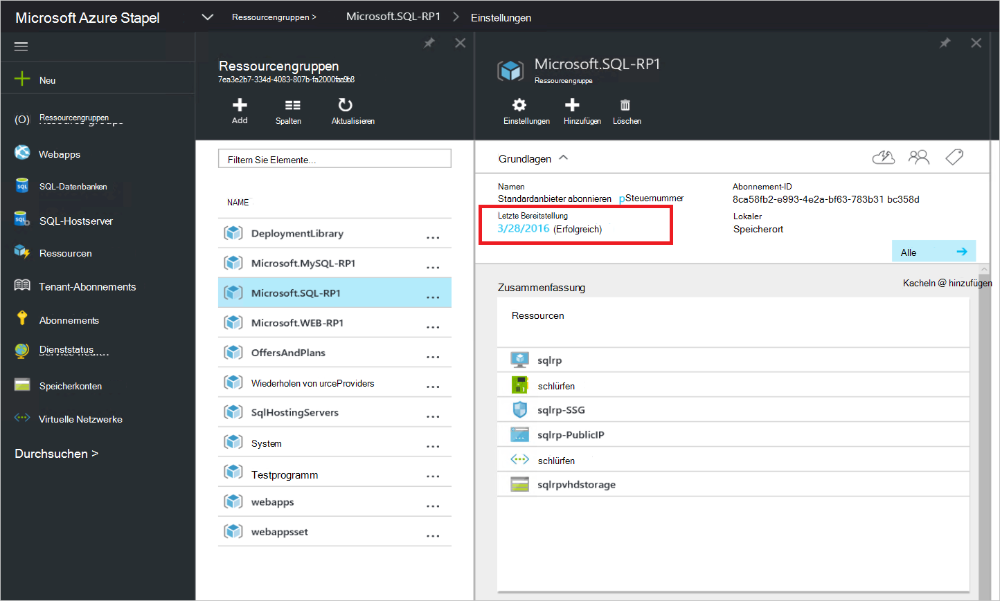

4. Stellen Sie sicher, dass die Registrierung erfolgreich war. Klicken Sie auf **Durchsuchen** &gt; **Ressourcen**und dann nach **Lokalen SQL**:

      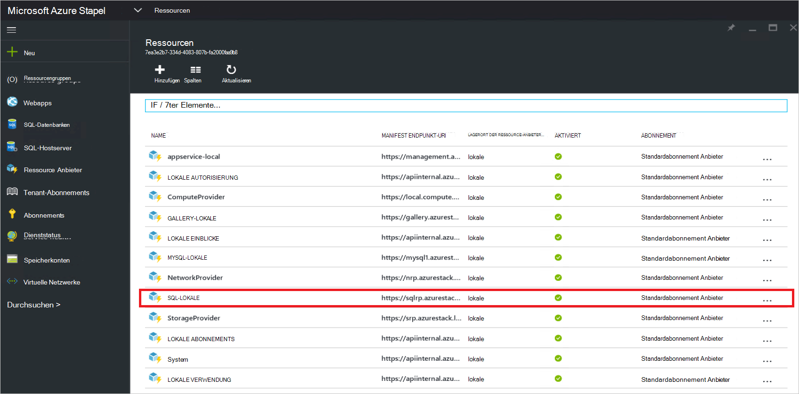

## Bereitstellen Sie Kapazität der Ressourcenanbieter SQL, indem Sie eine SQL-Hostserver mit

1. Als ein Administrator des Azure Stapel POC-Portal anmelden

2. Klicken Sie auf **Ressourcen** &gt; **SQL lokale** &gt; **Provider Ressourcenmanagement gehen** &gt; **Server** &gt; **Hinzufügen**.

    **SQL Server hosten** Blade ist dem Ressourcenanbieter der SQL Server-Instanzen von SQL Server hergestellt werden kann, die als Back-End der Ressourcenanbieter fungieren.

    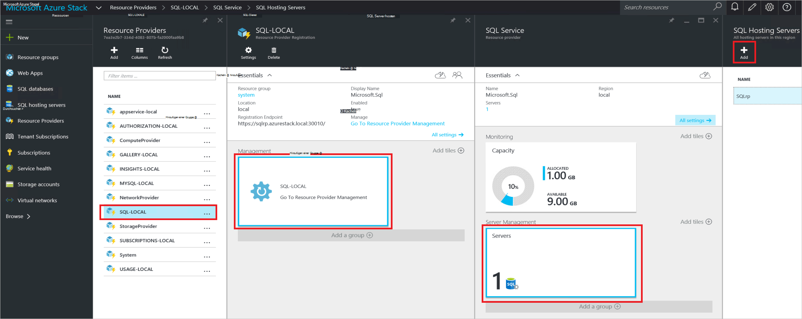

3. Formular mit der Verbindung der SQL Server-Instanz. Standardmäßig Namen einer vorkonfigurierten SQL Server "SQLRP" mit dem Administrator Benutzernamen "sa" und das Kennwort rief im Parameter "Adminpassword" Parameter JSON auf dem virtuellen Computer ausgeführt wird.

## Erstellen Sie Ihre erste SQL-Datenbank zum Testen der Bereitstellung

1. Als Dienstadministrators Azure Stapel POC-Portal anmelden

2. Klicken Sie auf **Durchsuchen** &gt; **SQL-Datenbanken** &gt; **Hinzufügen**
  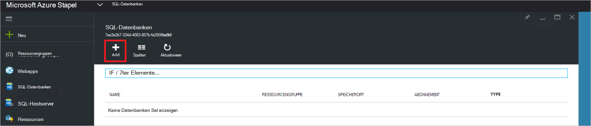

3. Füllen Sie das Formular mit den Details der Datenbank einschließlich **Servernamen**, **Server Admin Anmeldung**und **Kennwort** für einen neuen *virtuellen Server* in die **Neue Server** -Blade.

    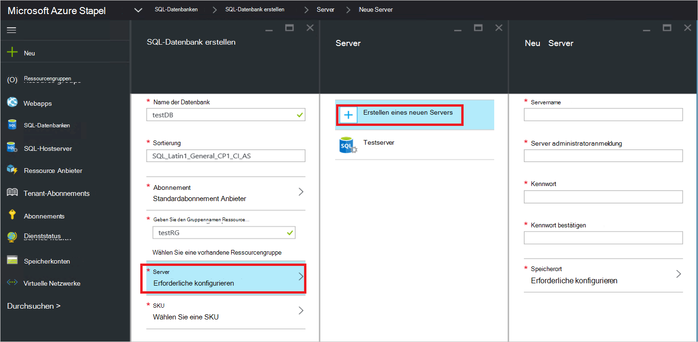

    Virtueller Server ist eine künstliche Konstruktion. SQL Server selbst keinem er zeigt stattdessen über den Benutzernamen in der Verbindungszeichenfolge der Ressourcenanbieter am Ende dieses Vorgangs generiert. **Hinweis das Kennwort, die Sie für den virtuellen Server eingeben**. Das Portal wird niemals das Kennwort angezeigt.

4. Sie werden aufgefordert, einen Tarif für Ihre Datenbank auswählen.

    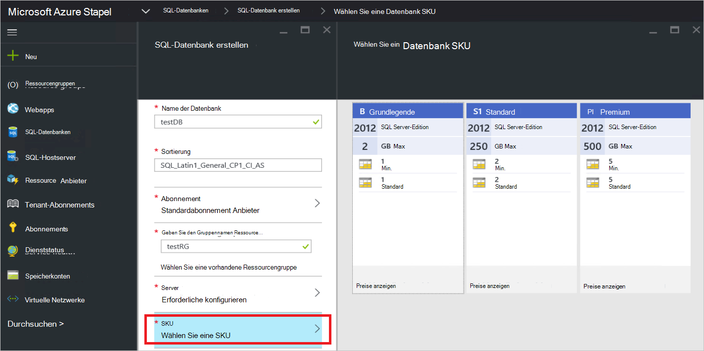

    Ebenen werden in dieser Version nicht implementiert jedoch ihren Verbrauch von Azure-Ressourcen-Manager so Differenzierung präsentieren Kontingent Durchsetzung usw. erstellten nachverfolgt.

5. Das Formular aus, und warten Sie, bis die Bereitstellung abgeschlossen.

6. Beachten Sie in der resultierenden Blade-Feld "Verbindungszeichenfolge". Können Sie die Zeichenfolge in einer Anwendung, die SQL Server-Zugriff (z. B. Web-app) erfordert in Azure Stapel.

    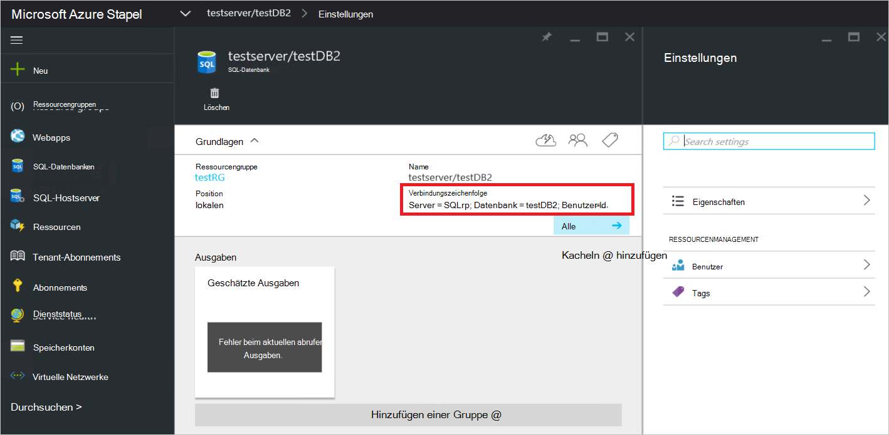

## Nächste Schritte

Versuchen Sie andere [PaaS-Dienste](azure-stack-tools-paas-services.md) wie [Ressourcenanbieter MySQL Server](azure-stack-mysql-rp-deploy-short.md) und [Web Apps Ressourcenanbieter](azure-stack-webapps-deploy.md).
