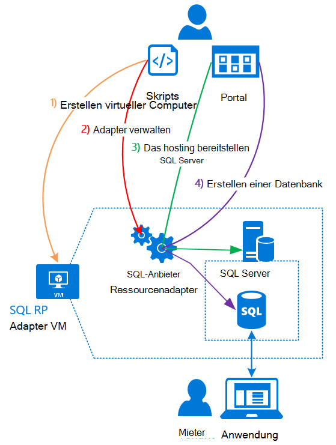

<properties
    pageTitle="Verwendung von Datenbanken SQL Azure Stapel | Microsoft Azure"
    description="Erfahren Sie, wie Sie SQL-Datenbanken als Dienst in Azure Stack und die Schritte der SQL Server-Anbieter Ressourcenadapter Bereitstellung bereitstellen können."
    services="azure-stack"
    documentationCenter=""
    authors="Dumagar"
    manager="byronr"
    editor=""/>

<tags
    ms.service="multiple"
    ms.workload="na"
    ms.tgt_pltfrm="na"
    ms.devlang="na"
    ms.topic="article"
    ms.date="09/26/2016"
    ms.author="dumagar"/>

# Datenbanken SQL Azure Stapel verwenden

> [AZURE.NOTE] Folgendes gilt nur für Azure Stapel TP1 Bereitstellungen.

Verwenden der SQL Server-Anbieter Ressourcenadapter SQL-Datenbanken als Dienst Azure Stapel aussetzen. Nach der Installation des Ressourcenanbieters können Sie und Ihre Benutzer Datenbanken Cloud systemeigenen apps auf SQL basierende Website und Arbeitslasten, die auf SQL ohne Bereitstellung eine virtuellen Maschine (VM) hostet SQL Server jedes Mal erstellen.

Da der Ressourcenanbieter während der Prüfung des Konzepts (PoC) alle Funktionen von Azure SQL-Datenbank hat, beginnt dieser Artikel einen Überblick über die Architektur der Ressource. Anschließend erhalten Sie eine schnelle Übersicht über die Schritte zum Einrichten der Ressourcenanbieter mit Links zu mehr Einzelheiten in [der SQL-Datenbank Anbieter Ressourcenadapter auf Azure Stapel POC bereitstellen](azure-stack-sql-rp-deploy-long.md).

## SQL Server-Ressource Adapterarchitektur
Der Ressourcenanbieter der Datenbank bietet keine Verwaltungsfunktionen von Azure SQL-Datenbank wird. Z. B. elastische datenbankpools und die Fähigkeit, Datenbank-Performance nach oben und unten bei laufendem Betrieb nicht verfügbar. Der Ressourcenanbieter unterstützt jedoch dieselbe erstellen, lesen, aktualisieren und löschen (CRUD) Operationen in Form von Azure SQL-Datenbank.

Der Ressourcenanbieter besteht aus drei Komponenten:

- **Der SQL-Anbieter-Ressourcenadapter VM**umfasst den Vorgang des Anbieters und die Server, die SQL Server hosten.
- **Der Ressourcenanbieter selbst**die Anfragen und Ressourcen verfügbar macht.
- **Server, die SQL Server hosten**, die Kapazität für Datenbanken.

Das folgende Diagramm zeigt diese Komponenten und die Schritte durchlaufen den Ressourcenanbieter bereitstellen, richten Sie einen Server, der als Host für SQL Server und eine Datenbank erstellen.

## Schritte zum Bereitstellen des Ressourcenanbieters
Verwenden Sie folgendermaßen, wenn Sie bereits mit Azure vertraut sind. Wenn Sie mehr Details wünschen, Hyperlinks in jedem Abschnitt oder direkt zum [Bereitstellen der SQL-Datenbank Anbieter Ressourcenadapter auf Azure Stapel POC](azure-stack-sql-rp-deploy-long.md).

1.  Stellen Sie sicher, dass alle [Schritte vor der Bereitstellung einrichten](azure-stack-sql-rp-deploy-long.md#set-up-steps-before-you-deploy) der Ressourcenanbieter ausführen:

  - 3.5 von .NET Framework ist bereits im Windows Server-Basisabbild festgelegt. (Wenn Sie Bits Azure Stapel nach dem 23. Februar 2016 heruntergeladen können Sie diesen Schritt überspringen.)
  - [Eine Version von Azure PowerShell, die kompatibel mit Azure ist, installiert](http://aka.ms/azStackPsh).
  - In Internet Explorer Einstellungen auf ClientVM [Internet Explorer aus Sicherheitsgründen deaktiviert und Cookies aktiviert sind](azure-stack-sql-rp-deploy-long.md#Turn-off-IE-enhanced-security-and-enable-cookies).

2. [Herunterladen der SQL Server-RP Binärdateien](http://aka.ms/massqlrprfrsh) und ClientVM in Ihren Azure Stapel POC extrahieren.

3. [Bootstrap.cmd und Skripts ausführen](azure-stack-sql-rp-deploy-long.md#Bootstrap-the-resource-provider-deployment-PowerShell-and-Prepare-for-deployment).

    Skripte werden zwei wichtige Registerkarten öffnen in der PowerShell Integrated Scripting Environment (ISE) gruppiert. Führen Sie die geladenen Skripts nacheinander von links nach rechts auf jeder Registerkarte.

    1. Skripts im Register **Vorbereiten** von links nach rechts, um ausführen:

        - Erstellen Sie ein Platzhalterzertifikat zum Sichern der Kommunikation zwischen dem Ressourcenanbieter und Azure-Ressourcen-Manager.
        - Hochladen Sie Zertifikate und andere Artefakte für Azure Storage-Konto.
        - Veröffentlichen Sie Gallery-Pakete, sodass Sie SQL und Ressourcen in der Sammlung bereitstellen können.

        > [AZURE.IMPORTANT] Wenn Skripts hängt ohne ersichtlichen Grund, nachdem Sie Ihre Azure Active Directory Mieter übermittelt, blockieren die Sicherheitsstufe eine DLL, die für die Bereitstellung ausführen muss. Zum Beheben dieses Problems Microsoft.AzureStack.Deployment.Telemetry.Dll im Ordner Anbieter Ressource suchen, Maustaste klicken Sie auf **Eigenschaften**, und überprüfen Sie **Zulassen** auf der Registerkarte **Allgemein** .

    1. Skripts in die Registerkarte **Bereitstellen** von links nach rechts, um ausführen:

        - [Bereitstellen einer VM](azure-stack-sql-rp-deploy-long.md#Deploy-the-SQL-Server-Resource-Provider-VM) , der Ressourcenanbieter sowohl SQL Server hostet. Dieses Skript verweist auf ein JSON-Parameterdatei, müssen Sie einige Werte aktualisieren, bevor Sie das Skript ausführen.
        - [Registrieren Sie einen lokalen DNS-Eintrag](azure-stack-sql-rp-deploy-long.md#Update-the-local-DNS) , der dem Ressourcenanbieter VM zugeordnet ist.
        - [Registrieren der Ressourcenanbieter](azure-stack-sql-rp-deploy-long.md#Register-the-SQL-RP-Resource-Provider) mit lokalen Azure Resource Manager.

        > [AZURE.IMPORTANT] Alle Skripts angenommen, Betriebssystem-Image erforderlichen Komponenten (.NET 3.5 installiert, JavaScript und Cookies aktiviert die ClientVM und eine kompatible Version von Azure PowerShell installiert) erfüllt. Wenn Sie beim Ausführen des Skripts Fehler erhalten, überprüfen Sie die Voraussetzung erfüllt.

6. [Verbinden der Ressourcenanbieter auf einen Server, der SQL Server befindet,](#Provide-capacity-to-your-SQL-Resource-Provider-by-connecting-it-to-a-hosting-SQL-server) im Stapel Azure-Portal. Klicken Sie auf **Durchsuchen** &gt; **Ressourcenprovider** &gt; **SQLRP** &gt; **Provider Ressourcenmanagement gehen** &gt; **Server** &gt; **Hinzufügen**.

    Verwenden Sie "sa" Benutzername und Kennwort, die Sie bei den Ressourcenanbieter VM bereitgestellt.

7. [Test der neuen SQL Server-Ressourcenanbieter](/azure-stack-sql-rp-deploy-long.md#create-your-first-sql-database-to-test-your-deployment)Bereitstellen einer SQL Azure-Stapel-Portal. Klicken Sie auf **Erstellen** &gt; **benutzerdefinierte** &gt; **SQL Server-Datenbank**.

Dies sollte dem Ressourcenanbieter SQL Server von ca. 45 Minuten (je nach Hardware) wiederherstellt.
