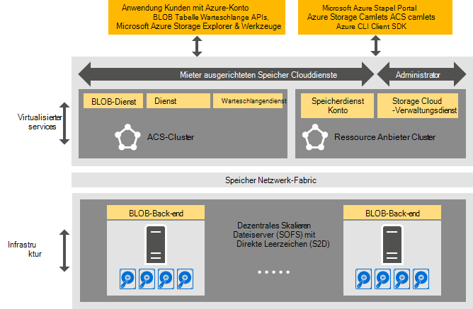

<properties
    pageTitle="Einführung in Azure einheitliche Speicher | Microsoft Azure"
    description="Erfahren Sie mehr über Azure einheitliche Speicher"
    services="azure-stack"
    documentationCenter=""
    authors="AniAnirudh"
    manager="darmour"
    editor=""/>

<tags
    ms.service="azure-stack"
    ms.workload="na"
    ms.tgt_pltfrm="na"
    ms.devlang="na"
    ms.topic="get-started-article"
    ms.date="09/26/2016"
    ms.author="anirudha"/>

# Einführung in Azure einheitliche Speicher
Azure einheitliche Speicher ist die Menge von Clouddiensten Microsoft Azure Stapel Speicher. Konsistente Azure Storage bietet Blob, Tabelle, Warteschlange und Account-Management-Funktionen mit Azure einheitlichen Semantik. Es ermöglicht zudem eine Cloud Storage Services verwalten in der Administratorhilfe. Dieser Artikel stellt Azure einheitliche Speicher und erläutert, wie Speicher Clouddienste in Azure Stapel gut umfangreiche [Funktionen in Windows Server 2016 Speicher](https://blogs.technet.microsoft.com/windowsserver/2016/04/14/ten-reasons-youll-love-windows-server-2016-5-software-defined-storage/)ergänzen.

Konsistente Azure Storage bietet folgenden Kategorien von Funktionen:

- **BLOBs**: Seite Blobs, blockieren Blobs und Anhängen Blobs mit   [konsistenten Azure Blob](https://msdn.microsoft.com/library/azure/dd179355.aspx#Anchor_1) 
   Verhalten

- **Tabellen**: Elemente, Partitionen und andere Tabelle mit   [Azure konsistente](https://msdn.microsoft.com/library/azure/dd179355.aspx#Anchor_3) 
   Verhalten

- **Warteschlangen**: zuverlässige und beständige Nachrichten und Warteschlangen   [Azure konsistente](https://msdn.microsoft.com/library/azure/dd179355.aspx#Anchor_2) Warteschlange
   Verhalten

- **Konten**: Speicherressourcenmanagement   [Azure konsistente](https://azure.microsoft.com/documentation/articles/storage-create-storage-account/) Konto Konto
   Verhalten für allgemeine Speicherkonten [Azure-Ressourcen-Manager-Bereitstellungsmodell](https://azure.microsoft.com/documentation/articles/resource-manager-deployment-model/) bereitgestellt

- **Verwaltung**: Mieter gerichteten und Azure einheitliche Speicher Zentralspeicher Dienstleistungen (in anderen Artikeln behandelt)

## Azure konsistente Speicherarchitektur

Abbildung 1. Konsistente Azure Storage: Lösung anzeigen

## Konsistente Azure Storage virtualisiert, Services und Cluster

In Azure konsistente Speicherarchitektur alle Mandanten oder Administrator zugänglichen Speicherdienste virtualisiert. D. h. Ausführung in [Hyper-V](https://technet.microsoft.com/library/dn765471.aspx) -Funktionalität in [Windows Server 2016](http://www.microsoft.com/server-cloud/products/windows-server-2016/)VMs auf Service Provider verwaltet, hochgradig verfügbar.
VMs sind hochverfügbare [Windows Server Failover Clustering](https://technet.microsoft.com/library/dn765474.aspx) -Technologie Azure konsistente virtualisierte Storage Services selbst Gast gruppiert, hochverfügbare Services [Azure Service Fabric](http://azure.microsoft.com/campaigns/service-fabric/)-Technologie.

Azure einheitliche Speicher nutzt zwei Service Fabric-Cluster in einer Bereitstellung Azure Stapel.
Storage Resource Provider Service wird auf einem Cluster Service Fabric ("RP Cluster) bereitgestellt, die auch andere Dienste grundlegenden Ressourcen gemeinsam. Die restliche Speicher virtualisiert Pfad-Dienste – einschließlich Blob, Tabelle und Warteschlange Services – in einem zweiten Service Fabric-Cluster ("konsistente Azure Storage Cluster) gehostet.

## BLOB-Dienst und Speicher

Blob Service wieder beenden auf der anderen Seite führt direkt auf den Clusterknoten [Scale-Out-Dateiserver](https://technet.microsoft.com/library/hh831349.aspx) . Lösungsarchitektur Azure Stapel Scale-Out-File Server beruht auf den- [Storage Spaces Direct](https://technet.microsoft.com/library/mt126109.aspx)-Basis, solch Failovercluster. Abbildung 1 zeigt wichtige Azure einheitliche Speicher Komponentendienste und ihre verteilte Bereitstellungsmodell. Wie Sie im Diagramm sehen, fügt Azure einheitliche Speicher mit vorhandenen Speicher-Features in Windows Server 2016. Keine spezieller Hardware ist für Azure einheitliche Speicher über diese Windows Server-Plattform Vorschriften erforderlich.

## Speicherfarm

Speicherfarm ist die Auflistung der Speicherinfrastruktur, Ressourcen und Back-End-Dienste, die zusammen Mieter gerichteten und Administrator gerichteten Azure konsistent Speicher in einer Bereitstellung Azure Stapel bereitzustellen. Speicherfarm umfasst Folgendes:

- Speicher-Hardware (z. B. Dateiserver Scale-Out-Knoten, Festplatten)

- Storage Fabric-Ressourcen (z. B. SMB-Freigaben)

- Storage-Service Fabric Dienstleistungen (beispielsweise BLOB-Endpunkt Service von Azure einheitliche Speicher-Cluster)

- Speicher-bezogene Dienste auf Dateiserver Scale-Out-Knoten (z. B. der Blob-Dienst)

## IaaS und PaaS Storage-Verwendungsszenarien

Konsistente Azure Storage Seitenblobs in Azure bieten die virtuellen Laufwerke in die gesamte Infrastruktur wie ein Service (IaaS) Szenarien:

- Erstellen Sie einen virtueller Computer mit benutzerdefinierten Betriebssystemdatenträger in ein Seitenblob

- Erstellen Sie einen virtueller Computer mit benutzerdefiniertes Betriebssystemabbild in Seitenblob

- Erstellen Sie einen virtueller Computer mit einem Azure Marketplace-Bild in eine neue Seitenblob

- Erstellen Sie einen virtueller Computer mit einem leeren Datenträger in eine neue Seitenblob

Plattform als Service (PaaS) Szenarien entsprechend Azure einheitliche Speicher Block Blobs Anhängen Blobs, Warteschlangen und Tabellen funktionieren wie in Azure.

## Benutzerrollen

Konsistente Azure Speicher ist für zwei Rollen:

- Anwendungseigentümer, einschließlich Entwickler und Unternehmen. Sie müssen nicht zwei Versionen einer Anwendung und Skripts, die dasselbe Projekt eine öffentliche Cloud und einer gehosteten/Private Cloud in einem Rechenzentrum erreichen bereitstellen oder verwalten. Konsistente Azure Storage bietet Speicher über REST-API, SDK-Cmdlet und Azure Stack-Portal.

- Dienstleister, einschließlich Unternehmen, die Bereitstellung und Verwaltung von Microsoft Azure stapelbasierten mandantenfähigen Storage Cloud-Dienste.

## Nächste Schritte

- [Azure einheitliche Speicher: Unterschiede und Aspekte] (Azure-Stapel-acs-Unterschiede-tp2.md)
