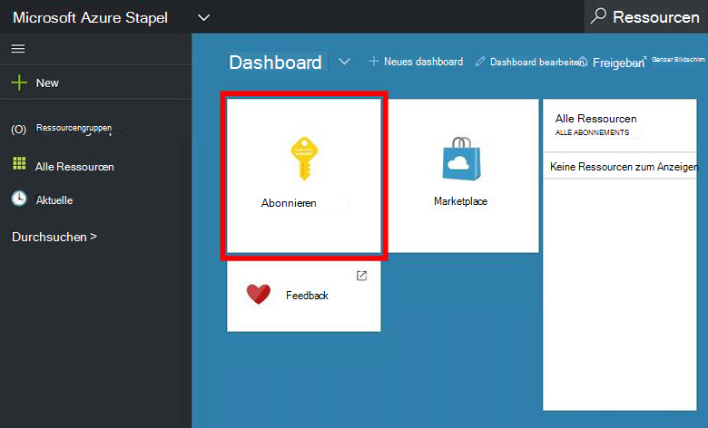
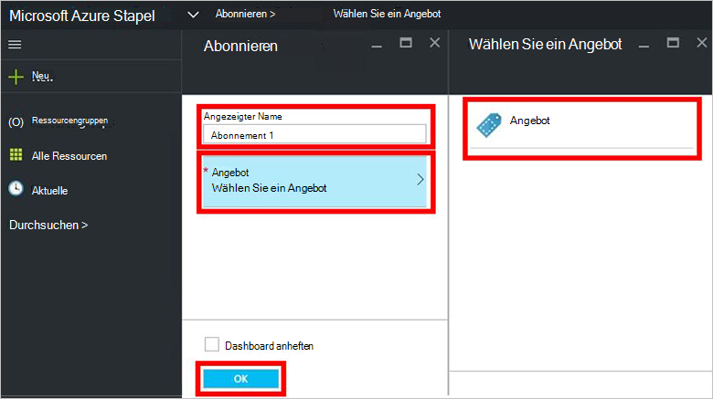
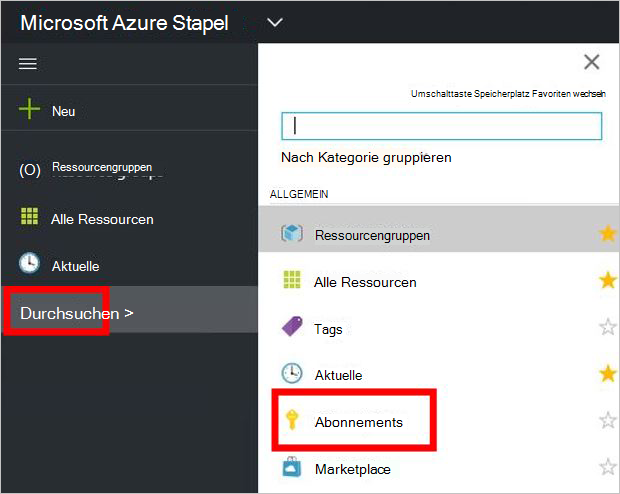

<properties
    pageTitle="Abonnieren Sie ein Angebot und Bereitstellung eine VM in Azure Stapel (Mandant) | Microsoft Azure"
    description="Erfahren Sie, wie ein Angebot und Bereitstellung einer VM in Azure Stapel als Mieter."
    services="azure-stack"
    documentationCenter=""
    authors="ErikjeMS"
    manager="byronr"
    editor=""/>

<tags
    ms.service="azure-stack"
    ms.workload="na"
    ms.tgt_pltfrm="na"
    ms.devlang="na"
    ms.topic="get-started-article"
    ms.date="09/26/2016"
    ms.author="erikje"/>

# Ein Angebot abonnieren

Nachdem Sie [ein Angebot erstellt](azure-stack-create-offer.md)haben, Testen der Mieter ein Abonnement erstellen.

1.  Computer Azure Stapel POC melden `https://portal.azurestack.local` als [Mieter](azure-stack-connect-azure-stack.md#log-in-as-a-tenant) und klicken Sie auf **Abonnieren**.

    

2.  Im Feld **Angezeigter Name** einen Namen für Ihr Abonnement auf **anbieten**, klicken Sie auf eines der Angebote auf dem Blatt **Wählen Sie ein Angebot** , und klicken Sie dann auf **Erstellen**.

    

4.  Zum Erstellen des Abonnements anzuzeigen, klicken Sie auf **Durchsuchen**, **Abonnements**, klicken auf Ihr neues Abonnement.  

    

Nach dem Abonnieren eines Angebots Aktualisieren des Portals um anzuzeigen, welche Dienste das neue Abonnement gehören.

## Nächste Schritte

[Bereitstellen einer virtuellen Maschine](azure-stack-provision-vm.md)
