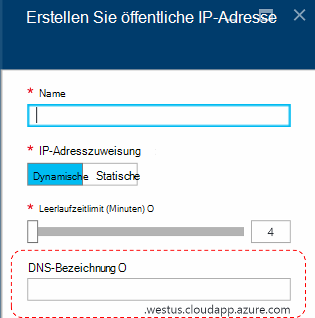
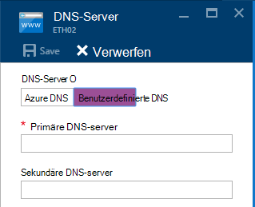
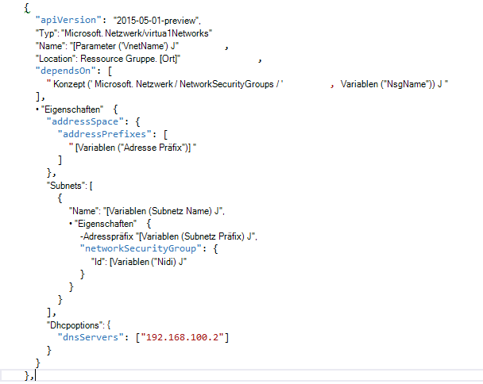

<properties
    pageTitle="Grundlegendes zu DNS in Azure Stapel TP2 | Microsoft Azure"
    description="Grundlegendes zum neuen DNS-Features und Funktionen von Azure Stapel TP2"
    services="azure-stack"
    documentationCenter=""
    authors="ScottNapolitan"
    manager="darmour"
    editor=""/>

<tags
    ms.service="azure-stack"
    ms.workload="na"
    ms.tgt_pltfrm="na"
    ms.devlang="na"
    ms.topic="get-started-article"
    ms.date="09/26/2016"
    ms.author="scottnap"/>

# Einführung in iDNS für Azure
================================

iDNS ist ein neues Feature in Technology Preview 2 für Azure, der externe DNS-Namen (z. B. http://www.bing.com) auflösen können.
Es können Sie interne virtuelle Netzwerknamen registrieren. Dadurch können Sie VMs im gleichen virtuellen Netzwerk von Namen anstelle der IP-Adresse auflösen ohne benutzerdefinierte Einträge für DNS-Server.

Ist, immer es in Azure, aber jetzt gibt es in Windows Server 2016 und Azure Stack zu.

Was iDNS?
------------------

Mit iDNS in Azure Stapel erhalten Sie folgenden Funktionen ohne benutzerdefinierte Einträge für DNS-Server angeben.

-   DNS-Namensauflösungsdienste für Mieter Arbeitslasten freigegeben.

-   Autorisierende DNS-Dienst für Auflösung und DNS-Registrierung Mieter virtuelles Netzwerk.

-   Recursive DNS-Dienst für die Auflösung von Internetnamen Mieter VMs. Mieter müssen keine benutzerdefinierten DNS-Einträge zum Auflösen von Internetnamen (z. B. www.bing.com) angeben.

Weiterhin können Sie bringen ein eigenes DNS und ggf. benutzerdefinierte DNS-Server verwenden. Aber, wenn Sie nur auflösen Internet-DNS-Namen und anderen virtuellen Computern im gleichen virtuellen Netzwerk herstellen können, müssen nichts angeben und einfach funktioniert.

Was nicht iDNS?
---------------------

Welche iDNS Sie nicht zulassen ist einen DNS-Eintrag für einen Namen, die außerhalb des virtuellen Netzwerks behoben werden können.

In Azure haben Sie die Möglichkeit, eine DNS-Bezeichnung, die eine öffentliche IP-Adresse zugeordnet werden kann. Bezeichnung (Präfix) wählen, aber Azure wählt das Suffix Region basiert in die öffentliche IP-Adresse erstellen.

Im Bild oben erstellt Azure ein "A"-Datensatz in DNS für den DNS-Namen unter der Zone **westus.cloudapp.azure.com**angegeben. Das Präfix und das Suffix zusammen erstellen einen vollständig qualifizierten Domäne (FQDN), die von überall im Internet aufgelöst werden können.

Unter TP2 unterstützt Azure nur iDNS für interne Registrierung, damit Folgendes nicht.

-   Erstellen Sie einen DNS-Eintrag unter einer vorhandenen gehostete DNS-Zone (z. B. azurestack.local).

-   Erstellen einer DNS-Zone (z. B. Contoso.com).

-   Erstellen eines Datensatzes unter eigene benutzerdefinierte DNS-Zone.

-   Unterstützen Sie den Kauf von Domain-Namen.

Ändert DNS von Azure Stapel TP1
-----------------------------------

In der Technology Preview 1 (TP1) Version von Azure Stapel mussten Sie benutzerdefinierte DNS-Server bereitstellen, wenn Sie Hosts nach Namen anstatt nach IP-Adresse auflösen können. Dies bedeutet, dass Sie ein virtuelles Netzwerk oder einen virtuellen Computer erstellen, mussten Sie geben mindestens ein DNS-Server angegeben. TP1 POC-Umgebung bedeutete dies IP POC Fabric DNS-Server, nämlich 192.168.200.2 eingeben.

Wenn Sie einen virtuellen Computer über das Portal erstellt, mussten Sie wählen Sie **Benutzerdefinierte DNS** die virtuellen Netzwerk bzw. Ethernet-Adapter.

In TP2 Azure DNS können und keine benutzerdefinierte Einträge für DNS-Server angeben müssen.

Erstellt einen virtuellen Computer über eine Vorlage mit eigenem Bild hat die **DHCPOptions** -Eigenschaft hinzugefügt, und der DNS-Server DNS erhalten Auflösung zu nennen. Die folgende Abbildung zeigt, wie diese aussah.

TP2 verfügt müssen Sie nicht mehr die VM-Vorlagen Ihre VMs Internetnamen auflösen kann diese ändern. Sie sollten funktionieren.