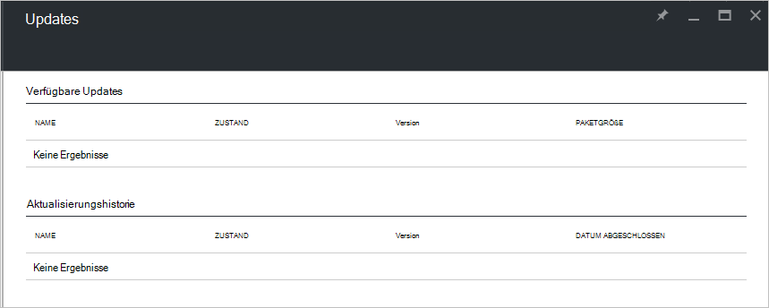

<properties
    pageTitle="Updates in Azure Stapel | Microsoft Azure"
    description="Erfahren Sie mehr über Updates in Azure Stapel"
    services="azure-stack"
    documentationCenter=""
    authors="HeathL17"
    manager="byronr"
    editor=""/>

<tags
    ms.service="azure-stack"
    ms.workload="na"
    ms.tgt_pltfrm="na"
    ms.devlang="na"
    ms.topic="article"
    ms.date="09/26/2016"
    ms.author="Helaw"/>

# Verwaltung von Updates in Azure Stapel
Technical Preview 2 führt eine Vorschau der Erfahrung von Azure Stapel Sicherheitsupdates.  In diesem Thema navigieren Sie zu dem Knoten Updates.  

## Updates blade
1.  Updates Blade, klicken auf **Durchsuchen,** und klicken Sie dann auf **Updates**.

2.  Klicken Sie auf den **lokalen** Speicherort.

3.  Sie eine Liste der verfügbaren Updates angezeigt und Verlauf aktualisieren.  Im Technical Preview 2 werden keine Updates für die Installation verfügbar.  

    

## Nächste Schritte
- [Kennen Sie Azure Stack POC-Architektur](azure-stack-architecture.md)      
- [Bereitstellung erforderlicher Komponenten verstehen](azure-stack-deploy.md)
- [Bereitstellen von Azure Stapel](azure-stack-run-powershell-script.md)
 
    
  

  

