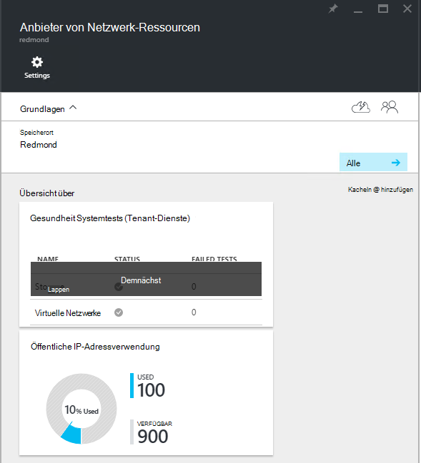
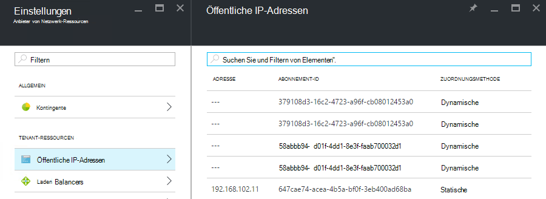

<properties
    pageTitle="Anzeigen von öffentlichen IP-Adressraums in TP2 | Microsoft Azure"
    description="Administratoren können den Verbrauch von öffentlichen IP-Adressen in einem Bereich anzeigen."
    services="azure-stack"
    documentationCenter=""
    authors="ScottNapolitan"
    manager="darmour"
    editor=""/>

<tags
    ms.service="azure-stack"
    ms.workload="na"
    ms.tgt_pltfrm="na"
    ms.devlang="na"
    ms.topic="get-started-article"
    ms.date="09/26/2016"
    ms.author="scottnap"/>

# Öffentliche IP-Adressraums in Azure Stapel TP2 anzeigen

Als Administrator Service die Anzahl öffentlicher IP-Adressen angezeigt, die an Mieter Anzahl öffentlicher IP-Adressen für die Zuweisung verfügbar und der Prozentsatz der öffentlichen IP-Adressen, die an diesem Standort zugewiesen zugewiesen wurden.

Kachel **Verwendung öffentlicher IP-Adresse** zeigt die Gesamtzahl der öffentlichen IP-Adressen, die über alle öffentlichen IP-Adresspools auf dem Stoff verbraucht, ob sie verwendet wurden Mieter IaaS VM Instanzen Fabric-Infrastruktur-Services oder öffentlichen IP-Adressressourcen, die von Mietern explizit erstellt wurden.

Der Kacheln soll Azure Stapel Administratoren die Anzahl öffentlicher IP-Adressen geben, die an diesem Speicherort verwendet. Dies hilft Administratoren bestimmen, ob sie diese Ressource knapp werden.

Auf dem Blatt **Einstellungen** Listet das **Öffentliche IP-Adressen** Menüelement **Mieter Ressourcen** nur die öffentlichen IP-Adressen, die *von Mietern explizit erstellt*wurden. So die Anzahl der nebeneinander öffentliche IP-Adressen für die **Verwendung öffentlicher IP-Adresse** **verwendet** unterscheidet immer (größer als) die Anzahl **Öffentlicher IP-Adressen** Kachel unter **Mieter Ressourcen**.

## Die öffentliche IP-Adresse-Verwendungsinformationen anzeigen

Die Gesamtzahl der öffentlichen IP-Adressen anzeigen, die in der Region genutzt:

1.  Klicken Sie im Portal Azure Stapel auf **Durchsuchen**und wählen Sie dann **Ressourcen**.

2.  Wählen Sie aus der Liste der **Ressourcen** **Netzwerk Ressource Anbieter Admin**.

3.  Sie können auch **Durchsuchen klicken | Speicherorte** und wählen Sie den Speicherort aus der Liste anzeigen möchten. Wählen Sie auf der Kachel **Ressourcenprovider** **Ressource Anbieter Netzwerkadministrator**.

4.  **Ressource Netzwerkanbieter** Zielseite Blade zeigt Kachel **Verwendung öffentlicher IP-Adresse** im Abschnitt " **Übersicht** ".

Denken Sie daran, die die **verwendet** gibt die Anzahl von öffentlichen IP-alle öffentlichen IP-Adressen Pools an diesem Speicherort beziehen, die zugeordnet sind. Die **Verfügbare** gibt die Anzahl von öffentlichen IP-alle öffentlichen IP-Adressen Adresse Pools, die nicht zugeordnet und sind weiterhin verfügbar. Die **% verwendet** gibt die Anzahl der verwendeten oder zugewiesenen Adressen als Prozentsatz der Gesamtanzahl von öffentlichen IP-alle öffentlichen IP-Adressen Adresse Pools an diesem Speicherort.

## Adressen Sie die öffentliche IP-, die vom Pächter Abonnements erstellt wurden

Um öffentliche IP-Adressen aufgelistet, die vom Pächter Abonnements in einer bestimmten Region explizit erstellt wurden, Gehe zu Blatt **Einstellungen** **Netzwerkadministrator Ressource-Anbieter**, und wählen Sie **Öffentliche IP-Adressen**.

Sie können feststellen, dass einige öffentlichen IP-Adressen, die dynamisch zugewiesen werden in der Liste eine Adresse zugeordnet noch nicht haben. Ist die Adressenressource Ressourcenanbieter Netzwerk jedoch nicht im Netzwerk-Controller noch erstellt wurde.

Netzwerk-Controller weist keine Adresse für diese Ressource, bis es tatsächlich an eine Schnittstelle, eine Netzwerkkarte (NIC), ein Lastenausgleich oder ein virtuelles Netzwerk-Gateway gebunden ist. Wenn die öffentliche IP-Adresse an eine Schnittstelle gebunden ist, Netzwerk-Controller weist es eine IP-Adresse und im Feld **Adresse** angezeigt.

## Dient zum Anzeigen der öffentlichen IP-Adresse Informationen Zusammenfassung

Es gibt eine Anzahl von anderen Fällen in der öffentliche IP-Adressen zugewiesen werden, die bestimmen, ob die Adresse in einer Liste oder einer anderen angezeigt wird.

| **Öffentliche IP-Adresse Zuweisung Fall** | **Zusammenfassung der Verwendung angezeigt** | **Wird in öffentlichen IP-Adressliste Mieter** |
| ------------------------------------- | ----------------------------| ---------------------------------------------- |
| Dynamische öffentliche IP-Adresse noch nicht, eine Netzwerkkarte oder Load Balancer (temporäre) | Nein | Ja |
| Dynamische öffentliche zugewiesene IP-Adresse einer Netzwerkkarte oder Load Balancer. | Ja | Ja |
| Statische öffentliche zugewiesene IP-Adresse ein Mieter NIC oder Load Balancer. | Ja | Ja |
| Statische öffentliche zugewiesene IP-Adresse Endpunkt eine Fabric-Infrastruktur. | Ja | Nein |
| Öffentliche IP-Adresse für IaaS VM Instanzen erstellt implizit und für ausgehende NAT auf das virtuelle Netzwerk verwendet. Diese werden im Hintergrund erstellt, wenn ein Mieter eine VM-Instanz erstellt, sodass VMs Informationen an das Internet senden können. | Ja | Nein |
