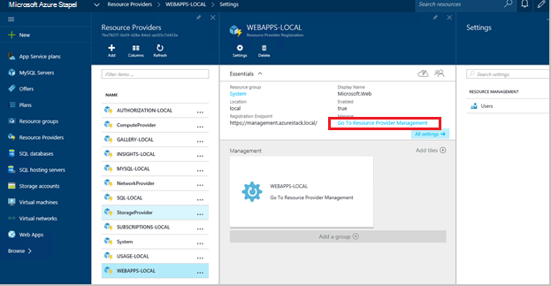
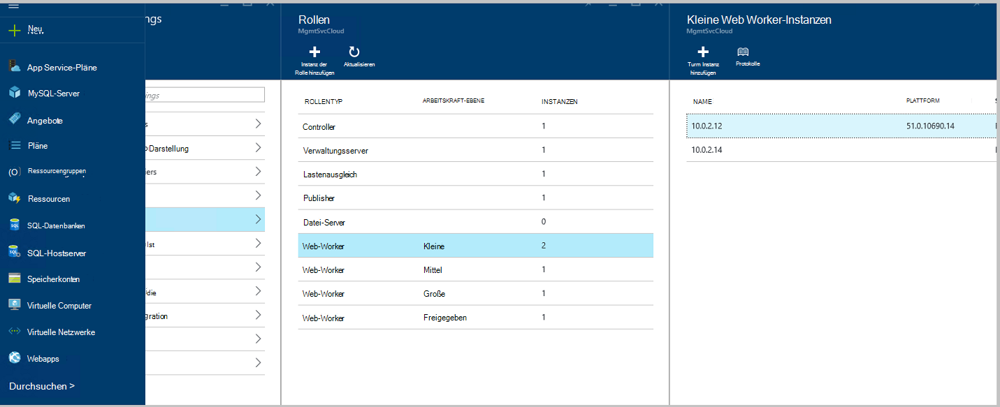
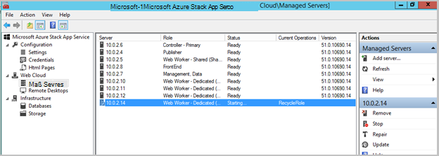
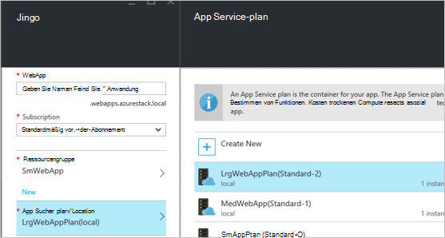
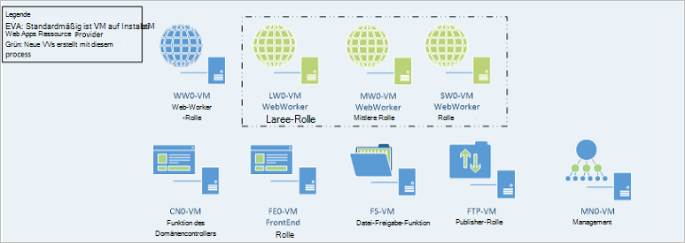

<properties
    pageTitle="Webapps mehr Web Worker-Rollen | Microsoft Azure"
    description="Detaillierte Hinweise zur Skalierung von Azure Stapel Web App"
    services="azure-stack"
    documentationCenter=""
    authors="kathm"
    manager="slinehan"
    editor=""/>

<tags
    ms.service="azure-stack"
    ms.workload="app-service"
    ms.tgt_pltfrm="na"
    ms.devlang="na"
    ms.topic="article"
    ms.date="09/26/2016"
    ms.author="kathm"/>

#   <a name="web-apps-adding-more-web-worker-roles"></a>Web Apps: Weitere Web Worker-Rollen hinzufügen

> [AZURE.NOTE] Folgendes gilt nur für Azure Stapel TP1 Bereitstellungen.

Dieses Dokument enthält Informationen zum Skalieren von Web Apps Web Worker-Rollen. Es enthält Schritte zum Erstellen von zusätzlichen Web Workerthreads um Web apps Angebote jeder Größe zu unterstützen.

Azure Stapel unterstützt frei und freigegebenen Web app. Um andere hinzuzufügen, müssen Sie weitere Web Worker-Rollen hinzufügen.

Wenn Sie nicht sicher sind, was bei der Standardinstallation Web Apps bereitgestellt wurde, überprüfen Sie zusätzliche Informationen [hier](azure-stack-webapps-overview.md).

Die folgenden Schritte müssen Skalierung Web Worker-Rollen:

1.  [Erstellen Sie einen neuen virtuellen Computer](#step-1-create-a-new-vm-to-support-the-new-instance-size)

2.  [Konfigurieren der virtuellen Computer](#step-2-configure-the-virtual-machine)

3.  [Konfigurieren Sie Web-Worker-Rolle in Azure Stapel portal](#step-3-configure-the-web-worker-role-in-the-azure-stack-portal)

4.  [App Service-Pläne konfigurieren](#step-4-configure-app-service-plans)

##<a name="step-1-create-a-new-vm-to-support-the-new-instance-size"></a>Schritt 1: Erstellen einer neuen VM zur Unterstützung der neuen Größe

Erstellen Sie einen virtuellen Computer gemäß [diesem Artikel](azure-stack-provision-vm.md), dass folgende Auswahl getroffen werden:

 - Benutzername und Kennwort: Geben Sie Benutzernamen und Kennwort bei der Installation von Web Apps.

 - Abonnement: Verwenden Sie das Standardabonnement Anbieter.

 - Gruppe: Wählen Sie **Lokale AppService**.

> [AZURE.NOTE]Speichern Sie die virtuellen Computer für Workerthreads in derselben Ressourcengruppe wie Web Apps Anwendung bereitgestellt wird. (Empfohlen für diese Version).

##<a name="step-2-configure-the-virtual-machine"></a>Schritt 2: Konfigurieren der virtuellen Computer

Nach Abschluss die Bereitstellung muss die folgende Konfiguration unterstützt Web Worker-Rolle:

1.  Öffnen Sie Server-Manager auf dem Hostcomputer, und klicken Sie auf **Extras** &gt; **Hyper-v-Manager**.

2.  Verbinden Sie über Remote Desktop Protocol (RDP) auf den neuen virtuellen Computer, den Sie in Schritt 1 erstellt haben. Der Name des Servers liegt in der Zusammenfassung jede VM ausgewählt ist.

3.  Öffnen Sie PowerShell durch Klicken auf die Schaltfläche **Start** und PowerShell eingeben. **PowerShell.exe**Maustaste, und wählen Sie PowerShell im Administratormodus öffnen **als Administrator ausführen** .

4.  Kopieren und fügen Sie jeder der folgenden Befehle (einzeln) in PowerShell-Fenster und drücken Sie eingeben:

    ```netsh advfirewall firewall set rule group="File and Printer Sharing" new enable=Yes```
    ```netsh advfirewall firewall set rule group="Windows Management Instrumentation (WMI)" new enable=yes```
    ```reg add HKLM\\SOFTWARE\\Microsoft\\Windows\\CurrentVersion\\Policies\\system /v LocalAccountTokenFilterPolicy /t REG\_DWORD /d 1 /f```

5.  Starten Sie den virtuellen Computer neu.

> [AZURE.NOTE]Hinweis: Diese sind Mindestanforderungen für Web Apps. Die Standardeinstellungen von Windows 2012 R2 Bild mit Azure enthalten sind. Die Informationen wurden zur zukünftigen Referenz und für die ein anderes Bild bereitgestellt.

##<a name="step-3-configure-the-web-worker-role-in-the-azure-stack-portal"></a>Schritt 3: Konfigurieren der Web-Worker-Rolle in Azure Stack-portal

1.  Öffnen Sie das Portal als Dienstadministrator **ClientVM**.

2.  Navigieren Sie zu **Ressourcen** &gt; **Lokale WEBAPPS**.

    
 
3.  Klicken Sie auf **Anbieter Ressourcenmanagement**.

4.  Klicken Sie auf **Rollen**.

    
 
5.  Klicken Sie auf die **Instanz der Rolle hinzufügen**.

6.  Klicken Sie auf der **Ebene** die neue Instanz (klein, Mittel, Groß oder freigegebene) bereitstellen möchten.

    
 
7.  Konfigurieren Sie Folgendes:
 - ServerName: Geben Sie die IP-Adresse des Servers, den Sie weiter (Abschnitt 1) erstellt haben.
 - Typ der Datenbankrolle: Web Arbeitskraft.
 - Arbeitskraft-Stufe: Entspricht Stufe ausgewählten.

8. Klicken Sie auf **OK.**

9. Melden Sie sich bei CN0 VM und **Web Cloud Management MMC**öffnen.

10. Navigieren Sie zum **Web Cloud** &gt; **auf verwalteten Servern**.

11. Klicken Sie auf den Servernamen, den Sie gerade bereitgestellt. Überprüfen Sie die Statusspalte, und warten Sie mit dem nächsten Schritt verschieben, bis der Status "Bereit" ist.

    

##<a name="step-4-configure-app-service-plans"></a>Schritt 4: Konfigurieren von app Service-Pläne

> [AZURE.NOTE]In der aktuellen Version der Web-Apps müssen in separaten Ressourcengruppen Servicepläne app gespeichert werden. Erstellen Sie eine Ressourcengruppe für jede Größe des WebApp und platzieren Sie Pläne Anwendung in ihre entsprechenden Ressourcengruppen.

1.  Melden Sie Portal auf der ClientVM an.

2.  Navigieren Sie zum **neuen** &gt; **Web und Mobile**.

3.  Wählen Sie die Webanwendung bereitstellen möchten.

4.  Die Informationen für die Webanwendung, und wählen Sie **AppService Plan / Standort**.

-   Klicken Sie auf **neu erstellen**.

-   Erstellen Sie den neuen Plan entsprechenden Tarif für den Plan auswählen.

> [AZURE.NOTE]Sie können mehrere Pläne auf diesem Blatt erstellen. Vor der Bereitstellung, jedoch sicherstellen Sie, dass den entsprechenden Plan ausgewählt haben.

Die folgenden zeigt ein Beispiel für mehrere Pläne zur Verfügung:    

##<a name="final-web-app-service-vm-configuration"></a>Letzte Web App Service VM-Konfiguration

Das Bild stellt eine Ansicht der Umgebung nach Arbeitskraft Webrollen skaliert haben. Die grüne Elemente repräsentieren neue Rolle hinzufügen.
    
