<properties
     pageTitle="Ein Azure Supportanfrage erstellen | Microsoft Azure"
     description="Ein Azure Supportanfrage erstellen"
     services="Azure Supportability"
     documentationCenter=""
     authors="ganganarayanan"
     manager="scotthit"
     editor=""/>

<tags
     ms.service="azure-supportability"
     ms.workload="na"
     ms.tgt_pltfrm="na"
     ms.devlang="na"
     ms.topic="article"
     ms.date="10/25/2016"
     ms.author="gangan"/>

# Ein Azure Supportanfrage erstellen

## Zusammenfassung
Azure-Kunden erstellen und Verwalten von Support-Anfragen in Azure-Portal [https://portal.azure.com](https://portal.azure.com).
>[AZURE.NOTE] Azure-Portal für Deutschland ist [https://portal.microsoftazure.de](https://portal.microsoftazure.de) und Azure Government Portal ist es [https://portal.azure.us](https://portal.azure.us).

Grundlage des Kundenfeedbacks haben wir Anforderung Supports auf drei Hauptziele aktualisiert:

- **Optimiertes**: Reduzierung Klicks und Blades vereinfachen den Prozess Unterstützung beantragen.
- **Integriert**: bei der Behandlung eines Problems mit einer Azure wird einfach eine Anfrage für diese Ressource ohne Kontext geöffnet.
- **Effizient**: wichtige Informationen Ihr Supportbetreuer effizient behoben werden müssen.

## Erste Schritte
Sie können eine Anfrage Menü oben oder direkt von einem Blade Ressource erstellen.

**In der oberen Navigationsleiste**

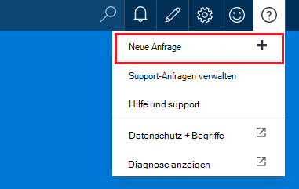

**Ressource-Blatt**

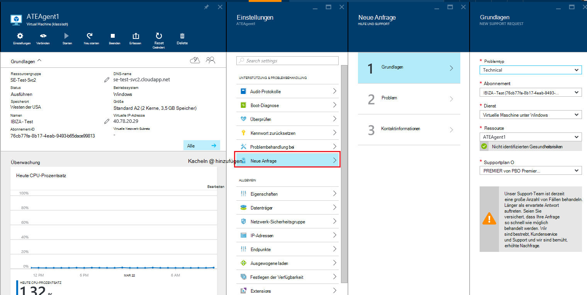

## Grundlagen
Zunächst Anforderungsprozess Support sammelt grundlegende Informationen über das Problem und Ihr Support-Plan.

Ein Beispiel: ein Netzwerkkonnektivitätsproblem verdächtige und stehen technische Probleme mit dem virtuellen Computer.
Auswählen des Dienstes ("Virtual Machine unter Windows") und die Ressource (der Name des virtuellen Computers) im ersten Schritt des Assistenten startet die Hilfe für dieses Problem.

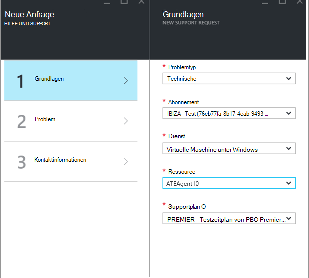

>[AZURE.NOTE] Azure bietet unbegrenzte Unterstützung für Abonnementmanagement (z. B. Rechnung Kontingent Korrekturen und Konto übertragen). Für technischen Support benötigen Sie einen. [Erfahren Sie mehr über Support-Pläne](https://azure.microsoft.com/support/plans).

## Problem
Im zweiten Schritt des Assistenten werden zusätzliche Details zum Problem gesammelt. Genaue Angaben in diesem Schritt ermöglicht Ihrem Fall am besten Supportmitarbeiter das Problem weiterleiten und Diagnose des Problems so bald wie möglich.

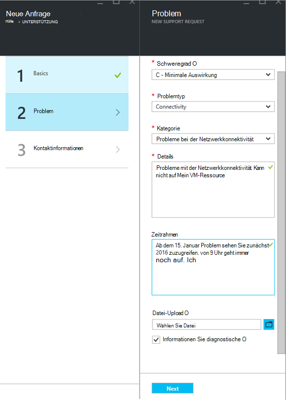

Der virtuellen Verbindung Beispiel oben würde füllen Sie dieses Formular an einem Problem mit der Netzwerkkonnektivität und böte Einzelheiten darüber, wie die ungefähre Uhrzeit, wann das Problem aufgetreten ist.

## Zugehörige
Für einige Probleme bieten wir Links zu zugehörigen Hilfethemen zur Behebung des Problems. Die empfohlene Dokumente nicht helfen, können Sie durch den Prozess zum Erstellen einer Anfrage fortsetzen.
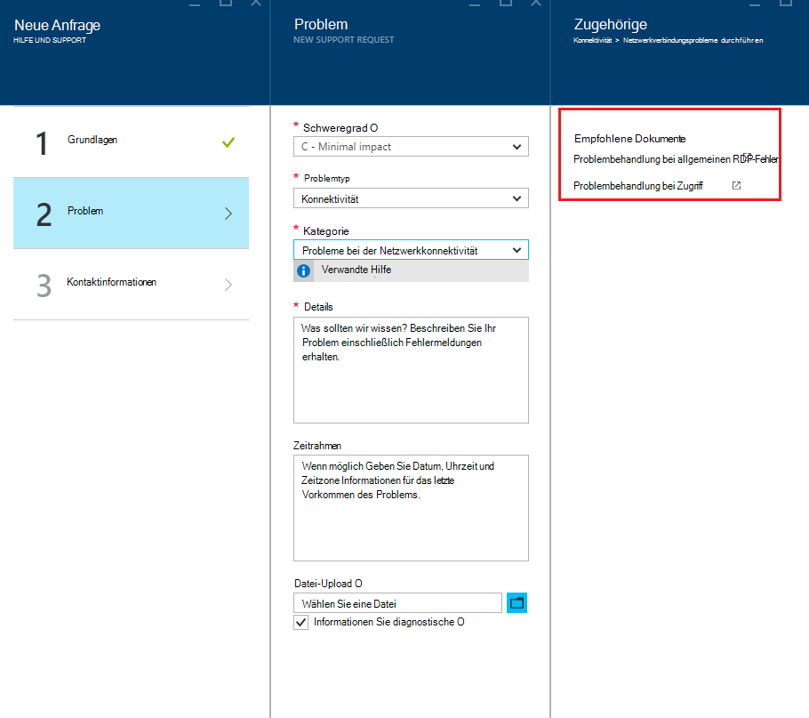

## Kontaktinformationen
Im letzten Schritt des Assistenten bestätigt Ihre Kontaktinformationen, damit wir Sie erreichen können.
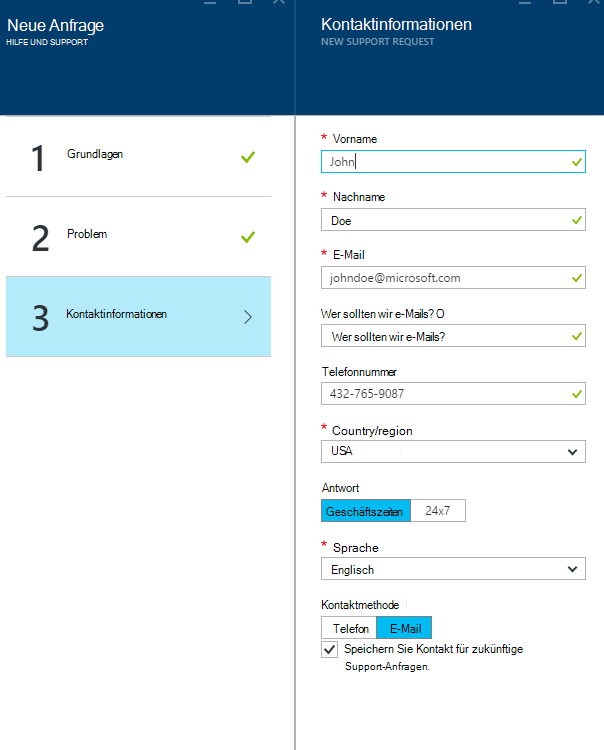

Je nach Schweregrad des Problems können Sie aufgefordert, anzugeben, ob Sie möchten während der Geschäftszeiten oder möchten Sie eine Antwort 24 x 7, d. h. Ihre Kontaktinformationen jederzeit kontaktieren.
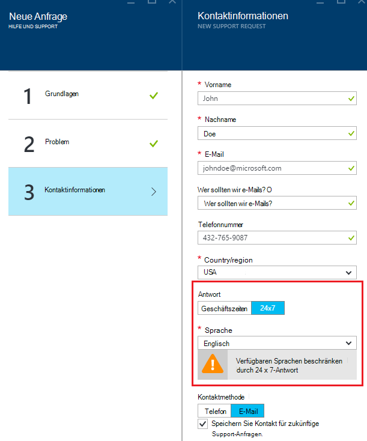

## Support-Anfragen verwalten
Nach dem Erstellen der Anfrage sehen Sie die Details auf der **Support-Anfragen verwalten** .

**In der oberen Navigationsleiste**

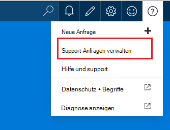

Auf der Seite **Verwalten von Support-Anfragen** können Sie alle Anfragen und deren Status anzeigen.
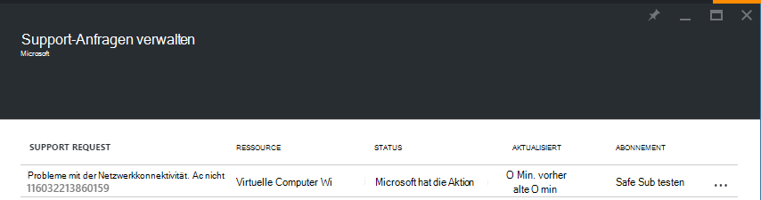

Wählen Sie Support-Anfrage an Angaben, Schweregrad und die erwartete Zeit für ein Supporttechniker reagiert wird.
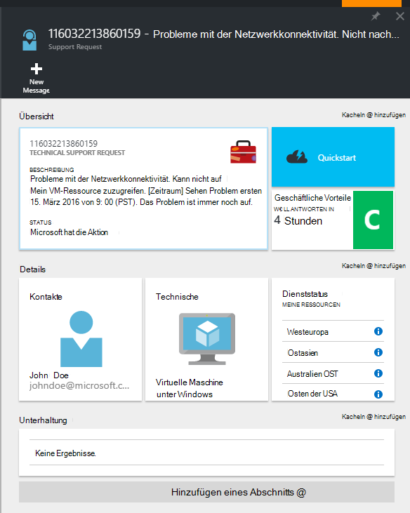

Klicken Sie auf die Kachel **geschäftlichen** , Schweregrad der Anforderung ändern. Im vorhergehenden Beispiel ist die Anforderung Schweregrad c festgelegt

Auf der Kachel wird eine Liste der Schweregrade, die einer offenen Anfrage zuweisen können.

>[AZURE.NOTE] Der maximale Schweregrad hängt Ihr Support-Plan. [Erfahren Sie mehr über Support-Pläne](https://azure.microsoft.com/support/plans).

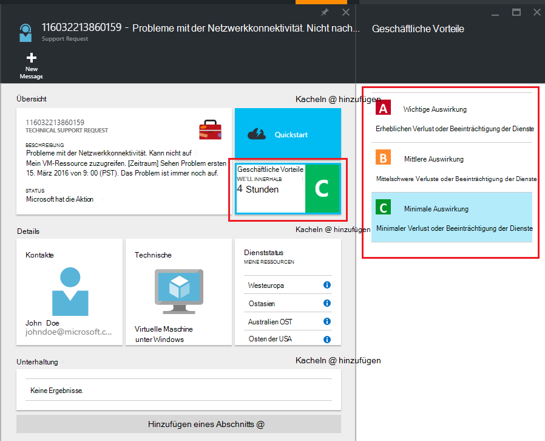

## Feedback
Wir sind immer auf Feedback und Vorschläge. Senden Sie uns Ihre [Vorschläge](https://feedback.azure.com/forums/266794-support-feedback). Darüber hinaus können Sie mit uns über [Twitter](https://twitter.com/azuresupport) oder [MSDN-Foren](https://social.msdn.microsoft.com/Forums/azure)teilnehmen.

## Weitere Informationen
[Azure-Support-FAQ](https://azure.microsoft.com/support/faq)
