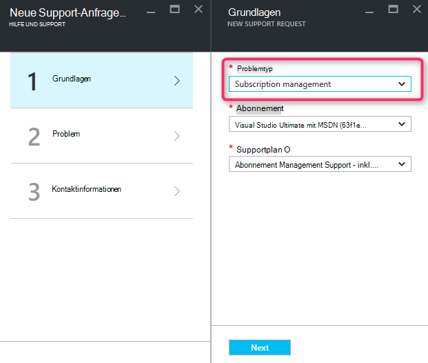
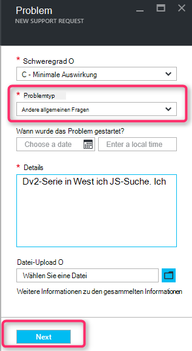
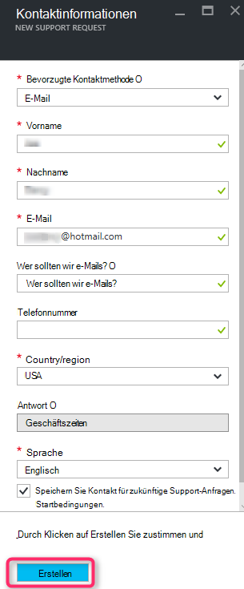

<properties
     pageTitle="SKU-Serie nicht verfügbar | Microsoft Azure"
     description="Einige SKU-Reihe sind für das ausgewählte Abonnement für diese Region nicht verfügbar."
     services="Azure Supportability"
     documentationCenter=""
     authors="ganganarayanan"
     manager="scotthit"
     editor=""/>

<tags
     ms.service="azure-supportability"
     ms.workload="na"
     ms.tgt_pltfrm="na"
     ms.devlang="na"
     ms.topic="article"
     ms.date="08/12/2016"
     ms.author="gangan"/>

# SKU-Serie nicht verfügbar

In einigen Regionen stehen bestimmte SKUs nicht automatisch auf neue Abonnements.  Dies kann auftreten, wenn [leistungsfähigere SKUs in einer Region eingeführt](https://azure.microsoft.com/updates/announcing-new-dv2-series-virtual-machine-size/) und Verbreitung der Legacy SKU ablehnt.
Die Meldung "*einige SKU werden für das ausgewählte Abonnement für diese Region nicht verfügbar*" wird angezeigt, wenn eine Supportanfrage Compute Core Kontingent zu erstellen.

Sie können Lagerhaltungsdaten Verfügbarkeit der [Azure-Region](https://azure.microsoft.com/regions/#services) Seite überprüfen. 

Um Zugriff auf eine SKU anfordern, der aus dem Abonnement gesperrt, erstellen Sie eine "Abonnementmanagement" Supportanfrage.

- Wählen Sie auf der Seite Grundlagen Problem als"Abonnement", und klicken Sie auf "Weiter".

- Wählen Sie auf der Seite Problem Problem als "Allgemeinen Fragen" und geben Sie den genauen Bereich und SKU nicht sehen.
Dadurch Unterstützung zu beschleunigen.

- Geben Sie auf der Seite Kontakt Ihre Kontaktadresse ein, und klicken Sie auf "Erstellen".

## Feedback
Wir sind immer auf Feedback und Vorschläge. Senden Sie uns Ihre [Vorschläge](https://feedback.azure.com/forums/266794-support-feedback). Darüber hinaus können Sie mit uns über [Twitter](https://twitter.com/azuresupport) oder [MSDN-Foren](https://social.msdn.microsoft.com/Forums/azure)teilnehmen.

## Weitere Informationen
[Azure-Support-FAQ](https://azure.microsoft.com/support/faq)
