<properties
    pageTitle="Wiederherstellen von Daten von einem anderen DPM-Server im backup-Tresor | Microsoft Azure"
    description="Wiederherstellen von Daten in ein Depot Azure Backup von jedem DPM-Server registriert dieses Depot geschützt haben."
    services="backup"
    documentationCenter=""
    authors="nkolli1"
    manager="shreeshd"
    editor=""/>

<tags
    ms.service="backup"
    ms.workload="storage-backup-recovery"
    ms.tgt_pltfrm="na"
    ms.devlang="na"
    ms.topic="article"
    ms.date="08/08/2016"
    ms.author="giridham;jimpark;trinadhk;markgal"/>

# Wiederherstellen von Daten von einem anderen DPM-Server im backup-Tresor
Sie können nun die Daten wiederherstellen, die Sie eine Azure Backup-Tresor registriert dieses Depot alle DPM-Server geschützt haben. Gehen so vollständig in der DPM-Verwaltungskonsole integriert und Recovery Workflows ähnelt.

Zum Wiederherstellen von Daten von einem anderen DPM-Server im backup-Tresor benötigen Sie [System Center Data Protection Manager UR7](https://support.microsoft.com/en-us/kb/3065246) und die [neuesten Azure Backup-Agent](http://aka.ms/azurebackup_agent).

## Wiederherstellen von Daten von einem anderen DPM-Server
Daten von einem anderen DPM-Server wiederherzustellen:

1. Registerkarte **Wiederherstellung** der DPM-Verwaltungskonsole klicken Sie auf **"externe DPM hinzufügen"** (am oberen linken Bildschirmrand).

    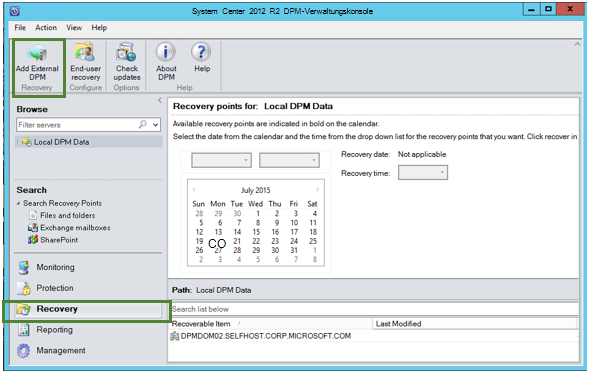

2. Herunterladen Sie neue **Vault-Anmeldeinformationen** aus dem Tresor des **DPM-Servers** , in dem die Daten wiederhergestellt werden, wählen Sie den DPM-Server aus der Liste der DPM-Server mit der backup erfasst und bieten Sie den DPM-Server, dessen Daten wiederhergestellt werden, zugeordnete **verschlüsselungspassphrase** .

    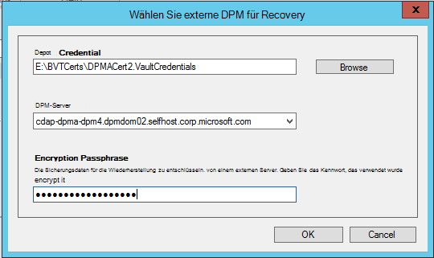

    >[AZURE.NOTE] Nur DPM-Server mit der gleichen Anmeldung zugeordnete können die Daten wiederherstellen.

    Sobald externe DPM-Server erfolgreich hinzugefügt wurde, können Sie die Daten von externen DPM-Server und lokale DPM-Servers die Registerkarte **Wiederherstellen** suchen.

3. Suchen der Liste der Produktions-Server durch externe DPM-Server geschützt und die Datenquelle auswählen.

    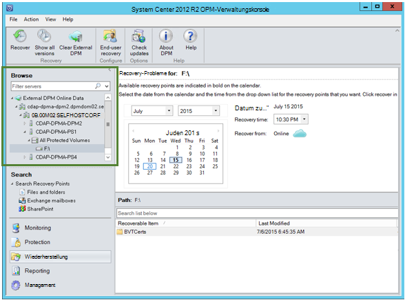

4. Wählen Sie **den Monat und das Jahr** von **Wiederherstellungspunkten** Dropdown-Liste, wählen Sie das gewünschte **Recovery Datum** der Erstellung des Wiederherstellungspunkts und **Wiederherstellungszeit**.

    Eine Liste von Dateien und Ordnern wird im unteren Bereich angezeigt, durchsucht und an einen beliebigen Speicherort wiederhergestellt werden kann.

    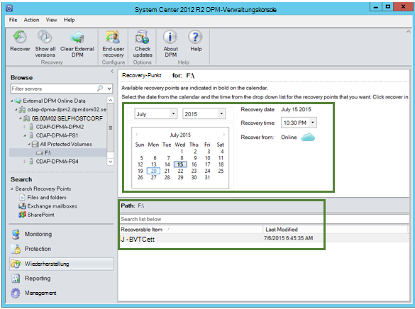

5. Klicken Sie rechts auf das entsprechende Element, und klicken Sie auf **Wiederherstellen**.

    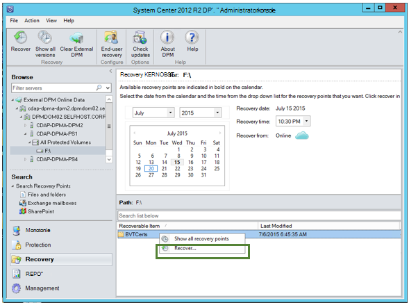

6. Überprüfen Sie die **Auswahl wiederherstellen**. Überprüfen Sie die Daten und Zeit der Sicherungskopie wiederhergestellt sowie die Quelle, aus der die Sicherungskopie erstellt wurde. Wenn die Auswahl nicht korrekt ist, klicken Sie auf Navigieren zu Recovery-Registerkarte entsprechenden Wiederherstellungspunkt auswählen **Abbrechen** . Wenn die Auswahl richtig ist, klicken Sie auf **Weiter**.

    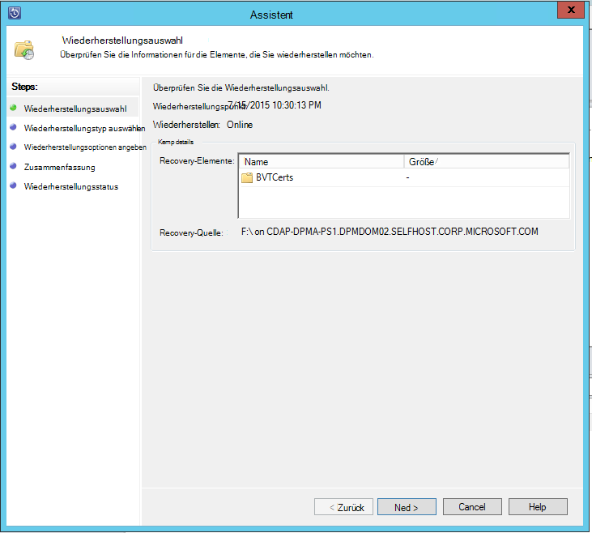

7. Wählen Sie **an einem alternativen Speicherort wiederherstellen**. **Wechseln Sie** an den richtigen Speicherort für die Wiederherstellung.

    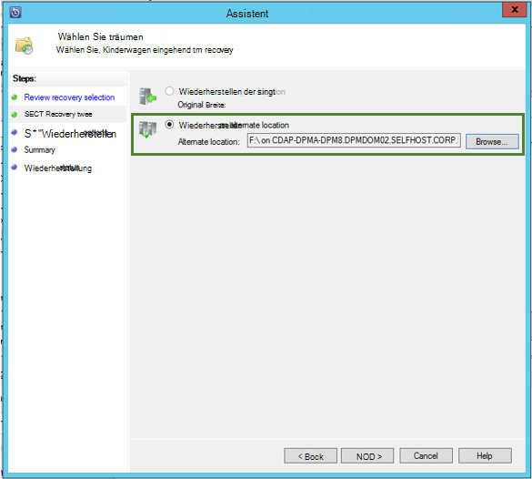

8. Wählen Sie die Option **Kopie erstellen**, **Überspringen**oder **Überschreiben**beziehen.
    - **Kopie erstellen** erstellt eine Kopie der Datei bei einem Namenskonflikt.
    - **Überspringen** überspringt die Datei bei einem Namenskonflikt wiederherstellen.
    - **Überschreiben** überschreibt das vorhandene kopieren bei einem Namenskonflikt angegebenen Speicherort.

    Wählen Sie die entsprechende Option zur **Sicherheit wiederherstellen**. Anwenden der Sicherheitsvorlage des Zielcomputers, dem die Daten wiederhergestellt werden, oder die Sicherheitsrichtlinien Produkt für Waren der Wiederherstellungspunkt erstellt wurde.

    Ermitteln Sie, ob eine **Benachrichtigung** gesendet wird, sobald die Wiederherstellung erfolgreich abgeschlossen wurde.

    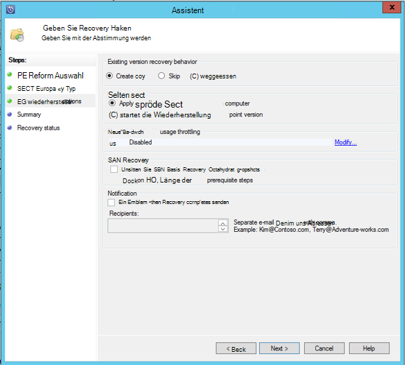

9. Der Bildschirm **Zusammenfassung** listet bisher ausgewählten Optionen. Sobald Sie auf **"Wiederherstellen"**klicken, werden die Daten an den entsprechenden lokalen Speicherort wiederhergestellt.

    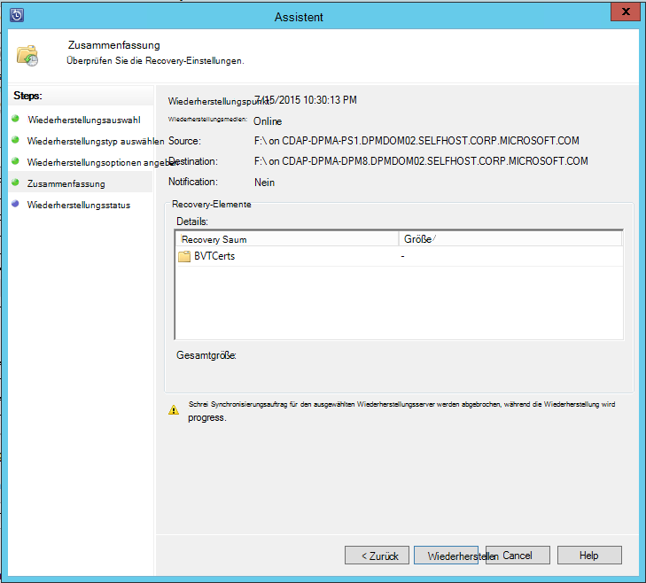

    >[AZURE.NOTE] Der Wiederherstellungsauftrag kann auf der Registerkarte **Überwachung** der DPM-Server überwacht werden.

    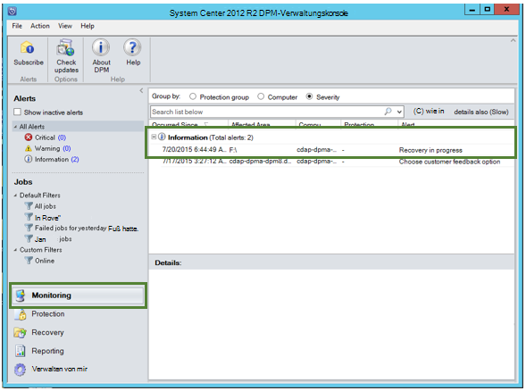

10. Sie können **Externe DPM deaktivieren** auf der Registerkarte **Wiederherstellen** des DPM-Servers zum Entfernen der Ansicht des externen DPM-Servers klicken.

    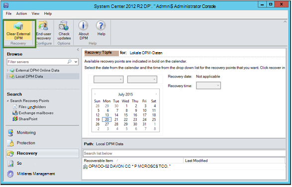

## Problembehandlung bei Fehlermeldungen
|Nein. |  Fehlermeldung | Schritte zur Fehlerbehebung |
| :-------------: |:-------------| :-----|
|1.|        Dieser Server ist nicht festgelegten Anmeldeinformationen Depot Depot registriert.|  **Ursache:** Dieser Fehler tritt nach die ausgewählten Depot Anmeldeinformationsdatei nicht gehört backup Depot die Wiederherstellung auf dem versucht DPM-Server zugeordnet.   **Lösung:** Downloaden Sie Depot Anmeldeinformationen aus dem backup Tresor mit dem DPM-Server registriert ist.|
|2.|        Wiederherstellbaren Daten ist nicht verfügbar oder des ausgewählten Servers keinem DPM-Server.|   **Ursache:** Gibt es keine anderen DPM-Server mit DPM 2012 R2 UR7 backup Depot registriert die DPM-Server mit DPM 2012 R2 UR7 wurden noch nicht hochgeladen Metadaten oder der ausgewählte Server ist kein DPM-Server (auch bekannt als Windows Server oder Windows-Client).   **Lösung:** Wenn andere DPM-Server backup Depot registriert sind, gewährleisten Sie SCDPM 2012 R2 UR7 und neueste Azure Backup Agent installiert.  Warten Sie andere DPM-Server backup Depot mit DPM 2012 R2 UR7 registriert sind, einen Tag nach der Installation von UR7 mit der Wiederherstellung beginnen. Nachtzeiten werden die Metadaten für alle zuvor geschützte Backups in cloud hochladen. Die Daten werden für die Wiederherstellung verfügbar.|
|3.|        Keine anderen DPM-Server ist für diesen Tresor registriert.|   **Ursache:** Es gibt keine anderen DPM-Server mit DPM 2012 R2 UR7 oder, die Depot registriert sind, aus denen die Wiederherstellung versucht wird. **Lösung:** Wenn andere DPM-Server backup Depot registriert sind, gewährleisten Sie SCDPM 2012 R2 UR7 und neueste Azure Backup Agent installiert. Warten Sie andere DPM-Server backup Depot mit DPM 2012 R2 UR7 registriert sind, einen Tag nach der Installation von UR7 mit der Wiederherstellung beginnen. Nachtzeiten werden die Metadaten für alle zuvor geschützte Backups in cloud hochladen. Die Daten werden für die Wiederherstellung verfügbar.|
|4.|        Die folgenden Server zugeordnete Passphrase entspricht nicht verschlüsselungspassphrase bereitgestellt:**<server name>**|  **Ursache:** Verschlüsselung Kennwort zur Verschlüsselung der Daten aus dem DPM-Server, der wiederhergestellt wird entspricht nicht die verschlüsselungspassphrase bereitgestellt. Der Agent kann die Daten entschlüsseln. Daher schlägt die Wiederherstellung. **Lösung:** Geben Sie genau dieselbe zugeordnete verschlüsselungspassphrase dem DPM-Server, dessen Daten wiederhergestellt werden.|

## Häufig gestellte Fragen:
1. **Warum hinzufügen kann nicht ich nach der Installation von UR7 und neueste Azure Backup-Agent einen externen DPM-Server von einem anderen DPM-Server?**

    (A) für die vorhandene DPM-Server mit Datenquellen, die in die Cloud (mithilfe eines Updaterollups vor Update Rollup 7) geschützt sind, müssen Sie warten Sie mindestens einen Tag nach der Installation der UR7 und neueste Azure Backup Agent *Hinzufügen externer DPM-Server*starten. Dies ist erforderlich, die Metadaten des DPM-Schutzgruppen in Azure hochladen. Dies geschieht erstmals durch einen Auftrag nachts.

2. **Was ist die Mindestversion des Azure Backup-Agent benötigt?**

    (A) Azure Backup Agent Aktivierung dieses Features ist, ist 2.0.8719.0.  Azure Backup Agentenversion kann durch Navigieren zur Systemsteuerungsoption überprüft **>** alle Systemsteuerungsobjekte **>** Programme und Funktionen **>** Microsoft Azure Services Wiederherstellungsagenten. Wenn die Version kleiner als 2.0.8719.0 ist, der [neuesten Azure Backup-Agent](https://go.microsoft.com/fwLink/?LinkID=288905) downloaden und installieren.

    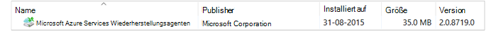

## Nächste Schritte:
• [Azure Backup FAQ](backup-azure-backup-faq.md)
