<properties
    pageTitle="Virtuelle Computer Wiederherstellung Azure-Portal wiederherstellen | Microsoft Azure"
    description="Wiederherstellen Sie Azure VM von Azure-Portal mit einem Wiederherstellungspunkt"
    services="backup"
    documentationCenter=""
    authors="markgalioto"
    manager="cfreeman"
    editor=""
    keywords="Sicherung; Das Wiederherstellen; Wiederherstellungspunkt;"/>

<tags
    ms.service="backup"
    ms.workload="storage-backup-recovery"
    ms.tgt_pltfrm="na"
    ms.devlang="na"
    ms.topic="article"
    ms.date="08/10/2016"
    ms.author="trinadhk; jimpark;"/>

# Verwenden Sie Azure-Portal, um virtuelle Computer wiederherstellen

> [AZURE.SELECTOR]
- [VMs im klassischen Portal wiederherstellen](backup-azure-restore-vms.md)
- [VMs in Azure-Portal wiederherstellen](backup-azure-arm-restore-vms.md)

Schützen Sie Ihre Daten durch Snapshots von Daten in festgelegten Intervallen. Diese Snapshots genannt Wiederherstellungspunkte und Recovery Services Depots in gespeichert sind. Wenn oder reparieren oder Wiederherstellen einer VM erforderlich ist, können Sie die VM aus den gespeicherten Wiederherstellungspunkten wiederherstellen. Beim Wiederherstellen eines Wiederherstellungspunkts zurückgegeben oder VM in den Zustand zurückgesetzt, wenn der Wiederherstellungspunkt erstellt wurde. Dieser Artikel erläutert eine VM wiederherstellen.

> [AZURE.NOTE] Azure hat zwei Bereitstellungsmodelle für erstellen und Verwenden von Ressourcen: [Ressourcen-Manager und Classic](../resource-manager-deployment-model.md). Dieser Artikel bietet Informationen und Verfahren für das Wiederherstellen von VMs mit dem Ressourcen-Manager-Modell bereitgestellt.

## Wiederherstellen eines Wiederherstellungspunkts

1. [Azure-Portal](http://portal.azure.com/) anmelden

2. Azure Menü klicken Sie auf **Durchsuchen** , und geben Sie in der Liste der Dienste **Recovery Services**. Die Liste der Dienste passt Sie eingeben. Wenn **Recovery Services Depots**angezeigt wird, wählen Sie es aus.

    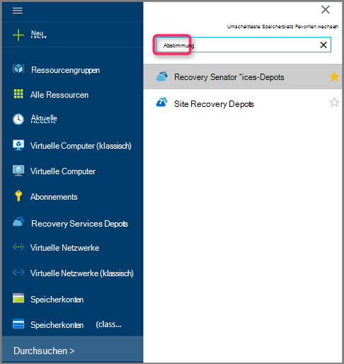

    Depots im Abonnement wird angezeigt.

    

3. Wählen Sie aus der Liste das Depot zugeordnete VM wiederherstellen möchten. Beim Klicken auf das Depot öffnet seine Dashboard.

    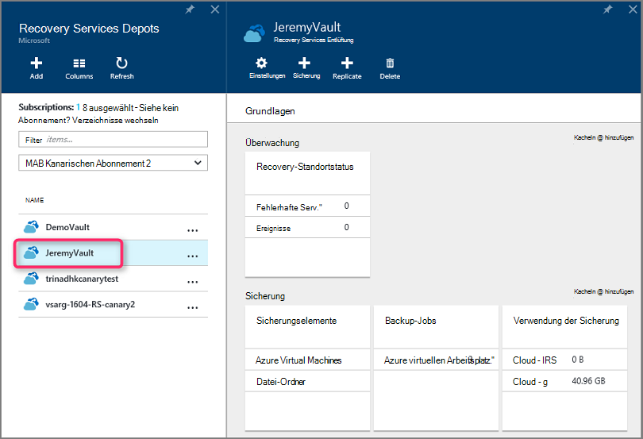

4. Jetzt, dass Sie im Vault-Dashboard. Die **Sicherung Elemente** nebeneinander, klicken Sie auf **Azure Virtual Machines** Tresor zugeordnete VMs anzuzeigen.

    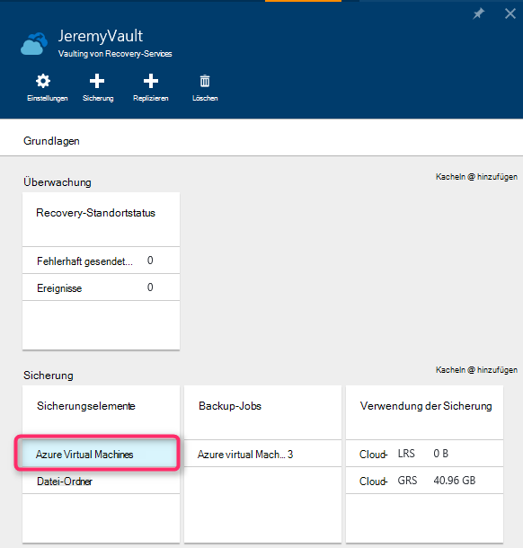

    **Sicherung Elemente** Blade wird geöffnet und zeigt die Liste der Azure virtuelle Computer.

    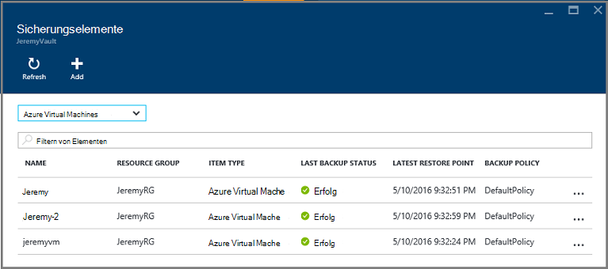

5. Wählen Sie aus der Liste eine VM auf dem Dashboard. Das VM-Schaltpult wird Überwachung Bereich Wiederherstellung Punkte Kachel enthält.

    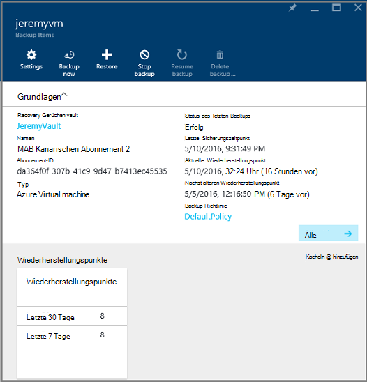

6. Klicken Sie im Schaltpult VM auf **Wiederherstellen**

    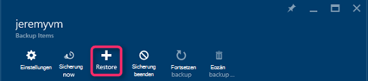

    Wiederherstellen-Blatt wird geöffnet.

    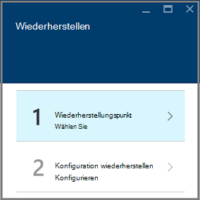

7. Klicken Sie auf Blade **Wiederherstellen** auf **Wiederherstellungspunkt** öffnen Blade **Wiederherstellungspunkt auswählen** .

    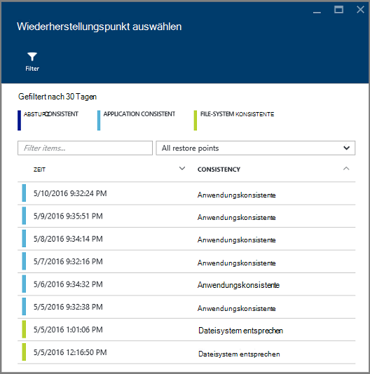

    Standardmäßig zeigt das Dialogfeld alle Wiederherstellungspunkte der letzten 30 Tage. Verwenden der **Filter** so ändern Sie den Zeitraum der Wiederherstellungspunkte angezeigt. Standardmäßig werden alle Konsistenz Wiederherstellungspunkte angezeigt. Ändern Sie **Alle Wiederherstellungspunkte** Filter wählen eine bestimmte Konsistenz Wiederherstellungspunkte. Weitere Informationen zu den einzelnen Wiederherstellung zeigen Sie, finden Sie im Kapitel [Datenkonsistenz](./backup-azure-vms-introduction.md#data-consistency).  
    - **Restore Point Konsistenz** aus dieser Liste auswählen:
        - Konsistente Wiederherstellungspunkte abstürzen,
        - Anwendung konsistente Wiederherstellungspunkte
        - Datei System konsistente Wiederherstellungspunkte
        - Alle Wiederherstellungspunkte.  

8. Wählen Sie einen Wiederherstellungspunkt aus, und klicken Sie auf **OK**.

    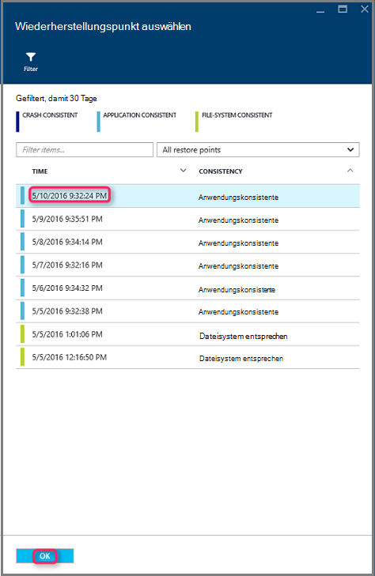

    Das Blade **Wiederherstellen** zeigt der Wiederherstellungspunkt ist.

    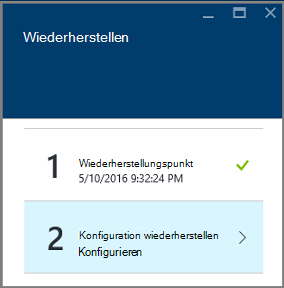

9. -Blade **Wiederherstellen** öffnet **Konfiguration wiederherstellen** nach dem Wiederherstellungspunkt festgelegt ist.

    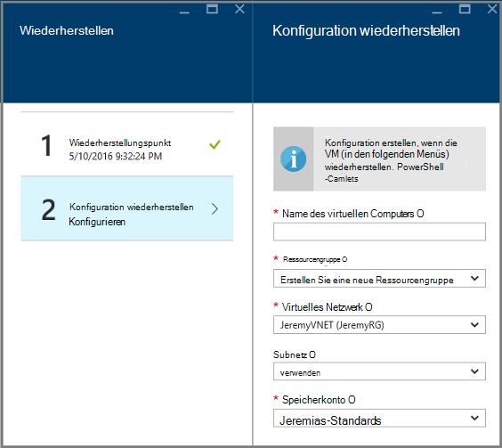

## Auswählen einer VM-Konfigurations wiederherstellen

Jetzt wählen Sie den Wiederherstellungspunkt ausgewählt haben, eine Konfiguration für die Wiederherstellung virtueller Computer. Konfiguration der wiederhergestellten VM Werte verwenden: Azure-Portal oder PowerShell.

> [AZURE.NOTE] Portal bietet eine Option Schnellerfassungsformular für wiederhergestellte VM. Wenn Sie die VM-Konfiguration von dem wiederhergestellten VM anpassen möchten, mithilfe von PowerShell wiederherstellen Datenträger gesichert und ordnen auf VM-Konfiguration. Finden Sie unter [Wiederherstellen einer VM mit speziellen Konfigurationen](#restoring-vms-with-special-network-configurations).

1. Wenn Sie nicht bereits vorhanden sind, fahren Sie das Blade **Wiederherstellen** . Stellen Sie sicher, einen **Wiederherstellungspunkt** ausgewählt wurde und auf Öffnen **Wiederherstellungskonfiguration** Blade **-Konfiguration wiederherstellen** .

    

2. Geben Sie auf Blade **-Konfiguration wiederherstellen** oder wählen Sie Werte für die folgenden Felder:
    - **Name der virtuellen Maschine** – Geben Sie einen Namen für den virtuellen Computer. Der Name muss der Ressourcengruppe (für eine VM Ressourcenmanager bereitgestellt) oder Cloud-Dienst (für eine klassische VM) eindeutig sein. Der virtuelle Computer kann nicht ersetzt werden, wenn sie das Abonnement vorhanden ist.
    - **Ressourcengruppe** - vorhandene Ressourcengruppe verwenden oder einen neuen erstellen. Wenn Sie eine klassische VM wiederherstellen, verwenden Sie dieses Feld an den Namen des neuen Cloud-Dienst. Wenn Sie erstellen einen neue Ressource Gruppe Cloud Service, muss der Name global eindeutig sein. In der Regel der Namen Cloud wird eine öffentliche URL - zugeordnet: [Cloudservice]. cloudapp.net. Wenn Sie versuchen, einen Namen für die Cloud Ressource Gruppe Cloud-Dienst verwenden, der bereits verwendet, weist Azure Ressource Gruppe Cloud-Dienst den gleichen Namen wie die VM. Azure zeigt Ressource Gruppen Cloud Services und VMs alle Gruppen zugeordnet. Weitere Informationen finden Sie unter [Migrieren von Gruppen mit einem regionalen virtuellen Netzwerk (VNet)](../virtual-network/virtual-networks-migrate-to-regional-vnet.md).
    - **Virtuelles Netzwerk** – wählen Sie das virtuelle Netzwerk (VNET) beim Erstellen der VM. Das Feld enthält alle VNETs, die dem Abonnement zugeordnet. Ressourcengruppe des virtuellen Computers wird in Klammern angezeigt.
    - **Subnet** - hat das VNET Subnetze, ist das erste Subnetz standardmäßig aktiviert. Sind weitere Subnetze, wählen Sie das gewünschte Subnet.
    - **Konto** – dieses Menü enthält Speicherkonten in demselben Speicherort wie das Depot Recovery Services. Bei ein Speicherkonto wählen Sie ein Konto, das am gleichen Speicherort wie das Depot Recovery Services teilt. Redundante Zone Speicherkonten werden nicht unterstützt. Sind keine Speicherkonten mit demselben Speicherort wie das Depot Recovery Services, legen Sie vor die Wiederherstellung starten. Das Speicherkonto Replikationstyp ist in Klammern aufgeführt.

    > [AZURE.NOTE] Wenn Sie einen Ressourcen-Manager bereitgestellte VM wiederherstellen, müssen Sie ein virtuelles Netzwerk (VNET) angeben. Ein virtuelles Netzwerk (VNET) ist eine klassische VM freigestellt.

3. Blade **-Konfiguration wiederherzustellen** klicken Sie auf **OK** zum Abschließen der Konfigurations wiederherstellen.

4. Klicken Sie auf das Blade **Wiederherstellen** **Wiederherstellen** Wiederherstellung ausgelöst.

    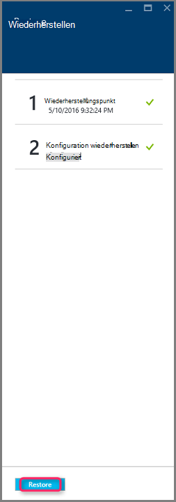

## Die Wiederherstellung überwachen

Nach die Wiederherstellungsoperation auslösen erstellt der Sicherungsdienst einen Auftrag für die Wiederherstellung überwachen. Der Sicherungsdienst auch erstellt und vorübergehend die Benachrichtigung im Benachrichtigungsbereich des Portals angezeigt. Wenn die Meldung nicht angezeigt wird, können Sie immer Benachrichtigungen Symbol um Benachrichtigungen anzeigen klicken.

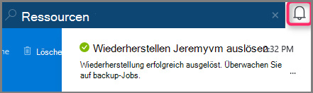

Für die Operation verarbeitet wird oder Fertigstellung anzeigen, Öffnen der Projektliste Backup.

1. Azure Menü klicken Sie auf **Durchsuchen** , und geben Sie in der Liste der Dienste **Recovery Services**. Die Liste der Dienste passt Sie eingeben. Wenn **Recovery Services Depots**angezeigt wird, wählen Sie es aus.

    

    Depots im Abonnement wird angezeigt.

    

2. Wählen Sie aus der Liste das Depot wiederhergestellten VM zugeordnet. Beim Klicken auf das Depot öffnet seine Dashboard.

3. Im Dashboard Depot **Backup-Jobs** nebeneinander, klicken Sie auf **Azure Virtual Machines** Tresor zugeordnete Einzelvorgänge angezeigt.

    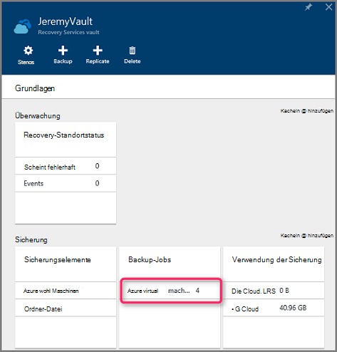

    **Backup-Jobs** Blade wird geöffnet und zeigt eine Liste der Aufträge.

    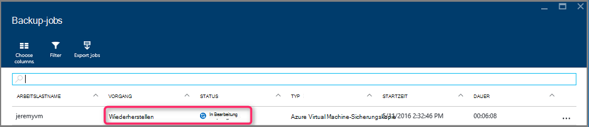

## Wiederherstellen virtueller Computer mit speziellen Konfigurationen
Es ist möglich, Sichern und Wiederherstellen von VMs mit folgenden besonderen Netzwerkkonfigurationen. Diese Konfigurationen erfordern jedoch einige besonderen Berücksichtigung der Wiederherstellungsvorgang durchlaufen.

- VMs unter Lastenausgleich (intern und extern)
- VMs mit mehreren reserviert
- Virtueller Computer mit mehreren Netzwerkkarten

>[AZURE.IMPORTANT] Beim Erstellen der besondere Netzwerkkonfiguration für VMs erforderlich PowerShell zu VMs von Festplatten wiederhergestellt.

Um die virtuellen Computer nach der Wiederherstellung auf der Festplatte vollständig zu erstellen, gehen Sie folgendermaßen vor:

1. Wiederherstellen Sie Datenträger von einem Recovery Services Depot mit [PowerShell](../backup-azure-vms-automation.md#restore-an-azure-vm)

2. Die VM-Konfiguration für Lastenausgleich erforderlich erstellen und mehrere NIC-mehrere reservierte IP-Adresse mit der PowerShell-Cmdlets verwenden die VM erstellen gewünschten Konfiguration.
    - Erstellen Sie virtueller Computer im Cloud-Dienst mit [internen Lastenausgleich](https://azure.microsoft.com/documentation/articles/load-balancer-internal-getstarted/)
    - VM [Lastenausgleich mit Internetzugriff] Verbindung erstellen (https://azure.microsoft.com/en-us/documentation/articles/load-balancer-internet-getstarted/)
    - Erstellen Sie virtueller Computer mit [mehreren Netzwerkkarten](https://azure.microsoft.com/documentation/articles/virtual-networks-multiple-nics/)
    - Erstellen Sie virtueller Computer mit [mehreren reserviert](https://azure.microsoft.com/documentation/articles/virtual-networks-reserved-public-ip/)

## Nächste Schritte
Nun, dass Sie Ihre virtuellen Computer wiederherstellen können, finden Sie Informationen im Artikel Problembehandlung auf Fehlermeldungen mit VMs. Überprüfen Sie auch den Artikel zum Verwalten von Aufgaben mit der VMs.

- [Problembehandlung bei Fehlern](backup-azure-vms-troubleshoot.md#restore)
- [Verwaltung virtueller Computer](backup-azure-manage-vms.md)
