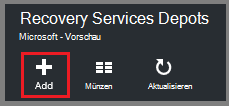
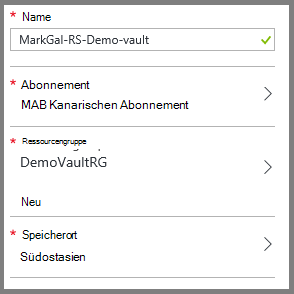
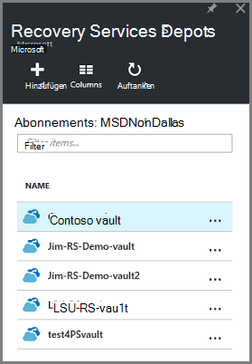
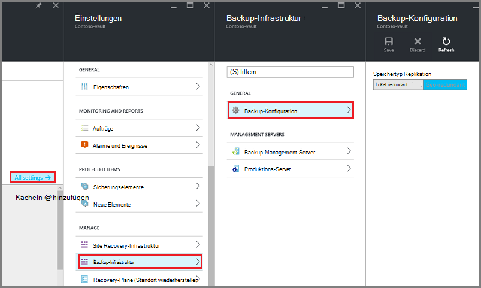
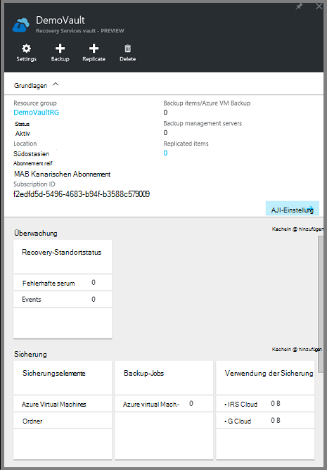
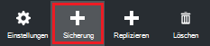
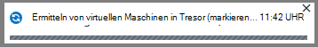
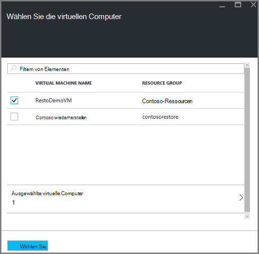
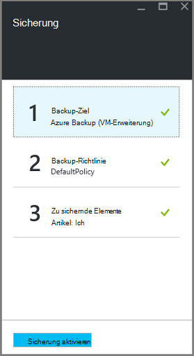

<properties
    pageTitle="Vorbereiten der Umgebung zum Ressourcen-Manager bereitgestellten virtuellen Computer sichern | Microsoft Azure"
    description="Stellen Sie sicher, dass Ihre Umgebung Sichern virtueller Computer in Azure vorbereitet"
    services="backup"
    documentationCenter=""
    authors="markgalioto"
    manager="cfreeman"
    editor=""
    keywords="Sicherung; Sichern;"/>

<tags
    ms.service="backup"
    ms.workload="storage-backup-recovery"
    ms.tgt_pltfrm="na"
    ms.devlang="na"
    ms.topic="article"
    ms.date="08/21/2016"
    ms.author="trinadhk; jimpark; markgal;"/>


# <a name="prepare-your-environment-to-back-up-resource-manager-deployed-virtual-machines"></a>Bereiten Sie Ihrer Umgebung Ressourcenmanager bereitgestellten virtuellen Computer sichern vor

> [AZURE.SELECTOR]
- [Ressourcen-Manager-Modell](backup-azure-arm-vms-prepare.md)
- [Klassisch](backup-azure-vms-prepare.md)

Dieser Artikel enthält die Schritte zum Vorbereiten Ihrer Umgebung einen Ressourcen-Manager bereitgestellten virtuellen Computer (VM) zurück. Die Schritte im Verfahren nutzen das Azure-Portal.  

Der Sicherungsdienst Azure hat zwei Arten von Depots (Sichern von Depots und Recovery Services Depots) zum Schutz Ihrer virtuellen Computer. Ein Depot backup schützt VMs mit klassischen Bereitstellungsmodell bereitgestellt. Ein Depot Recovery Services schützt **VMs Classic bereitgestellt oder Ressourcen-Manager bereitgestellt** . Ein Depot Recovery Services verwenden zu einer VM Resource Manager bereitgestellt.

>[AZURE.NOTE] Azure hat zwei Bereitstellungsmodelle für erstellen und Verwenden von Ressourcen: [Ressourcen-Manager und Classic](../resource-manager-deployment-model.md). Informationen zum Arbeiten mit klassischen Bereitstellungsmodell VMs finden Sie unter [Vorbereitung Ihrer Umgebung Azure virtuelle Computer sichern](backup-azure-vms-prepare.md) .

Schützen und einen Ressourcen-Manager bereitgestellten virtuellen Computer (VM) zurück, stellen Sie sicher, dass Folgendes vorhanden:

- Erstellen ein Depots Recovery Services (oder identifizieren Sie einen vorhandenen Recovery Services Depot) *in demselben Speicherort wie die VM*.
- Wählen Sie ein Szenario, definieren Sie die Sicherungsrichtlinie und definieren Sie Elemente zu.
- Überprüfen Sie die Installation des VM-Agent auf dem virtuellen Computer.
- Überprüfen der Netzwerkkonnektivität

Wenn Sie wissen, dass dies in Ihrer Umgebung vorhanden anschließend [Ihre VMs Artikel zurück](backup-azure-vms.md). Möchten Sie einrichten oder überprüfen diese erforderlichen Komponenten führt dieser Artikel Sie durch die Schritte zum Vorbereiten dieser Voraussetzung.


## <a name="limitations-when-backing-up-and-restoring-a-vm"></a>Nachteile beim Sichern und Wiederherstellen einer VM

Bevor Sie die Umgebung vorbereiten, verstehen Sie die Grenzen.

- Sichern virtueller Computer mit mehr als 16 Datenträger wird nicht unterstützt.
- Sichern virtueller Computer mit einer reservierten IP-Adresse und keine definierten Endpunkt wird nicht unterstützt.
- Sicherung der virtuelle Linux-Computer mit Andockfenster Erweiterung wird nicht unterstützt. 
- Backup-Daten enthalten nicht bereitgestellten Netzwerklaufwerke an VM. 
- Ersetzen von vorhandenen virtuellen Computer während der Wiederherstellung wird nicht unterstützt. Wenn Sie versuchen, den virtuellen Computer wiederherstellen, wenn die VM vorhanden ist, fehl die Wiederherstellung.
- Cross-Region Sicherung und Wiederherstellung wird nicht unterstützt.
- Virtuelle Computer in allen öffentlichen Bereichen des Azure sichern (siehe [Prüfliste](https://azure.microsoft.com/regions/#services) der unterstützten Regionen). Wenn die gewünschte Region heute nicht unterstützt wird, erscheint es nicht in der Dropdown-Liste im Depot erstellen.
- Sie können virtuelle Computer nur für ausgewählte Betriebssysteme sichern:
  - **Linux**: Azure Backup [eine Liste der Distributionen, die von Azure unterstützt,](../virtual-machines/virtual-machines-linux-endorsed-distros.md) Core Betriebssystem Linux unterstützt.  Andere in-Your-eigenen-Linux-Distributionen können solange der VM-Agent auf dem virtuellen Computer verfügbar ist auch Unterstützung für Python vorhanden ist.
  - **Windows Server**: Windows Server 2008 R2-Versionen werden nicht unterstützt.
- Wiederherstellen eines Domänencontrollers (DC)-VM, die Teil einer Multi-DC-Konfiguration ist nur durch PowerShell unterstützt. Weitere Informationen zur [Wiederherstellung eines Domänencontrollers Multi-DC](backup-azure-restore-vms.md#restoring-domain-controller-vms).
- Wiederherstellen von virtuellen Computern, die die folgenden speziellen Konfigurationen über PowerShell unterstützt. VMs mit der wiederherstellen-Workflow in der Benutzeroberfläche erstellt haben keinen dieser Konfigurationen nach Abschluss der Wiederherstellung. Informationen finden Sie unter [Wiederherstellen virtueller Computer mit speziellen Konfigurationen](backup-azure-restore-vms.md#restoring-vms-with-special-netwrok-configurations).
  - Virtuelle Maschinen unter Load Balancer-Konfiguration (intern und extern)
  - Virtuelle Maschinen mit mehreren reservierte IP-Adressen
  - Virtuelle Computer mit mehreren Netzwerkkarten

## <a name="create-a-recovery-services-vault-for-a-vm"></a>Ein Depot Recovery Services für einen virtuellen Computer erstellen

Ein Depot Recovery Services ist eine Entität, die speichert Backup- und Recovery-Punkte, die mit der Zeit erstellt wurden. Recovery Services Depot enthält auch geschützte virtuelle Maschinen backup-Policies.

So erstellen Sie ein Depot Recovery Services:

1. Mit der [Azure-Portal](https://portal.azure.com/)anmelden.

2. Im Hub klicken Sie auf **Durchsuchen** , und geben Sie in der Liste der Ressourcen **Recovery Services**. Beginn der Eingabe Filtern der Liste basierend auf Ihrer Eingabe. Klicken Sie auf **Recovery Services Tresor**.

     <br/>

    Recovery Services Depots wird angezeigt.

3. Klicken Sie im Menü **Recovery Services Depots** **Hinzufügen**.

    

    Recovery Services Depot Blade geöffnet, **Name**, **Abonnements**, **Ressourcengruppe**und **Speicherort**angeben.

    

4. **Name**Geben Sie einen Anzeigenamen zu Tresor. Der Name muss eindeutig für den Azure-Abonnement. Geben Sie einen Namen ein, der zwischen 2 und 50 Zeichen enthält. Sie müssen mit einem Buchstaben beginnen und darf nur Buchstaben, Zahlen und Bindestriche.

5. Klicken Sie auf **Abonnement** finden in der Liste der Abonnements. Wenn Sie nicht sicher, welches Abonnement zu verwenden sind, verwenden Sie die Standardeinstellung (oder vorgeschlagene) Abonnement. Es werden mehrere Optionen nur wenn Konto Ihrer Organisation mehrere Azure-Abonnements zugeordnet ist.

6. Klicken Sie auf **Gruppe** finden in der Liste der Ressourcengruppen, oder klicken Sie auf **neu** , um eine neue Ressourcengruppe erstellen. Vollständige Informationen zu Ressourcengruppen finden Sie in [Azure-Ressourcen-Manager (Übersicht)](../azure-resource-manager/resource-group-overview.md)

7. Klicken Sie auf **Speicherort** wählen geografische Region für das Depot. Das Depot **muss** sein im Bereich der virtuellen Computer, die Sie schützen möchten.

    >[AZURE.IMPORTANT] Wenn Sie den Speicherort nicht in denen VM vorhanden ist kennen, schließen das Dialogfeld Depot erstellen und die Liste der virtuellen Maschinen im Portal. Wenn Sie virtuelle Computer in mehreren Regionen haben, müssen Sie Erstellen eines Depots Recovery Services in jeder Region. Erstellen Sie das Depot an der ersten Stelle vor der nächsten Position Speicherkonten zum Speichern von backup-Daten - Recovery-Services Depot angegeben ist und der Azure-Sicherungsdienst automatisch umgehen.

8. Klicken Sie auf **Erstellen**. Es dauert eine Weile Depot Recovery Services erstellt werden. Überwachen Sie Status Benachrichtigung im oberen rechten Bereich des Portals. Erstellte Ihrem Tresor in der Liste der Recovery Services Depots angezeigt.

    

    Erstellung der Vault erlernen Sie die Speicherreplikation.

## <a name="set-storage-replication"></a>Festlegen der Speicherreplikation

Storage Replication-Option können Sie zwischen Geo-redundant und lokal redundanter Speicher auswählen. Standardmäßig hat der Tresor Geo redundanten Speicher. Lassen Sie die Option Geo redundante Speicherung ist dies die primäre Sicherung. Wählen Sie lokal redundanten Speicher, wenn Sie ein billiger, die sehr langlebig. Lesen Sie mehr über [Geo-redundant](../storage/storage-redundancy.md#geo-redundant-storage) und [lokal redundanter](../storage/storage-redundancy.md#locally-redundant-storage) Speicher in [Azure Storage Replication Overview](../storage/storage-redundancy.md).

Einstellung für die Speicherung zu bearbeiten:

1. Wählen Sie den Tresor öffnen Vault-Dashboard und Blade-Einstellungen. Wenn Blatt **Einstellungen** öffnet, klicken Sie auf **Alle** Vault-Dashboard.

2. Klicken Sie auf Blatt **Einstellungen** auf **Backup-Infrastruktur** > **Sicherungskonfiguration** **Sicherungskonfiguration** Blade geöffnet. -Blade **Sicherungskonfiguration** die Option Storage Replication für den Tresor.

    

    Nach dem Auswählen der Speicheroption für Ihr Depot, können Sie die VM Tresor zuordnen. Die Zuordnung zunächst Sie entdecken und Azure virtuelle Computer registrieren.


## <a name="select-a-backup-goal-set-policy-and-define-items-to-protect"></a>Wählen Sie ein backup-Ziel, Politik und Elemente zu definieren

Führen Sie vor der Registrierung einer VM mit einem Erkennungsprozess um sicherzustellen, dass alle neuen virtuellen Computer, die das Abonnement hinzugefügt wurden, identifiziert werden. Prozess Abfragen Azure für die Liste der virtuellen Computer im Abonnement sowie zusätzliche Informationen wie den Namen Cloud und der Region. In Azure-Portal bezieht Szenario Sie was Recovery Services Depot abgelegt. Richtlinie ist sind, wann und wie oft Wiederherstellungspunkte ergriffen werden. Richtlinie auch die Beibehaltungsdauer für die Wiederherstellungspunkte.

1. Haben Sie bereits ein Recovery Services Tresor öffnen, fahren Sie mit Schritt 2. Wenn Sie keinen Recovery-Services offen vault, aber im Azure-Portal den Hub klicken Sie auf **Durchsuchen**.

  - Geben Sie in der Liste der Ressourcen **Recovery Services**.
  - Beginn der Eingabe Filtern der Liste basierend auf Ihrer Eingabe. Wenn **Recovery Services Depots**angezeigt wird, klicken Sie darauf.

     <br/>

    Recovery Services Depots angezeigt.
  - Wählen Sie aus der Liste der Recovery Services Depots ein Depot.

    Das ausgewählte Depot-Schaltpult wird geöffnet.

    

2. Klicken Sie im Schaltpult Depot auf **Sicherung** Backup-Blade öffnen.

    

    Wenn das Blade geöffnet wird, sucht der Sicherungsdienst neue VMs im Abonnement.

    

3. Klicken Sie auf Blade Sicherung **Backup-Ziel** um das Backup-Ziel-Blatt öffnen.

    

4. -Blade Backup-Ziel in Azure festgelegt **, auf dem Ihre Arbeitslast ausgeführt** und **möchten, Sichern** virtuellen Computer klicken Sie auf **OK**.

    Das Backup-Ziel-Blade geschlossen und das Sicherung Blatt geöffnet.

    

5. Wählen Sie Richtlinie Backup-Blade Sicherungsrichtlinie, **Depot gelten soll**.

    

    Details der Standardrichtlinie sind im Detail aufgeführt. Wenn Sie eine neue Richtlinie erstellen möchten, wählen Sie im Dropdown-Menü **Neu erstellen** . Klicken Sie im Dropdown-Menü bietet auch eine Option, wenn der Snapshot, 7 Uhr erstellt wurde, schalten. Informationen zum Definieren einer Sicherungsrichtlinie finden Sie unter [Definieren einer Sicherungsrichtlinie](backup-azure-vms-first-look-arm.md#defining-a-backup-policy). Sobald Sie auf **OK**klicken, wird die Sicherungsrichtlinie Tresor zugeordnet.

    Als nächstes wählen Sie VMs Tresor zuordnen.

6. Wählen Sie die virtuellen Computer mit der angegebenen Richtlinie und klicken Sie auf **auswählen**.

    

    Die gewünschte VM nicht angezeigt wird, sicher, dass in Azure dort als Recovery Services Depot vorhanden ist.

7. Sie definiert klicken alle für das Depot in der Sicherung Blade- **Sicherung aktivieren Sie** am unteren Rand der Seite. Die Richtlinie wird in das Depot und den VMs bereitgestellt.

    

Die nächste Phase zur Vorbereitung Installation des VM-Agenten oder Sicherstellen der VM-Agent installiert ist.


## <a name="install-the-vm-agent-on-the-virtual-machine"></a>VM-Agent auf dem virtuellen Computer installieren

Der Azure-VM-Agent muss auf Azure Virtual Machine für die Backup-Erweiterung zu installiert. Wenn die VM aus dem Azure-Katalog erstellt wurde, ist der VM-Agent bereits auf dem virtuellen Computer vorhanden. Diese Informationen ist für Situationen können *nicht* mit einem VM von Azure Galerie - z. B. erstellt einen virtuellen Computer aus einem lokalen Rechenzentrum migriert. In diesem Fall muss der VM-Agent installiert werden, um den virtuellen Computer zu schützen.

Informationen Sie zu [VM-Agent](https://go.microsoft.com/fwLink/?LinkID=390493&clcid=0x409) und [der VM-Agent installieren](../virtual-machines/virtual-machines-windows-classic-manage-extensions.md).

Haben Sie Probleme beim Sichern der Azure-VM auf dem virtuellen Computer ordnungsgemäß Azure VM-Agent überprüfen (siehe Tabelle unten). Wenn Sie eine benutzerdefinierte VM erstellt, ist [sicherzustellen, dass das Kontrollkästchen **den VM-Agent installieren** ausgewählt ist](../virtual-machines/virtual-machines-windows-classic-agents-and-extensions.md) , bevor Sie den virtuellen Computer bereitgestellt.

Folgende Tabelle enthält zusätzliche Informationen zu den VM-Agent für Windows und Linux VMs.

| **Vorgang** | **Windows** | **Linux** |
| --- | --- | --- |
| Installieren Sie den Agent VM | <li>Downloaden Sie und installieren Sie den [Agent MSI](http://go.microsoft.com/fwlink/?LinkID=394789&clcid=0x409). Sie benötigen Administratorrechte, um die Installation abzuschließen. <li>[Aktualisieren Sie die VM-Eigenschaft](http://blogs.msdn.com/b/mast/archive/2014/04/08/install-the-vm-agent-on-an-existing-azure-vm.aspx) an, dass der Agent installiert ist. | <li> Installieren Sie den neuesten [Linux-Agent](https://github.com/Azure/WALinuxAgent) von GitHub. Sie benötigen Administratorrechte, um die Installation abzuschließen. <li> [Aktualisieren Sie die VM-Eigenschaft](http://blogs.msdn.com/b/mast/archive/2014/04/08/install-the-vm-agent-on-an-existing-azure-vm.aspx) an, dass der Agent installiert ist. |
| VM-Agent aktualisieren | Aktualisieren der VM-Agent ist so einfach wie die [VM-Agent Binärdateien](http://go.microsoft.com/fwlink/?LinkID=394789&clcid=0x409)installieren. <br>Stellen Sie sicher, dass kein Sicherungsvorgang ausgeführt wird, während der VM-Agent aktualisiert wird. | Gehen Sie [das Linux VM-Agent aktualisieren ](../virtual-machines-linux-update-agent.md). <br>Stellen Sie sicher, dass kein Sicherungsvorgang ausgeführt wird, während die VM-Agent aktualisiert wird. |
| Die VM-Agenteninstallation überprüfen | <li>Navigieren Sie zum Ordner *C:\WindowsAzure\Packages* in Azure VM. <li>Finden Sie die Datei WaAppAgent.exe.<li> Maustaste auf die Datei, **Eigenschaften Sie**und wählen Sie die Registerkarte **Details** . Das Feld Produktversion sollte 2.6.1198.718 oder höher. | N/A |


### <a name="backup-extension"></a>Backup-Erweiterung

Sobald der VM-Agent auf dem virtuellen Computer installiert ist, installiert der Azure-Sicherungsdienst backup Erweiterung VM-Agent. Der Azure-Sicherungsdienst nahtlos upgrades und patches backup-Erweiterung.

Backup-Erweiterung wird von der Sicherungsdienst installiert, ob die VM ausgeführt wird. Eine laufende VM bietet die größte Chance anwendungskonsistente Recovery-Punkt. Weiterhin der Azure-Sicherungsdienst VM sichern, auch wenn ausgeschaltet und die Erweiterung nicht installiert werden konnte. Dies wird als Offline VM bezeichnet. In diesem Fall werden der Wiederherstellungspunkt *absturzkonsistent*.


## <a name="network-connectivity"></a>Netzwerkkonnektivität

Verwaltung von VM-Snapshots benötigt backup Erweiterung Konnektivität Azure öffentlicher IP-Adressen. Ohne die richtige Internet-Konnektivität des virtuellen Computers HTTP-Anforderungen Zeit und der Sicherungsvorgang fehlschlägt. Wenn die Bereitstellung uneingeschränkt (über ein Netzwerksicherheitsgruppe (NSG) beispielsweise) verfügt, wählen Sie eine der folgenden Optionen zum Bereitstellen einer klaren für backup-Datenverkehr:

- [Weiße Liste der Azure-Rechenzentrum IP Bereiche](http://www.microsoft.com/en-us/download/details.aspx?id=41653) - Siehe Hinweise auf der weißen Liste wie die IP-Adressen.
- Bereitstellen Sie einen Proxyserver HTTP-Datenverkehr.

Bei der Option sind Kompromisse zwischen Verwaltung, Kontrolle und Kosten.

|Option|Vorteile|Nachteile|
|------|----------|-------------|
|Whitelist IP-Bereiche| Keine zusätzlichen Kosten.<br><br>Zum Öffnen von Access in eine NSG, verwenden Sie das Cmdlet " <i>Set-AzureNetworkSecurityRule</i> ". | Komplexer als die betroffenen verwalten ändern IP-Bereiche.<br><br>Bietet Zugriff auf die gesamte Azure und nicht nur Speicher.|
|HTTP-proxy| Granulare Steuerung im Proxy Speicher URLs zulässig.<br>Einzelner Punkt der Internetzugriff auf VMs.<br>Keine Änderungen Azure-IP-Adresse.| Zusätzliche Kosten für eine VM mit Proxy-Software.|

### <a name="whitelist-the-azure-datacenter-ip-ranges"></a>Weiße Liste der Azure-Rechenzentrum IP-Bereiche

Whitelist Azure-Rechenzentrum IP-Bereiche finden Sie in der [Azure-Website](http://www.microsoft.com/en-us/download/details.aspx?id=41653) Weitere Informationen IP-Adressbereiche und Informationen.

### <a name="using-an-http-proxy-for-vm-backups"></a>Verwenden einen HTTP-Proxy für VM-backups
Beim Sichern einer VM sendet backup Erweiterung des virtuellen Computers Verwaltungsbefehle Snapshot Azure-Speicher unter Verwendung einer HTTPS-API. Datenverkehr der backup-Erweiterung über den HTTP-Proxy ist die einzige Komponente, die für den Zugriff auf das Internet konfiguriert.

>[AZURE.NOTE] Gibt es keine Empfehlung für die Proxysoftware, die verwendet werden soll. Sicher, dass Sie einen Proxy, der mit folgenden Konfigurationsschritte.

Beispielabbildung zeigt die drei Schritte einen HTTP-Proxy verwenden:

- VM App leitet alle HTTP-Datenverkehr an das öffentliche Internet über Proxy VM.
- Proxy-VM lässt eingehenden Datenverkehr von VMs in das virtuelle Netzwerk.
- Die Network Security Gruppe (NSG) namens NSF Lockdown benötigt eine Sicherheit ermöglicht ausgehende Internet Datenverkehr von Proxy-VM.


Gehen Sie folgendermaßen vor, um einen HTTP-Proxy zur Kommunikation mit dem öffentlichen Internet zu verwenden:

#### <a name="step-1-configure-outgoing-network-connections"></a>Schritt 1. Ausgehend-Netzwerk konfigurieren

###### <a name="for-windows-machines"></a>Für Windows-Computer
Dies wird Proxyserverkonfiguration für lokales Systemkonto einrichten.

1. [PsExec](https://technet.microsoft.com/sysinternals/bb897553) herunterladen
2. Führen Sie folgenden Befehl aus erweiterten,

     ```
     psexec -i -s "c:\Program Files\Internet Explorer\iexplore.exe"
     ```
     Internet Explorer-Fenster wird geöffnet.
3. Extras -> Optionen -> Connections-LAN Settings >.
4. Überprüfen Sie die Proxyeinstellungen für das Systemkonto. Proxy-IP und-Port festgelegt.
5. Schließen Sie InternetExplorer.

Diese Computer Proxy-Konfiguration eingerichtet wird und für ausgehende HTTP/HTTPS-Datenverkehr verwendet werden.

Haben Sie Setup einen Proxy-Server für einen aktuellen Benutzer (kein lokales Systemkonto), verwenden Sie das folgende Skript SYSTEMACCOUNT anzuwenden:

```
   $obj = Get-ItemProperty -Path Registry::”HKEY_CURRENT_USER\Software\Microsoft\Windows\CurrentVersion\Internet Settings\Connections"
   Set-ItemProperty -Path Registry::”HKEY_USERS\S-1-5-18\Software\Microsoft\Windows\CurrentVersion\Internet Settings\Connections" -Name DefaultConnectionSettings -Value $obj.DefaultConnectionSettings
   Set-ItemProperty -Path Registry::”HKEY_USERS\S-1-5-18\Software\Microsoft\Windows\CurrentVersion\Internet Settings\Connections" -Name SavedLegacySettings -Value $obj.SavedLegacySettings
   $obj = Get-ItemProperty -Path Registry::”HKEY_CURRENT_USER\Software\Microsoft\Windows\CurrentVersion\Internet Settings"
   Set-ItemProperty -Path Registry::”HKEY_USERS\S-1-5-18\Software\Microsoft\Windows\CurrentVersion\Internet Settings" -Name ProxyEnable -Value $obj.ProxyEnable
   Set-ItemProperty -Path Registry::”HKEY_USERS\S-1-5-18\Software\Microsoft\Windows\CurrentVersion\Internet Settings" -Name Proxyserver -Value $obj.Proxyserver
```

>[AZURE.NOTE] Wenn "(407) Proxyauthentifizierung ist erforderlich" im Proxy Server-Protokoll beobachten aktivieren Sie die Authentifizierung korrekt eingerichtet ist.

######<a name="for-linux-machines"></a>Für Linux-Maschinen

Fügen Sie folgende Zeile in die ```/etc/environment``` Datei:

```
http_proxy=http://<proxy IP>:<proxy port>
```

Fügen Sie die folgenden Zeilen der ```/etc/waagent.conf``` Datei:

```
HttpProxy.Host=<proxy IP>
HttpProxy.Port=<proxy port>
```

#### <a name="step-2-allow-incoming-connections-on-the-proxy-server"></a>Schritt 2. Eingehende Verbindung auf dem Proxyserver zulassen:

1. Öffnen Sie Windows-Firewall auf dem Proxyserver. Am einfachsten auf die Firewall ist für Windows-Firewall mit erweiterter Sicherheit suchen.

    

2. Im Dialogfeld Windows-Firewall **Eingehende Regeln** Maustaste, und klicken Sie auf **Neue Regel...**.

    

3. Wählen Sie im **Assistenten für neue eingehende Regel**für den **Typ** die Option **Benutzerdefiniert aus** und auf **Weiter**.
4. Wählen Sie auf der Seite das **Programm**aus **Alle Programme** und klicken Sie auf **Weiter**.

5. Geben Sie auf der Seite **Protokolle und Ports** Folgendes ein, und klicken Sie auf **Weiter**:

    

    - Wählen Sie für *Protokolltyp* *TCP*
    - *Lokaler Port* wählen Sie *Bestimmte Anschlüsse*, geben Sie im Feld der ```<Proxy Port>``` konfiguriert wurde.
    - Wählen Sie *Alle Ports* für *Remote-port*

    Klicken Sie für den Rest des Assistenten auf bis zum Ende, und nennen Sie diese Regel.

#### <a name="step-3-add-an-exception-rule-to-the-nsg"></a>Schritt 3. Die NSG Ausnahmeregel hinzufügen:

Geben Sie in einer Azure PowerShell-Befehlszeile den folgenden Befehl ein:

Der folgende Befehl hinzugefügt die NSG Ausnahme. Diese Ausnahme ermöglicht TCP-Datenverkehr von jedem Port 10.0.0.5 Internet-Adresse auf Port 80 (HTTP) oder 443 (HTTPS). Benötigen Sie einen bestimmten Port in das öffentliche Internet unbedingt diesen Port der ```-DestinationPortRange``` sowie.

```
Get-AzureNetworkSecurityGroup -Name "NSG-lockdown" |
Set-AzureNetworkSecurityRule -Name "allow-proxy " -Action Allow -Protocol TCP -Type Outbound -Priority 200 -SourceAddressPrefix "10.0.0.5/32" -SourcePortRange "*" -DestinationAddressPrefix Internet -DestinationPortRange "80-443"
```


*Diese Schritte werden Namen und Werte für dieses Beispiel verwenden. Verwenden Sie die Namen und Werte der Bereitstellung beim eingeben oder Ausschneiden und Einfügen von Informationen in den Code.*


Da Sie, dass Sie über Netzwerkkonnektivität verfügen wissen, können Sie die VM sichern. Finden Sie unter [Sichern von VMs Resource Manager bereitgestellt](backup-azure-arm-vms.md).

## <a name="questions"></a>Haben Sie Fragen?
Wenn Sie Fragen haben oder gibt es Funktion enthalten, angezeigt werden soll [uns Feedback senden](http://aka.ms/azurebackup_feedback).

## <a name="next-steps"></a>Nächste Schritte
Damit Sie Ihrer Umgebung zum Sichern Ihrer VM vorbereitet haben, ist der nächste logische Schritt ein Backup erstellen. Planung Artikel enthält ausführlichere Informationen Sichern virtueller Computer.

- [Sichern von virtuellen Maschinen](backup-azure-vms.md)
- [Planen Sie die VM-backup-Infrastruktur](backup-azure-vms-introduction.md)
- [Verwalten von Backups virtueller Maschinen](backup-azure-manage-vms.md)
