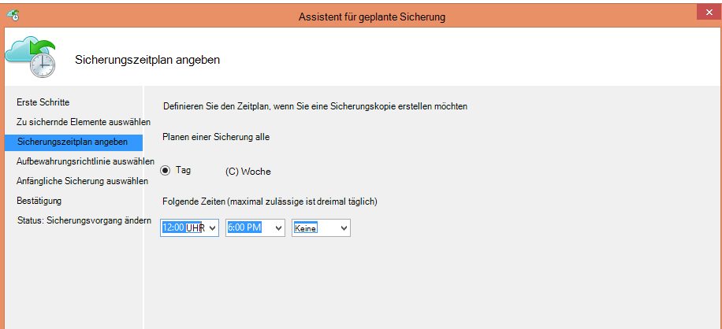
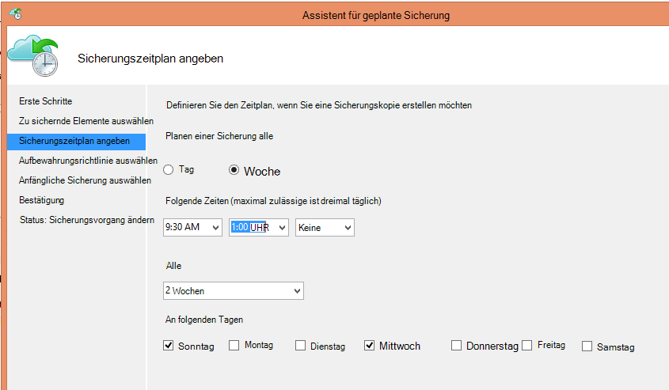
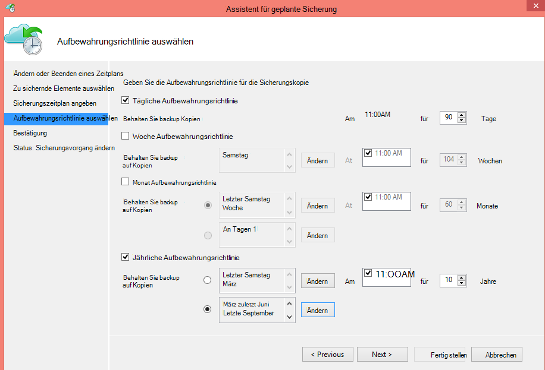
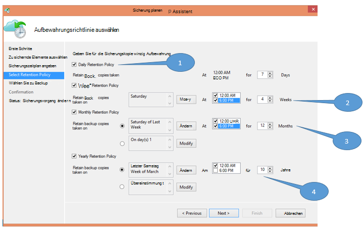
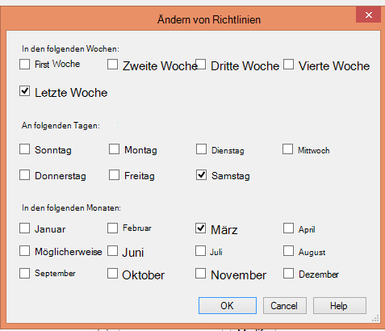

<properties
   pageTitle="Mit der Band-Infrastruktur ersetzen Azure Backup | Microsoft Azure"
   description="Hier erfahren Sie, wie Azure Backup Band wie Semantik ermöglicht backup und Wiederherstellung von Daten in Azure"
   services="backup"
   documentationCenter=""
   authors="trinadhk"
   manager="vijayts"
   editor=""/>
<tags
   ms.service="backup"
   ms.devlang="na"
   ms.topic="article"
   ms.tgt_pltfrm="na"
   ms.workload="storage-backup-recovery"
   ms.date="09/27/2016"
   ms.author="jimpark;trinadhk;markgal"/>

# Sicherungsprogramm Azure Band-Infrastruktur ersetzen

Azure Backup und System Center Data Protection Manager-Kunden können:

- Sichern Sie Daten in Listen die organisatorischen Bedürfnissen am besten entspricht.
- Backup-Daten über längere Zeiträume beizubehalten
- Stellen Sie Azure Teil ihrer langfristig (statt Band) benötigt.

Dieser Artikel erläutert, wie Kunden sichern und Aufbewahrungsrichtlinien aktivieren können. Benutzer von Bändern an ihre long-term-Aufbewahrung müssen jetzt eine leistungsstarke und praktikable Alternative mit dieser Funktion haben. Die Funktion in der neuesten Version der Azure-Sicherung aktiviert ist (die [hier](http://aka.ms/azurebackup_agent)). System Center DPM-Kunden müssen zumindest, aktualisieren DPM 2012 R2 UR5 bevor DPM mit Azure Backup Service.

## Was ist der Sicherungszeitplan?
Der Sicherungszeitplan gibt die Frequenz des Sicherungsvorgangs an. Einstellungen im folgenden Bildschirm beispielsweise angeben, dass Backups täglich um 6 Uhr und Mitternacht.

Kunden können auch eine wöchentliche Sicherung planen. Die Einstellungen im folgenden Bildschirm laut z. B. Backups jede alternative Sonntag und Mittwoch 9:30 Uhr und 1:00 Uhr erfolgen.

## Was ist die Aufbewahrungsrichtlinie?
Die Aufbewahrungsrichtlinie gibt die Dauer für die Sicherung gespeichert werden muss. Anstatt nur eine "flache"Richtlinie für alle backup, können Kunden unterschiedliche Aufbewahrungsrichtlinien basierend darauf, wann die Sicherung ausgeführt wird. Beispielsweise wird der Sicherungspunkt, dient als betriebliche Recovery Point, 90 Tage beibehalten. Der Sicherungspunkt am Ende jedes Quartals zu Audit-Zwecken wird länger beibehalten.

Insgesamt "Aufbewahrung Punkte" in dieser Richtlinie festgelegten ist 90 (täglich Punkte) + 40 (jeweils 10 Jahren Quartal) = 130.

## Beispiel – beide Zusammenstellung

1. **Tägliche Aufbewahrungsrichtlinie**: tägliche Sicherungen werden sieben Tage lang gespeichert.
2. **Wöchentliche Aufbewahrungsrichtlinie**: Sicherungen täglich um Mitternacht und 18 Uhr Samstag für vier Wochen beibehalten werden
3. **Monatliche Aufbewahrungsrichtlinie**: Sicherungen Uhr und 18 Uhr am letzten Samstag jedes Monats bleiben für 12 Monate
4. **Jährliche Aufbewahrungsrichtlinie**: Sicherungen am letzten Samstag im März um Mitternacht bleiben für 10 Jahre

Insgesamt "Aufbewahrung Punkte" (Punkte aus dem Kunden Daten wiederherstellen kann) in der obigen Abbildung wird wie folgt berechnet:

- zwei Punkte pro Tag und sieben Tage = 14 recovery
- zwei Punkte pro Woche für vier Wochen = 8 recovery
- zwei Punkte pro Monat für 12 Monate = 24 recovery
- einmal pro Jahr und pro 10 Jahre = 10 Recovery-Punkte

Die Gesamtzahl der Wiederherstellungspunkte beträgt 56.

> [AZURE.NOTE] Azure Backup verfügen keine Beschränkung für Anzahl der Wiederherstellungspunkte.

## Erweiterte Konfiguration
**Ändern** Sie im vorherigen Bildschirm auf, haben Kunden zusätzliche Flexibilität Aufbewahrungszeitpläne angeben.

## Nächste Schritte
Weitere Informationen zur Sicherung von Azure finden Sie unter:

- [Einführung in Azure Backup](backup-introduction-to-azure-backup.md)
- [Versuchen Sie Azure Backup](backup-try-azure-backup-in-10-mins.md)
