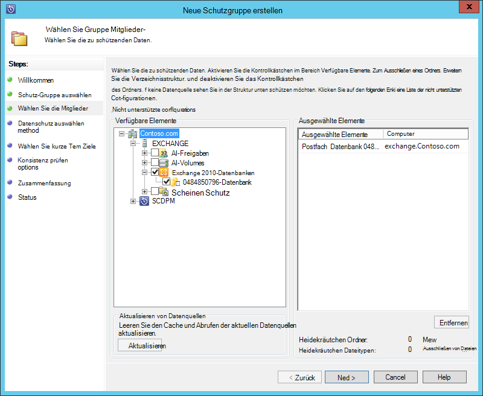
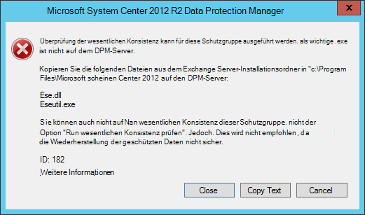
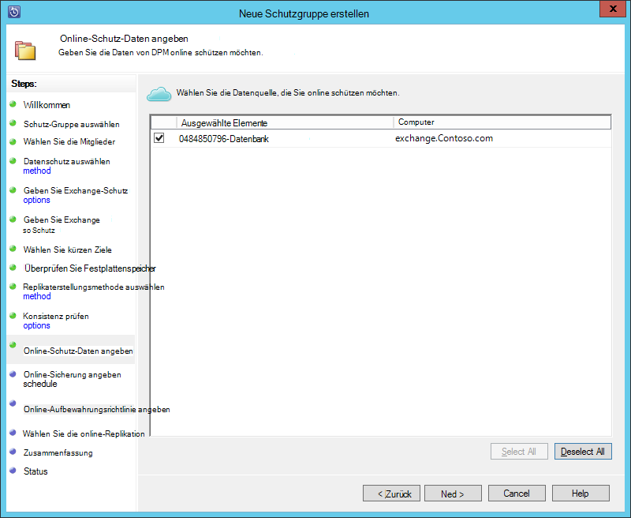
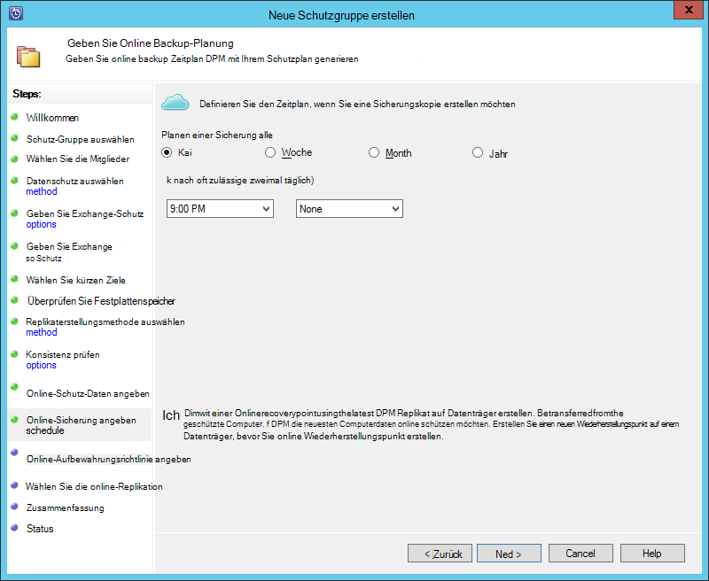
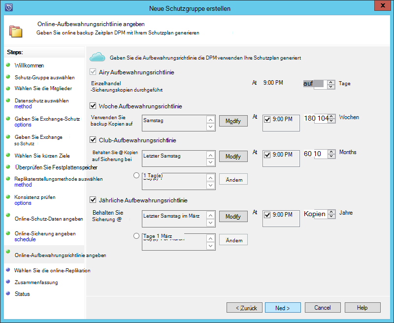
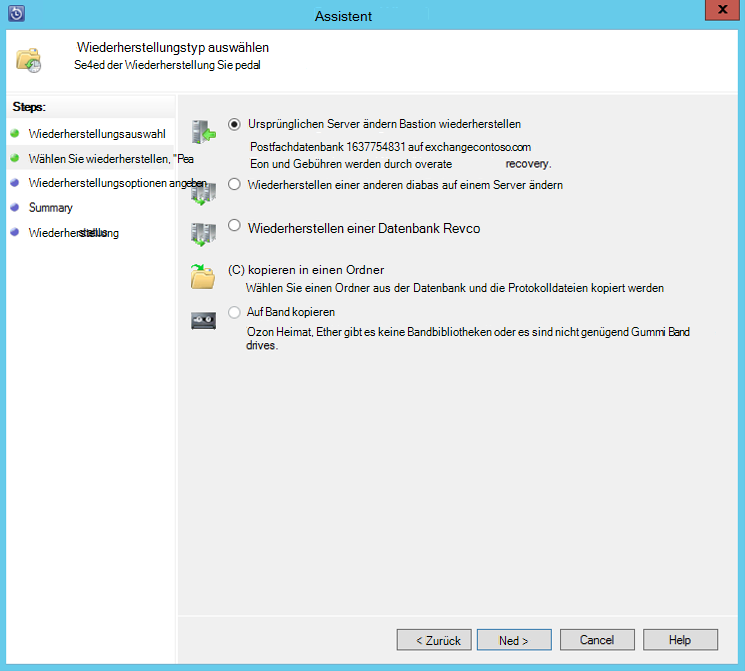

<properties
    pageTitle="Sichern einer Exchange Server Azure Backup mit System Center 2012 R2 DPM | Microsoft Azure"
    description="Erfahren Sie, wie Exchange Server mithilfe von System Center 2012 R2 DPM Azure Backup Sichern"
    services="backup"
    documentationCenter=""
    authors="MaanasSaran"
    manager="NKolli1"
    editor=""/>

<tags
    ms.service="backup"
    ms.workload="storage-backup-recovery"
    ms.tgt_pltfrm="na"
    ms.devlang="na"
    ms.topic="article"
    ms.date="08/15/2016"
    ms.author="anuragm;jimpark;delhan;trinadhk;markgal"/>

# Sichern von Exchange Server Azure Backup mit System Center 2012 R2 DPM
Dieser Artikel beschreibt, wie System Center 2012 R2 Data Protection Manager (DPM) Server Microsoft Exchange Server auf Azure Backup Sichern konfigurieren.  

## Updates
Um Azure Backup erfolgreich den DPM-Server registrieren, müssen Sie das neueste Updaterollup für System Center 2012 R2 DPM und die neueste Version von Azure Backup-Agent installieren. Das neueste Updaterollup aus dem [Microsoft-Katalog](http://catalog.update.microsoft.com/v7/site/Search.aspx?q=System%20Center%202012%20R2%20Data%20protection%20manager)zu erhalten.

>[AZURE.NOTE] Für die Beispiele in diesem Artikel Azure Backup Agent Version 2.0.8719.0 installiert und Updaterollup 6 auf System Center 2012 R2 DPM installiert ist.

## Erforderliche Komponenten
Bevor Sie fortfahren, stellen Sie sicher, dass alle [erforderlichen Komponenten](backup-azure-dpm-introduction.md#prerequisites) für mit Microsoft Azure Backup Arbeitslasten schützen erfüllt wurden. Die folgenden: erforderlichen Komponenten

- Ein backup Depot auf der Azure-Website wurde erstellt.
- Agent und Vault Anmeldeinformationen wurden auf dem DPM-Server heruntergeladen.
- Der Agent wird auf dem DPM-Server installiert.
- Das Depot wurden Anmeldeinformationen auf den DPM-Server registrieren.
- Wenn Sie Exchange 2016 schützen, aktualisieren Sie DPM 2012 R2 UR9 oder höher

## DPM-Schutz-agent  
Gehen Sie folgendermaßen vor, um den DPM-Schutz-Agent auf dem Exchange-Server installieren:

1. Stellen Sie sicher, dass die Firewalls korrekt konfiguriert sind. Finden Sie unter [Konfigurieren der Firewallausnahmen für den Agent](https://technet.microsoft.com/library/Hh758204.aspx).

2. Installieren Sie den Agent auf dem Exchange Server, indem Sie auf **Management > Agents > Installieren** in der DPM-Verwaltungskonsole. Einzelheiten finden Sie in der [DPM-Schutz-Agent installieren](https://technet.microsoft.com/library/hh758186.aspx?f=255&MSPPError=-2147217396) .

## Erstellen einer Schutzgruppe für Exchange server

1. Der DPM-Verwaltungskonsole klicken Sie auf **Schutz**und **Klicken auf der Multifunktionsleiste Tool zum Öffnen des Assistenten **Neue Schutzgruppe erstellen** ** .

2. Klicken Sie auf **der Willkommensseite des Assistenten** auf **Weiter**.

3. Wählen Sie auf dem Bildschirm **Wählen Sie Schutz Gruppe** **Server aus** und auf **Weiter**.

4. Wählen Sie die zu schützen, und **Klicken Sie auf**Exchange Server-Datenbank.

    >[AZURE.NOTE] Wenn Schutz von Exchange 2013 [Exchange 2013 Komponenten](https://technet.microsoft.com/library/dn751029.aspx)überprüfen.

    Im folgenden Beispiel wird die Exchange 2010-Datenbank ausgewählt.

    

5. Wählen Sie die Datenschutzmethode aus.

    Benennen Sie Schutzgruppe, und wählen Sie dann die folgenden Optionen:

    - Ich möchte kurzfristigen Schutz Datenträger.
    - Online-Schutz soll.

6. Klicken Sie auf **Weiter**.

7. Die Option der **Führen Sie Eseutil Integrität überprüft** die Integrität der Exchange Server-Datenbanken überprüft werden soll.

    Nach dem Auswählen dieser Option, backup-Konsistenz überprüfen auf dem DPM-Server den Datenverkehr zu, der generiert wird, durch Ausführen des Befehls **Eseutil** auf dem Exchange Server ausgeführt wird.

    >[AZURE.NOTE]Um diese Option verwenden, müssen Sie Ese.dll und Eseutil.exe Dateien in das Verzeichnis C:\Program Files\Microsoft System Center 2012 R2\DPM\DPM\bin auf dem DPM-Server kopieren. Andernfalls wird der folgende Fehler ausgelöst:  
    

8. Klicken Sie auf **Weiter**.

9. Wählen Sie die Datenbank für die **Sicherung**, und klicken Sie auf **Weiter**.

    >[AZURE.NOTE] Wenn Sie nicht mindestens so Kopie einer Datenbank "vollständige Sicherung" auswählen, werden Protokolle nicht abgeschnitten.

10. Konfigurieren Sie die Ziele für **kurzfristige Sicherung**, und klicken Sie dann auf **Weiter**.

11. Überprüfen Sie den verfügbaren Speicherplatz, und klicken Sie dann auf **Weiter**.

12. Wählen Sie die mit der DPM-Server die erste Replikation erstellen, und klicken Sie auf **Weiter**.

13. Wählen Sie die Konsistenz Optionen aus und dann auf **Weiter**.

14. Wählen Sie die Datenbank, die Sie in Azure sichern möchten, und klicken Sie auf **Weiter**. Zum Beispiel:

    

15. Definieren Sie den Zeitplan für die **Sicherung von Azure**, und klicken Sie dann auf **Weiter**. Zum Beispiel:

    

    >[AZURE.NOTE] Beachten Sie Online Wiederherstellungspunkte basieren auf Express vollständige Wiederherstellungspunkte. Daher müssen Sie online Wiederherstellungspunkt nach Wiederherstellungspunkt für schnelle vollständige angegebenen Zeitraum planen.

16. Konfigurieren Sie die Aufbewahrungsrichtlinie für **Azure Backup**, und klicken Sie auf **Weiter**.

17. Wählen Sie die online-Replikation, und klicken Sie auf **Weiter**.

    Haben Sie eine große Datenbank kann viel Zeit für das erste Backup über das Netzwerk erstellt werden dauert. Um dieses Problem zu vermeiden, können Sie eine offline-Sicherung erstellen.  

    

18. Bestätigen Sie die Einstellung, und klicken Sie auf **Gruppe erstellen**.

19. Klicken Sie auf **Schließen**.

## Wiederherstellen der Exchange-Datenbank

1. Klicken Sie auf **Wiederherstellung** in der DPM-Verwaltungskonsole, um eine Exchange-Datenbank wiederherzustellen.

2. Suchen Sie die Exchange-Datenbank, die Sie wiederherstellen möchten.

3. Dropdownliste *Wiederherstellungszeit* online Wiederherstellungspunkt auswählen.

4. Klicken Sie zum Starten des **Assistenten zur Wiederherstellung** **wiederherzustellen** .

Für Online-Wiederherstellungspunkte stehen fünf Recovery:

- **Am ursprünglichen Exchange Server-Speicherort wiederherstellen:** Die Daten werden auf dem ursprünglichen Exchange-Server wiederhergestellt.
- **In einer anderen Datenbank auf einem Exchange Server wiederherstellen:** Die Daten werden in eine andere Datenbank auf einem anderen Exchange-Server wiederhergestellt.
- **Einer Wiederherstellung wiederherstellen:** Die Daten werden auf einer Exchange Recovery der Datenbank (RDB) wiederhergestellt.
- **In einen Netzwerkordner kopieren:** Die Daten werden mit einem Ordner wiederhergestellt.
- **Auf Band kopieren:** Wenn Sie eine Bandbibliothek oder ein eigenständiges Bandlaufwerk angeschlossen und auf dem DPM-Server konfiguriert haben, wird der Wiederherstellungspunkt ein freies Band kopiert werden.

    

## Nächste Schritte

- [Azure Backup FAQ](backup-azure-backup-faq.md)
