<properties
   pageTitle="Azure Backup - Offline-Sicherung oder Seedrouting Azure Import/Export nutzen | Microsoft Azure"
   description="Erfahren Sie, wie Azure Backup Daten aus dem Netzwerk Azure Import/Export-Dienst senden können. Dieser Artikel beschreibt offline seeding der ursprünglichen backup-Daten unter Verwendung von Azure importieren exportieren."
   services="backup"
   documentationCenter=""
   authors="saurabhsensharma"
   manager="shivamg"
   editor=""/>
<tags
   ms.service="backup"
   ms.devlang="na"
   ms.topic="article"
   ms.tgt_pltfrm="na"
   ms.workload="storage-backup-recovery"
   ms.date="08/16/2016"
   ms.author="jimpark;saurabhsensharma;nkolli;trinadhk"/>

# Offline-Sicherung Workflow in Azure Backup
Azure Backup verfügt über mehrere integrierte Effizienz, die während der anfänglichen vollständige Backups von Daten in Azure Netzwerk- und Kosten sparen. Erste vollständige Backups normalerweise große Datenmengen übertragen und erfordern mehr Netzwerkbandbreite im Vergleich zu nachfolgenden Backups, die nur die Deltas/inkrementelle übertragen. Azure Backup komprimiert die anfänglichen Backups. Durch den Prozess der offline seeding können Azure Backup Festplatten komprimierten anfänglichen backup-Daten offline in Azure hochladen.  

Offline seeding Prozess von Azure Backup ist eng in [Azure Import/Export-Dienst](../storage/storage-import-export-service.md) integriert, die in Azure Datentransfer über Festplatten ermöglicht. Haben Sie Terabyte (TB) der ursprünglichen backup-Daten, die über ein hoher Latenz und niedriger Bandbreite übertragen werden, können offline seeding Workflows Sie um die erste Sicherungskopie auf Festplatten zu Azure-Rechenzentrum zu liefern. Dieser Artikel bietet eine Übersicht über die Schritte, die Workflows.

## Übersicht

Die Möglichkeit offline seeding Azure Backup und Azure Import/Export ist es einfach, Daten offline mit Festplatten in Azure hochladen. Statt der ersten vollständigen Kopie über das Netzwerk, steht die Sicherungsdaten an einem *Speicherort bereitstellen*. Nach Abschluss des Kopiervorgangs an staging mit Azure Import/Export Tool werden diese Daten mindestens SATA-Laufwerke je nach Daten geschrieben. Diese Laufwerke werden schließlich an den nächsten Azure-Rechenzentrum geliefert.

[August 2016 Aktualisieren von Azure Backup (und höher)](http://go.microsoft.com/fwlink/?LinkID=229525) enthält das *Azure Datenträger Preparation Tool*, mit dem Namen AzureOfflineBackupDiskPrep, die:

   - Können Sie die Laufwerke mit Azure Import/Export Tool für Azure Import vorbereiten.
   - Erstellt automatisch einen Azure Importauftrag für Azure Import/Export-Dienst in [Azure-Verwaltungsportal](https://manage.windowsazure.com) anstatt dasselbe manuell mit älteren Versionen von Azure Backup.

Nach Abschluss des Uploads der backup-Daten in Azure Azure Backup kopiert die Sicherungsdaten backup Depot und inkrementelle Backups geplant werden.

  > [AZURE.NOTE] Um die Azure Datenträger verwenden, sicher, dass das Update August 2016 Azure Backup (oder höher) installiert und alle Schritte des Workflows mit. Wenn Sie eine ältere Version von Azure Backup verwenden, können Sie das SATA-Laufwerk mithilfe von Azure Import/Export Tool wie in späteren Abschnitten dieses Artikels vorbereiten.

## Erforderliche Komponenten

- [Vertrautmachen mit dem Azure Import/Export-Workflow](../storage/storage-import-export-service.md).
- Bevor Sie den Workflow initiieren, stellen Sie Folgendes sicher:
    - Ein Depot Azure Backup wurde erstellt.
    - Vault-Anmeldeinformationen wurden heruntergeladen.
    - Azure Backup-Agent wurde auf Windows Server/Windows Client- oder System Center Data Protection Manager installiert und der Computer mit dem Azure Backup registriert.
- [Herunterladen die Azure veröffentlichen Einstellungen](https://manage.windowsazure.com/publishsettings) auf dem Computer, aus dem Sie Daten sichern möchten.
- Bereiten Sie ein Verzeichnis "staging", eine Netzwerkfreigabe oder zusätzliche Laufwerke auf dem Computer. Verzeichnis "staging" vorübergehende Speicherung ist und während dieser Workflow verwendet. Sicherstellen Sie, dass das Verzeichnis "staging" genügend Speicherplatz für die erste Kopie. Z. B. Wenn Sie einen Server 500-GB-Datei sichern, sicherstellen Sie, dass der Stagingbereich mindestens 500 GB. (Weniger wird durch Komprimierung verwendet.)
- Stellen Sie sicher, dass Sie ein unterstütztes Laufwerk verwenden. 3,5-Zoll-SATA-II/III-Festplatten sind mit dem Import/Export-Dienst unterstützt. Festplatten, die größer als 8 TB werden nicht unterstützt. Sie können einen Datenträger SATA II/III extern auf den meisten Computern installieren, mit einem SATA II-III-USB-Adapter. Dokumentation der Azure Import/Export die aktuelle Gruppe der Laufwerke, die der Dienst unterstützt.
- Aktivieren Sie BitLocker auf dem Computer, der Writer SATA-Laufwerk angeschlossen ist.
- [Azure Import/Export Tool herunterladen](http://go.microsoft.com/fwlink/?LinkID=301900&clcid=0x409) auf den Computer, die SATA drive Writer, verbunden ist. Dieser Schritt ist nicht erforderlich, wenn Sie heruntergeladen und installiert August 2016 Azure Backup (oder höher).

## Workflow
Die Informationen in diesem Abschnitt können Sie den offline-Sicherung Workflow abzuschließen, damit Ihre Daten Azure-Rechenzentrum übermittelt und Azure-Speicher hochgeladen werden können. Haben Sie Fragen zu Service importieren oder einen Teil des Prozesses finden Sie im [Service Importübersicht](../storage/storage-import-export-service.md) zuvor erwähnten.

### Offline-Sicherung starten

1. Wenn Sie eine Sicherung planen, Sie Folgendes angezeigt (in Windows Server, Windows-Client oder System Center Data Protection Manager).

    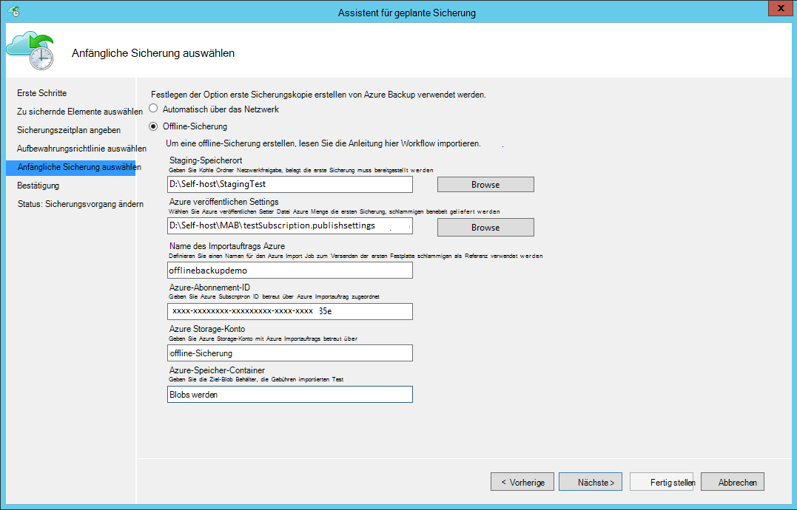

    Hier ist der entsprechende Bildschirm in System Center Data Protection Manager:  
    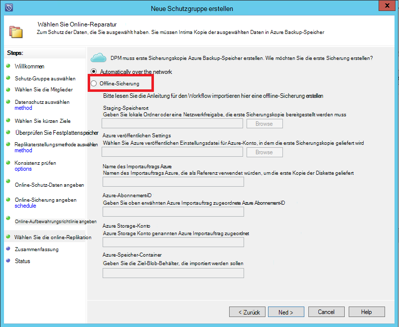

    Die Beschreibung der Eingaben lautet wie folgt:

    - **Staging-Position**: die temporären Speicherort in die erste Sicherungskopie geschrieben. Dies kann auf einer Netzwerkfreigabe oder einem lokalen Computer sein. Wenn Computer kopieren und Quellcomputer unterscheiden, sollten den vollständigen Netzwerkpfad des Verzeichnis "staging" angeben.
    - **Name des Importauftrags Azure**: der eindeutige Name der Azure-Import Service und Azure Backup die Übertragung von Daten auf Datenträgern in Azure verfolgen.
    - **Azure Veröffentlichungseinstellungen**: eine XML-Datei mit Informationen zu Ihrem Abonnementprofil. Es enthält auch sichere Anmeldeinformationen mit Ihrem Abonnement verknüpft. Sie können [die Datei herunterladen](https://manage.windowsazure.com/publishsettings). Geben Sie den lokalen Pfad der Einstellungsdatei veröffentlichen.
    - **Azure-Abonnement-ID**: der Azure-Abonnement-ID für das Abonnement Azure Importauftrag initiiert werden soll. Verwenden Sie mehrere Azure-Abonnements verfügen, die ID des Abonnements des Importauftrags zugeordnet werden soll.
    - **Azure Storage-Konto**: klassische Speicherkonto in bereitgestellten Azure-Abonnement, das den Azure Importauftrag zugeordnet werden.
    - **Azure Storage Container**: den Namen des Ziel Speicher Blob in Azure Storage Konto, wo dieses Projekt importiert.

    > [AZURE.NOTE] Wenn Sie Ihre Server in ein Depot Azure Recovery Services aus dem [Azure-Portal](https://portal.azure.com) für Backups registriert haben und nicht auf einem Abonnement Cloud Solution Provider (CSP), können Sie erstellen ein Speicherkonto klassischen von Azure-Portal und für offline Backup-Workflow verwenden.

    Speichern Sie diese Informationen, da in Schritte erneut eingeben müssen. Nur der *Speicherort der Stagingdatenbank* ist Azure Datenträger Systemvorbereitungsprogramm verwendet, um den Datenträger vorzubereiten.    

2. Abgeschlossen Sie der Workflow, und wählen Sie **Jetzt wieder** in Azure Backup-Verwaltungskonsole offline-Sicherungskopie initiieren. Die anfängliche Sicherung wird in den Stagingbereich dieser Schritt geschrieben.

    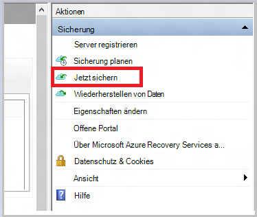

    Den entsprechenden Workflow in System Center Data Protection Manager, **Schutzgruppe**Maustaste, und wählen die Option **Wiederherstellungspunkt erstellen** . Wählen Sie dann die Option **Online-Schutz** .

    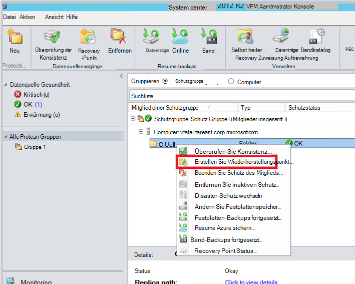

    Nach des Vorgangs beenden ist Verzeichnis "staging" Vorbereitung Datenträger verwendet werden.

    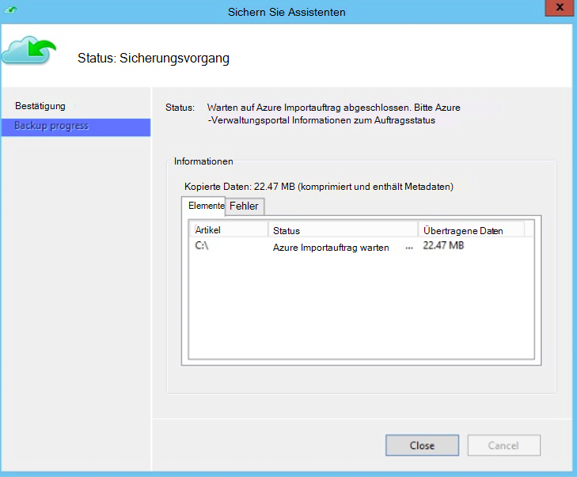

### Bereiten Sie eine SATA-Festplatte vor und erstellen Sie einen Importauftrag Azure mithilfe von Azure Datenträger Systemvorbereitungsprogramm
Das Systemvorbereitungsprogramm von Azure Datenträger steht im Installationsverzeichnis des Agenten Recovery Services (August 2016 aktualisieren und höher) in folgendem Pfad.

   *\Microsoft* *Azure* *Wiederherstellung* *Services* * Agent\Utils\*

1. Wechseln Sie zum Verzeichnis, und kopieren Sie das Verzeichnis **AzureOfflineBackupDiskPrep** eine Kopie Computer auf die Laufwerke vorbereitet werden bereitgestellt werden. Gewährleisten Sie in Bezug auf den Computer kopieren:

      - Computer kopieren kann Verzeichnis "staging" für den Workflow offline seeding mit denselben Netzwerkpfad aus Workflow **initiieren offline-Sicherung** zugreifen.

      - BitLocker ist auf dem Computer aktiviert.

      - Der Computer kann das Azure-Portal zugreifen.

      Bei Bedarf kann Computer kopieren Quellcomputer identisch sein.

2. Öffnen Sie ein Eingabeaufforderungsfenster mit erhöhten Rechten auf dem Computer Kopieren mit dem Azure Datenträger Vorbereitung Tool Verzeichnis als aktuelles Verzeichnis, und führen Sie folgenden Befehl:

      *.\AzureOfflineBackupDiskPrep.exe* s: <*Staging-Pfad*> [p: <*Pfad zu PublishSettingsFile*>]

| Parameter | Beschreibung
|-------------|-------------|
|s: <*Staging-Pfad*> | Den Pfad zum Verzeichnis "staging" bereitgestellt, die im Workflow **initiieren offline-Sicherung** eingegeben Pflichtfeld. |
|p: <*Pfad zu PublishSettingsFile*> | Optionale Eingabe, die den Pfad zu der Datei **Azure veröffentlichen** zur Verfügung stellt, die im Workflow **initiieren offline-Sicherung** eingegeben. |

> [AZURE.NOTE] Die &lt;Pfad zur PublishSettingFile&gt; Wert ist erforderlich, wenn die Computer kopieren und die Quellcomputer unterscheiden.

Beim Ausführen des Befehls fordert das Tool die Auswahl des Importauftrags Azure, die den Laufwerken, die entspricht vorbereitet werden müssen. Nur eine einzelne Importauftrag bereitgestellten Verzeichnis "staging" zugeordnet ist, sehen Sie einen Bildschirm wie mit dem folgenden.

   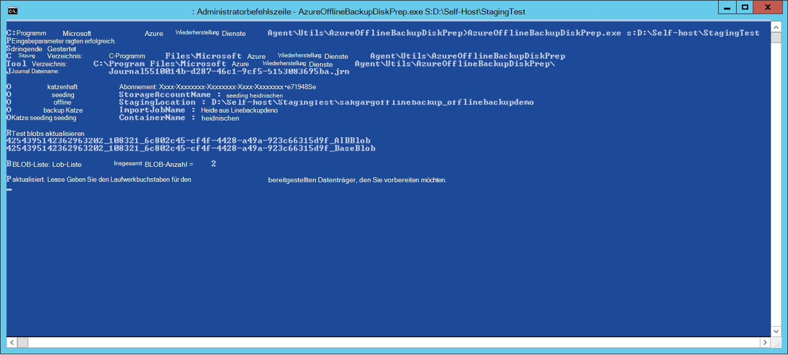  
3. Geben Sie den Laufwerkbuchstaben ohne nachfolgende Doppelpunkt für den bereitgestellten Datenträger, den Sie für die Übertragung in Azure vorbereiten möchten. Geben Sie für die Formatierung des Laufwerks Aufforderung zur Bestätigung.

Das Tool beginnt dann den Datenträger mit der backup-Daten vorbereiten. Sie müssen zusätzliche Festplatten Aufforderung vom Tool bei der bereitgestellte Datenträger nicht genügend Speicherplatz für die gesicherten Daten anfügen.  

Am Ende der erfolgreichen Ausführung des Tools sind ein oder mehrere Laufwerke, die Sie bereitgestellt für den Versand in Azure bereit. Darüber hinaus wird ein Importauftrag mit während des **offline-Sicherung starten** Workflows eingegebenen Namen auf klassischen Azure-Portal erstellt. Schließlich wird die Lieferadresse auf der Azure-Rechenzentrum, in dem die Festplatten ausgeliefert werden müssen, und Verknüpfen des Importauftrags auf klassischen Azure-Portal finden.

    
4. Liefern Sie Laufwerke an, die das Tool bereitgestellt und behalten Sie Nachverfolgungsnummer für Referenzzwecke bei. 
5. Wenn Sie auf den Link, die das Tool angezeigt gehen, siehe Azure Storage-Konto, das im Workflow **initiieren offline-Sicherung** angegeben. Hier sehen Sie den neu erstellte Importauftrag Register **IMPORT/EXPORT** des Speicherkontos.

   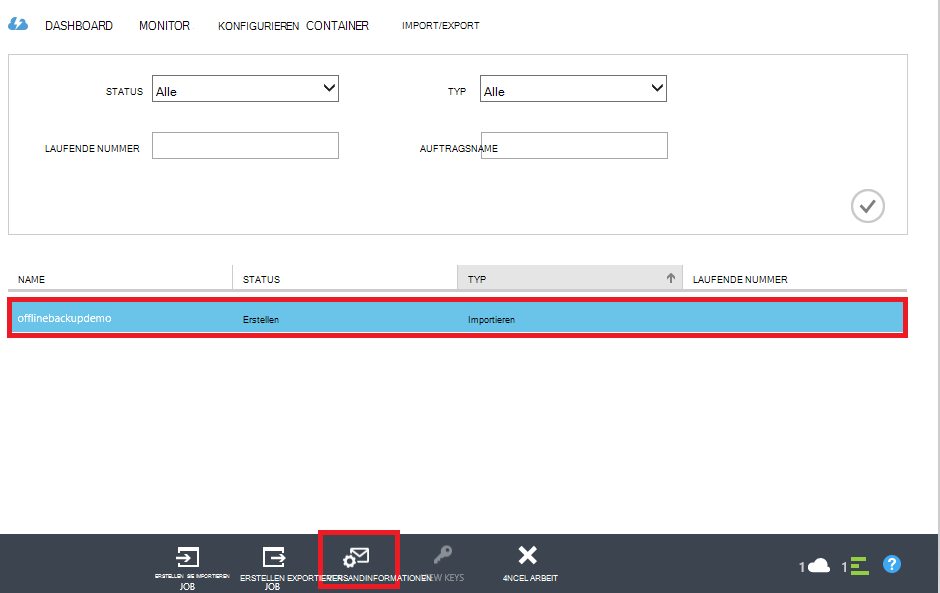 
6. Klicken Sie auf **INFO Lieferung** am unteren Rand der Seite um Ihre Kontaktinformationen zu aktualisieren, wie im folgenden Bild gezeigt. Microsoft verwendet diese Informationen, liefern Sie Ihre Festplatten nach Abschluss des Importauftrags.

   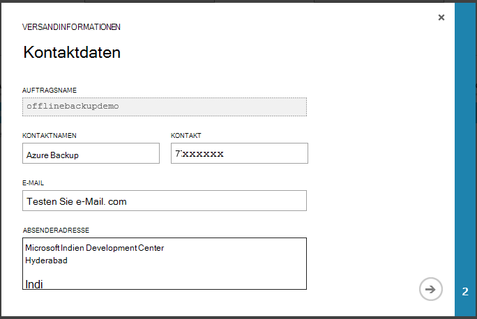 
7. Geben Sie die Versandkosten auf dem nächsten Bildschirm. Machen Sie **Spediteurs** und **Laufende Nummer** , die die Datenträger entsprechen, die in Azure Datencenter geliefert.

   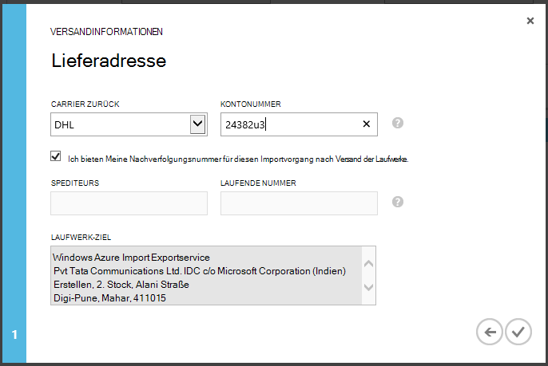 

### Der Workflow abgeschlossen
Nach Abschluss des Importauftrags ist erste backup-Daten in das Speicherkonto verfügbar. Recovery Services Agent und kopiert den Inhalt der Daten von diesem Konto Depot Backup oder Recovery Services vault-, je nachdem, was zutrifft. In der nächsten geplanten Sicherung Zeit führt Azure Backup Agent inkrementelle Sicherung über die erste Sicherungskopie.

> [AZURE.NOTE] Die folgenden Abschnitte gelten für Benutzer früherer Versionen von Azure Backup, die keinen Zugriff auf das Systemvorbereitungsprogramm von Azure Datenträger.

### Eine SATA-Festplatte vorbereiten

1. Downloaden Sie [Microsoft Azure Import/Export Tool](http://go.microsoft.com/fwlink/?linkid=301900&clcid=0x409) auf den Computer kopieren. Sicherstellen Sie, dass das Verzeichnis "staging" auf dem Computer den nächsten Satz von Befehlen ausgeführt werden soll. Bei Bedarf kann Computer kopieren Quellcomputer identisch sein.

2. Extrahieren Sie die Datei WAImportExport.zip. Ausführen der WAImportExport, die das SATA-Laufwerk, schreibt backup-Daten in das SATA-Laufwerk, und verschlüsselt. Bevor Sie den folgenden Befehl ausführen, stellen Sie sicher, dass BitLocker auf dem Computer aktiviert ist.  

    *.\WAImportExport.exe PrepImport /j: <* JournalFile*> .jrn/ID: <*SessionId*> /sk: <*StorageAccountKey*> /BlobType:**PageBlob* * /t: <*TargetDriveLetter*>/format / verschlüsseln /srcdir: <*staging-Speicherort*> /dstdir: <*DestinationBlobVirtualDirectory*>/*

    > [AZURE.NOTE] August 2016 Update Azure Backup (oder höher) installiert haben, sicher, dass Verzeichnis "staging" die eingegebene der auf dem Bildschirm **Jetzt sichern entspricht** und AIB und Base BLOB-Dateien enthält.

| Parameter | Beschreibung
|-------------|-------------|
| /j: <*JournalFile*>| Der Pfad zur Journaldatei. Jedes Laufwerk muss genau eine Journaldatei. Die Journal-Datei muss nicht auf dem Ziellaufwerk. Erweiterung der Erfassung ist .jrn und wird als Teil dieser Befehl erstellt.|
|/ ID: <*SessionId*> | Sitzung-ID identifiziert einen Kopiervorgang. Hiermit wird das genaue Recovery von unterbrochenen Kopiervorgang. Copy-Sitzung kopiert Dateien werden im Verzeichnis nach der ID für eine Sitzung auf dem Datenträger gespeichert.|
| /SK: <*StorageAccountKey*> | Der kontoschlüssel für das Speicherkonto, importiert werden. Der Schlüssel muss dasselbe wie bei Erstellung der Sicherung Richtlinienschutzes eingegeben wurde.|
| / BlobType | Der Typ des Blob. Dieser Workflow erfolgreich nur, wenn **PageBlob** angegeben wird. Dies ist die Standardoption und gemäß dieser Befehl. |
|/ t: <*TargetDriveLetter*> | Der Laufwerkbuchstabe ohne angehängten Strichpunkt der Ziel-Festplatte für die aktuelle kopiersitzung.|
|Format | Die Möglichkeit, das Laufwerk zu formatieren. Geben Sie diesen Parameter, wenn das Laufwerk formatiert werden muss; Andernfalls lassen Sie es. Bevor das Tool das Laufwerk formatiert, aufgefordert, eine Bestätigung über die Konsole. Zum Unterdrücken der Bestätigungs Geben Sie den /silentmode-Parameter an|
|/ Verschlüsseln | Die Option zum Verschlüsseln des Laufwerks. Geben Sie diesen Parameter, wenn das Laufwerk noch nicht mit BitLocker verschlüsselt und vom Tool verschlüsselt werden. Wenn das Laufwerk bereits mit BitLocker verschlüsselt wurde, diesen Parameter /bk Parameter angeben und den BitLocker-Schlüssel bereitzustellen. Wenn Sie den Format-Parameter angeben, müssen Sie auch angeben der / encrypt Parameter. |
|/srcdir: <*Quellverzeichnis*> | Das Quellverzeichnis, das Dateien enthält, auf das Ziellaufwerk kopiert werden. Sicherstellen Sie, dass der angegebene Verzeichnisname vollständigen anstelle von relativen Pfad.|
|/dstdir: <*DestinationBlobVirtualDirectory*> | Der Pfad zum virtuellen Zielverzeichnis in Ihrem Konto Azure-Speicher. Achten Sie darauf, dass Sie gültigen Namen verwenden, wenn Sie die virtuellen Zielverzeichnisse oder Blobs angeben. Denken Sie daran, Container Kleinbuchstaben sein müssen.  Der Containername sollten handeln, die während der Erstellung der Sicherung Richtlinienschutzes eingegeben.|

  > [AZURE.NOTE] Eine Journaldatei wird im Ordner WAImportExport erstellt, die die gesamte Informationen des Workflows erfasst. Sie benötigen diese Datei beim Erstellen eines Importauftrags in Azure-Portal.

  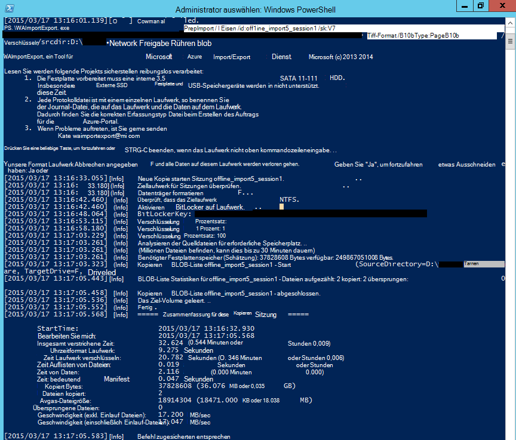

### Einen Importauftrag in Azure-Portal erstellen
1. Das Speicherkonto im [klassischen Azure-Portal](https://manage.windowsazure.com/)gehen Sie, klicken Sie im Aufgabenbereich auf **Import/Export**und **Import-Auftrag erstellen** .

    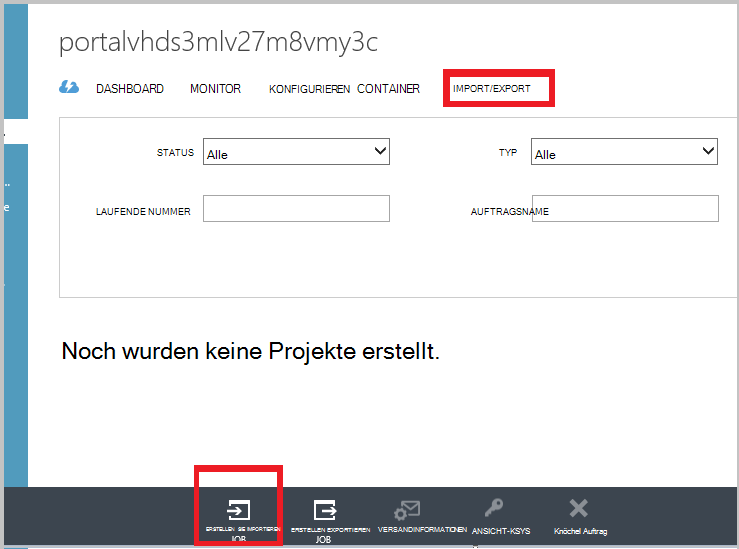

2. Geben Sie in Schritt 1 des Assistenten Festplatte vorbereitet haben und sich die Journaldatei Laufwerk verfügbar.
3. Geben Sie in Schritt 2 des Assistenten Kontaktinformationen für die verantwortliche Person für dieses Projekt importieren.
4. Laden Sie in Schritt 3 Dateien der Buch.-Blatt, die Sie im vorherigen Abschnitt abgerufen.
5. Geben Sie in Schritt 4 einen beschreibenden Namen für den Importvorgang während der Erstellung der Sicherung Richtlinienschutzes eingegeben. Der eingegebene Name enthalten nur Kleinbuchstaben, Zahlen, Bindestriche und Unterstriche, muss mit einem Buchstaben beginnen und darf keine Leerzeichen enthalten. Der ausgewählte Name wird Ihre Aufträge verfolgen, während sie sind und nach Abschluss verwendet.
6. Wählen Sie anschließend Ihr Datencenter Region aus der Liste. Bereich Datacenter gibt die Datacenter und Adresse, Ihr Paket geliefert werden müssen.

    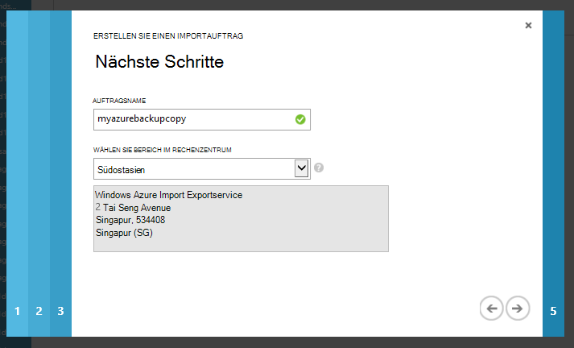

7. Wählen Sie in Schritt 5 zurück Anbieter aus, und geben Sie die Kontonummer des Spediteurs. Microsoft verwendet dieses Konto, liefern Sie Laufwerke nach der Import abgeschlossen ist.

8. Liefern Sie den Datenträger, und geben Sie die Nachverfolgungsnummer, um den Status der Lieferung verfolgen. Nach Eingang der Datenträger im Datencenter das Speicherkonto kopiert, und der Status aktualisiert.

    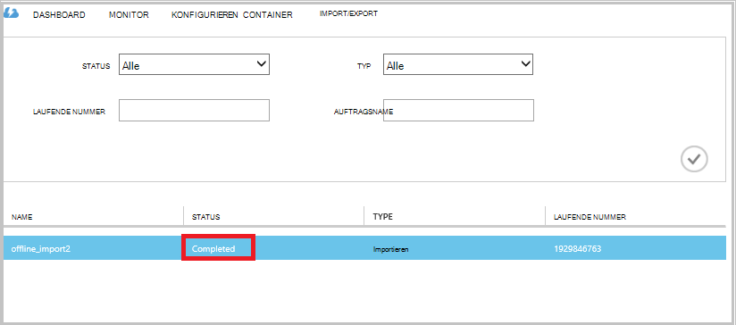

### Der Workflow abgeschlossen
Nach dem ersten backup-Daten in das Speicherkonto verfügbar ist, Microsoft Azure Recovery Services-Agenten kopiert den Inhalt der Daten von diesem Konto Sicherung Depot oder Depot Recovery Services, Agrarerzeugnis. In der nächste geplante Zeitpunkt backup führt Azure Backup-Agent über die erste Sicherungskopie die inkrementelle Sicherung.

## Nächste Schritte
- Fragen zur Azure Import/Export-Workflow finden Sie unter [Microsoft Azure Import/Export-Dienst Daten-BLOB-Speicher übertragen](../storage/storage-import-export-service.md).
- Siehe Abschnitt offline Backup Azure Backup [FAQ](backup-azure-backup-faq.md) für Fragen des Workflows.
