<properties
    pageTitle="Azure Backup für SQL Server-Arbeitslasten mit DPM | Microsoft Azure"
    description="Einführung in SQL Server-Datenbanken mithilfe von Azure Backup Service sichern"
    services="backup"
    documentationCenter=""
    authors="adigan"
    manager="Nkolli1"
    editor=""/>

<tags
    ms.service="backup"
    ms.workload="storage-backup-recovery"
    ms.tgt_pltfrm="na"
    ms.devlang="na"
    ms.topic="article"
    ms.date="09/27/2016"
    ms.author="adigan;giridham; jimpark;markgal;trinadhk"/>

# Azure Backup für SQL Server-Arbeitslasten mit DPM

Dieser Artikel führt Sie durch die Schritte zur Sicherung der SQL Server-Datenbanken mithilfe von Azure Backup.

Zum Sichern der SQL Server-Datenbanken in Azure benötigen Sie ein Azure-Konto. Wenn Sie ein Konto haben, können Sie in nur wenigen Minuten ein kostenloses Testabo erstellen. Weitere Informationen finden Sie unter [Azure-Testversion](https://azure.microsoft.com/pricing/free-trial/).

Die Verwaltung der SQL Server-Sicherung in Azure und Recovery von Azure umfasst drei Schritte:

1. Erstellen einer Sicherungsrichtlinie Schutz zu Azure SQL Server-Datenbanken.
2. Erstellen Sie Sicherungskopien bei Bedarf in Azure.
3. Wiederherstellen der Datenbank von Azure.

## Bevor Sie beginnen
Zunächst sicherstellen Sie, dass alle [erforderlichen Komponenten](../backup-azure-dpm-introduction.md#prerequisites) für mit Microsoft Azure Backup Arbeitslasten schützen erfüllt wurden. Die erforderlichen Komponenten umfassen Aufgaben wie: Erstellung eines backup-Depots Depot Anmeldeinformationen werden heruntergeladen, Azure Backup-Agent installieren und Registrieren des Servers mit der.

## Erstellen einer Sicherungsrichtlinie Schutz zu Azure SQL Server-Datenbanken

1. Klicken Sie auf **Schutz** Arbeitsbereich auf dem DPM-Server.

2. Klicken Sie auf der Multifunktionsleiste Tool auf **neu** , um eine neue Schutzgruppe erstellen.

    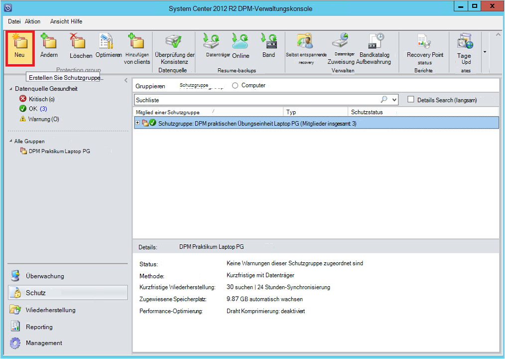

3. DPM zeigt der Startbildschirm mit dem Erstellen einer **Schutzgruppe**. Klicken Sie auf **Weiter**.

4. **Server**auswählen

    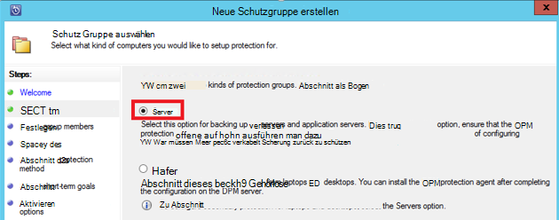

5. Erweitern Sie den SQL Server-Computer vorhanden sind die Datenbanken gesichert werden. DPM zeigt verschiedene Datenquellen, die von diesem Server gesichert werden können. Erweitern Sie **Alle SQL-Freigaben** und wählen Sie (in diesem Fall ausgewählt wir ReportServer$ MSDPM2012 und ReportServer$ MSDPM2012TempDB) Datenbanken gesichert werden. Klicken Sie auf **Weiter**.

    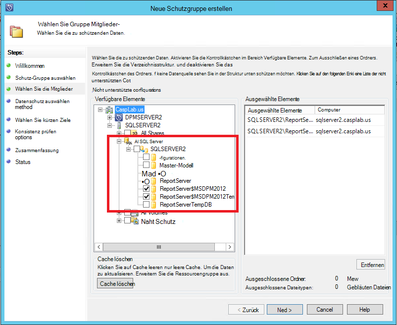

6. Geben Sie einen Namen für die Schutzgruppe aus und aktivieren Sie das Kontrollkästchen **ich möchte Online-Schutz** .

    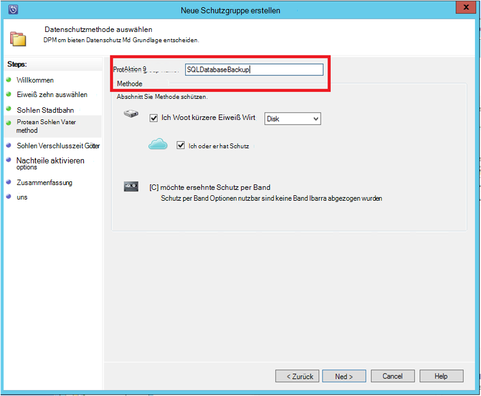

7. Enthalten Sie im Bildschirm **Kurzfristige Ziele angeben** die erforderlichen Eingaben um backup auf Festplatte erstellen.

    Hier sehen wir, dass **Beibehaltungsdauer** *5*Tage festgelegt, **Synchronisierungsfrequenz** wird alle *15 Minuten* die Häufigkeit mit der Sicherung. **Vollständige Sicherung Express** ist auf *8:00 Uhr*festgelegt.

    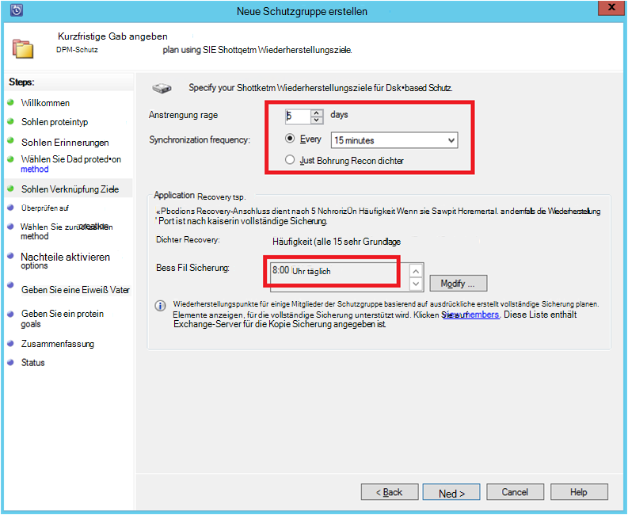

    >[AZURE.NOTE] Um 8 Uhr (nach Bildschirmeingabe) wird einem täglich übertragen die geänderten Daten vom Sicherungsort für den vorherigen Tag 8:00 Uhr erstellt. Dieser Vorgang wird **Vollständige Sicherung Express**bezeichnet. Während der Transaktion Protokolle synchronisiert werden express alle 15 Minuten ist 9:00 Uhr – die Datenbank wiederhergestellt werden muss und der Punkt erstellt wird, durch die Wiedergabe der Protokolle der letzten vollständige Sicherung zeigen (8 Uhr in diesem Fall).

8. Klicken Sie auf **Weiter**

    DPM zeigt den gesamten verfügbaren Speicherplatz und potenzielle Datenträgerspeicher.

    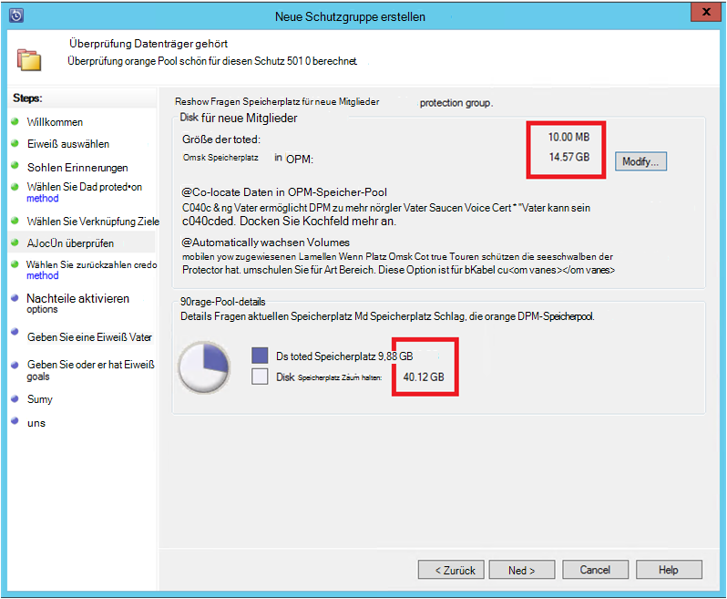

    Standardmäßig erstellt DPM ein Volume pro Datenquelle (SQL Server-Datenbank) für die erste Sicherungskopie verwendet wird. Mithilfe dieses Ansatzes beschränkt Logical Disk Manager (LDM) DPM Schutz 300 Datenquellen (SQL Server-Datenbanken). Um diese Einschränkung zu umgehen, markieren Sie die **Daten im DPM-Speicherpool Grenzschutz**, option Wenn diese Option verwendet DPM ein einzelnes Volume für mehrere Datenquellen den bis zu 2000 SQL-Datenbanken zu können.

    **Automatische Vergrößerung Volumes** gewählt ist, kann DPM für verbesserte backup-Volumen berücksichtigt werden Wachstum die Produktionsdaten. Wenn **Volumes automatisch vergrößern** nicht gewählt ist, beschränkt DPM backup-Speicher zum Datenquellen in der Schutzgruppe.

9. Administratoren erhalten die Wahl übertragen diese anfängliche Sicherung manuell (aus Netzwerk) zur Vermeidung von Bandbreiten-Überlastung oder über das Netzwerk. Sie können auch konfigurieren, die Zeit mit die erste Übertragung möglich. Klicken Sie auf **Weiter**.

    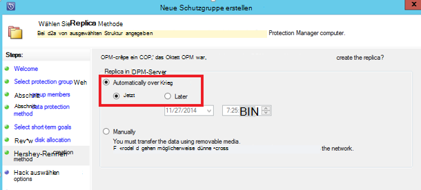

    Die erste Sicherungskopie erfordert Übertragung der gesamten Datenquelle (SQL Server-Datenbank) vom Produktionsserver (SQL Server-Computer) auf dem DPM-Server. Diese Daten möglicherweise große und Datenübertragung über das Netzwerk mehr Bandbreite als. Aus diesem Grund können Administratoren übertragen die anfängliche Sicherung: **manuell** (mit Wechselmedien) zu Bandbreiten-Überlastung oder **automatisch über das Netzwerk** (zu einem bestimmten Zeitpunkt).

    Nach Abschluss die erste Sicherung die übrigen Sicherungen sind inkrementelle Backups auf die erste Sicherungskopie. Inkrementelle Backups sind klein und leicht über das Netzwerk übertragen.

10. Wählen Sie die Überprüfung der Konsistenz und klicken Sie auf **Weiter**.

    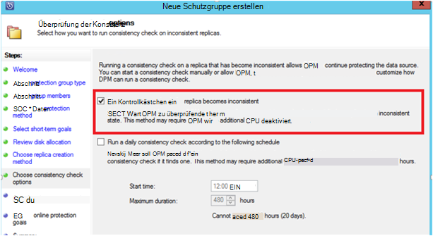

    DPM kann einer Konsistenz zum Einchecken die Integrität der Sicherungsort ausführen. Die Prüfsumme der Sicherungsdatei auf dem Produktionsserver (SQL Server-Computer in diesem Szenario) und Backup Daten für diese Datei in DPM berechnet. Im Falle eines Konflikts wird davon ausgegangen, dass DPM die gesicherten Datei beschädigt ist. DPM korrigiert die gesicherten Daten per Blöcke für die Nichtübereinstimmung der Prüfsumme. Die Überprüfung der Konsistenz ressourcenintensiven Vorgang ist, können Administratoren die Konsistenz-Überprüfung planen oder automatisch ausgeführt.

11. Online-Schutz der Datenquellen wählen Sie die Datenbanken in Azure geschützt werden, und klicken Sie auf **Weiter**.

    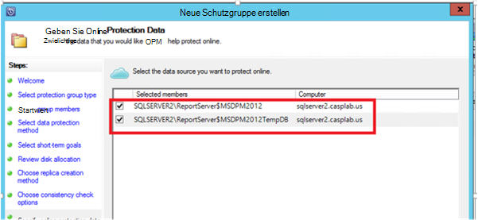

12. Administratoren können backup-Zeitpläne und Aufbewahrungsregeln, die Richtlinien ihrer Organisation entsprechen.

    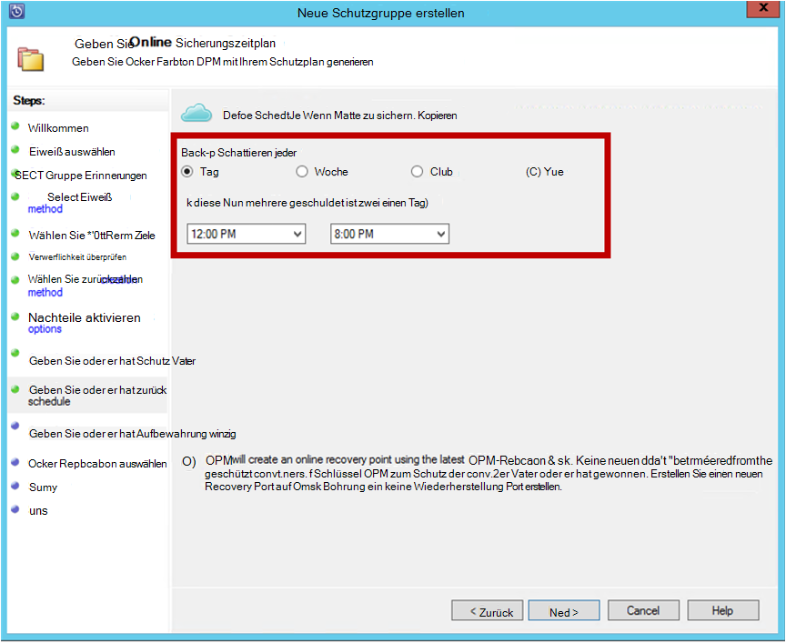

    In diesem Beispiel werden Backups täglich 12:00 Uhr und 20: 00 Uhr (Unterteil des Bildschirms) übernommen.

    >[AZURE.NOTE] In diesem Zusammenhang empfiehlt es sich, einige kurzfristigen Wiederherstellungspunkte auf dem Datenträger für die schnelle Wiederherstellung besitzen. Diese Wiederherstellungspunkte werden für die "Recovery" verwendet. Azure dient als gute abgeholt mit höheren SLAs und Verfügbarkeit garantiert.

    **Bewährte Methode**: Stellen Sie sicher, dass nach Abschluss der lokalen Festplatten-Backups mit DPM Azure Backups geplant werden. Dadurch wird die neueste Sicherung in Azure kopiert werden.

13. Auswählen eines Zeitplans für die Aufbewahrung. Details zur Funktionsweise der Aufbewahrungsrichtlinie werden bei [Verwendung Azure Sicherung der Band-Infrastruktur Artikel](backup-azure-backup-cloud-as-tape.md)bereitgestellt.

    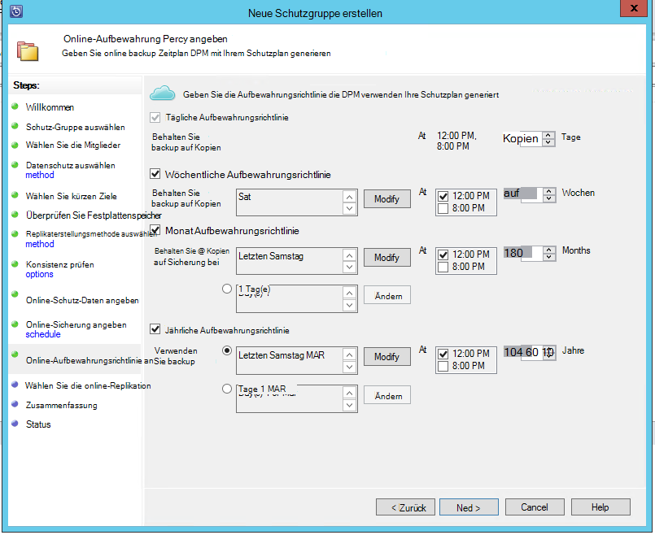

    In diesem Beispiel:

    - Backups werden täglich 12:00 Uhr und 20: 00 Uhr (Unterteil des Bildschirms) und 180 Tage lang aufbewahrt.
    - Die Sicherung am Samstag 12:00 Uhr 104 Wochen beibehalten
    - Die Sicherung am letzten Samstag 12:00 Uhr 60 Monate beibehalten
    - Die Sicherung am letzten Samstag im März um 12:00 Uhr 10 Jahren beibehalten

14. Klicken Sie auf **Weiter** , und wählen Sie die entsprechende Option für die erste Sicherungskopie in Azure übertragen. Sie können **automatisch über das Netzwerk** oder **Offline-Sicherung**.

    - **Automatisch über das Netzwerk** überträgt die Sicherungsdaten in Azure gemäß dem Zeitplan für die Sicherung ausgewählt.
    - Funktionsweise von **Offline-Sicherung** wird am [Offline Backup Workflow in Azure Backup](backup-azure-backup-import-export.md)erläutert.

    Wählen Sie den entsprechenden Mechanismus die erste Sicherungskopie in Azure senden, und klicken Sie auf **Weiter**.

15. Überprüfen die Richtliniendetails im Fenster **Zusammenfassung** klicken Sie auf **Erstellen** , um den Workflow abzuschließen. Klicken Sie auf **Schließen** , und der Job Status im Arbeitsbereich Überwachung.

    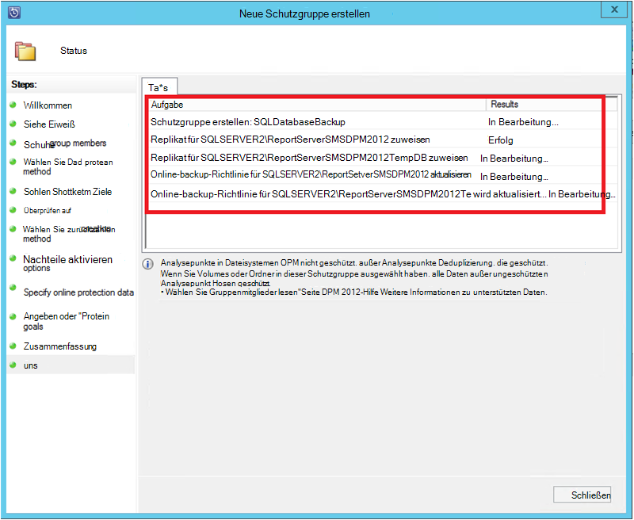

## Sicherung einer SQL Server-Datenbank bei Bedarf
Während der vorherigen Schritte eine Sicherungsrichtlinie erstellt, wird nur bei der ersten Sicherung "Wiederherstellungspunkt" erstellt. Nicht für den Planer starten, zeigen die Schritte der Erstellung eines Wiederherstellungspunktvolumes Trigger manuell.

1. Warten Sie, bis der Schutzstatus Gruppe vor dem Erstellen des Wiederherstellungspunkts **OK** für die Datenbank zeigt.

    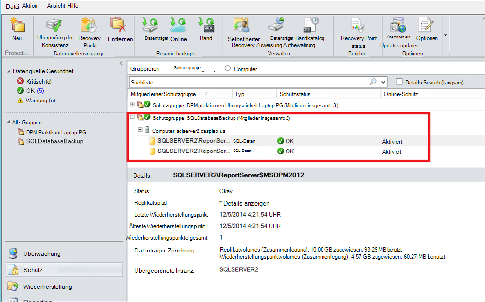

2. Mit der rechten Maustaste auf die Datenbank und wählen Sie **Wiederherstellungspunkt erstellen**.

    

3. Wählen Sie **Online-Schutz** im Dropdown-Menü, und klicken Sie auf **OK**. Dadurch wird die Erstellung eines Wiederherstellungspunkts in Azure gestartet.

    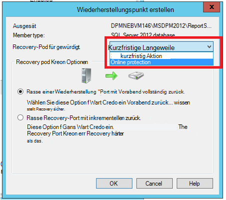

4. Können den Job-Status im Arbeitsbereich **Überwachen** , Sie in Bearbeitung befindlichen finden, Auftrag wie in der folgenden Abbildung dargestellt.

    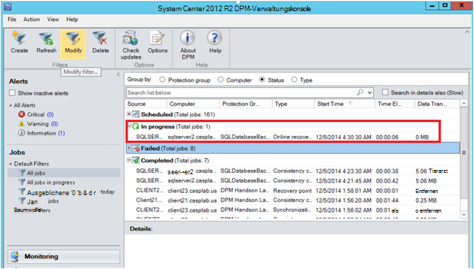

## Wiederherstellen einer SQL Server-Datenbank von Azure
Die folgenden Schritte müssen geschützte Entität (SQL Server-Datenbank) von Azure wiederherzustellen.

1. Öffnen Sie den DPM-Server Management-Konsole. Von DPM gesicherten Server finden **Recovery** Arbeitsbereich navigieren. Durchsuchen Sie die erforderliche Datenbank (in diesem Fall ReportServer$ MSDPM2012). Wählen Sie eine **Recovery** -Zeit endet mit **Online**.

    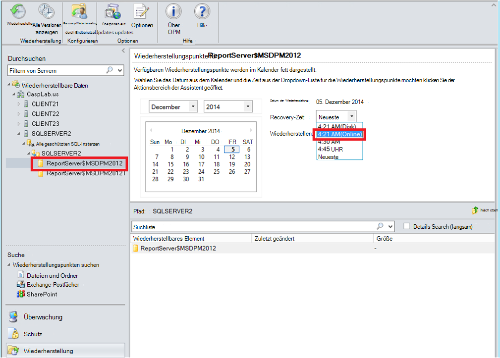

2. Name der Datenbank und **Wiederherstellen**.

    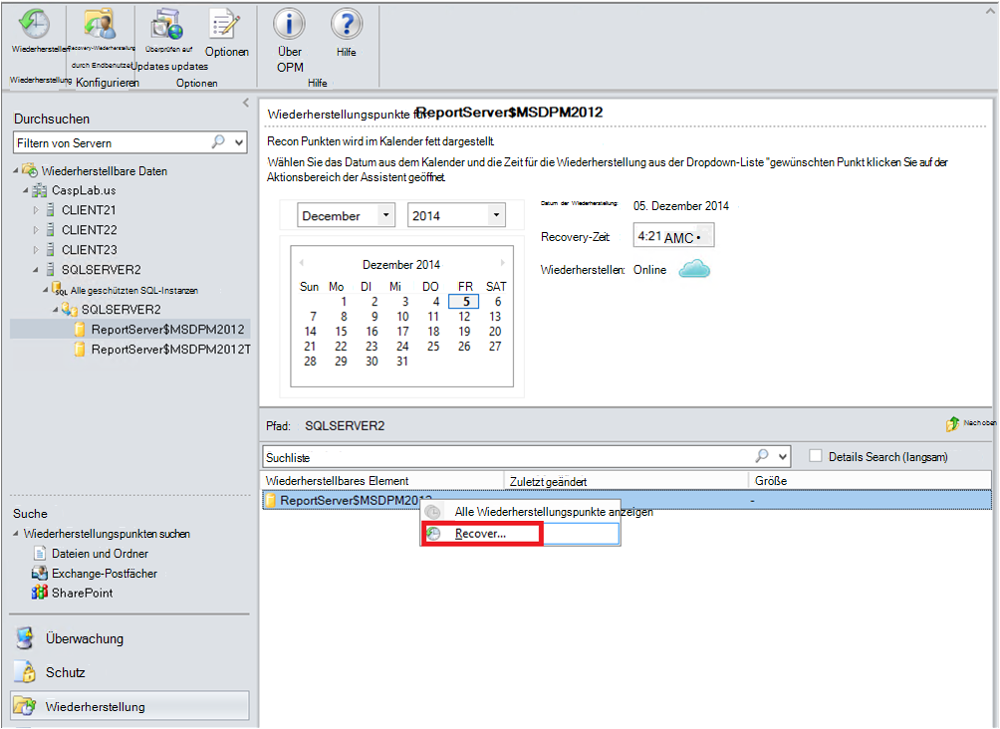

3. DPM zeigt die Details des Wiederherstellungspunkts. Klicken Sie auf **Weiter**. Um die Datenbank zu überschreiben, wählen Sie die Recovery **in ursprünglicher Instanz von SQL Server wiederherstellen**. Klicken Sie auf **Weiter**.

    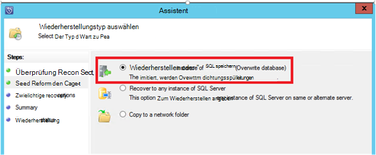

    In diesem Beispiel kann DPM Wiederherstellung der Datenbank in eine andere SQL Server-Instanz oder mit einem eigenständigen Ordner.

4. Wählen Sie im Bildschirm **Geben Sie Wiederherstellungsoptionen** Wiederherstellungsoptionen wie Drosselung der Verwendung mit Netzwerkbandbreite von Recovery verwendete Bandbreite einschränken. Klicken Sie auf **Weiter**.

5. Im Fenster **Zusammenfassung** anzeigen alle bisher bereitgestellten Recovery-Konfigurationen Klicken Sie auf **Wiederherstellen**.

    Recovery-Status zeigt die Datenbank wiederhergestellt wird. Sie können klicken Sie auf **Schließen** , um den Assistenten zu schließen und den Fortschritt im Arbeitsbereich **Überwachung** anzeigen.

    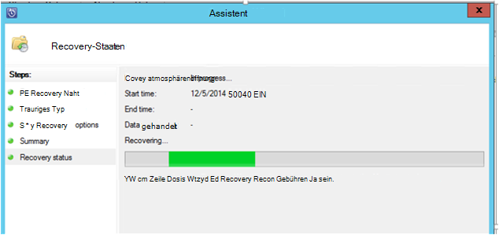

    Nachdem die Wiederherstellung abgeschlossen ist, wird die wiederhergestellte Datenbank anwendungskonsistente.

### Nächste Schritte:

• [Azure Backup FAQ](backup-azure-backup-faq.md)
