<properties
   pageTitle="Ein Depot Azure Backup löschen | Microsoft Azure"
   description="Wie eine Sicherung von Azure-Speicher löschen. Problembehandlung, warum backup Tresor gelöscht werden kann. "
   services="service-name"
   documentationCenter="dev-center-name"
   authors="markgalioto"
   manager="cfreeman"
   editor=""/>

<tags
   ms.service="backup"
   ms.devlang="na"
   ms.topic="article"
   ms.tgt_pltfrm="na"
   ms.workload="storage-backup-recovery"
   ms.date="08/29/2016"
   ms.author="markgal;trinadhk"/>

# Ein Depot Azure Backup löschen

Der Sicherungsdienst Azure hat zwei Arten von Depots - Depot Backup und Recovery Services Depot. Backup-Depot kam zuerst. Dann kam das Depot Recovery Services erweiterte Ressourcenmanager Bereitstellung unterstützen. Erweiterten Funktionen und Informationen abhängig, die im Depot gespeichert werden müssen, kann ein Depot Recovery Services löschen scheinen schwieriger als es ist.

|**Bereitstellungstyp**|**Portal**|**Depotnamen**|
|--------------|----------|---------|
|Classic|Classic|Backup vault|
|Ressourcen-Manager|Azure|Vaulting von Recovery-Services|

> [AZURE.NOTE] Backup Depots schützen Ressourcenmanager bereitgestellte Lösung nicht kann. Ein Depot Recovery Services können Sie jedoch um Klassisch bereitgestellten Server und virtueller Computer zu schützen.  

In diesem Artikel verwenden wir den Begriff Depot auf generische Form der Sicherung Depot oder Depot Recovery Services. Wir verwenden formalen Namen, Sicherung Depot oder Depot Recovery Services bei Bedarf Depots unterscheiden.

## Ein Depot Recovery Services löschen

Löschen eines Depots Recovery Services ist ein langwieriger Vorgang - *sofern das Depot Ressourcen enthält*. Vor dem Löschen eines Depots Recovery Services müssen Sie entfernen oder alle Ressourcen im Tresor löschen. Wenn Sie versuchen, einen Speicher zu löschen, die Ressourcen enthält, erhalten Sie eine Fehlermeldung wie die folgende Abbildung.

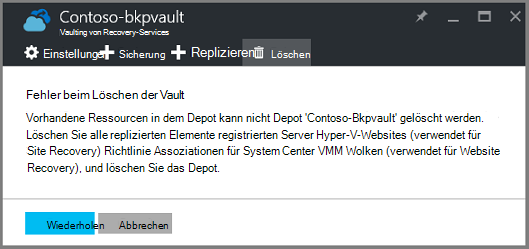  

Bis Sie die Ressourcen aus dem Tresor gelöscht haben, wird auf **Wiederholen** denselben Fehler erzeugt. Wenn Sie in dieser Fehlermeldung fest, klicken Sie auf **Abbrechen** , und gehen Sie die Ressourcen im Tresor Recovery Services löschen.

### Entfernen der Elemente aus einem Depot Schützen einer VM

Haben Sie bereits Recovery Services Tresor öffnen, fahren Sie mit den zweiten Schritt.

1.  Öffnen des Azure-Portals und aus dem Dashboard das Depot zu löschen.

    Haben Sie Recovery Services Depot im Hub auf dem Dashboard fixiert auf **Weitere Dienste** und geben Sie in der Liste der Ressourcen **Recovery Services**. Wie Sie mit der Eingabe beginnen, die Liste Filter basierend auf Ihrer Eingabe. Klicken Sie auf **Recovery Services Depots**.

    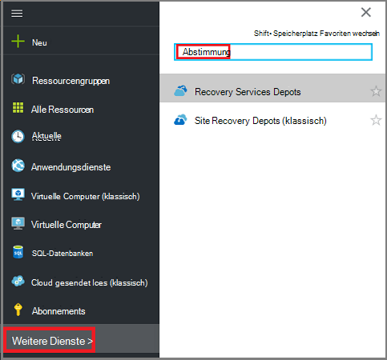  

    Recovery Services Depots wird angezeigt. Wählen Sie aus der Liste das Depot zu löschen.

    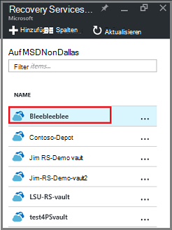

2. Betrachten Sie an Vault **Essentials** -Bereich. Zum Löschen eines Depots nicht geschützten Elemente. Erscheint eine Zahl ungleich NULL **Sicherung Elemente** oder **Backup-Management-Server**müssen Sie vor dem Löschen der Vault Elemente entfernen.

    

    VMs Dateien und Ordner sichern Elemente gelten und im Bereich **Backup Elemente** des Bereichs Essentials aufgeführt. Ein DPM-Server wird im Bereich **Backup Management Server** Essentials-Bereich aufgeführt. **Replizierte Objekte** beziehen sich auf Azure Site Recovery-Service.

3. Finden Sie zunächst die geschützten Elemente aus dem Tresor entfernt Elemente im Tresor. **Klicken Sie im Depot Dashboard**und dann auf **Backup Elemente** öffnen, Blade.

    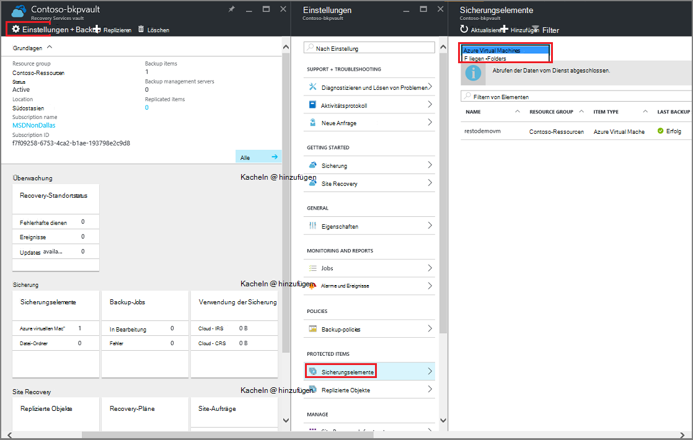

    Das **Sicherung Elemente** Blade verfügt über separate Listen basierend auf den Elementtyp: Azure Virtual Machines und Dateiordner (siehe Abbildung). Die Elementtyp Standardliste angezeigt wird Azure Virtual Machines. Wählen Sie zum Anzeigen der Liste der Ordner Elemente im Tresor **- Ordner** aus dem Dropdown Menü.

4. Bevor Sie ein Element aus dem Tresor Schützen einer VM löschen können, müssen das Element Sicherungsauftrag beendet und löschen die Wiederherstellungsdaten. Gehen Sie für jedes Element im Depot folgendermaßen vor:

    ein. Blade **Sicherungselemente** Maustaste, und wählen Sie im Kontextmenü **Sicherung beenden**.

    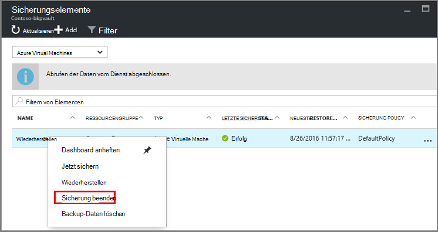

    Sicherung beenden-Blatt wird geöffnet.

    b. **Backup beenden** -Blade Menü **eine Option** wählen **Sicherungsdaten löschen** > Geben Sie den Namen des Artikels > und klicken Sie auf **Sicherung anhalten**.

      Geben Sie den Namen des Elements überprüfen Sie löschen möchten. Die Schaltfläche **Beenden Sicherung** wird nicht aktiviert, Element zu überprüfen. Wenn das Dialogfeld zur Eingabe backup Element nicht angezeigt wird, haben Sie die Option **Daten beibehalten** .

    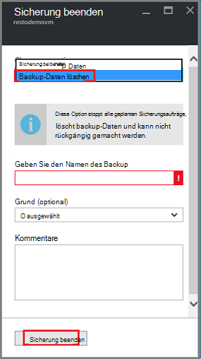

      Optional können Sie einen Grund angeben, warum Sie Daten löschen und Hinzufügen von Kommentaren. Nach dem Klicken auf **Stop Backup**lassen Sie zu "löschen" nach Abschluss der Vault löschen Überprüfen, ob der Job abgeschlossen ist, überprüft der Azure-Nachrichten .  
   Wenn der Auftrag abgeschlossen ist, erhalten Sie eine Meldung der Sicherungsvorgang beendet wurde und die Sicherungsdaten für dieses Element gelöscht wurde.

    c. Löschen eines Elements in der Liste im Menü **Sicherung Elemente** klicken Sie auf **Aktualisieren** , um die übrigen Elemente in das Depot anzuzeigen.

      

      Wenn keine Elemente in der Liste, führen Sie einen Bildlauf im Bereich **Basiswissen** Backup Vault-Blade. Sollte nicht werden **Sicherung Elemente** **Backup Verwaltungsserver**oder **replizierte Elemente** . Elemente weiterhin im Depot angezeigt, zurück zu Schritt 3 oben und wählen einen anderen Typ.  

5. Gibt keine Elemente mehr Depots auf, klicken Sie auf **Löschen**.

    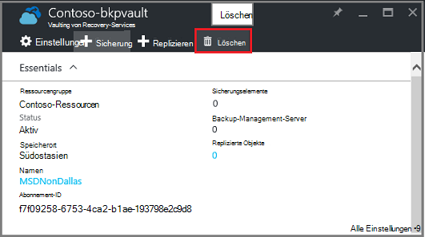

6. Wenn aufgefordert zu überprüfen, ob das Depot löschen möchten, klicken Sie auf **Ja**.

    Das Depot wird gelöscht und das Portal gibt, servicemenü **neu** .

## Was passiert, wenn ich beendet den Sicherungsvorgang aber beibehalten Daten?

Wenn Sie den Sicherungsvorgang beendet versehentlich *beibehalten* der Daten, löschen Sie zunächst die Sicherungsdaten löschen das Depot. Backup-Daten zu löschen:

1. Das Blade **Sicherungselemente** Maustaste, und klicken Sie im Kontextmenü auf **backup-Daten löschen**.

    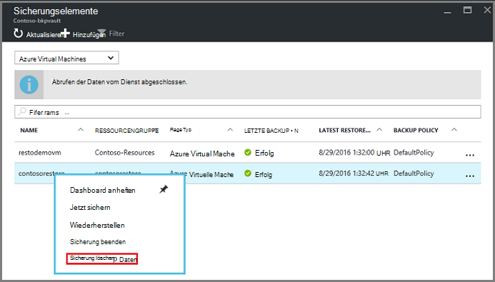

    **Löschen von Backup-Daten** -Blatt wird geöffnet.

2. Geben Sie auf die **Backup-Daten löschen** den Namen des Elements und klicken Sie auf **Löschen**.

    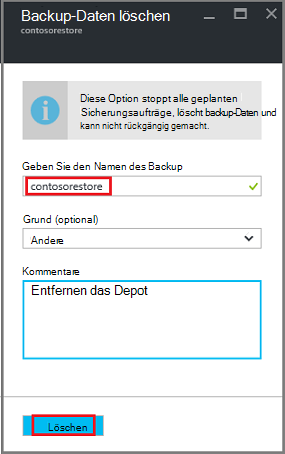

    Gelöschte Daten gehen Sie zu Schritt 4c, und mit dem Vorgang fortfahren.

## Löschen Sie ein Depot zum DPM-Server schützen

Vor dem Löschen eines Depots zum DPM-Server schützen müssen alle erstellten Wiederherstellungspunkte löschen und Registrierung den Server aus dem Tresor.

So löschen Sie eine Schutzgruppe zugeordneten Daten

1. Der DPM-Verwaltungskonsole klicken Sie auf **Schutz**, wählen Sie eine Schutzgruppe wählen Sie das Schutzgruppenmitglied und im Menüband Tool klicken Sie auf **Entfernen**. Wählen Sie das Element die Schaltfläche **Entfernen** im Tool Menüband angezeigt werden. Im Beispiel wird das Mitglied **dummyvm9**. Wenn gibt es mehrere Member in der Schutzgruppe, halten Sie STRG gedrückt, um mehrere Elemente auszuwählen.

    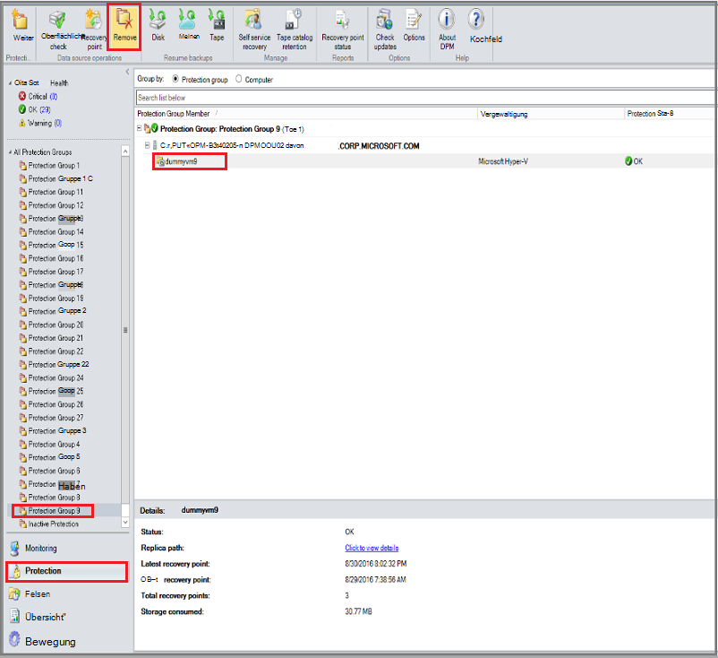

    **Schutz beenden** -Dialogfeld wird geöffnet.

2. Wählen Sie im Dialogfeld **Schutz beenden** **geschützte Daten**und klicken Sie auf **Schutz aufheben**.

    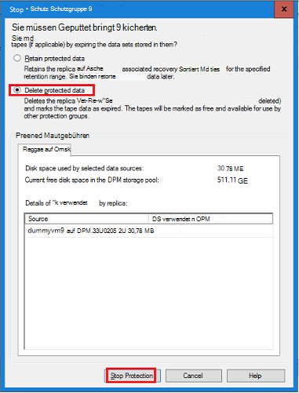

    Sie möchten geschützte Daten beibehalten, da Sie das Depot löschen müssen. Je nachdem, wie viele Recovery Punkte und wie viele Daten in der Schutzgruppe, dauern überall von ein paar Sekunden auf wenige Daten löschen. **Schutz beenden** -Dialogfeld zeigt den Status an, wenn der Auftrag abgeschlossen wurde.

    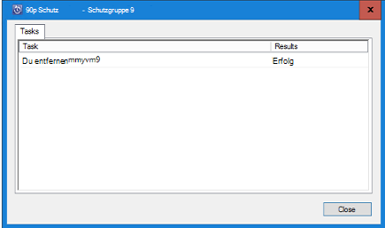

3. Setzen Sie diesen Vorgang für alle Elemente in allen Gruppen an.

    Sie müssen alle geschützten Daten und den Schutz Gruppen entfernen.

4. Wechseln Sie nach dem Löschen alle Mitglieder der Schutzgruppe, Azure-Portal. Öffnen Sie das Dashboard Depot und sicherstellen Sie, dass keine **Sicherung Elemente**, **Backup-Verwaltungsserver**oder **replizierte Elemente**vorhanden sind. Klicken Sie auf der Symbolleiste Vault **Löschen**.

    

    Wenn Backup-Verwaltungsserver Depot registriert sind Sie werdet Tresor gelöscht, auch wenn es keine Daten im Tresor. Wenn Sie dachten Verwaltungsserver Backup das Depot zugeordnet wurde gelöscht, aber es gibt noch im Bereich **Essentials** Server, finden Sie [die Sicherung Verwaltungsserver Depot registriert](backup-azure-delete-vault.md#find-the-backup-management-servers-registered-to-the-vault).

5. Wenn aufgefordert zu überprüfen, ob das Depot löschen möchten, klicken Sie auf **Ja**.

    Das Depot wird gelöscht und das Portal gibt, servicemenü **neu** .

## Ein Depot verwendet einen Produktionsserver zu löschen

Vor dem Löschen eines Depots zu einem Produktionsserver verwendet Sie löschen oder den Server aus dem Tresor abmelden.

Verbunden mit dem Produktionsserver zu löschen:

1. Azure-Portal Vault-Dashboard zu öffnen, und **Klicken Sie** > **Backup-Infrastruktur** > **Produktionsservern**.

    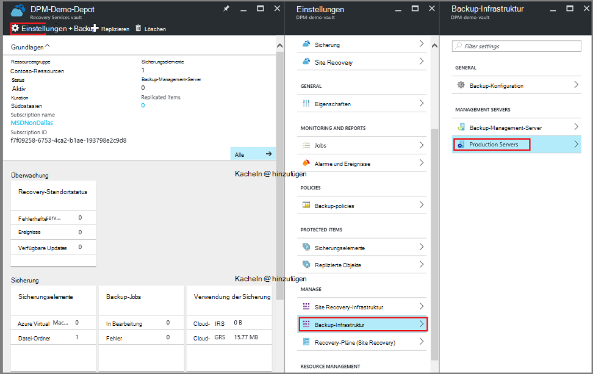

    **Produktions-Server** Blade wird geöffnet und listet alle Produktionsserver im Tresor.

    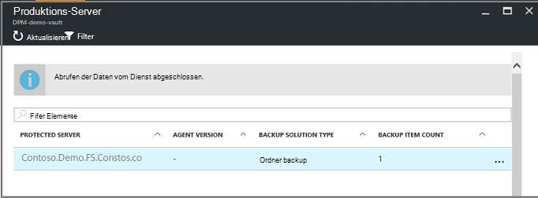

2. Blade **Produktions-Server** mit der rechten Maustaste auf den Server, und klicken Sie auf **Löschen**.

    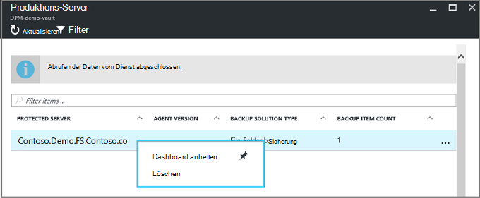

    Blatt **Löschen** wird geöffnet.

    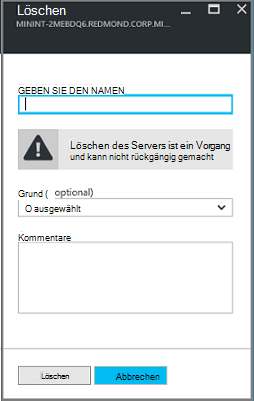

3. Bestätigen Sie auf dem Blatt **Löschen** den Namen des Servers und auf **Löschen**. Sie müssen den Namen des Servers ein, aktivieren Sie die Schaltfläche **Löschen** korrekt eingeben.

    Gelöschte Tresor erhalten Sie eine Meldung, dass das Depot gelöscht wurde. Löschen aller Server im Tresor, Bildlauf zurück zum Essentials im Vault-Dashboard.

4. Sicherzustellen Sie im Dashboard Depot, dass keine **Sicherung Elemente**, **Backup-Verwaltungsserver**oder **replizierte Elemente**vorhanden sind. Klicken Sie auf der Symbolleiste Vault **Löschen**.

5. Wenn aufgefordert zu überprüfen, ob das Depot löschen möchten, klicken Sie auf **Ja**.

    Das Depot wird gelöscht und das Portal gibt, servicemenü **neu** .

## Ein Depot Sicherung löschen

Die folgenden sind für ein Backup Depot im klassischen Portal löschen. Ein Depot Backup und Recovery Services Vault entsprechen: die Elemente und die beibehaltenen Daten vor dem Löschen der Vault löschen.

1. Öffnen Sie das klassische Portal.

2. Wählen Sie aus der Sicherung Depots das Depot löschen möchten.

    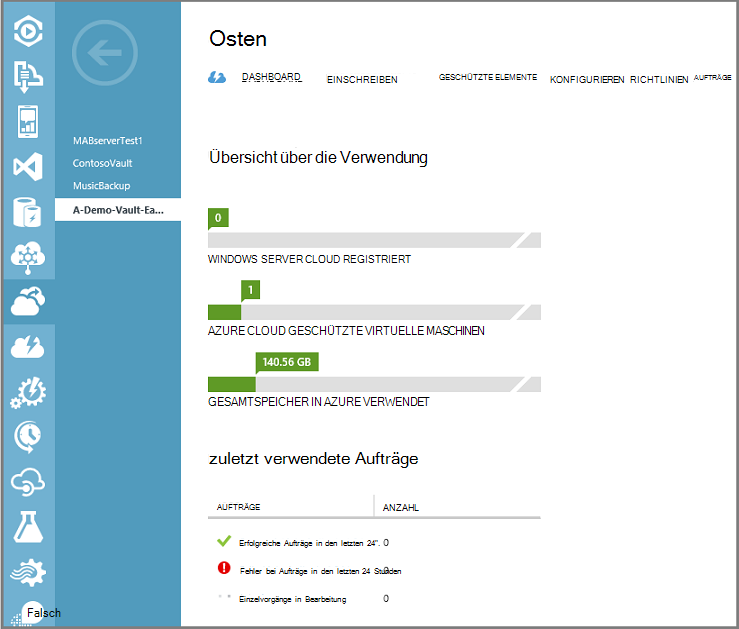

    Vault-Schaltpult wird geöffnet. Sehen Sie sich die Anzahl von Windows-Servern und Azure virtuelle Computer das Depot zugeordnet. Betrachten Sie auch den Gesamtspeicher in Azure verwendet. Sie müssen Sicherungsaufträge beenden und Löschen vorhandener Daten vor dem Löschen der Vault.

3. Klicken Sie auf die Registerkarte **Geschützt** und klicken Sie auf **Schutz aufheben**

    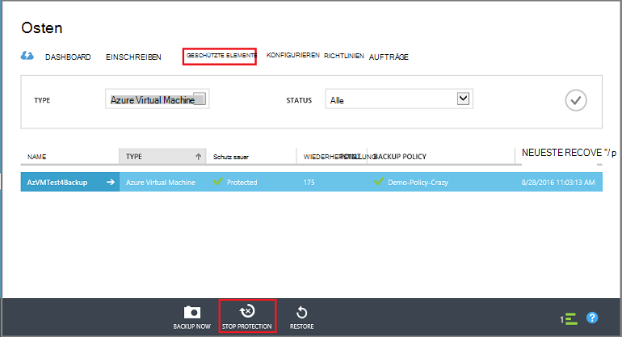

    **Beenden des Schutzes "Vault"** -Dialogfeld wird angezeigt.

4. Klicken Sie im Dialogfeld **Beenden des Schutzes "Vault"** Kontrollkästchen **zugeordnete Sicherungsdaten löschen** , und klicken Sie auf .  
   Optional können Sie einen Grund für das Beenden des Schutzes auswählen und ein Kommentar.

    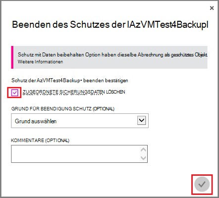

    Gelöschte Elemente in das Depot wird das Depot leer sein.

    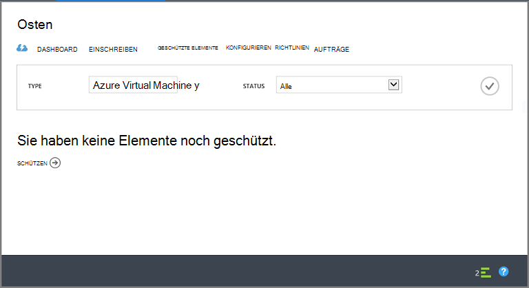

5. Klicken Sie in der Liste der Registerkarten auf **Registriert**. Wählen Sie für jedes Element im Tresor registriert das Element, und klicken Sie auf **Registrierung**.

    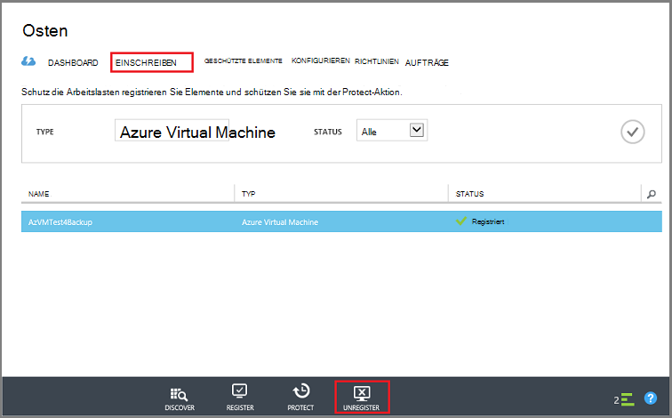

6. Klicken Sie in der Liste der Registerkarten auf **Dashboard** die Registerkarte öffnen. Überprüfen Sie, ob keine registrierten Server oder Azure VMs in der Cloud geschützt. Überprüfen Sie auch, dass keine Daten im Speicher. Klicken Sie auf **Löschen** , um den Speicher löschen.

    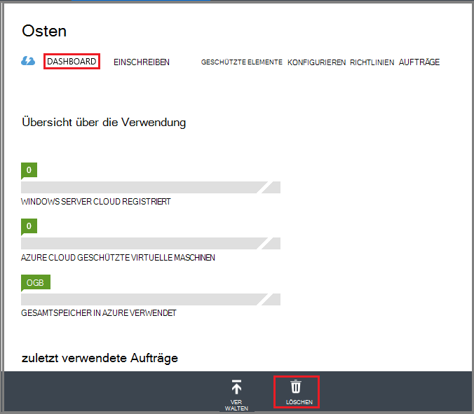

    Sicherung löschen Depot Bestätigungsfenster wird geöffnet. Wählen Sie eine Option, warum das Depot löschen, und klicken Sie auf .  

    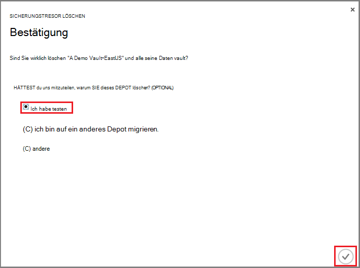

    Das Depot wird gelöscht und klassischen Portal Dashboard zurück.

### Suchen Sie Backup-Management Server registriert Depot

Haben mehrere Server in ein Depot registriert kann es schwer merken. Depot registrierten Server, und löschen Sie sie:

1. Öffnen Sie das Dashboard Depot.

2. Klicken Sie im Bereich **Essentials** **Einstellungen** öffnen, Blade.

    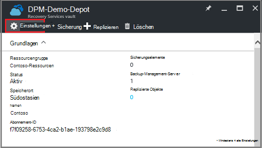

3. Klicken Sie auf **Blatt Einstellungen**auf **Backup-Infrastruktur**.

4. Klicken Sie auf **Backup-Management-Server**-Blade **Backup-Infrastruktur** . Das Backup-Management-Server-Blade wird geöffnet.

    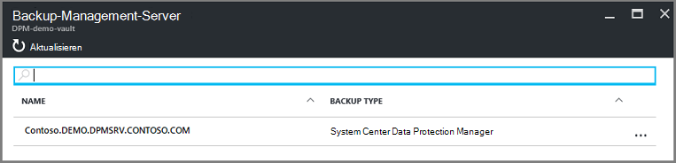

5. Löschen eines Servers aus der Liste den Namen des Servers und klicken Sie dann auf **Löschen**.
    Blatt **Löschen** wird geöffnet.

6. Geben Sie den Namen des Servers auf dem Blatt **Löschen** . Ist dies eine lange Name können Sie kopieren und Einfügen aus der Backup-Management-Server. Klicken Sie auf **Löschen**.  
