<properties
    pageTitle="Einführung in Azure DPM Sicherung | Microsoft Azure"
    description="Einführung in die DPM-Server mithilfe des Diensts für Azure Backup Sichern"
    services="backup"
    documentationCenter=""
    authors="Nkolli1"
    manager="shreeshd"
    editor=""
    keywords="System Center Data Protection Manager, DPM, Dpm-Sicherung"/>

<tags
    ms.service="backup"
    ms.workload="storage-backup-recovery"
    ms.tgt_pltfrm="na"
    ms.devlang="na"
    ms.topic="article"
    ms.date="08/08/2016"
    ms.author="trinadhk;giridham;jimpark;markgal;adigan"/>

# Vorbereiten der Arbeitslasten in Azure mit DPM sichern

> [AZURE.SELECTOR]
- [Azure Backup-Server](backup-azure-microsoft-azure-backup.md)
- [SCDPM](backup-azure-dpm-introduction.md)
- [Azure Backup-Server (klassisch)](backup-azure-microsoft-azure-backup-classic.md)
- [SCDPM (klassisch)](backup-azure-dpm-introduction-classic.md)

Dieser Artikel enthält eine Einführung in Microsoft Azure Backup zum Schutz von System Center Data Protection Manager (DPM)-Server und Arbeitslasten. Lesen, werden Sie verstehen:

- Funktionsweise von Azure DPM-Server-Sicherung
- Die erforderlichen Komponenten über einen reibungslosen backup Erfahrung
- Normalerweise Fehler und wie Sie damit umgehen
- Unterstützte Szenarios

> [AZURE.NOTE] Azure hat zwei Bereitstellungsmodelle für erstellen und Verwenden von Ressourcen: [Ressourcen-Manager und Classic](../resource-manager-deployment-model.md). Dieser Artikel bietet Informationen und Verfahren für das Wiederherstellen von VMs mit dem Ressourcen-Manager-Modell bereitgestellt.

System Center DPM unterstützt Datei-und Anwendungsdaten. Daten von DPM auf Band auf Festplatte gespeichert oder in Azure mit Microsoft Azure Backup gesichert. DPM interagiert mit Azure Backup wie folgt:

- **DPM als einen physischen Server oder lokalen virtuellen Computer bereitgestellt** , wenn DPM bereitgestellt, als physischen Server oder als lokale Hyper-V virtuelle Maschine Daten, Recovery Services Tresor neben Disk und Tape sichern backup.
- **DPM als Azure VM** – von System Center 2012 R2 mit Update 3 DPM als Azure virtuellen Computer bereitgestellt werden. Wenn DPM wie Azure virtuelle Computer bereitgestellt wird, Daten in Azure Datenträger sichern können, DPM Azure Virtual Machine an oder Entlastung der Speicherung von Daten bis zu einem Depot Recovery Services sichern.

## Warum Sichern von DPM in Azure?

Die Vorteile der Verwendung von Azure Backup zum Sichern von DPM-Servern gehören:

- Lokalen DPM-Bereitstellung können Sie Azure als Alternative zur langfristigen Einsatz auf Band.
- Für DPM-Installationen in Azure ermöglicht Azure Backup Speicher aus dem Azure offload ermöglicht die Skalierung durch ältere Daten in Recovery Services Depot und neue Daten auf der Festplatte gespeichert.

## Erforderliche Komponenten
Vorbereiten von Azure Backup Sichern von DPM-Daten wie folgt:

1. **Erstellen eines Depots Recovery Services** – ein Depot in Azure-Portal erstellen.
2. **Anmeldeinformationen zum Herunterladen Vault** -Anmeldeinformationen mit den DPM-Server Recovery Services Tresor registrieren zum Herunterladen.
3. **Installieren von Azure Backup-Agent** – von Azure Backup installieren Sie den Agent auf jedem DPM-Server.
4. **Registrieren Sie den Server** , der DPM-Server Recovery Services Tresor.

### 1. erstellen Sie 1. ein Depot Recovery services
So erstellen Sie ein Depot Recovery Services:

1. Mit der [Azure-Portal](https://portal.azure.com/)anmelden.

2. Im Hub klicken Sie auf **Durchsuchen** , und geben Sie in der Liste der Ressourcen **Recovery Services**. Beginn der Eingabe Filtern der Liste basierend auf Ihrer Eingabe. Klicken Sie auf **Recovery Services Tresor**.

    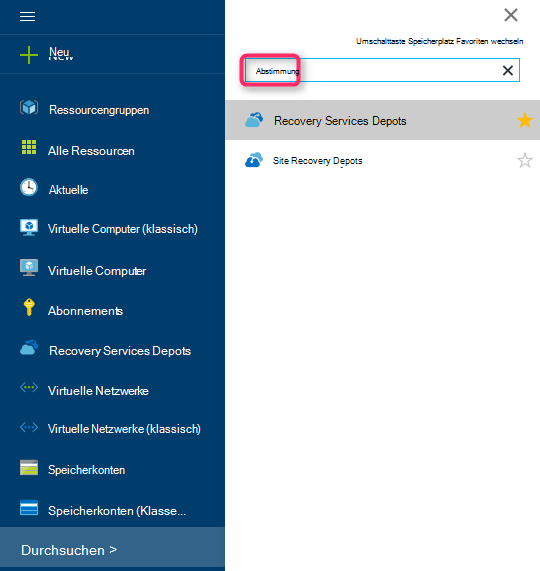

    Recovery Services Depots wird angezeigt.

3. Klicken Sie im Menü **Recovery Services Depots** **Hinzufügen**.

    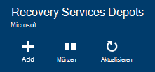

    Recovery Services Depot Blade geöffnet, **Name**, **Abonnements**, **Ressourcengruppe**und **Speicherort**angeben.

    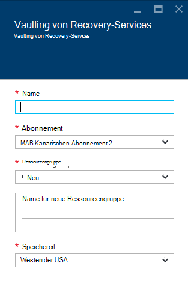

4. **Name**Geben Sie einen Anzeigenamen zu Tresor. Der Name muss eindeutig für den Azure-Abonnement. Geben Sie einen Namen ein, der zwischen 2 und 50 Zeichen enthält. Sie müssen mit einem Buchstaben beginnen und darf nur Buchstaben, Zahlen und Bindestriche.

5. Klicken Sie auf **Abonnement** finden in der Liste der Abonnements. Wenn Sie nicht sicher, welches Abonnement zu verwenden sind, verwenden Sie die Standardeinstellung (oder vorgeschlagene) Abonnement. Es werden mehrere Optionen nur wenn Konto Ihrer Organisation mehrere Azure-Abonnements zugeordnet ist.

6. Klicken Sie auf **Gruppe** finden in der Liste der Ressourcengruppen, oder klicken Sie auf **neu** , um eine neue Ressourcengruppe erstellen. Vollständige Informationen zu Ressourcengruppen finden Sie in [Azure-Ressourcen-Manager (Übersicht)](../azure-resource-manager/resource-group-overview.md)

7. Klicken Sie auf **Speicherort** wählen geografische Region für das Depot.

8. Klicken Sie auf **Erstellen**. Es dauert eine Weile Depot Recovery Services erstellt werden. Überwachen Sie Status Benachrichtigung im oberen rechten Bereich des Portals.
Erstellte Ihrem Tresor in das Portal geöffnet.

### Festlegen der Speicherreplikation

Storage Replication-Option können Sie zwischen Geo-redundant und lokal redundanter Speicher auswählen. Standardmäßig hat der Tresor Geo redundanten Speicher. Lassen Sie die Option Geo redundante Speicherung ist dies die primäre Sicherung. Wählen Sie lokal redundanten Speicher, wenn Sie ein billiger, die sehr langlebig. Lesen Sie mehr über [Geo-redundant](../storage/storage-redundancy.md#geo-redundant-storage) und [lokal redundanter](../storage/storage-redundancy.md#locally-redundant-storage) Speicher in [Azure Storage Replication Overview](../storage/storage-redundancy.md).

Einstellung für die Speicherung zu bearbeiten:

1. Wählen Sie den Tresor öffnen Vault-Dashboard und Blade-Einstellungen. Wenn Blatt **Einstellungen** öffnet, klicken Sie auf **Alle** Vault-Dashboard.

2. Klicken Sie auf Blatt **Einstellungen** auf **Backup-Infrastruktur** > **Sicherungskonfiguration** **Sicherungskonfiguration** Blade geöffnet. -Blade **Sicherungskonfiguration** die Option Storage Replication für den Tresor.

    

    Nach dem Auswählen der Speicheroption für Ihr Depot, können Sie die VM Tresor zuordnen. Die Zuordnung zunächst Sie entdecken und Azure virtuelle Computer registrieren.

### 2. Vault-Anmeldeinformationen zum Herunterladen

Die Datei Vault ist ein Zertifikat vom Portal für jede Sicherung Depot generiert. Das Portal lädt dann den öffentlichen Schlüssel an Access Control Service (ACS). Der private Schlüssel des Zertifikats wird dem Benutzer als Teil des Workflows zur Verfügung als Eingabe Registrierung Zustandsautomatworkflow eingeräumt. Dies authentifiziert die Maschine Sicherungsdaten identifizierten Tresor in Azure Backup Service senden.

Vault-Anmeldeinformationen ist nur während der Registrierung Workflow verwendet. Es obliegt dem Benutzer sicherstellen, dass die Datei Vault ist. Fällt in eine nicht autorisierte Benutzer, kann die Datei Vault sich andere Computer gegen dasselbe Depot verwendet werden. Backup-Daten verschlüsselt ist die Verwendung einer Passphrase Kunden gehört, können nicht jedoch vorhandene Sicherungsdaten beeinträchtigt. Um dieses Problem zu verringern, sind Vault Anmeldeinformationen in 48 Stunden Gültigkeitsdauer festgelegt. Mehrfach-Depot Anmeldeinformationen von Recovery-Diensten herunterladen kann jedoch nur der aktuelle Depot Anmeldeinformationsdatei während des Registrierung Workflows.

Vault-Anmeldeinformationsdatei wird über einen sicheren Kanal von Azure-Portal heruntergeladen. Azure Backup-Dienst ist nicht der private Schlüssel des Zertifikats und des privaten Schlüssels wird in das Portal oder den Dienst. Gehen Sie Vault Anmeldeinformationsdatei auf einem lokalen Computer herunterzuladen.

1. Mit der [Azure-Portal](https://portal.azure.com/)anmelden.

2. Tresor öffnen Recovery Services, Computer, DPM registriert werden sollen.

3. Einstellungen-Blades wird standardmäßig geöffnet. Wenn sie geschlossen ist, klicken Sie auf **Einstellungen** Depot Dashboard Blatt Einstellungen öffnen. Blatt Einstellungen klicken Sie auf **Eigenschaften**.

    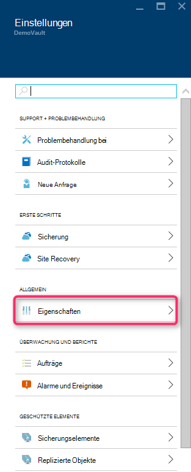

4. Klicken Sie auf der Seite Eigenschaften unter **Sicherung Anmeldeinformationen** **herunterladen** . Generiert die Vault Anmeldeinformationsdatei zum Download zur Verfügung gestellt wird.

    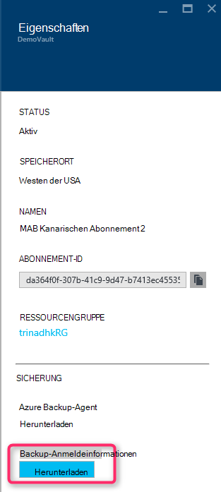

Das Portal generiert tresoranmeldeinformationen mit einer Kombination aus den Vault-Namen und das aktuelle Datum. Klicken Sie auf **Speichern** , um Vault Anmeldeinformationen in das lokale Konto Downloads Ordner herunterladen oder Menü speichern Speichern einen Speicherort für die Vault-Anmeldeinformationen an. Es wird eine Minute zu generierenden Datei dauern.

### Hinweis
- Sicherstellen Sie, dass die Depot Datei an einem Speicherort gespeichert wird, der auf Ihrem Computer. Wenn sie eine Datei freigeben/SMB gespeichert ist, für die Zugriffsberechtigungen überprüfen.
- Die Datei Depot wird nur während der Registrierung Workflow verwendet.
- Datei der Vault nach 48 Stunden abläuft und aus dem Portal heruntergeladen werden.

### 3. Backup-Agent installieren

Nach dem Erstellen des Azure Backup-Tresors, sollte ein Agent auf jedem Windows-Computer (Windows Server, Windows-Client, System Center Data Protection Manager-Server oder Azure Backup-Server-Computer), das Sichern von Daten und Anwendung in Azure ermöglicht installiert werden.

1. Tresor öffnen Recovery Services, Computer, DPM registriert werden sollen.

2. Einstellungen-Blades wird standardmäßig geöffnet. Wenn sie geschlossen ist, klicken Sie auf **Einstellung** Einstellungen-Blades öffnen. Blatt Einstellungen klicken Sie auf **Eigenschaften**.

    

3. Klicken Sie auf der Seite Einstellungen unter **Azure Backup Agent** **herunterladen** .

    

   Nach dem Herunterladen des Agents einen Doppelklick MARSAgentInstaller.exe Installation von Azure Backup-Agent starten. Wählen Sie den Installationsordner Ablageordner für den Agenten erforderlich. Speicherort des angegebenen benötigen Speicherplatz mindestens 5 % der backup-Daten.

4.  Verwenden Sie einen Proxy-Server für die Verbindung mit dem Internet im Bildschirm **Proxy-Konfiguration** Geben Sie die Proxy Server. Verwenden Sie einen authentifizierten Proxy Geben Sie Benutzerinformationen und Kennwort in diesem.

5.  Azure Backup Agent installiert.NET Framework 4.5 und Windows PowerShell (falls es nicht bereits vorliegt) um die Installation abzuschließen.

6.  Sobald der Agent installiert ist, Sie **Schließen** das Fenster.

    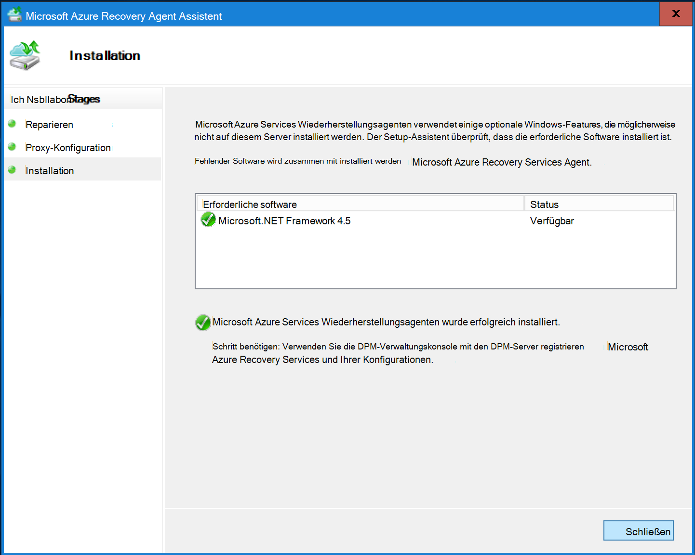

7. Klicken Sie auf **Online**Depot in der Registerkarte **Verwaltung** **der DPM-Server** . Wählen Sie **Registrieren**. Registrieren Sie Setup-Assistent wird geöffnet.

8. Verwenden Sie einen Proxy-Server für die Verbindung mit dem Internet im Bildschirm **Proxy-Konfiguration** Geben Sie die Proxy Server. Verwenden Sie einen authentifizierten Proxy Geben Sie Benutzerinformationen und Kennwort in diesem.

    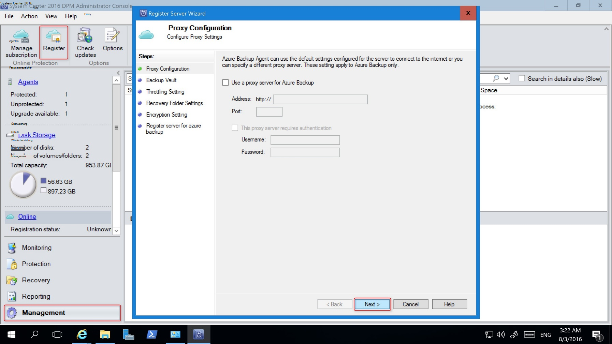

9. Bildschirm Anmeldeinformationen Vault zu suchen und Auswählen der Datei Depot die zuvor heruntergeladen wurde.

    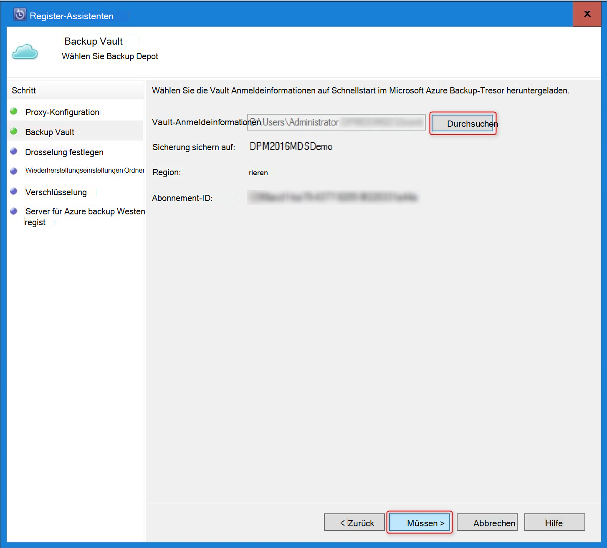

    Die Datei Vault gilt nur für 48 Std. (nachdem das Portal heruntergeladen wurde). Wenn dieser Bildschirm (z. B. "Vault Anmeldeinformationen Datei abgelaufen"), bei Azure-Portal und Download Depot Anmeldeinformationen erneut Datei Fehler auftreten.

    Sicherstellen Sie, dass die Datei Vault verfügbar an einem Ort die Setup-Anwendung zugegriffen werden kann. Sollten Sie Fehler Zugriff die Depot Datei in ein temporäres Verzeichnis auf diesem Computer kopieren und wiederholen Sie den Vorgang.

    Wenn ein ungültiger Depot Anmeldeinformationen Fehler (z. B. "Ungültige Depot Anmeldeinformationen bereitgestellt") die Datei ist entweder beschädigt oder enthält nicht die aktuellen Anmeldeinformationen zugeordnet Recovery Service. Versuchen Sie nach dem Download eine neue Vault-Anmeldeinformationen über das Portal. Dieser Fehler tritt in der Regel die Option **Download Depot Anmeldeinformationen** in Azure-Portal hintereinander klickt der Benutzer. In diesem Fall ist nur der zweite Depot Anmeldeinformationsdatei gültig.

10. Um die Auslastung der Netzwerkbandbreite während der Arbeit und arbeitsfreien Stunden im Bildschirm **Drosselung Einstellung** steuern können Verwendung Bandbreitengrenzwerte festlegen und definieren die Arbeit und arbeitsfreien Stunden.

    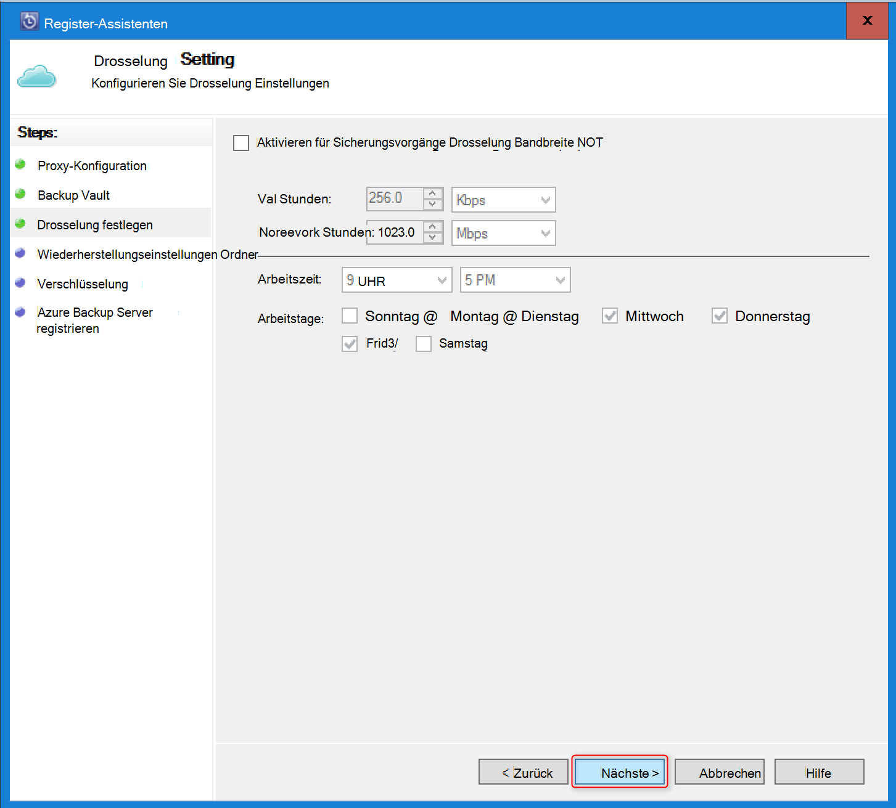

11. Im Bildschirm **Recovery Einstellung** wird vorübergehend suchen den Ordner, in dem die Dateien von Azure, bereitgestellt werden.

    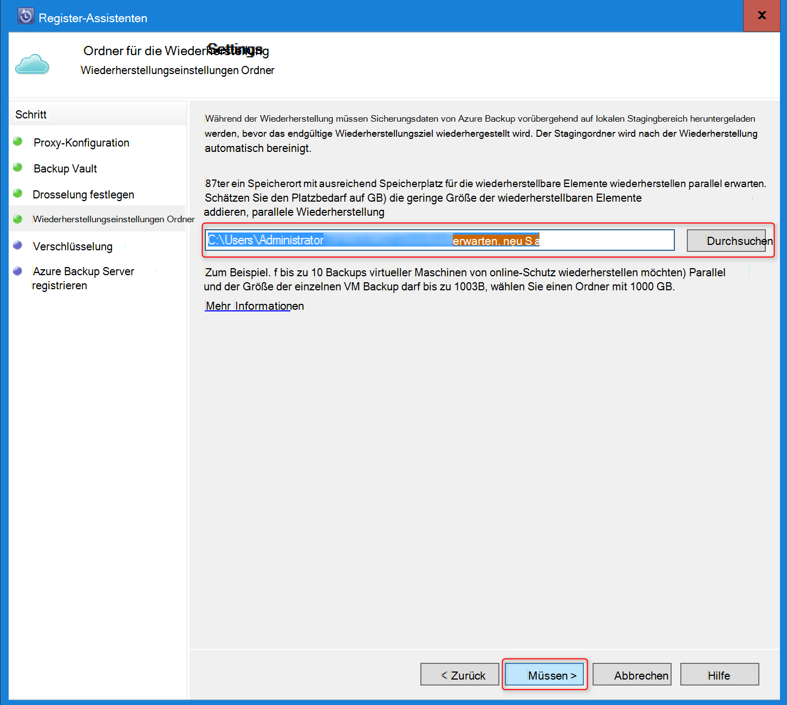

12. Im Bildschirm **Verschlüsselung** generieren eine Passphrase oder ein Kennwort (mindestens 16 Zeichen) angeben. Denken Sie daran, das Kennwort an einem sicheren Ort speichern.

    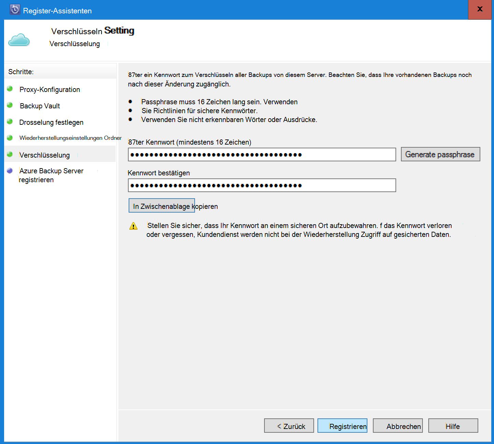

    > [AZURE.WARNING] Wenn das Kennwort verloren oder vergessen. Hilfe kann nicht in der backup-Daten wiederherstellen. Der Benutzer besitzt die verschlüsselungspassphrase und Microsoft keinen Einblick in die Passphrase vom Endbenutzer verwendet. Speichern Sie die Datei an einem sicheren Ort wie bei einem Wiederherstellungsvorgang erforderlich ist.

13. Nach der Schaltfläche **Registrieren anklicken** der Computer erfolgreich Depot registriert und können nun Microsoft Azure Backup starten.

14. Wenn Sie Data Protection Manager verwenden, können Sie während der Registrierung Workflow durch Klicken die Option **Konfigurieren** auswählen **Online** unter **der Registerkarte** angegebene ändern.

## Vorschriften (und Grenzen)

- DPM kann als physischen Server oder einem Hyper-V-VM auf System Center 2012 SP1 oder System Center 2012 R2 installiert ausgeführt werden. Kann auch als eine Azure virtuellen Computer mit System Center 2012 R2 mit mindestens ausgeführt werden DPM 2012 R2 Updaterollup 3 oder einem Windows-Computer in System Center 2012 R2 mit mindestens unter VMWare Updaterollup 5.
- Wenn Sie DPM mit System Center 2012 SP1 ausführen sollten Sie eine Aktualisierung für 2 für System Center Data Protection Manager SP1 installieren. Dies ist erforderlich, bevor Azure Backup-Agent installieren zu können.
- Der DPM-Server muss Windows PowerShell und .net Framework 4.5 installiert.
- DPM kann die meisten Arbeitslasten auf Azure Backup sichern. Für eine vollständige Liste der unterstützten Siehe hat unterstützen Azure Backup Elemente.
- Mit der Option "auf Band kopieren" können Daten in Azure Backup wiederhergestellt werden.
- Sie benötigen ein Azure-Konto mit Azure Backup aktiviert. Wenn Sie ein Konto haben, können Sie ein kostenloses Testabo in wenigen Minuten erstellen. Informationen Sie zu [Preisen Azure Backup](https://azure.microsoft.com/pricing/details/backup/).
- Mithilfe von Azure Backup erfordert Azure Backup-Agent auf den Servern installiert werden, die Sie sichern möchten. Jeder Server muss mindestens 5 % der Größe der Daten, die als lokaler Speicher gesichert wird. 100 GB an Daten sichern muss z. B. mindestens 5 GB Speicherplatz Scratch an.
- Die Daten werden in der Azure-Tresor. Ist unbegrenzt, bis ein Azure Backup vault können, Datenmenge, aber die Größe einer Datenquelle (z. B. einen virtuellen Computer oder eine Datenbank) sollte 54400 GB nicht überschreiten.

Diese Dateitypen werden bis Azure unterstützt:

- Verschlüsselt (vollständige Sicherung)
- Komprimiert (inkrementelle Backups unterstützt)
- Sparse (inkrementelle Backups unterstützt)
- Komprimierte und sparse (als Sparse)

Und diese werden nicht unterstützt:

- Server in Kleinschreibung Dateisysteme werden nicht unterstützt.
- Feste Links (übersprungen)
- Analysepunkte (übersprungen)
- Verschlüsselte und komprimierte (übersprungen)
- Verschlüsselten und vereinzelten (übersprungen)
- Komprimierte stream
- Sparse-stream

>[AZURE.NOTE] Vom können in System Center 2012 DPM mit SP1 ab Sie Arbeitslasten geschützt durch DPM Azure mit Microsoft Azure Backup sichern.
