<properties
    pageTitle="Verwalten und Überwachen von Azure Virtual Machine Backups | Microsoft Azure"
    description="Informationen Sie zum Verwalten und Überwachen von Azure Virtual Machine-backups"
    services="backup"
    documentationCenter=""
    authors="trinadhk"
    manager="shreeshd"
    editor=""/>

<tags
    ms.service="backup"
    ms.workload="storage-backup-recovery"
    ms.tgt_pltfrm="na"
    ms.devlang="na"
    ms.topic="article"
    ms.date="08/31/2016"
    ms.author="trinadhk; jimpark; markgal;"/>

# <a name="manage-and-monitor-azure-virtual-machine-backups"></a>Verwalten und Überwachen von Azure Virtual Machine backups

> [AZURE.SELECTOR]
- [Verwalten von Azure VM-backups](backup-azure-manage-vms.md)
- [Klassische VM Backups managen](backup-azure-manage-vms-classic.md)

Dieser Artikel enthält Informationen zu allgemeinen Überwachungsaufgaben für Klassisch virtuelle Maschinen in Azure geschützt.  

>[AZURE.NOTE] Azure hat zwei Bereitstellungsmodelle für erstellen und Verwenden von Ressourcen: [Ressourcen-Manager und Classic](../resource-manager-deployment-model.md). Informationen zum Arbeiten mit klassischen Bereitstellungsmodell VMs finden Sie unter [Vorbereitung Ihrer Umgebung Azure virtuelle Computer sichern](backup-azure-vms-prepare.md) .

## <a name="manage-protected-virtual-machines"></a>Geschützte virtuelle Maschinen verwalten

Geschützte virtuelle Maschinen zu verwalten:

1. Zum Anzeigen und Verwalten klicken backup für einen virtuellen Computer die Registerkarte **Geschützt** .

2. Klicken Sie auf ein geschütztes Element auf der Registerkarte **Sicherungsdetails** zeigt Informationen über die letzte Sicherung.

    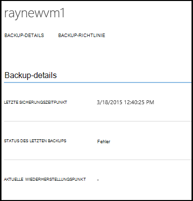

3. Zum Anzeigen und Verwalten von backup-Richtlinie klicken Sie für einen virtuellen Computer die Registerkarte **Richtlinien** .

    

    Die Registerkarte **Sicherungsrichtlinien** zeigt die vorhandene Richtlinie. Sie können nach Bedarf ändern. Erstellen eine neue Richtlinie klicken Sie **Erstellen** auf **der Seite** . Beachten Sie, dass wenn eine Richtlinie entfernen alle virtuellen Computer zugeordnet haben sollte.

    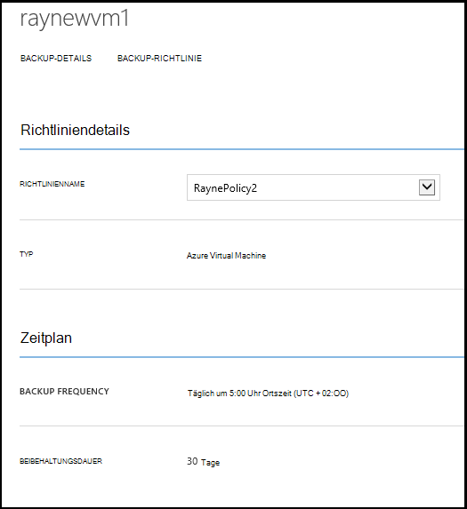

4. Sie erhalten weitere Informationen über Aktionen oder Status für einen virtuellen Computer auf der Seite **Projekte** . Klicken Sie auf ein Projekt in der Liste, um weitere Informationen zu erhalten oder filtern Sie Aufträge für einen bestimmten virtuellen Computer.

    

## <a name="on-demand-backup-of-a-virtual-machine"></a>Sicherung bei Bedarf eines virtuellen Computers
Sie können on-Demand nutzen backup einer virtuellen Maschine nach der Konfiguration für den Schutz. Wenn die anfängliche Sicherung aussteht für den virtuellen Computer wird bei Bedarf eine vollständige Kopie des virtuellen Computers in Azure backup Depot erstellen. Erste Sicherung ist nur senden Änderungen aus einer vorherigen Sicherung Azure Backup z. B. vault backup wird bei Bedarf immer inkrementell.

>[AZURE.NOTE] Aufbewahrungswert für tägliche Archivierung Sicherungsrichtlinie für die VM Beibehaltungsdauer eine Sicherung bei Bedarf fest.  

Zu on-Demand backup eines virtuellen Computers:

1. Navigieren Sie zu der Seite **Geschützte Elemente** und wählen Sie **Azure Virtual Machine** **Dateityp** (falls nicht bereits aktiviert) und klicken Sie auf **auswählen** .

    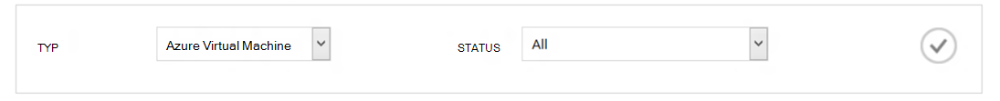

2. Wählen Sie den virtuellen Computer, die Sie auf on-Demand backup und klicken auf **Jetzt sichern,** am unteren Rand der Seite.

    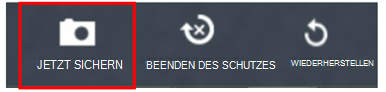

    Dies erstellt einen Sicherungsauftrag auf dem ausgewählten virtuellen Computer. Beibehaltungsdauer der Wiederherstellungspunkt durch diesen Auftrag erstellt wird, der im virtuellen Computer zugeordnete Richtlinie übereinstimmen.

    

    >[AZURE.NOTE] Um einen virtuellen Computer zugeordnete Richtlinie anzuzeigen, Drilldown in virtuellen Computer auf **Geschützte Elemente** und wechseln Sie zur Registerkarte Sicherungsrichtlinie.

3. Nachdem das Projekt erstellt wurde, können Sie in der Leiste Toast an der entsprechenden Stelle auf der Seite Projekte auf **Auftrag anzeigen** klicken.

    

4. Nach dem erfolgreichen Abschluss des Auftrags wird ein Wiederherstellungspunkt erstellt mit dem virtuellen Computer wiederherstellen. Dies wird auch Recovery Point-Spaltenwert 1 Seite **Geschützte Elemente** erhöht.

## <a name="stop-protecting-virtual-machines"></a>Beenden Sie den Schutz von virtuellen Maschinen
Sie können zukünftigen Sicherungskopien von einem virtuellen Computer mit den folgenden Optionen zu wählen:

- Daten Sie backup zugeordneten virtuellen Computer in Azure Backup vault
- Löschen Sie backup-Daten zugeordneten virtuellen Computer

Wenn Sie backup Daten zugeordneten virtuellen Computer ausgewählt haben, können Sie die Sicherungsdaten, zum Wiederherstellen des virtuellen Computers. Preisinformationen für solche virtuellen Maschinen finden Sie [hier](https://azure.microsoft.com/pricing/details/backup/).

Beim Beenden des Schutzes für einen virtuellen Computer:

1. Navigieren Sie zur Seite **Geschützte Elemente** wählen Sie **Azure VM** als Filter (falls nicht bereits aktiviert) und klicken Sie auf **auswählen** .

    

2. Wählen Sie den virtuellen Computer, und klicken Sie auf **Schutz beenden** am unteren Rand der Seite.

    

3. In der Standardeinstellung löschen nicht Azure Backup backup-Daten der virtuellen Maschine zugeordnet.

    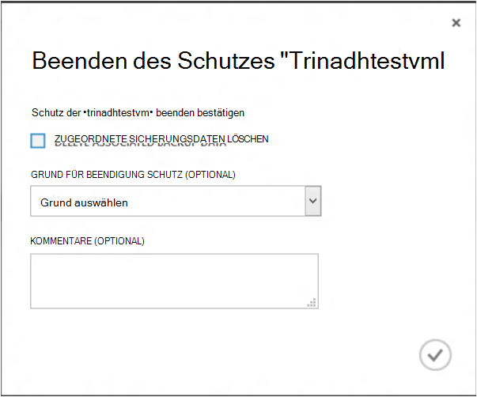

    Wenn Sie Daten löschen möchten, aktivieren Sie das Kontrollkästchen.

    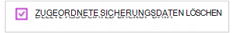

    Wählen Sie einen Grund für die Sicherung beendet. Dies ist, zwar optional hilft Angabe von Gründen Azure Backup die Bewertung und Priorisierung der Kundenszenarien.

4. Klicken Sie auf **Absenden den **Schutz** Auftrag senden** . Klicken Sie auf **Auftrag anzeigen** , finden das entsprechende Projekt auf **Aufträge** .

    

    Wenn Sie nicht **zugeordnete Sicherungsdaten löschen** während **Dokumentschutz** Assistenten und Projektabschluss buchen gewählt haben, ändert Schutzstatus **Schutz**gestoppt. Die Daten bleiben mit Azure Backup bis sie explizit gelöscht wird. Sie können jederzeit Daten löschen, den virtuellen Computer auf **Geschützte Elemente** markieren und auf **Löschen**.

    

    Bei Auswahl die Option **zugeordnete Sicherungsdaten löschen** wird nicht den virtuellen Computer Teil der Seite **Geschützte Elemente** sein.

## <a name="re-protect-virtual-machine"></a>VM wieder schützen
Wenn nicht die Option **Löschen zuordnen Sicherungsdaten** Schutz **Beenden**ausgewählt haben, können Sie den virtuellen Computer wie registrierte virtuellen Computer folgendermaßen erneut schützen. Geschützt, diesem virtuellen Computer müssen Sicherungsdaten vor Schutz beibehalten und Wiederherstellungspunkte erstellt nach wieder schützen.

Nach wieder schützen wird Sicherheitsstatus der virtuellen Maschine in **Protected** geändert sind Recovery vor **Schutz aufheben**.

  

>[AZURE.NOTE] Wenn der virtuelle Computer schützen, können Sie eine andere Richtlinie als die Richtlinie mit denen virtuellen Computer ursprünglich geschützt wurde.

## <a name="unregister-virtual-machines"></a>Virtuelle Computer abmelden

Wenn Sie den virtuellen Computer aus dem backup Tresor entfernen möchten:

1. Klicken Sie am unteren Rand der Seite auf **ABMELDEN** .

    

    Popupbenachrichtigung erscheint am unteren Bildschirmrand Bestätigung anfordern. Klicken Sie auf **Ja,** um fortzufahren.

    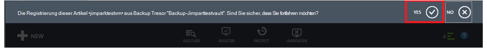

## <a name="delete-backup-data"></a>Backup-Daten löschen
Sie können entweder mit einem virtuellen Computer verbundenen backup-Daten:

- Während der Schutzauftrag beenden
- Nach einem Schutz wird auf einem virtuellen Computer abgeschlossen

Backup-Daten auf einer virtuellen Maschine *Schutz gestoppt* ist buchen löschen erfolgreiche Sicherungsauftrag **Beendet** :

1. Navigieren Sie zu der Seite **Geschützte Elemente** , wählen Sie **Azure Virtual Machine** *Dateityp* , und klicken Sie auf die Schaltfläche **auswählen** .

    

2. Wählen Sie den virtuellen Computer. Die virtuellen Computer werden Status **Schutz beendet** .

    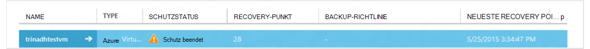

3. Klicken Sie auf die Schaltfläche **Löschen** am unteren Rand der Seite.

    

4. Assistenten zum **Löschen von Sicherungsdaten** einen Grund für das Löschen von Sicherungsdaten (dringend empfohlen) und klicken Sie auf **Absenden**.

    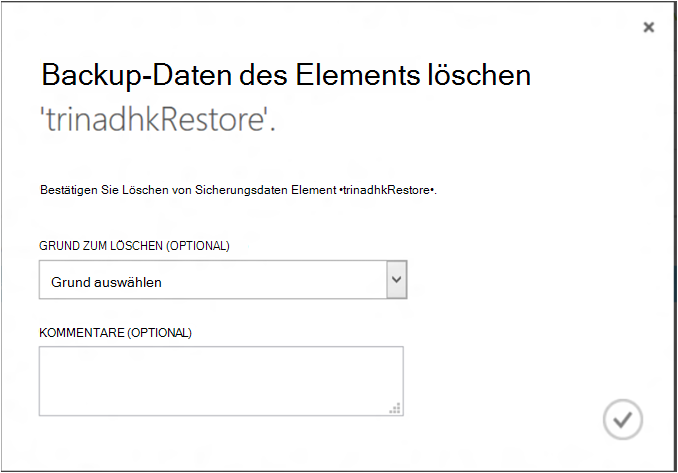

5. Dadurch wird einen Auftrag zum Löschen von Sicherungsdaten ausgewählten virtuellen Computer erstellt. Klicken Sie auf **Auftrag anzeigen** , um entsprechende Aufgabe auf Aufträge.

    

    Wenn der Auftrag abgeschlossen ist, wird der Eintrag für den virtuellen Computer auf **geschützte Elemente** entfernt.

## <a name="dashboard"></a>Dashboard
Überprüfen Sie auf **der Dashboardseite** Informationen Azure VMs, Speicher und Aufträge in den letzten 24 Stunden zugeordnet. Sie können backup-Status und zugeordneten backup Fehler anzeigen.


>[AZURE.NOTE] Werte im Dashboard werden alle 24 Stunden aktualisiert.

## <a name="auditing-operations"></a>Überwachen von Vorgängen
Azure Backup bietet Überblick der "Protokolle" backup-Vorgänge ausgelöst durch den Kunden damit sehen genau welche Verwaltungsvorgänge auf dem backup durchgeführt wurden. Log hervorragende Post Mortem aktivieren und Unterstützung für backup-Vorgänge überwachen.

Die folgenden Vorgänge werden im Protokolle protokolliert:

- Registrieren
- Registrierung
- Schutz konfigurieren
- Sicherung (beide geplant und bei Bedarf Backup über erstellen)
- Wiederherstellen
- Beenden des Schutzes
- Backup-Daten löschen
- Richtlinie hinzufügen
- Richtlinie löschen
- Richtlinie
- Auftrag abbrechen

Ein backup Depot für Protokolle anzeigen:

1. Navigieren Sie in Azure-Portal **Management Services** , und klicken Sie dann auf die Registerkarte **Protokolle** .

    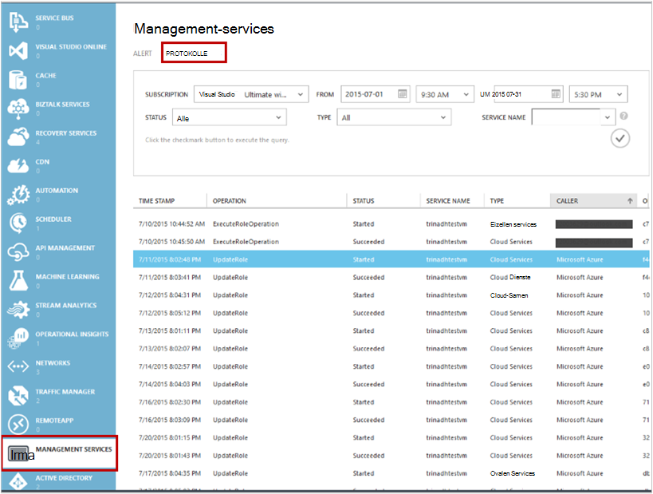

2. Die Filter *Wählen Sie **Backup** * Namen Sie backup Depot *Dienstnamen* ein, und klicken Sie auf **Senden**.

    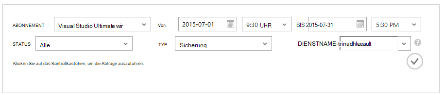

3. Das Log einen Vorgang und klicken Sie auf **Details** , um Details für einen Vorgang anzuzeigen.

    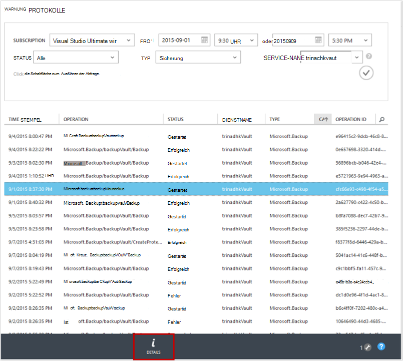

    **Details-Assistent** enthält Informationen über den Vorgang ausgelöst, Job-Id Ressource mit diesen Vorgang ausgelöst und Startzeit des Vorgangs.

    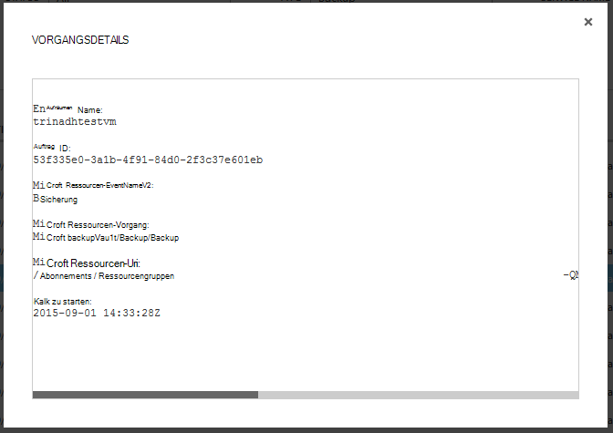

## <a name="alert-notifications"></a>Benachrichtigung
Sie können benutzerdefinierte Benachrichtigungen für die Aufträge im Portal abrufen. Dies wird durch Definieren von Warnregeln PowerShell basiert auf Betriebsprotokolle Ereignisse. Wir empfehlen *PowerShell Version 1.3.0 oder*.

Definieren Sie eine benutzerdefinierte Benachrichtigung Sicherungsfehler informiert wird Beispiel aussehen:

```
PS C:\> $actionEmail = New-AzureRmAlertRuleEmail -CustomEmail contoso@microsoft.com
PS C:\> Add-AzureRmLogAlertRule -Name backupFailedAlert -Location "East US" -ResourceGroup RecoveryServices-DP2RCXUGWS3MLJF4LKPI3A3OMJ2DI4SRJK6HIJH22HFIHZVVELRQ-East-US -OperationName Microsoft.Backup/backupVault/Backup -Status Failed -TargetResourceId /subscriptions/86eeac34-eth9a-4de3-84db-7a27d121967e/resourceGroups/RecoveryServices-DP2RCXUGWS3MLJF4LKPI3A3OMJ2DI4SRJK6HIJH22HFIHZVVELRQ-East-US/providers/microsoft.backupbvtd2/BackupVault/trinadhVault -Actions $actionEmail
```

**ResourceId**: Sie erhalten diese von Log Popup als Abschnitt in beschrieben. ResourceUri im Popup-Detailfenster eines Vorgangs wird ResourceId für dieses Cmdlet bereitgestellt werden.

**OperationName**: werden im Format "Microsoft.Backup/backupvault/<EventName>" wo EventName registrieren, Registrierung, ConfigureProtection, sichern, wiederherstellen, StopProtection, DeleteBackupData, CreateProtectionPolicy, DeleteProtectionPolicy, UpdateProtectionPolicy

**Status**: unterstützten Werte sind gestartet, erfolgreich und fehlgeschlagen.

**ResourceGroup**: ResourceGroup der Ressource auf der Operation ausgelöst. Sie erhalten diese von ResourceId Wert. Wert zwischen Feldern */resourceGroups/* und */providers/* ResourceId Wert ist der Wert für ResourceGroup.

**Name**: Name der Warnregel.

**CustomEmail**: Geben Sie die e-Mail Adresse, Benachrichtigung senden soll,

**SendToServiceOwners**: Diese Option sendet die Benachrichtigung für alle Administratoren und Co-Administratoren des Abonnements. Sie können in **Neu-AzureRmAlertRuleEmail** -Cmdlet verwendet werden

### <a name="limitations-on-alerts"></a>Beschränkungen Alerts
Event-basierte Alarme unterliegen die folgenden Nachteile:

1. Alarme werden auf alle virtuellen Computer in das backup Depot ausgelöst. Sie können nicht für bestimmte virtuelle Computer in einem backup Alerts zu ändern.
2. Dieses Feature ist in der Vorschau. [Weitere Informationen](../monitoring-and-diagnostics/insights-powershell-samples.md#create-alert-rules)
3. Erhalten Sie Alerts von "alerts-noreply@mail.windowsazure.com". E-Mail-Absender können derzeit nicht geändert werden.

## <a name="next-steps"></a>Nächste Schritte

- [Wiederherstellen von Azure VMs](backup-azure-restore-vms.md)
