<properties
    pageTitle="Ressourcen-Manager bereitgestellten virtuellen Computer Backups managen | Microsoft Azure"
    description="Informationen Sie zum Verwalten und Überwachen von Backups virtueller Maschinen Ressourcen-Manager bereitgestellt"
    services="backup"
    documentationCenter=""
    authors="trinadhk"
    manager="shreeshd"
    editor=""/>

<tags
    ms.service="backup"
    ms.workload="storage-backup-recovery"
    ms.tgt_pltfrm="na"
    ms.devlang="na"
    ms.topic="article"
    ms.date="08/11/2016"
    ms.author="jimpark; markgal; trinadhk"/>

# Verwalten von Azure Virtual Machine backups

> [AZURE.SELECTOR]
- [Verwalten von Azure VM-backups](backup-azure-manage-vms.md)
- [Klassische VM Backups managen](backup-azure-manage-vms-classic.md)

Dieser Artikel enthält Hinweise zur Verwaltung von VM-Backups und backup Alerts der Informationen im Portal Dashboard erläutert. Die Anleitung in diesem Artikel gilt für mit VMs mit Recovery Services. Dieser Artikel behandelt nicht die Erstellung von virtuellen Maschinen und erklärt zum Schutz von virtuellen Maschinen. Einführung in Azure-Ressourcen-Manager bereitgestellte VMs in Azure mit einer Recovery Services schützen, finden Sie unter [zuerst: Sichern von VMs in ein Depot Recovery Services](backup-azure-vms-first-look-arm.md).

## Verwalten von Depots und geschützte virtuelle Maschinen

In Azure-Portal bietet Recovery Services Depot Dashboard Informationen einschließlich Depot:

- aktuelle backup Snapshot ist auch die aktuellsten Wiederherstellungspunkt < Br\>
- die Sicherungsrichtlinie < Br\>
- Gesamtgröße aller backup-Snapshots < Br\>
- der virtuelle Computer, die mit dem geschützten < Br\>

Viele Verwaltungsaufgaben mit einem Backups virtueller Maschinen beginnen mit dem Depot im Dashboard. Da Depots zu mehreren Elementen oder mehrere VMs, um Details einer bestimmten VM verwendet werden können, öffnen Sie jedoch Depot Element Dashboard. Die folgende Prozedur wird das *Depot Dashboard* öffnen und dann das *Depot Element Dashboard*veranschaulicht. Beide Verfahren wie das Depot und Vaulting Element Azure Dashboard mit Pin Dashboard Befehl gibt "Tipps". PIN Dashboard ist eine Möglichkeit, eine Verknüpfung zum Depot oder Element. Häufig verwendete Befehle können auch über die Verknüpfung ausführen werden.

>[AZURE.TIP] Wenn Sie mehrere Dashboards und Blades öffnen, verwenden Sie den Schieberegler Dunkelblau am unteren Fensterrand Azure Dashboard hin und her schieben.

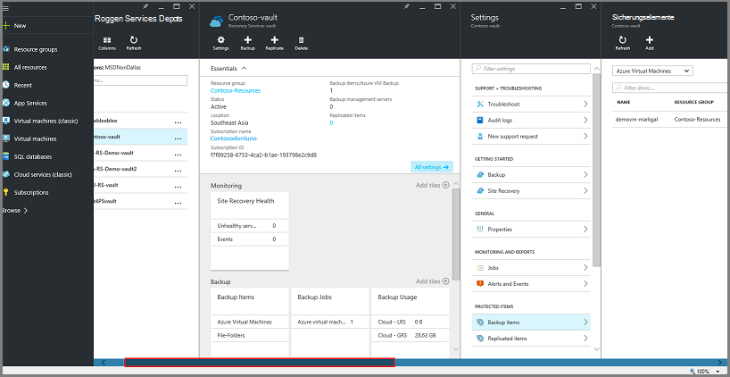

### Öffnen Sie im Dashboard ein Depot Recovery Services:

1. Mit der [Azure-Portal](https://portal.azure.com/)anmelden.

2. Im Hub klicken Sie auf **Durchsuchen** , und geben Sie in der Liste der Ressourcen **Recovery Services**. Wie Sie mit der Eingabe beginnen, die Liste Filter basierend auf Ihrer Eingabe. Klicken Sie auf **Recovery Services Tresor**.

      

    Recovery Services Depots werden angezeigt.

    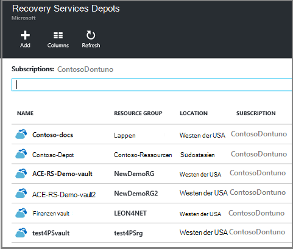  

    >[AZURE.TIP] Anheften ein Depots Azure Dashboard ist dieses Depot sofort verfügbar Azure-Portal öffnen. Um in der Liste Depot ein Depot, um das Dashboard anheften, das Depot Maustaste und wählen Sie **Dashboard**.

3. Wählen Sie das Depot auf der Dashboard aus Depots. Beim Auswählen des Tresors öffnen Vault-Dashboard und Blade- **Einstellungen** . In der folgenden Abbildung ist **Contoso Vault** -Dashboard hervorgehoben.

    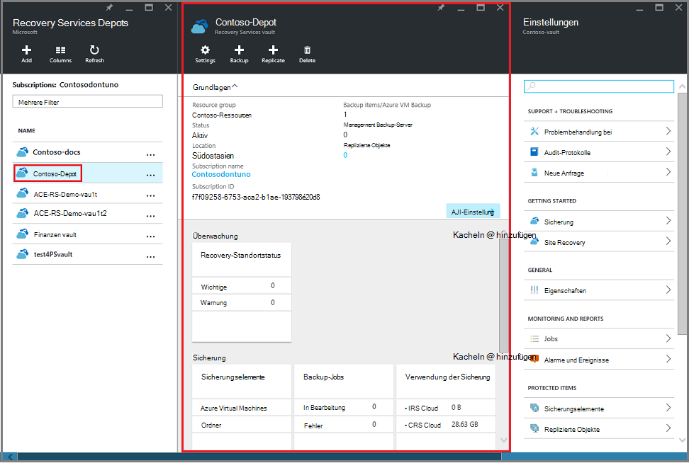

### Öffnen Sie ein Dashboard Depot Element

In der vorherigen Prozedur öffnen Sie Vault-Dashboard. Dashboard Element Tresor öffnen:

1. Klicken Sie im Dashboard Depot auf der Kachel **Sicherung Elemente** auf **Azure Virtual Machines**.

    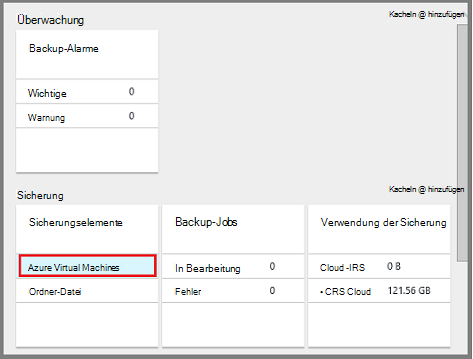

    **Sicherungselemente** Blade führt den letzten Sicherungsauftrag für jedes Element. In diesem Beispiel wird ein virtueller Computer, Demovm-Markgal von diesen Tresor geschützt.  

    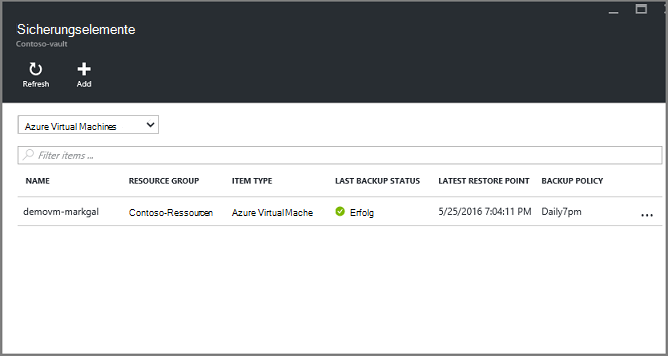

    >[AZURE.TIP] Zur Vereinfachung des Zugriffs können Sie ein Depotelement Azure Dashboard anheften. Zum Fixieren einer Vault-Element in der Liste Depot Maustaste, und wählen Sie **Dashboard**.

2. Blatt **Sicherung Elemente** klicken Sie Dashboard Element Tresor öffnen.

    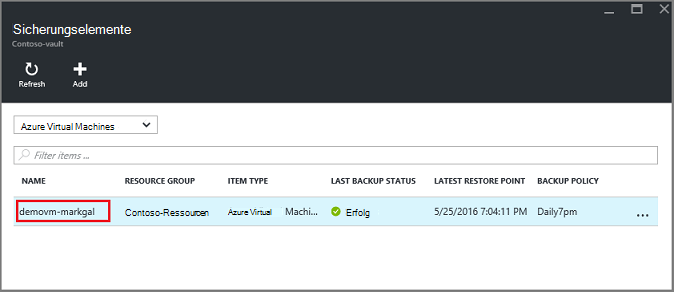

    Dashboard Element Depot und die **Einstellungen** -Blades öffnen.

    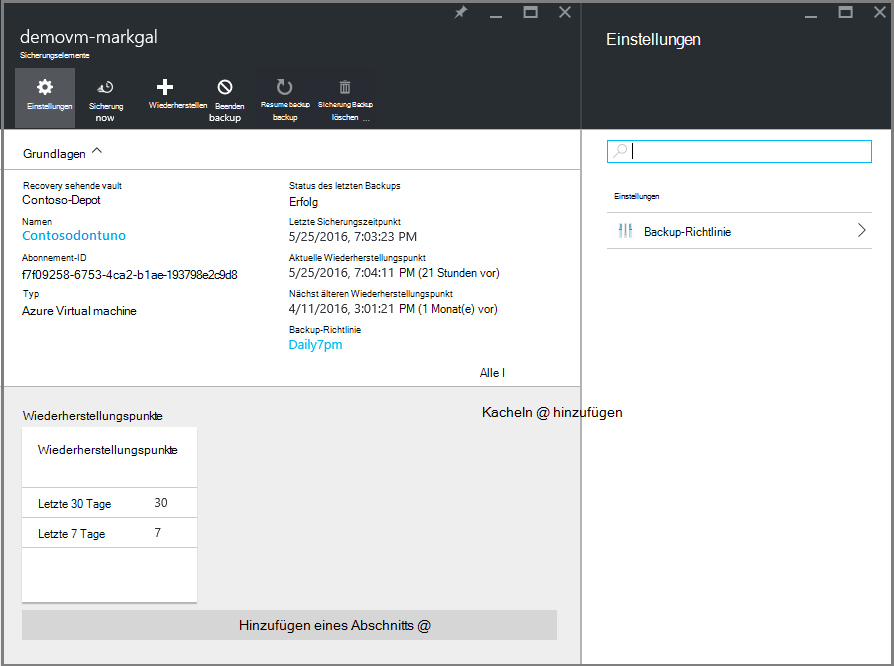

    Dashboard Element Vault können Sie viele wichtige Verwaltungsaufgaben ausführen:

    - Richtlinien ändern oder erstellen eine neue Sicherungsrichtlinie < Br\>
    - Wiederherstellungspunkte anzeigen und deren Konsistenz Zustand < Br\>
    - Sicherung des virtuellen Computers bei Bedarf < Br\>
    - Beenden Sie den Schutz von virtuellen Maschinen < Br\>
    - Schutz eines virtuellen Computers fortsetzen < Br\>
    - Löschen von backup-Daten (oder Wiederherstellungspunkt) < Br\>
    - [Wiederherstellen einer Sicherung (oder Wiederherstellungspunkt)](./backup-azure-arm-restore-vms.md#restore-a-recovery-point) < Br\>

Für die folgenden Prozeduren ist der Ausgangspunkt Depot Element Dashboard.

## Verwalten von backup-policies

1. [Depot Element Dashboard](backup-azure-manage-vms.md#open-a-vault-item-dashboard)klicken Sie auf **Alle** **Einstellungen** -Blades öffnen.

    

2. Klicken Sie auf Blatt **Einstellungen** auf **Backup-Richtlinie** öffnen, Blade.

    Backup Häufigkeit und Aufbewahrungsfristen Bereichsdetails werden auf dem Blatt angezeigt.

    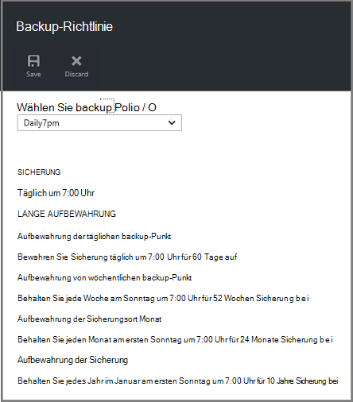

3. Menü **Sicherungsrichtlinie auswählen** :
    - Richtlinien ändern, wählen Sie eine andere Richtlinie, und klicken Sie auf **Speichern**. Die neue Richtlinie wird auf das Depot sofort angewendet. < Br\>
    - Wählen Sie zum Erstellen einer Richtlinie **Neu erstellen**.

    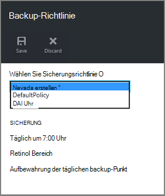

    Informationen zum Erstellen einer backup-Richtlinie finden Sie unter [Definieren einer Sicherungsrichtlinie](backup-azure-manage-vms.md#defining-a-backup-policy).

[AZURE.INCLUDE [backup-create-backup-policy-for-vm](../../includes/backup-create-backup-policy-for-vm.md)]

## Sicherung bei Bedarf eines virtuellen Computers
Sie können on-Demand nutzen backup einer virtuellen Maschine nach der Konfiguration für den Schutz. Wenn die anfängliche Sicherung aussteht, erstellt bei Bedarf eine vollständige Kopie des virtuellen Computers im Tresor Recovery Services. Wenn die anfängliche Sicherung abgeschlossen ist, sendet eine Sicherung bei Bedarf nur Änderungen vom vorherigen Snapshot Depot Recovery Services. Nachfolgenden Backups sind also immer inkrementell.

>[AZURE.NOTE] Die Beibehaltungsdauer für eine Sicherung bei Bedarf aufbewahrungswert für tägliche Sicherung Punkt in der Richtlinie festgelegt ist. Wenn keine täglichen backup ausgewählt ist, wird der wöchentliche Sicherung Punkt verwendet.

Eine Sicherung bei Bedarf eines virtuellen Computers auslösen:

- [Depot Element Dashboard](backup-azure-manage-vms.md#open-a-vault-item-dashboard)klicken Sie auf **Jetzt sichern**.

    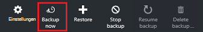

    Das Portal stellt sicher, dass Sie einen Sicherungsauftrag auf Anforderung starten möchten. Klicken Sie auf **Ja,** um den Sicherungsauftrag zu starten.

    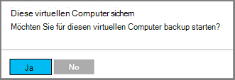

    Der Sicherungsauftrag wird ein Wiederherstellungspunkt erstellt. Die Beibehaltungsdauer der Wiederherstellungspunkt ist in den virtuellen Computer zugeordnete Richtlinie angegebene Beibehaltungsdauer identisch. Zum Verfolgen des Fortschritts für den Auftrag im Dashboard Depot klicken Sie **Backup-Jobs** .  

## Beenden Sie den Schutz von virtuellen Maschinen
Möchten Sie einen virtuellen Computer Schutz beenden, werden Sie gefragt, ob Wiederherstellungspunkte beibehalten möchten. Gibt es zwei Arten zu Schutz virtueller Computer:
- alle zukünftigen Sicherungsaufträge beenden und alle Wiederherstellungspunkte löschen oder
- beendet alle zukünftigen Sicherungsaufträge jedoch bleiben die Wiederherstellungspunkte  

Kosten mit den Wiederherstellungspunkten im Speicher vorhanden ist. Ist jedoch davon verlassen die Wiederherstellungspunkte der virtuelle Computer später wiederherstellen können bei Bedarf. Informationen über die Kosten aus den Wiederherstellungspunkten finden Sie [Preise](https://azure.microsoft.com/pricing/details/backup/). Wenn Sie alle Wiederherstellungspunkte löschen, kann nicht den virtuellen Computer wiederherstellen.

Beim Beenden des Schutzes für einen virtuellen Computer:

1. Klicken Sie auf [Vault Element Dashboard](backup-azure-manage-vms.md#open-a-vault-item-dashboard)auf **Sicherung beenden**.

    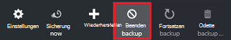

    Sicherung beenden-Blatt wird geöffnet.

    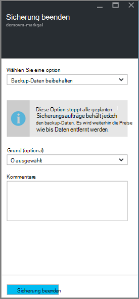

2. **Backup beenden** -Blade wahlweise beibehalten oder Löschen von backup-Daten. Das Informationen enthält Details zu Ihrer Wahl.

    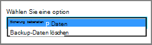

3. Wenn Sie backup-Daten beibehalten möchten, fahren Sie mit Schritt 4 fort. Wenn backup-Daten löschen, bestätigen Sie Sicherungsaufträge stoppen und löschen die Wiederherstellungspunkte - geben Sie den Namen des Elements.

    

    Zeigen Sie auf das Ausrufezeichen an den Namen des Elementnamens dafür. Außerdem ist der Name des Elements unter **Sicherung beenden** am Anfang des Blades.

4. Optional bieten Sie **Grund** oder **Kommentar**.

5. Stoppen Sie den Sicherungsauftrag für das aktuelle Element klicken Sie auf  

    Eine Benachrichtigung können Sie feststellen, dass Sicherungsaufträge beendet wurden.

    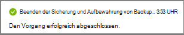

## Schutz eines virtuellen Computers fortsetzen
Wenn die Option **Sicherung behalten** , beim Schutz des virtuellen Computers beenden ausgewählt wurde ist Schutz wieder aufgenommen. Wenn die Option **Sicherung löschen** ausgewählt wurde, kann nicht Schutz für den virtuellen Computer fortsetzen.

Schutz für den virtuellen Computer wieder

1. Klicken Sie auf **Sicherung fortsetzen**, [Vault Element Dashboard](backup-azure-manage-vms.md#open-a-vault-item-dashboard).

    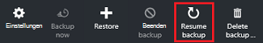

    Das Sicherung Blatt wird geöffnet.

    >[AZURE.NOTE] Wenn der virtuelle Computer schützen, können Sie eine andere Richtlinie als die Richtlinie mit denen virtuellen Computer ursprünglich geschützt wurde.

2. Schritte in [Richtlinien ändern oder neue backup-Richtlinie erstellen](backup-azure-manage-vms.md#change-policies-or-create-a-new-backup-policy), um die Richtlinie für den virtuellen Computer zuzuweisen.

    Nachdem die Sicherungsrichtlinie virtuellen Computer angewendet wurde, wird die folgende Meldung angezeigt.

    

## Backup-Daten löschen
Sie können die Sicherungsdaten einer virtuellen Maschine zugeordnet während der **Sicherung** Auftrag oder jederzeit nach der Sicherung Auftrag wurde abgeschlossen. Es kann sogar Tage oder Wochen Wiederherstellungspunkte löschen warten hilfreich sein. Anders als beim Löschen von Sicherungsdaten Wiederherstellungspunkte wiederherstellen können keine bestimmten Wiederherstellungspunkte löschen wählen. Wenn Sie Ihre backup-Daten löschen, löschen Sie alle Wiederherstellungspunkte, die dem Element zugeordnet.

Vorausgesetzt der Sicherungsauftrag für den virtuellen Computer beendet oder deaktiviert wurde. Nach der Deaktivierung des Sicherungsauftrag stehen Optionen **Fortsetzen Backup** und **Backup löschen** im Depot Element Dashboard.

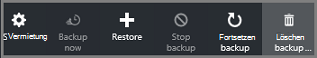

Backup-Daten auf einer virtuellen Maschine mit *Sicherung deaktiviert*zu löschen:

1. Klicken Sie auf [Vault Element Dashboard](backup-azure-manage-vms.md#open-a-vault-item-dashboard)auf **Sicherung löschen**.

    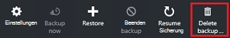

    **Löschen von Backup-Daten** -Blatt wird geöffnet.

    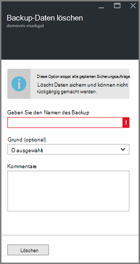

2. Geben Sie den Namen des Elements bestätigen, dass Sie die Wiederherstellungspunkte löschen möchten.

    

    Zeigen Sie auf das Ausrufezeichen an den Namen des Elementnamens dafür. Außerdem ist der Name des Elements **Löschen Backup Daten** am Anfang des Blades.

3. Optional bieten Sie **Grund** oder **Kommentar**.

4. Um die backup-Daten für das aktuelle Element zu löschen, klicken Sie auf  

    Eine Benachrichtigung können Sie feststellen, dass die Sicherungsdaten gelöscht wurde.

## Nächste Schritte

Checken Sie Informationen neu Erstellen eines virtuellen Computers von einem Wiederherstellungspunkt [Azure-VMs wiederherstellen](backup-azure-restore-vms.md). Informationen zum Schützen von virtuellen Computern finden Sie unter [zuerst: Sichern von VMs in ein Depot Recovery Services](backup-azure-vms-first-look-arm.md). Informationen zum Überwachen von Ereignissen finden Sie unter [Alarme für Azure Virtual Machine Backups überwachen](backup-azure-monitor-vms.md).
