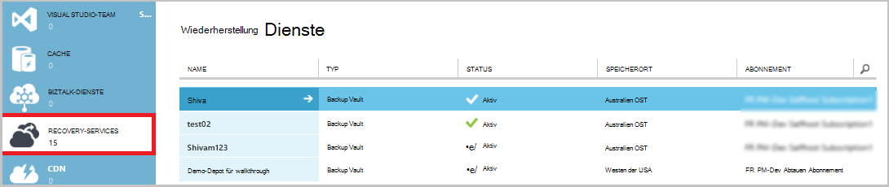
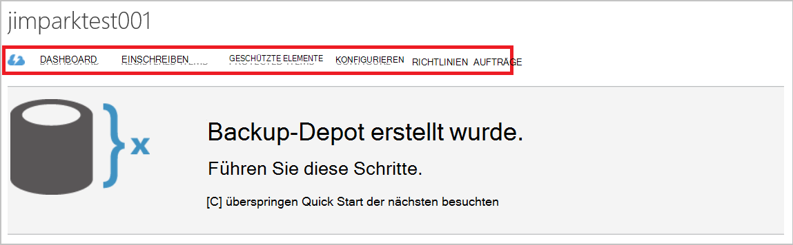
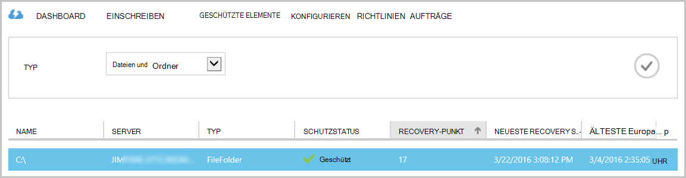
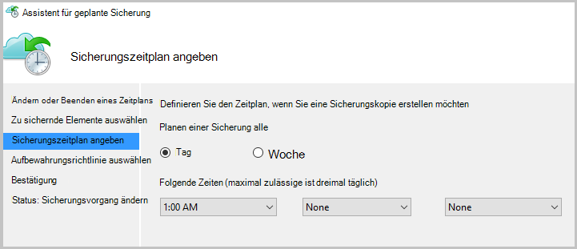
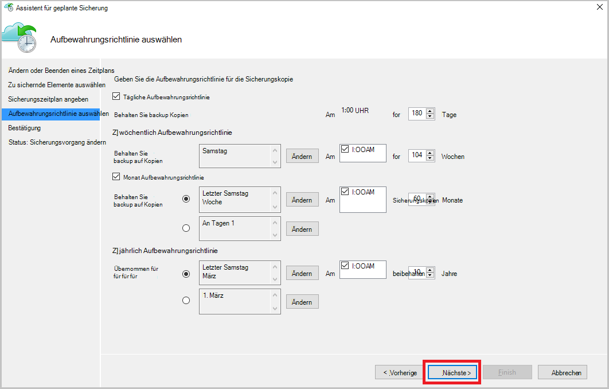
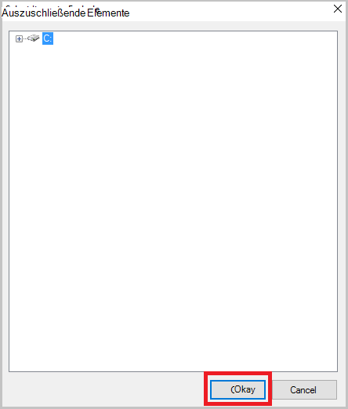
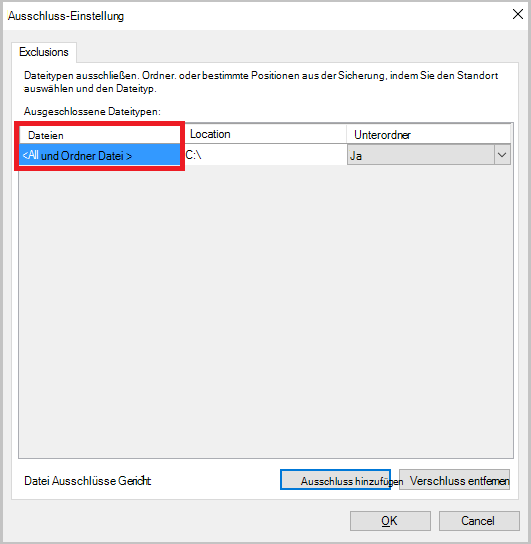
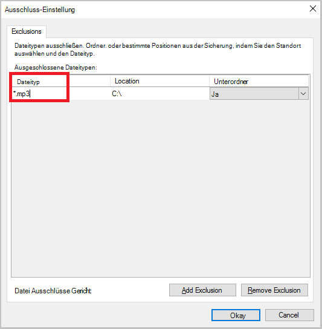
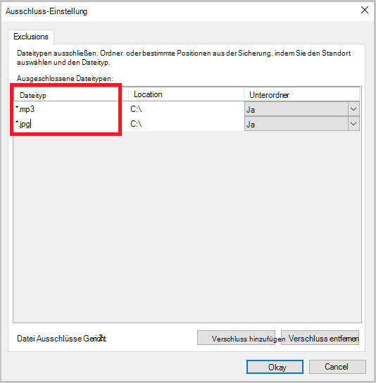
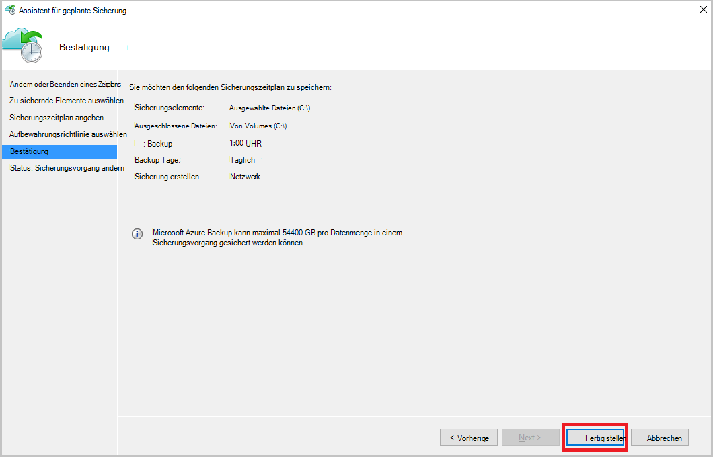

<properties
    pageTitle="Verwalten von Azure Backup Depots und Servern mit dem klassischen Bereitstellungsmodell Azure | Microsoft Azure"
    description="Verwenden Sie dieses Lernprogramm lernen Azure Backup Depots und Server verwalten."
    services="backup"
    documentationCenter=""
    authors="markgalioto"
    manager="jwhit"
    editor="tysonn"/>

<tags
    ms.service="backup"
    ms.workload="storage-backup-recovery"
    ms.tgt_pltfrm="na"
    ms.devlang="na"
    ms.topic="article"
    ms.date="09/27/2016"
    ms.author="jimpark;markgal"/>

# Verwalten von Azure Backup Depots und Servern mit dem klassischen Bereitstellungsmodell

> [AZURE.SELECTOR]
- [Ressourcen-Manager](backup-azure-manage-windows-server.md)
- [Classic](backup-azure-manage-windows-server-classic.md)

In diesem Artikel finden Sie eine Übersicht über die Sicherung Verwaltungsaufgaben klassischen Azure-Portal mit Microsoft Azure Backup Agent.

[AZURE.INCLUDE [learn-about-deployment-models](../../includes/learn-about-deployment-models-classic-include.md)]Ressourcen-Manager-Bereitstellungsmodell.

## Portal-Management-Aufgaben
1. Melden Sie sich im [Verwaltungsportal](https://manage.windowsazure.com).

2. Klicken Sie unter **Recovery Services**backup Depot zum Anzeigen der Seite Schnellstart klicken.

    

Durch Auswählen der Optionen am oberen Rand der Seite Quick Start, sehen Sie die verfügbaren Verwaltungsaufgaben.

### Dashboard
Wählen Sie **Dashboard** Verwendung Übersicht für den Server. Die **Verwendung Übersicht** enthält:

- Registrierte Windows Server Cloud
- Die Anzahl der Azure Cloud geschützte virtuelle Maschinen
- Der Gesamtspeicher in Azure verwendet
- Der Status des aktuellen Aufträge

Am unteren Rand das Dashboard können Sie folgenden Aufgaben ausführen:

- **Zertifikat verwalten** – Wenn ein Zertifikat wurde der Server und das Zertifikat aktualisieren können. Verwenden Sie bei Verwendung von Vault Anmeldeinformationen nicht **Verwalten Zertifikat**.
- **Löschen** - löscht die aktuelle Sicherung Vault. Wenn ein backup Depot nicht mehr verwendet wird, können sie Speicherplatz freigeben löschen. **Löschen** ist nur verfügbar, nachdem alle registrierte Servern aus dem Tresor gelöscht wurden.

## Einschreiben
Wählen Sie **Elemente registriert** die Namen der Server anzeigen, die für diesen Tresor registriert.

Der **Typ** Filter standardmäßig auf Azure Virtual Machine. Wählen Sie zum Anzeigen der Namen der Server, die für diesen Tresor registriert **WindowsServer** aus dem Dropdown-Menü.

Hier können Sie die folgenden Aufgaben ausführen:

- **Allow Re-Registrierung** - Wenn diese Option für einen Server können Sie den **Registrier-Assistenten** im lokalen Microsoft Azure Backup Agent registrieren Sie den Server mit der Sicherung erneut. Möglicherweise aufgrund eines Fehlers im Zertifikat registrieren, oder wenn ein Server wiederhergestellt werden.
- **Löschen** - Löscht einen Server aus der Sicherung Tresor. Alle Daten des Servers wird sofort gelöscht.

    

## Geschützte Elemente
Wählen Sie **Geschützte Objekte** , Elemente anzuzeigen, die von den Servern gesichert wurden.

## Konfigurieren

Auf der Registerkarte **Konfigurieren** können Sie die entsprechende Speicheroption Redundanz auswählen. Die beste Zeit um Redundanz Speicheroption auszuwählen ist richtig, nach dem Erstellen eines Depots und Computer registriert werden.

>[AZURE.WARNING] Sobald ein Depot registriert wurde, Redundanz Speicheroption ist gesperrt und kann nicht geändert werden.

Weitere Informationen über [Speicherredundanz](../storage/storage-redundancy.md)anzeigen

## Microsoft Azure Backup Agent Aufgaben

### Konsole

Öffnen Sie den **Microsoft Azure Backup-Agent** (Sie finden sie nach dem Computer suchen *Microsoft Azure Backup*).

Von rechts Netzwerksicherungsdienst Konsole verfügbaren **Aktionen** können Sie die folgenden Verwaltungsaufgaben ausführen:

- Server registrieren
- Sicherung planen
- Jetzt sichern
- Eigenschaften ändern

>[AZURE.NOTE] **Wiederherstellen von Daten**finden Sie unter [Dateien wiederherstellen in einem WindowsServer oder Windows-Clientcomputer](backup-azure-restore-windows-server.md).

### Ändern Sie eine vorhandene Sicherung

1. Klicken Sie in der Microsoft Azure Backup-Agent auf **Sicherung planen**.

    

2. Im **Zeitplan Assistenten** lassen Sie die **Änderungen backup oder Zeiten** Option und klicken Sie auf **Weiter**.

    

3. Hinzufügen oder ändern, klicken Sie auf Elemente auf dem Bildschirm **Zu sichernde Elemente wählen Sie** **Elemente hinzufügen**.

    Sie können auch **Ausschluss** von dieser Seite im Assistenten eingestellt. Auszuschließende Dateien oder Dateitypen lesen Sie das Verfahren zum [Ausschluss Einstellungen](#exclusion-settings)hinzufügen.

4. Wählen Sie die Dateien und Ordner zu sichern, und klicken Sie auf **OK**.

    

5. Geben Sie den **Sicherungszeitplan** , und klicken Sie auf **Weiter**.

    Sie können täglich (maximal 3 Mal pro Tag) oder wöchentliche Backups planen.

    

    >[AZURE.NOTE] Angeben des Sicherungszeitplans wird in diesem [Artikel](backup-azure-backup-cloud-as-tape.md)erläutert.

6. Wählen Sie die **Aufbewahrungsrichtlinie** für die Sicherungskopie, und klicken Sie auf **Weiter**.

    

7. **Das Bestätigungsfenster** überprüfen Sie die Informationen und klicken Sie auf **Fertig stellen**.

8. Nachdem der Assistent den **Sicherungszeitplan**erstellen, klicken Sie auf **Schließen**.

    Nach dem Ändern der Schutz können Sie bestätigen, dass Backups korrekt auf der Registerkarte **Aufträge** und bestätigt, dass die Änderungen in der Sicherungsaufträge auslösen.

### Netzwerk-Drosselung aktivieren  
Azure Backup-Agent stellt eine Registerkarte Beschränkung, die können Sie steuern, wie Netzwerkbandbreite während der Datenübertragung verwendet wird. Dieses Steuerelement ist hilfreich, möchten Sie sichern Daten während der Arbeitszeit wollen aber nicht den Sicherungsvorgang beeinträchtigen andere Internetdatenverkehr. Beschränkung der Daten gilt für Übertragung sichern und Wiederherstellen von Aktivitäten.  

Drosselung aktivieren:

1. Klicken Sie im **Backup Agent**auf **Eigenschaften ändern**.

2. Aktivieren Sie das Kontrollkästchen **Internet-Bandbreite für Backups Einschränkungen aktivieren** .

    

3. Wenn Sie die Einschränkung aktiviert haben Geben Sie zugelassene Bandbreite für die Übertragung von Daten während der **Arbeitszeit** und **nicht - Arbeitszeiten an**

    Die Bandbreite Werte können 512 Kilobyte pro Sekunde (Kbps) beginnen und bis 1023 MB pro Sekunde (Mbit/s). Sie kennzeichnen den Anfang und Ende **Arbeitsstunden**und die Tage der Woche gelten Arbeit Tage. Die Zeit außerhalb der festgelegten Arbeitszeiten gilt nicht als Arbeitszeit.

4. Klicken Sie auf **OK**.

## Ausschluss-Einstellung

1. Öffnen Sie den **Microsoft Azure Backup-Agent** (Sie finden sie nach dem Computer suchen *Microsoft Azure Backup*).

    

2. Klicken Sie in der Microsoft Azure Backup-Agent auf **Sicherung planen**.

    

3. Im Zeitplan Assistenten lassen Sie die **Änderungen backup oder Zeiten** Option und klicken Sie auf **Weiter**.

    

4. Klicken Sie auf **Ausschlüsse**.

    

5. Klicken Sie auf **Ausschluss hinzufügen**.

    

6. Wählen Sie den Speicherort, und klicken Sie dann auf **OK**.

    

7. Hinzufügen der Erweiterung im Feld **Dateityp** .

    

    Hinzufügen einer MP3-Erweiterung

    

    Fügen Sie eine andere Erweiterung **Ausschluss hinzufügen** und geben Sie einen anderen typerweiterung (Erweiterung .jpeg hinzufügen).

    

8. Wenn Sie die Erweiterung hinzugefügt haben, klicken Sie auf **OK**.

9. Zeitplan Assistenten durch Klicken auf **Weiter** bis die **Bestätigungsseite**fahren Sie und dann auf **Fertig stellen**.

    

## Nächste Schritte
- [WindowsServer oder Client Windows Azure wiederherstellen](backup-azure-restore-windows-server.md)
- Mehr über Azure Backup finden Sie unter [Übersicht über die Sicherung von Azure](backup-introduction-to-azure-backup.md)
- Besuchen Sie das [Forum Azure Backup](http://go.microsoft.com/fwlink/p/?LinkId=290933)
