<properties
    pageTitle="Azure Recovery Services Depots und Server verwalten | Microsoft Azure"
    description="Verwenden Sie dieses Lernprogramm lernen Azure Recovery Services Depots und Server verwalten."
    services="backup"
    documentationCenter=""
    authors="markgalioto"
    manager="cfreeman"
    editor="tysonn"/>

<tags
    ms.service="backup"
    ms.workload="storage-backup-recovery"
    ms.tgt_pltfrm="na"
    ms.devlang="na"
    ms.topic="article"
    ms.date="10/19/2016"
    ms.author="jimpark; markgal"/>


# <a name="monitor-and-manage-azure-recovery-services-vaults-and-servers-for-windows-machines"></a>Überwachen und Verwalten von Azure Recovery Services Depots und Server für Windows-Computer

> [AZURE.SELECTOR]
- [Ressourcen-Manager](backup-azure-manage-windows-server.md)
- [Classic](backup-azure-manage-windows-server-classic.md)

In diesem Artikel finden Sie eine Übersicht über die Sicherung Verwaltungsaufgaben Azure-Portal mit Microsoft Azure Backup-Agent.

[AZURE.INCLUDE [learn-about-deployment-models](../../includes/learn-about-deployment-models-rm-include.md)]Klassische Bereitstellungsmodell.

## <a name="management-portal-tasks"></a>Portal-Management-Aufgaben

### <a name="access-your-recovery-services-vaults"></a>Zugriff auf Ihre Recovery Services Depots

1. Melden Sie sich mit Ihrem Azure-Abonnement [Azure-Portal](https://portal.azure.com/) .

2. Im Hub klicken Sie auf **Durchsuchen** , und geben Sie in der Liste der Ressourcen **Recovery Services**. Beginn der Eingabe Filtern der Liste basierend auf Ihrer Eingabe. Klicken Sie auf **Recovery Services Depots**.

    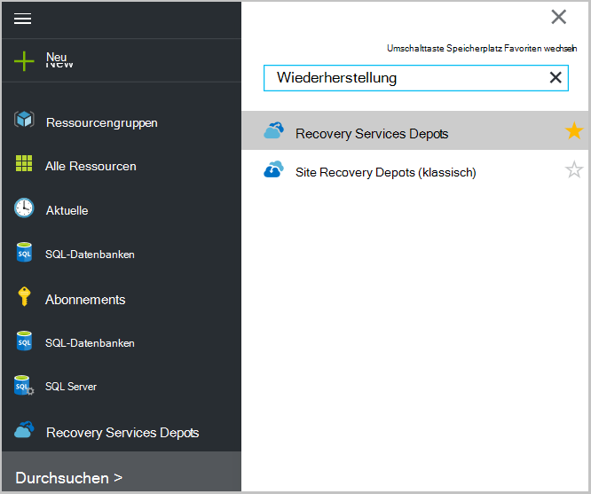 <br/>

2. Wählen Sie das Depot aus Recovery Services Depot Dashboard Blade öffnen anzeigen möchten.

     <br/>

## <a name="monitor-jobs-and-alerts"></a>Aufträge überwachen und Alarme
Sie überwachen Aufträge und Warnungen Recovery Services Depot Dashboard angezeigt:

- Backup Warnungsdetails
- Dateien und Ordner sowie Azure Cloud geschützte virtuelle Maschinen
- Gesamtspeicher in Azure verwendet
- Status des Sicherungsauftrags


Die Informationen in jedem dieser Kacheln öffnet zugeordnete Blade, Aufgaben verwalten.

Von der Spitze des Dashboards:

- Einstellung Zugriff verfügbare backup-Aufgaben.
- Backup - können Sie neue Dateien und Ordner (oder Azure VMs) Depot Recovery Services sichern.
- Löschen - Wenn ein Depot Recovery Services nicht mehr verwendet wird, können sie Speicherplatz freigeben löschen. Löschen ist nur verfügbar, nachdem alle geschützte Servern aus dem Tresor gelöscht wurden.

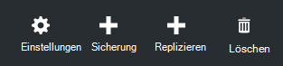
## <a name="alerts-for-backups-using-azure-backup-agent"></a>Alarme für Backups mit Azure backup-Agenten:
| Warnstufe  | Benachrichtigung |
| ------------- | ------------- |
| Wichtige | Backup-Fehler Wiederherstellungsfehler  |
| Warnung  | Sicherung abgeschlossen mit Warnungen (Wenn weniger als 100 Dateien nicht durch Probleme mit beschädigten Daten gesichert werden und mehr als eine Million Dateien erfolgreich gesichert werden)  |
| Information  | Keine  |
## <a name="manage-backup-alerts"></a>Backup-Alerts verwalten
Klicken Sie **Backup Alerts** zu öffnen **Backup Alerts** Blade Alerts verwalten.

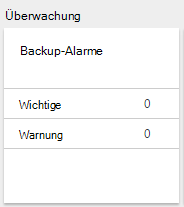

Backup-Alerts Kachel zeigt die Anzahl der:

- in den letzten 24 Stunden nicht aufgelöste Alarme
- in den letzten 24 Stunden nicht aufgelöste Warnungen

Auf diese Links gelangen Sie zu **Backup Alerts** Blade mit einer gefilterten Ansicht Signale (kritisch oder Warnung).

Blatt Backup Alerts Sie:

- Wählen Sie die entsprechende Informationen für Ihre Alerts ein.

    

- Filtern Sie Alarme für Schweregrad, Status und Anfang-Ende.

    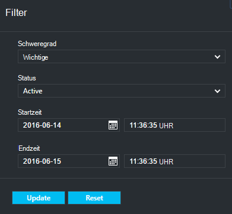

- Konfigurieren Sie Hinweise für Schweregrad, Frequenz und Empfänger sowie aktivieren Sie oder Deaktivieren der Warnung.

    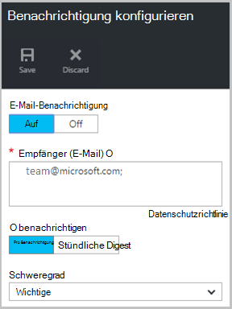

Tritt die **Notify** -Häufigkeit **Pro Benachrichtigung** aktiviert ist keine Gruppierung oder Verringerung der e-Mails. Jede Warnung ergibt 1 Benachrichtigung. Dies ist die Standardeinstellung und die Auflösung auch e-Mail sofort.

**Stündliche Digest** als ausgewählt ist die **Benachrichtigen** Häufigkeit eine e-Mail an den Benutzer, dass neue Computerstatus generiert in der letzten Stunde gibt. Eine Auflösung e-Mail wird am Ende der Stunde gesendet.

Die folgenden Schweregrade können Benachrichtigungen gesendet werden:

- wichtige
- Warnung
- Informationen

Sie deaktivieren die Warnung mit Job Details Blade auf **Deaktivieren** . Klicken Sie auf deaktivieren, können Sie Notizen Auflösung.

Sie wählen die Spalten, die als Teil der Warnung mit **Spalten auswählen** -Schaltfläche angezeigt werden soll.

>[AZURE.NOTE] Blatt **Einstellungen** Sie verwaltet backup Alerts **Überwachen und Berichte > Alarme und Ereignisse > Backup Alerts** und dann auf **Filter** oder **Benachrichtigung konfigurieren**.

## <a name="manage-backup-items"></a>Backup-Objekte verwalten
Verwalten von lokalen Sicherungen steht im Verwaltungsportal. Im Abschnitt Sichern des Dashboards zeigt die Kachel **Sicherungselemente** Anzahl Sicherungselemente Depot geschützt.

Klicken Sie auf **Ordner** Sicherung Elemente nebeneinander.

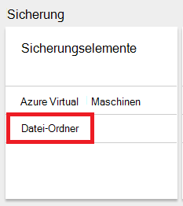

Sicherungselemente Blade öffnet mit der soll Ordner finden Sie jede spezielle Backup Artikel aufgelistet.

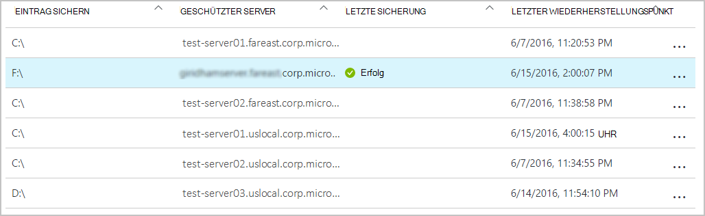

Wenn Sie ein bestimmtes backup-Element aus der Liste auswählen, das die grundlegenden Details für dieses Element angezeigt.

>[AZURE.NOTE] Blatt **Einstellungen** Sie Dateien und Ordner verwalten auswählen **geschützte Objekte > Sicherung Elemente** und wählen Sie im Dropdown-Menü **Datei-Ordner** .

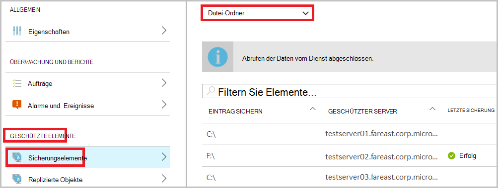

## <a name="manage-backup-jobs"></a>Verwalten von Backup-jobs
Backup-Aufgaben sowohl lokale (beim lokalen Server in Azure Backup) und Azure Backups werden im Dashboard angezeigt.

Im Abschnitt Sichern des Dashboards zeigt Backup Job Kachel die Anzahl von Aufträgen:

- in Bearbeitung
- Fehler in den letzten 24 Stunden.

Um die Sicherungsaufträge verwalten klicken Sie **Sicherungsaufträge** , Sicherungsaufträge Blade öffnen.

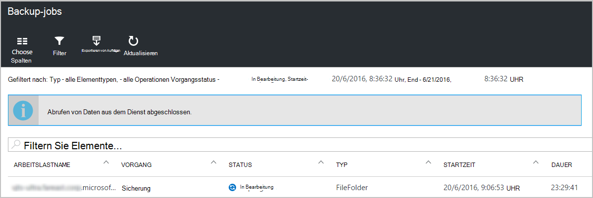

Sie ändern die Informationen in der Backup-Jobs Blade mit **Spalten auswählen** -Schaltfläche am oberen Rand der Seite.

Verwenden Sie die Schaltfläche **Filter** zwischen Dateien und Ordner und Azure Virtual Machine Backup.

Wenn gesicherten Dateien und Ordner nicht angezeigt wird, klicken Sie auf **Filter** am oberen Rand der Seite und wählen Sie **Dateien und Ordner** im Menü Typ.

>[AZURE.NOTE] Blatt **Einstellungen** Sie verwaltet Sicherungsaufträge **Überwachen und Berichte > Projekte > Sicherungsaufträge** und wählen Sie im Dropdown-Menü **Datei-Ordner** .

## <a name="monitor-backup-usage"></a>Backup überwachen
Im Abschnitt Sichern des Dashboards Backup Verwendung nebeneinander anzeigen in Azure verbrauchten Speicher Speicherverbrauch vorgesehen ist:
- Cloud LRS Speicherverbrauch das Depot zugeordnet
- Das Depot zugeordnete Speicherverbrauch GRS Cloud

## <a name="production-servers"></a>Produktions-Server
**Klicken Sie auf Ihren Produktionsservern zu verwalten.** Klicken Sie unter Verwaltung auf **Backup-Infrastruktur > Produktionsservern**.

Produktions-Server Blade Listen mit allen verfügbaren Produktionsservern. Klicken Sie auf einen Server in der Liste Serverdetails zu öffnen.

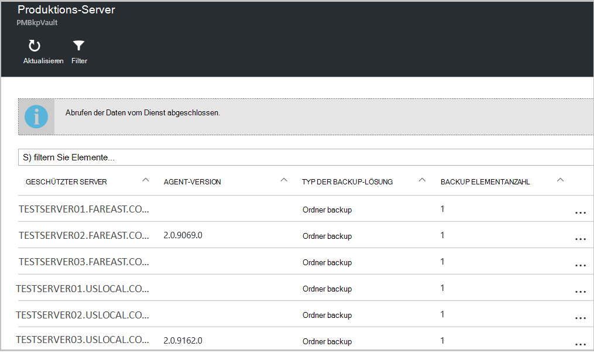

## <a name="microsoft-azure-backup-agent-tasks"></a>Microsoft Azure Backup Agent Aufgaben

## <a name="open-the-backup-agent"></a>Öffnen Sie den Netzwerksicherungsdienst

Öffnen Sie den **Microsoft Azure Backup-Agent** (finden sie nach dem Computer suchen *Microsoft Azure Backup*).


Von rechts Netzwerksicherungsdienst Konsole verfügbaren **Aktionen** führen Sie die folgenden Verwaltungsaufgaben:

- Server registrieren
- Sicherung planen
- Jetzt sichern
- Eigenschaften ändern

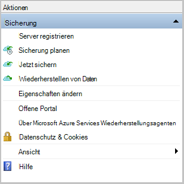

>[AZURE.NOTE] **Wiederherstellen von Daten**finden Sie unter [Dateien wiederherstellen in einem WindowsServer oder Windows-Clientcomputer](backup-azure-restore-windows-server.md).

## <a name="modify-an-existing-backup"></a>Ändern Sie eine vorhandene Sicherung

1. Klicken Sie in der Microsoft Azure Backup-Agent auf **Sicherung planen**.

    

2. Im **Zeitplan Assistenten** lassen Sie die **Änderungen backup oder Zeiten** Option und klicken Sie auf **Weiter**.

    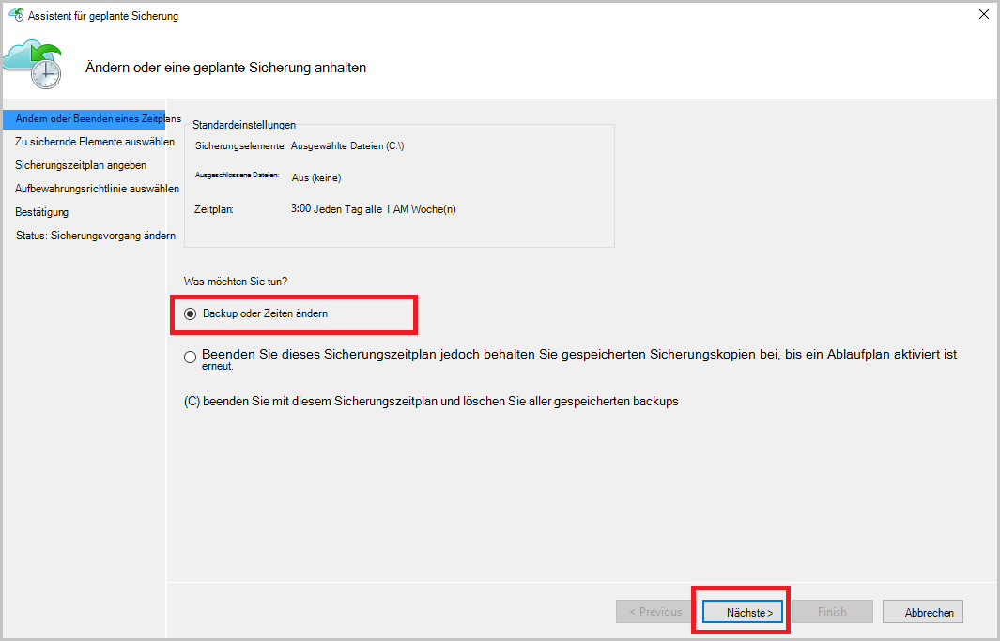

3. Hinzufügen oder ändern, klicken Sie auf Elemente auf dem Bildschirm **Zu sichernde Elemente wählen Sie** **Elemente hinzufügen**.

    Sie können auch **Ausschluss** von dieser Seite im Assistenten eingestellt. Auszuschließende Dateien oder Dateitypen lesen Sie das Verfahren zum [Ausschluss Einstellungen](#exclusion-settings)hinzufügen.

4. Wählen Sie die Dateien und Ordner zu sichern, und klicken Sie auf **OK**.

    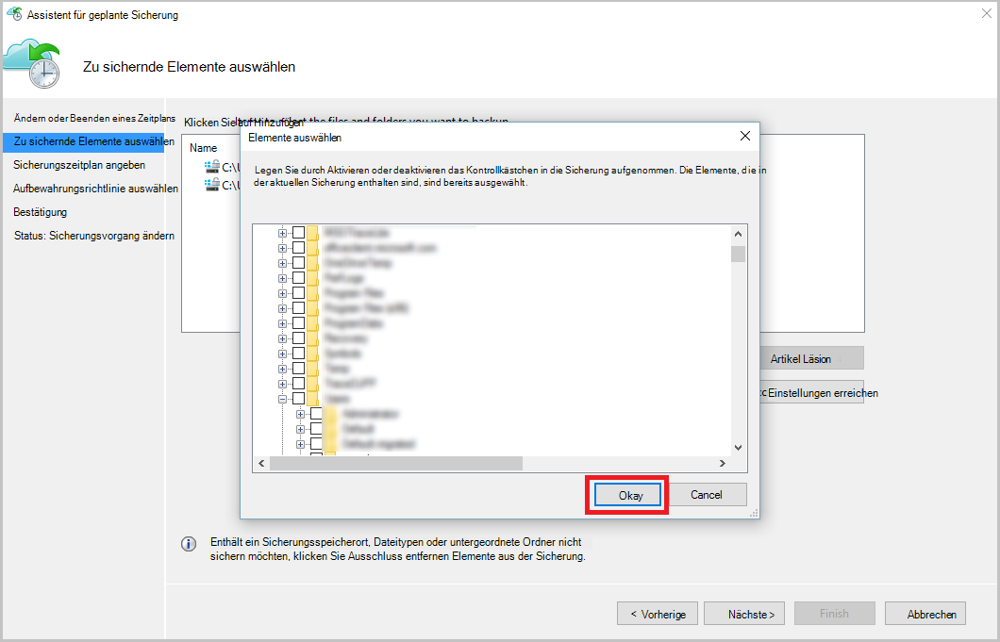

5. Geben Sie den **Sicherungszeitplan** , und klicken Sie auf **Weiter**.

    Sie können täglich (maximal 3 Mal pro Tag) oder wöchentliche Backups planen.

    

    >[AZURE.NOTE] Angeben des Sicherungszeitplans wird in diesem [Artikel](backup-azure-backup-cloud-as-tape.md)erläutert.

6. Wählen Sie die **Aufbewahrungsrichtlinie** für die Sicherungskopie, und klicken Sie auf **Weiter**.

    

7. **Das Bestätigungsfenster** überprüfen Sie die Informationen und klicken Sie auf **Fertig stellen**.

8. Nachdem der Assistent den **Sicherungszeitplan**erstellen, klicken Sie auf **Schließen**.

    Nach dem Ändern der Schutz können Sie bestätigen, dass Backups korrekt auf der Registerkarte **Aufträge** und bestätigt, dass die Änderungen in der Sicherungsaufträge auslösen.

## <a name="enable-network-throttling"></a>Netzwerk-Drosselung aktivieren  
Azure Backup-Agent stellt eine Registerkarte Beschränkung, die können Sie steuern, wie Netzwerkbandbreite während der Datenübertragung verwendet wird. Dieses Steuerelement ist hilfreich, möchten Sie sichern Daten während der Arbeitszeit wollen aber nicht den Sicherungsvorgang beeinträchtigen andere Internetdatenverkehr. Beschränkung der Daten gilt für Übertragung sichern und Wiederherstellen von Aktivitäten.  

Drosselung aktivieren:

1. Klicken Sie im **Backup Agent**auf **Eigenschaften ändern**.

2. **Wählen Sie die Registerkarte Beschränkung **aktivieren Sie Internet-Bandbreite für backup-Vorgänge ** Drosselung.

    

    Wenn Sie die Einschränkung aktiviert haben Geben Sie zugelassene Bandbreite für die Übertragung von Daten während der **Arbeitszeit** und **nicht - Arbeitszeiten an**

    Die Bandbreite Werte können 512 Kilobyte pro Sekunde (Kbps) beginnen und bis 1023 MB pro Sekunde (Mbit/s). Sie kennzeichnen den Anfang und Ende **Arbeitsstunden**und die Tage der Woche gelten Arbeit Tage. Die Zeit außerhalb der festgelegten Arbeitszeiten gilt nicht als Arbeitszeit.

3. Klicken Sie auf **OK**.

## <a name="manage-exclusion-settings"></a>Ausschluss verwalten

1. Öffnen Sie den **Microsoft Azure Backup-Agent** (Sie finden sie nach dem Computer suchen *Microsoft Azure Backup*).

    

2. Klicken Sie in der Microsoft Azure Backup-Agent auf **Sicherung planen**.

    

3. Im Zeitplan Assistenten lassen Sie die **Änderungen backup oder Zeiten** Option und klicken Sie auf **Weiter**.

    

4. Klicken Sie auf **Ausschlüsse**.

    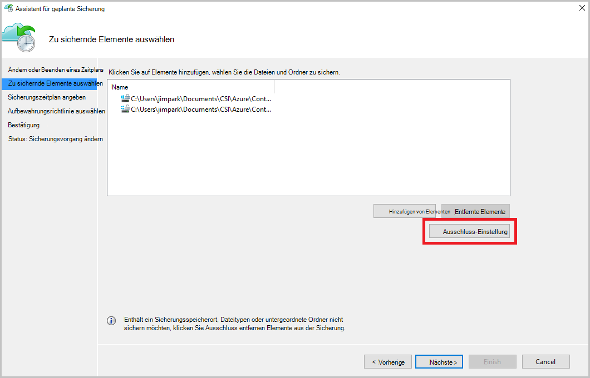

5. Klicken Sie auf **Ausschluss hinzufügen**.

    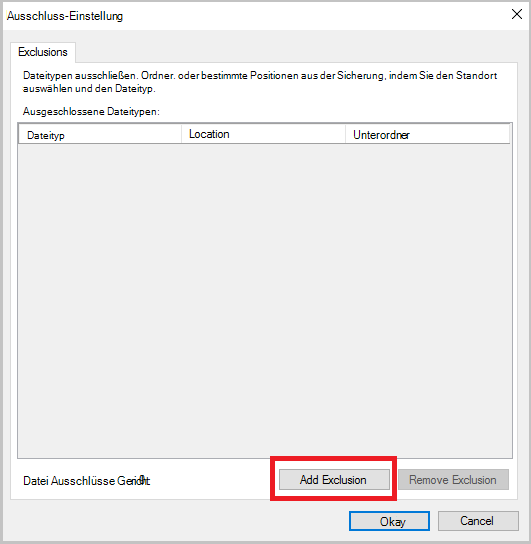

6. Wählen Sie den Speicherort, und klicken Sie dann auf **OK**.

    

7. Hinzufügen der Erweiterung im Feld **Dateityp** .

    

    Hinzufügen einer MP3-Erweiterung

    

    Fügen Sie eine andere Erweiterung **Ausschluss hinzufügen** und geben Sie einen anderen typerweiterung (Erweiterung .jpeg hinzufügen).

    

8. Wenn Sie die Erweiterung hinzugefügt haben, klicken Sie auf **OK**.

9. Zeitplan Assistenten durch Klicken auf **Weiter** bis die **Bestätigungsseite**fahren Sie und dann auf **Fertig stellen**.

    

## <a name="frequently-asked-questions"></a>Häufig gestellte Fragen
**1. QUARTAL. Status des Sicherungsauftrags zeigt in Azure backup Agent abgeschlossen warum es sofort Portal wider erhalten nicht?**

A1. Es maximale Verzögerung von 15 Minuten zwischen Sicherungsauftrag Azure backup-Agenten und Azure-Portal wider.

**Dauert q. 2 ein Sicherungsauftrag fällt, wie lange eine Warnung auslösen?**

A. 2 eine Warnung wird innerhalb von 20 Minuten Azure backup-Fehler ausgelöst.

**3. QUARTAL. Gilt es, eine e-Mail konfiguriert Benachrichtigungen gesendet werden?**

A3. Unten sind Fälle, wenn die Benachrichtigung gesendet werden um die Warnung zu reduzieren:

   - Wenn Benachrichtigungen stündlich konfiguriert und eine Warnung ausgelöst und innerhalb der Stunde
   - Auftrag wird abgebrochen.
   - Zweite Sicherungsauftrag fehlgeschlagen: ursprüngliche Sicherungsauftrag ausgeführt wird.

## <a name="troubleshooting-monitoring-issues"></a>Problembehandlung bei der Überwachung

**Problem:** Aufträge und Warnungen von Azure Backup Agent erscheinen nicht im Portal.

**Schritte zur Fehlerbehebung:** Der Prozess ```OBRecoveryServicesManagementAgent```, Auftrag und Warnung Daten Azure Backup-Dienst sendet. Gelegentlich dabei kann stecken oder Herunterfahren.

1. Überprüfen der Prozess wird nicht ausgeführt, **Task-Manager** öffnen und überprüfen, ob die ```OBRecoveryServicesManagementAgent``` Prozess ausgeführt wird.

2. Vorausgesetzt, dass der Prozess nicht ausgeführt wird, **deaktiviert** und Durchsuchen der Liste der Dienste. Starten Sie oder neu starten Sie **Microsoft Azure Recovery Services Management Agent**.

    Weitere Informationen finden Sie die Protokolle an:<br/>
`<AzureBackup_agent_install_folder>\Microsoft Azure Recovery Services Agent\Temp\GatewayProvider*`. Zum Beispiel:<br/> `C:\Program Files\Microsoft Azure Recovery Services Agent\Temp\GatewayProvider0.errlog`.

## <a name="next-steps"></a>Nächste Schritte
- [WindowsServer oder Client Windows Azure wiederherstellen](backup-azure-restore-windows-server.md)
- Mehr über Azure Backup finden Sie unter [Übersicht über die Sicherung von Azure](backup-introduction-to-azure-backup.md)
- Besuchen Sie das [Forum Azure Backup](http://go.microsoft.com/fwlink/p/?LinkId=290933)
