<properties
  pageTitle="Vorbereiten der Umgebung sichern Arbeitslasten mit Azure Backup Server | Microsoft Azure"
  description="Sicherstellen Sie, dass Ihre Umgebung ordnungsgemäß vorbereitet, Arbeitslasten mit Azure Backup Server sichern"
  services="backup"
  documentationCenter=""
  authors="pvrk"
  manager="shivamg"
  editor=""
  keywords="Azure backup Server; Backup vault"/>

<tags
  ms.service="backup"
  ms.workload="storage-backup-recovery"
  ms.tgt_pltfrm="na"
  ms.devlang="na"
  ms.topic="article"
  ms.date="08/22/2016"
  ms.author="jimpark;trinadhk;pullabhk; markgal"/>

# <a name="preparing-to-back-up-workloads-using-azure-backup-server"></a>Vorbereiten der Arbeitslasten mit Azure Backup Server sichern

> [AZURE.SELECTOR]
- [Azure Backup-Server](backup-azure-microsoft-azure-backup.md)
- [SCDPM](backup-azure-dpm-introduction.md)
- [Azure Backup-Server (klassisch)](backup-azure-microsoft-azure-backup-classic.md)
- [SCDPM (klassisch)](backup-azure-dpm-introduction-classic.md)


Dieser Artikel beschreibt das Vorbereiten Arbeitslasten mit Azure Backup-Server sichern. Mit Azure Backup Server schützen Sie Anwendungsarbeitslasten Hyper-V virtuelle Computer Microsoft SQL Server, SharePoint Server, Microsoft Exchange und Windows-Clients über eine einzige Konsole.

>[AZURE.WARNING] Azure Sicherungsserver erbt Funktionen von Data Protection Manager (DPM) für die Arbeitslast Sicherung. Finden Sie Verweise auf DPM-Dokumentation für einige dieser Funktionen. Jedoch Azure Backup Server nicht Schutz auf Band oder System Center integriert.

## <a name="1-windows-server-machine"></a>1. Windows Server-Computer


Der erste Schritt zur Einrichtung der Azure-Backup-Server ist Windows Server-Computer verfügen.

| Speicherort | Mindestanforderungen | Weitere Informationen |
| -------- | -------------------- | ----------------------- |
| Azure | Azure IaaS-VM<br><br>A2 Standard: 2 Kernen 3,5 GB RAM | Beginnen Sie mit einfachen Bild von Windows Server 2012 R2 Datacenter. [Schutz IaaS Arbeitslasten mit Azure Backup Server (DPM)](https://technet.microsoft.com/library/jj852163.aspx) hat viele Nuancen. Stellen Sie sicher, dass Sie Artikel vollständig lesen, bevor der Computer bereitstellen. |
| Vor Ort | Hyper-V-VM<br> VMWare-Computer<br> oder einem physischen host<br><br>2 Kernen und 4GB RAM | Sie können DPM Speicher Windows Server Deduplizierung mit Deduplizierung. Hier erfahren Sie, wie [DPM und Deduplizierung](https://technet.microsoft.com/library/dn891438.aspx) zusammenarbeiten Wenn Hyper-V virtuelle Computer bereitgestellt. |

> [AZURE.NOTE] Es wird empfohlen, auf einem Computer mit Windows Server 2012 R2 Datacenter Azure Backup-Server installiert werden. Viele Komponenten werden automatisch mit der neuesten Version des Windows-Betriebssystems behandelt.

Möchten Sie diesen Server zu einer Domäne irgendwann hinzufügen, sollten die Domäne beitreten Aktivität vor Azure Backup-Server-Installation ausgeführt werden. Vorhandenen Azure Backup Server Computer verschieben in eine neue Domäne nach Bereitstellung *nicht unterstützt*.

## <a name="2-backup-vault"></a>2. Backup vault


Senden von backup-Daten in Azure oder lokal halten muss Software in Azure verbunden werden. Um spezifische Computer Azure Backup-Server mit einem backup registriert werden muss.

So erstellen Sie ein backup Depot

1. Melden Sie sich im [Verwaltungsportal](http://manage.windowsazure.com/).

2. **Klicken Sie auf** > **Data Services** > **Recovery Services** > **Sicherungstresor** > **schnell erstellen**. Haben Sie mehrere Abonnements Konto Ihrer Organisation zugeordnet, wählen Sie das richtige Abonnement backup Depot zugeordnet.

3. Geben Sie im Feld **Name**einen Anzeigenamen zu Tresor. Für jedes Abonnement eindeutig sein müssen.

4. Wählen Sie im **Bereich**geografische Region für das Depot. In der Regel wird das Depot Region basierend auf Daten Hoheit oder Netzwerk Latenz entnommen.

    

5. Klicken Sie auf **Vault**. Es dauert eine Weile backup Depot erstellt werden. Überwachen Sie Status Notifications am unteren Rand des Portals.

    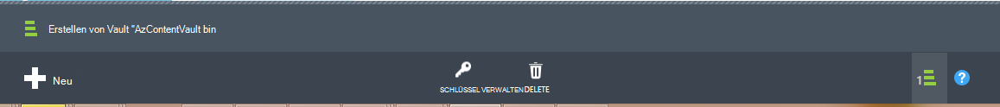

6. Eine Meldung bestätigt, dass das Depot erstellt wurde und wird in der Recovery-Seite als aktiv aufgelistet.
    

  > [AZURE.IMPORTANT] Stellen Sie sicher, dass sich Redundanz Option ausgewählt ist, nachdem das Depot erstellt wurde. Lesen Sie mehr über [Geo-redundant](../storage/storage-redundancy.md#geo-redundant-storage) und [lokal redundant](../storage/storage-redundancy.md#locally-redundant-storage) in dieser [Übersicht](../storage/storage-redundancy.md).


## <a name="3-software-package"></a>3. Software-Paket


### <a name="downloading-the-software-package"></a>Download der software

Ähnlich wie Anmeldeinformationen vault, können Sie Microsoft Azure Backup für Arbeitslasten **Schnell Startseite** backup Vault herunterladen.

1. Klicken Sie auf **Arbeitslasten (Datenträger zu Datenträger zu Cloud)**. So nehmen Sie die Seite Download Center, das Softwarepaket heruntergeladen werden kann.

    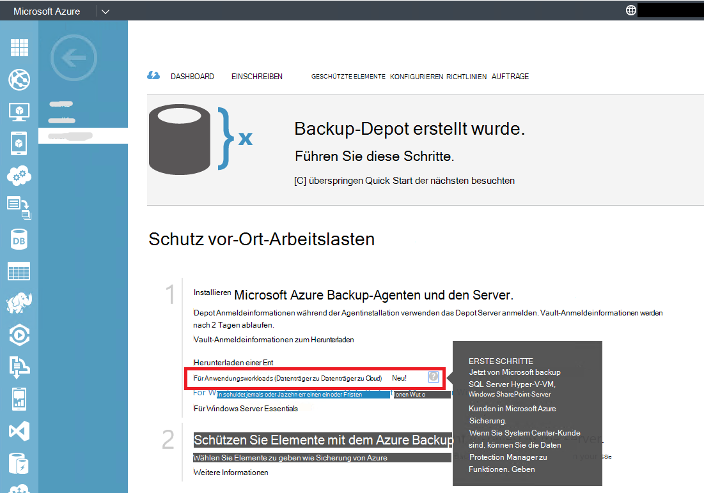

2. Klicken Sie auf **Download**.

    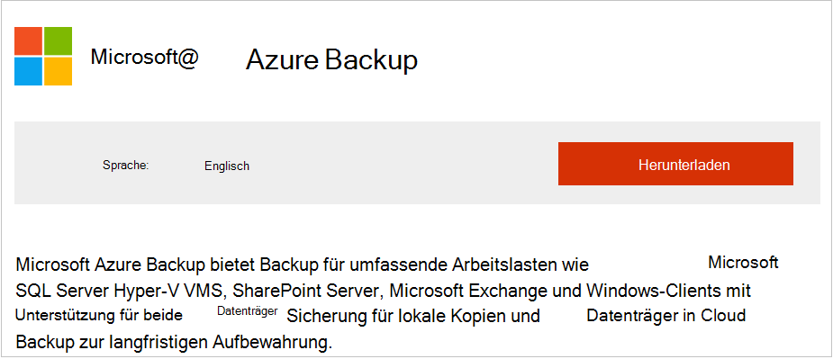

3. Wählen Sie alle Dateien, und klicken Sie auf **Weiter**. Herunterladen Sie alle Dateien aus Microsoft Azure Backup-Downloadseite und speichern Sie alle Dateien im gleichen Ordner.
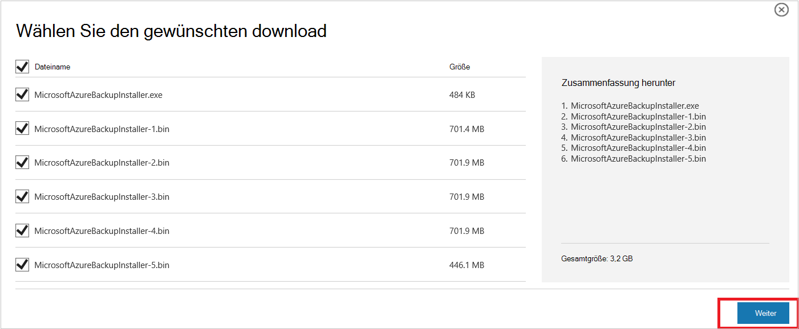

    Da die Download-Größe aller Dateien zusammen > 3G ist auf eine 10 Mbit/s Downloadlink kann es bis zu 60 Minuten für den Download abgeschlossen.


### <a name="extracting-the-software-package"></a>Extrahieren das Softwarepaket

Nachdem Sie die Dateien gedownloadet haben, klicken Sie auf **MicrosoftAzureBackupInstaller.exe**. Dies startet **Microsoft Azure Backup-Setup-Assistenten** die Installationsdateien an einem festgelegten Speicherort extrahiert. Führen Sie den Assistenten und klicken Sie auf **extrahieren** des Extrahierungsvorgangs beginnen.

> [AZURE.WARNING] Mindestens 4GB freier Speicherplatz ist erforderlich, die Setup-Dateien extrahiert.


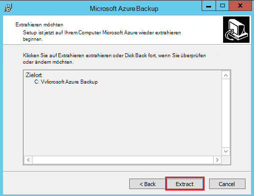

Nachdem die Extraktion abgeschlossen verarbeiten, das Kontrollkästchen Sie starten neu extrahierten *setup.exe* Microsoft Azure Backup Server Installation und klicken auf die Schaltfläche **Fertig stellen** .

### <a name="installing-the-software-package"></a>Installieren des Softwarepakets

1. Klicken Sie auf **Microsoft Azure Backup** , um den Setupassistenten zu starten.

    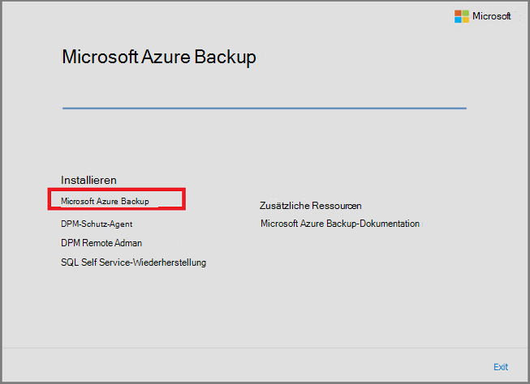

2. Klicken Sie auf der Willkommensseite auf **Weiter** . Dadurch gelangen Sie zum Abschnitt *Erforderliche überprüft* . Klicken Sie auf diesem Bildschirm auf der Schaltfläche **Suchen** , um festzustellen, ob Hardware und Software Voraussetzung Azure Backup Server erfüllt wurden. Alle Komponenten wurden erfolgreich erfüllt, sehen Sie eine Meldung, dass der Computer die Mindestanforderungen erfüllt. Klicken Sie auf die Schaltfläche **Weiter** .

    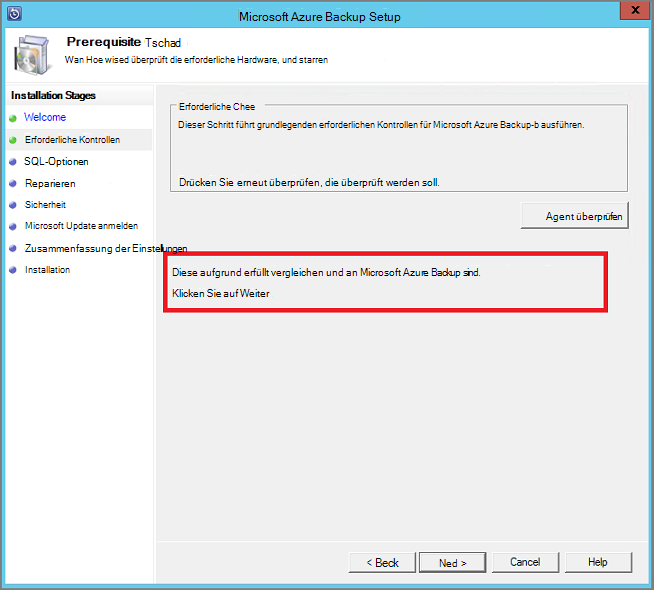

3. Microsoft Azure Backup Server muss SQL Server Standard und das Installationspaket Azure Backup-Server ist im Lieferumfang die entsprechenden SQL Server-Binärdateien benötigt. Beim Starten mit einer neuen Installation von Azure Backup Server sollten Sie wählen Sie die Option **Installieren neue Instanz von SQL Server mit diesem Setup** und klicken Sie auf die Schaltfläche **Überprüfen und installieren** . Nachdem die erforderlichen Komponenten erfolgreich installiert wurden, klicken Sie auf **Weiter**.

    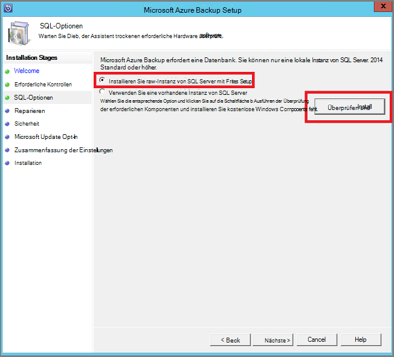

    Tritt ein Fehler mit einer Empfehlung zum Neustarten des Computers dazu, und klicken Sie auf **Erneut prüfen**.

    > [AZURE.NOTE] Azure Backup Server funktioniert nicht mit einer SQL Server-Remoteinstanz. Azure Backup Server verwendete Instanz muss lokal sein.

4. Geben Sie einen Speicherort für die Installation von Microsoft Azure Backup Serverdateien, und klicken Sie auf **Weiter**.

    

    Scratch Speicherort ist eine Voraussetzung für Azure zurück. Sicherstellen Sie, dass der sicheren Speicherort mindestens 5 % der Daten in der Cloud gesichert werden sollen. Datenträger-Schutz müssen separate Datenträger nach Abschluss der Installation konfiguriert werden. Weitere Informationen zu Speicher-Pools finden Sie unter [Speicher-Pools konfigurieren und Festplattenspeicher](https://technet.microsoft.com/library/hh758075.aspx).

5. Ein sicheres Kennwort für eingeschränkte Benutzerkonten und auf **Weiter.**

    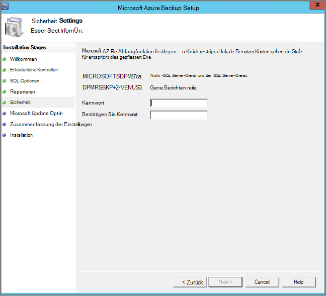

6. Wählen Sie aus, ob Sie mit *Microsoft Update* nach Updates suchen, und klicken Sie auf **Weiter**.

    >[AZURE.NOTE] Wir empfehlen Windows Update in Microsoft Update bietet Sicherheit und wichtige Updates für Windows und andere Produkte wie Microsoft Azure Backup Server umzuleiten.

    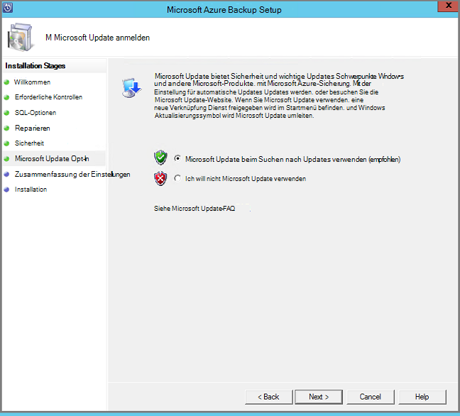

7. Überprüfen Sie die *Zusammenfassung der Einstellungen* , und klicken Sie auf **Installieren**.

    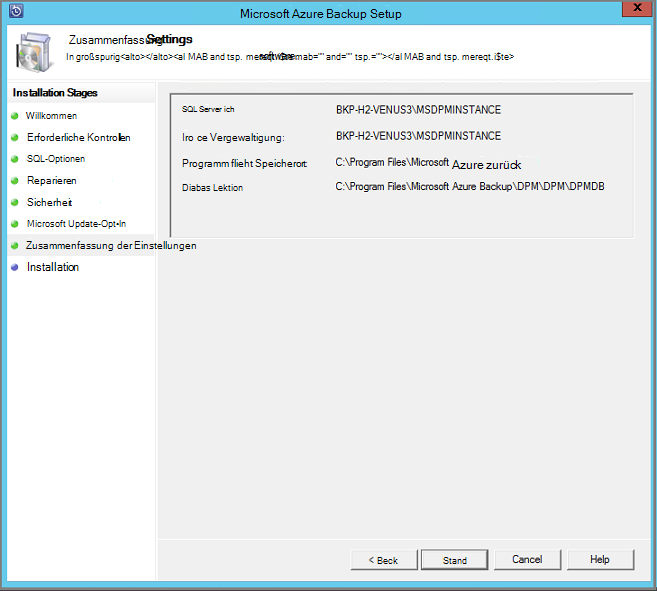

8. Die Installation erfolgt in mehreren Phasen. In der ersten Phase wird der Agent von Microsoft Azure Recovery Services auf dem Server installiert. Der Assistent überprüft außerdem Internetkonnektivität. Falls Internetkonnektivität verfügbar ist Installation fort, anderenfalls müssen Sie Proxy-Informationen für die Verbindung mit dem Internet.

    Im nächste Schritt ist der Microsoft Azure Wiederherstellungsagent Dienste konfigurieren. Als Teil der Konfiguration müssen Sie zum Bereitstellen von Anmeldeinformationen Vault Computer backup Depot registriert sind. Sie erhalten auch ein Kennwort zum Verschlüsseln und Entschlüsseln von Daten zwischen Azure und Ort. Sie können automatisch eine Passphrase zu generieren oder eigene mindestens 16 Zeichen Passphrase. Fortfahren Sie mit dem Assistenten, bis der Agent konfiguriert wurde.

    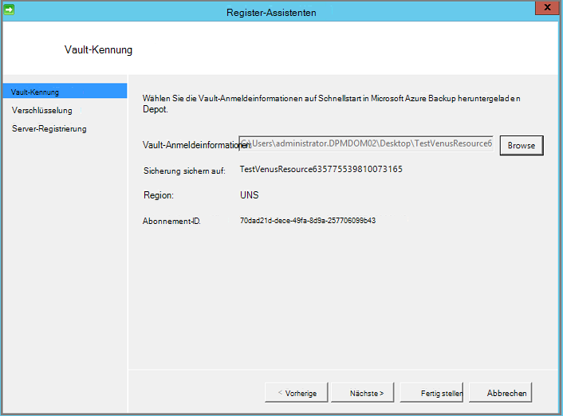

9. Nach der Registrierung des Servers Microsoft Azure Backup erfolgreich abgeschlossen wurde, geht allgemeine Setup-Assistent die Installation und Konfiguration von SQL Server und Azure Backup-Serverkomponenten. Nach Abschluss der Installation der SQL Server-Komponenten werden Azure Backup-Server-Komponenten installiert.

    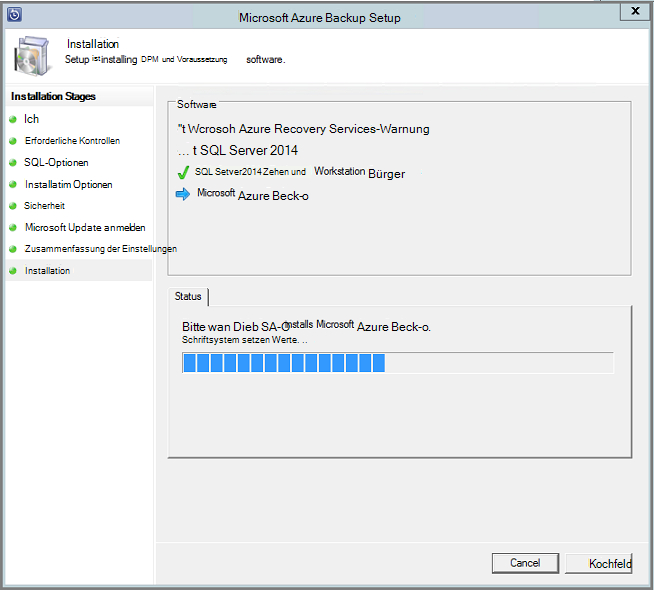


Nach Abschluss der Installationsschritt werden Desktopsymbole des Produkts auch erstellt wurden. Doppelklicken Sie einfach auf das Symbol, um das Produkt.

### <a name="add-backup-storage"></a>Backup-Speicher hinzufügen

Die erste Sicherungskopie bleibt im Speicher Azure Backup-Server-Computer verbunden ist. Weitere Informationen zum Hinzufügen von Datenträgern finden Sie unter [Speicher-Pools konfigurieren und Festplattenspeicher](https://technet.microsoft.com/library/hh758075.aspx).

> [AZURE.NOTE] Sie müssen backup-Speicher hinzufügen, auch wenn Sie Daten in Azure senden möchten. In der aktuellen Azure Backup-Server-Architektur enthält Azure Backup Depot *Kopie der Daten* , während lokale Speicher die erste (und erforderlich) Sicherungskopie enthält.  

## <a name="4-network-connectivity"></a>4. der Netzwerkkonnektivität


Azure Backup-Server benötigt eine Verbindung mit dem Azure Backup-Dienst für das Produkt erfolgreich. Um zu überprüfen, ob der Computer die Konnektivität in Azure verfügt, verwenden Sie die ```Get-DPMCloudConnection``` Cmdlet in Azure Backup Server PowerShell-Konsole. Ist die Ausgabe der Cmdlet TRUE Konnektivität vorhanden ist, andernfalls besteht keine Verbindung.

Zum gleichen Zeitpunkt muss das Azure-Abonnement in einem ordnungsgemäßen Zustand. Den Status Ihres Abonnements und zu verwalten, melden Sie sich im [Abonnement Portal]( https://account.windowsazure.com/Subscriptions).

Wenn Sie den Status der Azure-Konnektivität und der Azure-Abonnements kennen, können Sie die Tabelle, die Auswirkung auf die Backup-und Recovery-Funktionen zu.

| Status der Verbindung | Azure-Abonnement | Sicherung in Azure| Backup auf Festplatte | Wiederherstellen von Azure | Von Festplatte wiederherstellen |
| -------- | ------- | --------------------- | ------------------- | --------------------------- | ----------------------- |
| Verbunden | Aktiv | Zulässig | Zulässig | Zulässig | Zulässig |
| Verbunden | Abgelaufen | Beendet | Beendet | Zulässig | Zulässig |
| Verbunden | Hat | Beendet | Beendet | Beenden und Azure Wiederherstellungspunkte gelöscht | Beendet |
| Verlorene Verbindung > 15 Tage | Aktiv | Beendet | Beendet | Zulässig | Zulässig |
| Verlorene Verbindung > 15 Tage | Abgelaufen | Beendet | Beendet | Zulässig | Zulässig |
| Verlorene Verbindung > 15 Tage | Hat | Beendet | Beendet |  Beenden und Azure Wiederherstellungspunkte gelöscht | Beendet |

### <a name="recovering-from-loss-of-connectivity"></a>Wiederherstellung nach Verlust der Konnektivität
Haben Sie eine Firewall oder einen Proxy, der verhindert Zugriff auf Azure benötigen Sie Whitelist folgende Domänenadressen in Firewall-Proxy-Profil:

- www.msftncsi.com
- \*. Microsoft.com
- \*. WindowsAzure.com
- \*. microsoftonline.com
- \*. Windows

Wieder Konnektivität in Azure Azure Backup-Server-Computer, Azure Abonnementstatus Operationen werden können bestimmt. Der Tabelle hat Einzelheiten über die Vorgänge zulässig, wenn der Computer "verbunden".

### <a name="handling-subscription-states"></a>Abonnementstatus behandeln

Es ist möglich, Azure-Abonnement von einem *abgelaufen* oder *Sicherungsdaten* in den Zustand *aktiv* . Aber dies hat bestimmte Implikationen für das Verhalten während der Status nicht *aktiv*ist:

- Ein Abonnement *Sicherungsdaten* verliert Funktionalität für die Periode hat ist. Auf *aktiv*, wird die Produktfunktionalität Backup und Wiederherstellung fortgesetzt. Backup-Daten auf der Festplatte können auch abgerufen werden, wenn sie mit eine ausreichend lange Aufbewahrungsdauer wurde. Sicherungsdaten in Azure ist jedoch unwiederbringlich verloren, nachdem das Abonnement *Sicherungsdaten* Zustand wechselt.
- Ein Abonnement *abgelaufen* verliert nur Funktionen bis er *aktiv* erneut vorgenommen wurde. Sicherungskopien geplant für die Periode, in der das Abonnement *abgelaufen* ist, werden nicht ausgeführt.


## <a name="troubleshooting"></a>Problembehandlung

Microsoft Azure Backup-Server mit Fehlern während der Installationsphase (Backup oder Restore) fehlschlägt, finden Sie diese [Fehler Codes Dokument](https://support.microsoft.com/kb/3041338) für Weitere Informationen.
Außerdem finden Sie in [Azure Backup FAQs beziehen](backup-azure-backup-faq.md)


## <a name="next-steps"></a>Nächste Schritte

Sie erhalten detaillierte Informationen zum [Vorbereiten der Umgebung für DPM](https://technet.microsoft.com/library/hh758176.aspx) auf der Microsoft TechNet-Website. Es enthält außerdem Informationen zu unterstützten Konfigurationen auf denen Sicherungsserver Azure bereitgestellt und verwendet werden können.

Diese Artikel können Sie ein besseres Verständnis der Arbeitslast Schutz mit Microsoft Azure Backup Server erhalten.

- [SQL Server-Sicherung](backup-azure-backup-sql.md)
- [SharePoint Server-Sicherung](backup-azure-backup-sharepoint.md)
- [Alternativer Server-Sicherung](backup-azure-alternate-dpm-server.md)
