<properties
   pageTitle="Backups virtueller Maschinen Monitor Resource Manager bereitgestellt | Microsoft Azure"
   description="Überwachen Sie Ereignisse und Alarme aus Backups virtueller Maschinen Ressourcen-Manager bereitgestellt. E-Mail Alerts abhängig."
   services="backup"
   documentationCenter="dev-center-name"
   authors="markgalioto"
   manager="cfreeman"
   editor=""/>

<tags
ms.service="backup"
ms.workload="storage-backup-recovery"
ms.tgt_pltfrm="na"
ms.devlang="na"
ms.topic="article"
ms.date="08/25/2016"
ms.author="trinadhk; giridham;"/>

# <a name="monitor-alerts-for-azure-virtual-machine-backups"></a>Alarme überwachen für Azure Virtual Machine backups

Alerts sind Antworten vom Dienst, dass ein Ereignis Schwellenwert erreicht oder überschritten wurde. Wissen als Probleme starten für Kosten halten kann. Alarme in der Regel treten nicht nach einem Zeitplan, und so ist es hilfreich zu wissen, so bald wie möglich nach dem Auftreten der Warnung. Z. B. wenn ein Backup- oder Restore-Auftrag fehlschlägt, tritt eine Warnung innerhalb von fünf Minuten des Fehlers. Im Dashboard Depot zeigt Backup Alerts Kachel kritischen und Warnstufe Ereignissen. In den Einstellungen Backup-Alerts können Sie alle Ereignisse anzeigen. Aber was tun, wenn eine Warnung auftritt, wenn Sie ein anderes Thema arbeiten? Geschieht die Warnung nicht kennen, eine etwas umständlich sein oder es Daten gefährden. Stellen Sie sicher, dass die richtigen Personen wissen Warnung – beim auftreten, konfigurieren Sie den Dienst per e-Mail-Benachrichtigung senden. Informationen zum Einrichten von e-Mail-Benachrichtigung finden Sie unter [Benachrichtigung konfigurieren](backup-azure-monitor-vms.md#configure-notifications).

## <a name="how-do-i-find-information-about-the-alerts"></a>Finden Informationen über Alarme

Um Informationen anzuzeigen, die eine Warnung ausgelöst hat, muss das Backup Alerts Blatt geöffnet werden. Zweierlei Backup Alerts Blade öffnen: entweder Backup-Alerts nebeneinander im Depot Dashboard oder aus dem Blade Alarme und Ereignisse.

So öffnen Sie Sicherung Alerts Blade aus Sicherung Alerts Kachel

- Klicken Sie auf auf der Kachel **Backup Alerts** Vault-Schaltpult **kritisch** oder **Warnung** zum Anzeigen der operationelle Ereignisse, Schweregrad.

    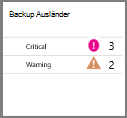


So öffnen Sie Sicherung Alerts-Blade aus dem Blade Alarme und Ereignisse

1. Vom Dashboard Depot klicken Sie auf **Alle**. 

2. Klicken Sie auf Blatt **Einstellungen** auf **Alarme und Ereignisse**. 

3. Das Blade **Alarme und Ereignisse** klicken Sie auf **Sicherung Alerts**. 

    **Sicherung Alerts** Blade wird geöffnet und zeigt die gefilterten Alarme.

    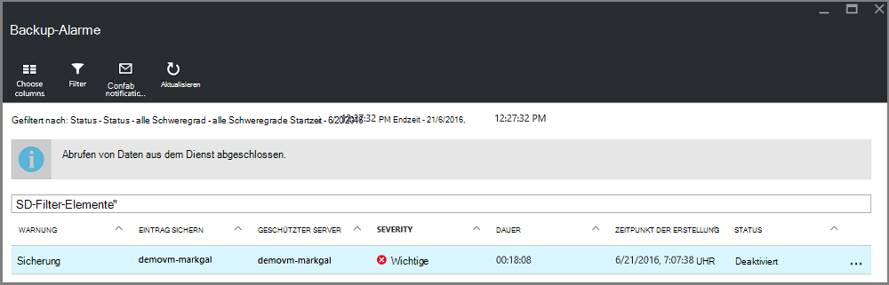

4. Klicken Sie detaillierte Informationen zu einer bestimmten Warnung aus der Liste der Ereignisse die Benachrichtigung, um seine **Details** Blatt geöffnet.

    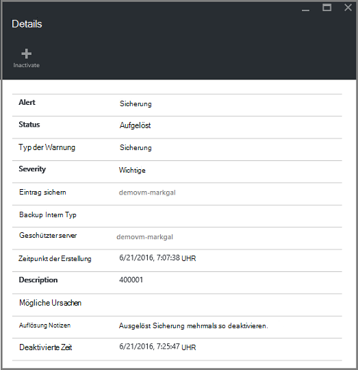

    Anpassen der Attribute in der Liste finden Sie unter [zusätzliche Attribute](backup-azure-monitor-vms.md#view-additional-event-attributes)

## <a name="configure-notifications"></a>Benachrichtigung konfigurieren

 Sie können den Dienst zum Senden von e-Mail-Benachrichtigungen Alarme, die aufgetreten sind, in der letzten Stunde oder wenn bestimmte Ereignisse auftreten.

E-Mail-Benachrichtigungen für Alarme einrichten

1. Klicken Sie im Backup-Alerts auf **Benachrichtigung konfigurieren**

    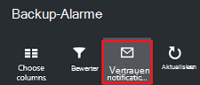

    Blade-Benachrichtigung konfigurieren wird geöffnet.

    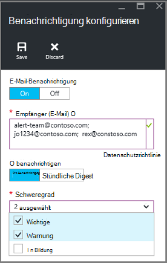

2. Klicken Sie auf Blatt Benachrichtigungen konfigurieren für e-Mail-Benachrichtigung **auf**.

    Die Empfänger und den Schweregrad Dialogfelder haben einen Stern, da diese Informationen erforderlich sind. Mindestens eine e-Mail-Adresse, und wählen Sie mindestens einen Schweregrad.

3. Geben Sie im Dialogfeld **Empfänger (E-Mail)** die e-Mail-Adressen für die Benachrichtigung ein. Verwenden Sie das Format: username@domainname.com. Trennen Sie mehrere e-Mail-Adressen durch ein Semikolon (;).

4. Wählen Sie im Bereich **Benachrichtigen** **Pro Benachrichtigung** Benachrichtigung beim Auftreten der Warnung angegebenen oder **Stündlich Digest** senden eine Zusammenfassung der letzten Stunde.

5. Wählen Sie im Dialogfeld **Schweregrad** eine oder mehrere Ebenen, die e-Mail-Benachrichtigung auslösen sollen.

6. Klicken Sie auf **Speichern**.
### <a name="what-alert-types-are-available-for-azure-iaas-vm-backup"></a>Welche Warnungstypen Azure Neuerung gesichert werden?
| Warnstufe  | Benachrichtigung |
| ------------- | ------------- |
| Wichtige | Backup-Fehler Wiederherstellungsfehler  |
| Warnung  | Keine |
| Information  | Keine  |

### <a name="are-there-situations-where-email-isnt-sent-even-if-notifications-are-configured"></a>Gibt es Situationen, in denen e-Mail gesendet wird, selbst wenn Benachrichtigungen konfiguriert werden?

Gibt es Situationen, in denen keine Warnung gesendet wird, obwohl die Anträge ordnungsgemäß konfiguriert wurden. In den folgenden Situationen e-Mail erhalten Benachrichtigungen keine Warnung zu vermeiden:

- Wenn die Benachrichtigung für stündliche Digest konfiguriert sind und eine Warnung ausgelöst und innerhalb einer Stunde aufgelöst.
- Der Auftrag wird abgebrochen.
- Ein Sicherungsauftrag wird dann nicht und anderen Sicherungsauftrag ausgeführt.
- Sicherungsauftrag für einen Ressourcen-Manager aktiviert VM gestartet, aber die VM nicht mehr vorhanden ist.

## <a name="customize-your-view-of-events"></a>Passen Sie die Ansicht der Ereignisse

**Überwachungsprotokolle** Einstellung enthält einen vordefinierten Satz von Filtern und Spalten betriebliche Informationen. Sie können die Ansicht anpassen, wenn **Ereignisse** Blade öffnet Sie Informationen zeigt gewünschte.

1. Im [Depot Dashboard](./backup-azure-manage-vms.md#open-a-recovery-services-vault-in-the-dashboard)suchen und **Überwachungsprotokolle** Blatt **Ereignisse** öffnen klicken.

    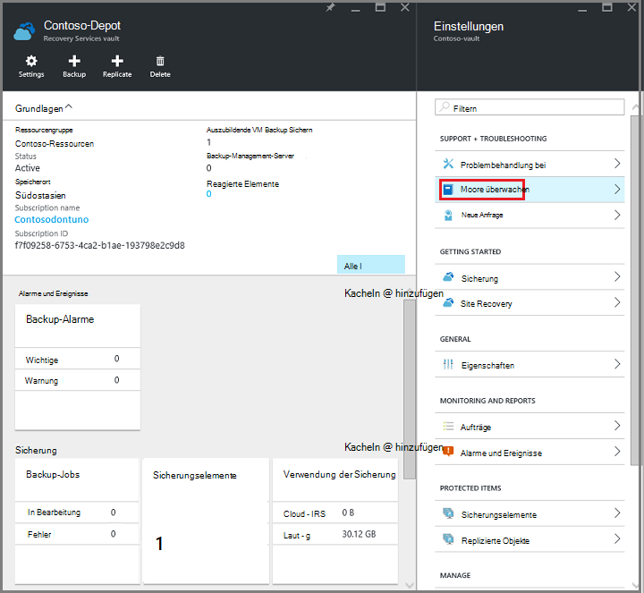

    Blatt **Ereignisse** operationelle Ereignisse filterte für derzeitigen Depot wird geöffnet.

    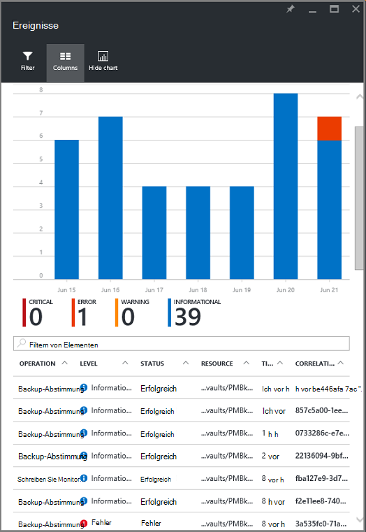

    Das Blade zeigt die Liste der kritischen, Fehler, Warnung und Information Ereignisse der letzten Woche. Die Zeitspanne ist ein Standardwert **Filter**. Blatt **Ereignisse** wird auch ein Balkendiagramm nachverfolgen, wenn die Ereignisse. Möchten Sie das Balkendiagramm finden im Menü **Ereignisse** klicken Sie auf das Diagramm ausschalten **Diagramm ausblenden** . Die Standardansicht der Ereignisse informiert Vorgang, Ebene, Status, Ressourcen und Zeit. Informationen zum Bereitstellen von zusätzlichen Ereignisattribute finden Sie Abschnitt [Ereignis Informationen](backup-azure-monitor-vms.md#view-additional-event-attributes).

2. Weitere Informationen über ein operationelles Ereignis in der Spalte **Vorgang** klicken Sie auf ein operationelles Ereignis Messer öffnen. Das Blade enthält detaillierte Informationen über die Ereignisse. Ereignisse gruppiert die Korrelations-ID und eine Liste der Ereignisse in der Zeitspanne.

    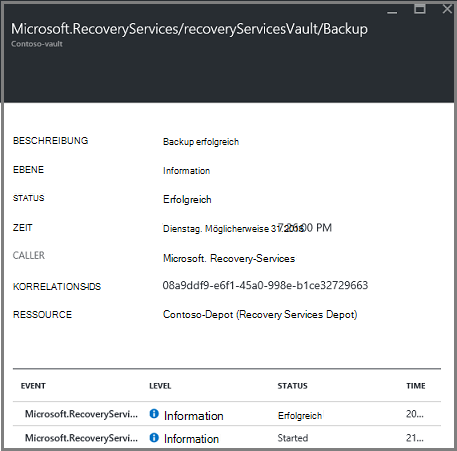

3. Klicken Sie detaillierte Informationen zu einem bestimmten Ereignis aus der Liste der Ereignisse das Ereignis, um seine **Details** Blatt geöffnet.

    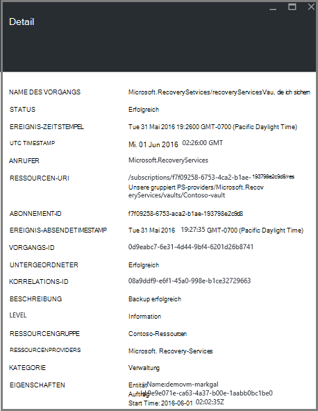

    Die Ereignis-Informationen ist so detailliert wie die Informationen. Wenn Sie lieber so viel Informationen zu jedem Ereignis und detailliert Blatt **Ereignisse** hinzufügen möchten, finden Sie in Abschnitt [Ereignisinformationen erweitern](backup-azure-monitor-vms.md#view-additional-event-attributes).


## <a name="customize-the-event-filter"></a>Passen Sie den Ereignisfilter an
Verwenden Sie den **Filter** anpassen oder die Informationen in einem bestimmten Blade. So filtern Sie die Ereignisinformationen

1. Im [Depot Dashboard](./backup-azure-manage-vms.md#open-a-recovery-services-vault-in-the-dashboard)suchen und **Überwachungsprotokolle** Blatt **Ereignisse** öffnen klicken.

    

    Blatt **Ereignisse** operationelle Ereignisse filterte für derzeitigen Depot wird geöffnet.

    

2. Klicken Sie im Menü **Ereignisse** auf **Filter** öffnen, Blade.

    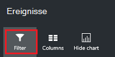

3. Das Blade **Filter** passen Sie an **, **Zeit**und **Aufrufer** **Filter. Die Filter sind nicht verfügbar, da sie aktuelle Informationen für das Recovery Services Depot festgelegt wurden.

    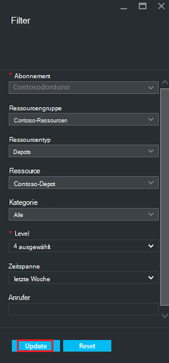

    Sie können die **Ebene** des Ereignisses: kritische Fehler, Warnung oder Information. Sie können eine beliebige Kombination von Ereignisebenen jedoch muss mindestens eine Ebene ausgewählt. Umschalten der Ebene ein- oder ausschalten. **Zeitspanne** Filter können Sie die Zeitdauer für das Erfassen von Ereignissen an. Verwenden eine benutzerdefinierte Zeitspanne können Sie die Start- und Endzeiten festlegen.

4. Wenn Sie mit einem Filter log abfragen möchten, klicken Sie auf **Aktualisieren**. Die Ergebnisse werden im Blatt **Ereignisse** .

    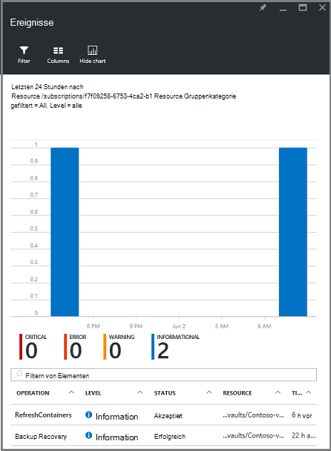


### <a name="view-additional-event-attributes"></a>Zusätzliche Attribute
Mit der Schaltfläche **Spalten** können Sie zusätzliche Attribute in der Liste auf die **Ereignisse** angezeigt werden. Die Standardliste der Ereignisse zeigt Informationen zum Vorgang, Ebene, Status, Ressourcen und Zeit. So aktivieren Sie zusätzliche Attribute

1. Klicken Sie auf Blatt **Ereignisse** auf **Spalten**.

    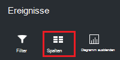

    Das Blade **Spalten auswählen** wird geöffnet.

    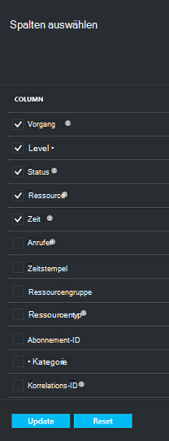

2. Aktivieren Sie das Kontrollkästchen, um das Attribut auswählen. Das Attribut Kontrollkästchen bzw. aktiviert deaktiviert.

3. Klicken Sie auf die Liste der Attribute in der Blade- **Ereignisse** zurücksetzen **Zurücksetzen** . Nach dem Hinzufügen oder Entfernen von Attributen aus der Liste verwenden Sie, um die neue Liste der Ereignisattribute **Zurücksetzen** .

4. Klicken Sie zum Aktualisieren der Daten in die Ereignisattribute **Aktualisieren** . Die folgende Tabelle enthält Informationen zu jedem Attribut.

| Spaltenname      |Beschreibung|
| -----------------|-----------|
| Vorgang|Der Name des Vorgangs|
| Ebene|Die Ebene des Vorgangs Werte können sein: Information, Warnung, Fehler und kritisch|
|Status|Beschreibenden Status des Vorgangs|
|Ressource|URL, die die Ressource identifiziert. auch die Ressourcen-ID|
|Zeit|Zeitmessung ab dem aktuellen Zeitpunkt das Ereignis auftrat|
|Anrufer|Wer oder was aufgerufen wird oder das Ereignis ausgelöst hat; kann das System oder ein Benutzer|
|Zeitstempel|Die Zeit, wann das Ereignis ausgelöst wurde|
|Ressourcengruppe|Zugeordnete Ressource|
|Ressourcentyp|Der interne Ressourcentyp wird vom Ressourcen-Manager|
|Abonnement-ID|Die zugeordnete Abonnement-ID|
|Kategorie|Kategorie des Ereignisses|
|Korrelations-ID|Allgemeine ID für Ereignisse|


## <a name="use-powershell-to-customize-alerts"></a>Mithilfe von PowerShell Alerts anpassen
Sie können benutzerdefinierte Benachrichtigungen für die Aufträge im Portal abrufen. Zu dieser Aufträge definieren von Warnregeln PowerShell basiert auf Betriebsprotokolle Ereignisse. Mit *PowerShell Version 1.3.0 oder höher*.

Definieren Sie eine benutzerdefinierte Benachrichtigung Sicherungsfehler Warnung verwenden Sie einen Befehl ähnlich dem folgenden:

```
PS C:\> $actionEmail = New-AzureRmAlertRuleEmail -CustomEmail contoso@microsoft.com
PS C:\> Add-AzureRmLogAlertRule -Name backupFailedAlert -Location "East US" -ResourceGroup RecoveryServices-DP2RCXUGWS3MLJF4LKPI3A3OMJ2DI4SRJK6HIJH22HFIHZVVELRQ-East-US -OperationName Microsoft.Backup/RecoveryServicesVault/Backup -Status Failed -TargetResourceId /subscriptions/86eeac34-eth9a-4de3-84db-7a27d121967e/resourceGroups/RecoveryServices-DP2RCXUGWS3MLJF4LKPI3A3OMJ2DI4SRJK6HIJH22HFIHZVVELRQ-East-US/providers/microsoft.backupbvtd2/RecoveryServicesVault/trinadhVault -Actions $actionEmail
```

**ResourceId** : die Überwachungsprotokolle ResourceId erhalten. Die ResourceId ist in der Spalte Ressource die Protokolle bereitgestellt.

**OperationName** : OperationName wird im Format "Microsoft.RecoveryServices/recoveryServicesVault/*EventName*" wobei *Ereignisname* sein kann:<br/>
- Registrieren <br/>
- Registrierung <br/>
- ConfigureProtection <br/>
- Sicherung <br/>
- Wiederherstellen <br/>
- StopProtection <br/>
- DeleteBackupData <br/>
- CreateProtectionPolicy <br/>
- DeleteProtectionPolicy <br/>
- UpdateProtectionPolicy <br/>

**Status** : Unterstützte Werte sind gestartet, erfolgreich oder fehlgeschlagen.

**ResourceGroup** : Dies ist die Ressourcengruppe, zu der die Ressource gehört. Sie können die generierten Protokolle Ressourcengruppe Spalte hinzufügen. Ressourcengruppe ist eine der verfügbaren Informationen.

**Name** : Name der Warnregel.

**CustomEmail** : Geben Sie die e-Mail Adresse, Sie eine Benachrichtigung möchten,

**SendToServiceOwners** : Diese Option sendet die Benachrichtigung für alle Administratoren und Co-Administratoren des Abonnements. Sie können in **Neu-AzureRmAlertRuleEmail** -Cmdlet verwendet werden

### <a name="limitations-on-alerts"></a>Beschränkungen Alerts
Event-basierte Alarme gelten die folgenden Nachteile:

1. Alarme werden auf allen virtuellen Computern im Tresor Recovery Services ausgelöst. Die Warnung für eine Teilmenge der virtuellen Computer in einem Recovery-Services kann nicht angepasst werden.
2. Dieses Feature ist in der Vorschau. [Weitere Informationen](../monitoring-and-diagnostics/insights-powershell-samples.md#create-alert-rules)
3. Alarme werden von "alerts-noreply@mail.windowsazure.com". E-Mail-Absender können derzeit nicht geändert werden.


## <a name="next-steps"></a>Nächste Schritte

Ereignisprotokolle können große Post Mortem und Unterstützung für backup-Vorgänge überwachen. Die folgenden Vorgänge werden protokolliert:

- Registrieren
- Registrierung
- Schutz konfigurieren
- Sicherung (beide geplant und bei Bedarf)
- Wiederherstellen
- Beenden des Schutzes
- Backup-Daten löschen
- Richtlinie hinzufügen
- Richtlinie löschen
- Richtlinie
- Auftrag abbrechen

Eine umfassende Erklärung der Ereignisse finden Vorgänge und Überwachungsprotokollen Azure Services, [Events und Überwachungsprotokolle](../monitoring-and-diagnostics/insights-debugging-with-events.md).

Checken Sie Informationen neu Erstellen eines virtuellen Computers von einem Wiederherstellungspunkt [Azure-VMs wiederherstellen](backup-azure-restore-vms.md). Informationen zum Schützen von virtuellen Computern finden Sie unter [zuerst: Sichern von VMs in ein Depot Recovery Services](backup-azure-vms-first-look-arm.md). Lernen Sie die Verwaltungsaufgaben für VM-Backups im Artikel [Backups virtueller Maschinen Azure verwalten](backup-azure-manage-vms.md).
