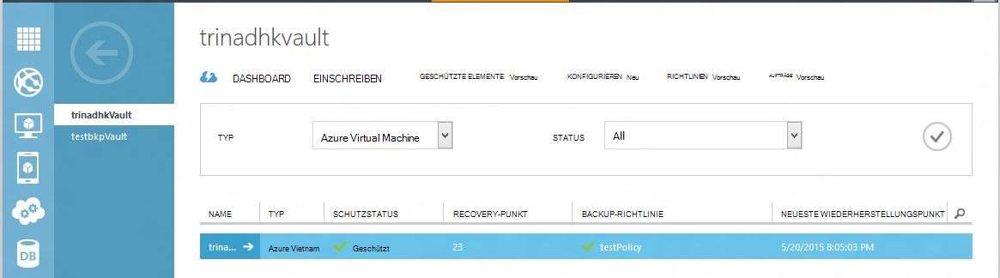
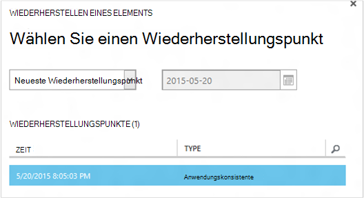
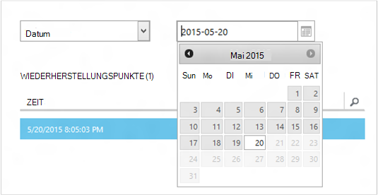
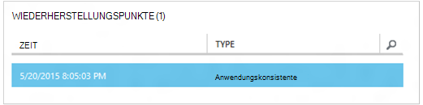
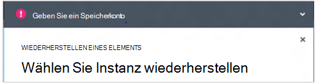
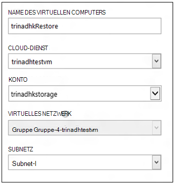
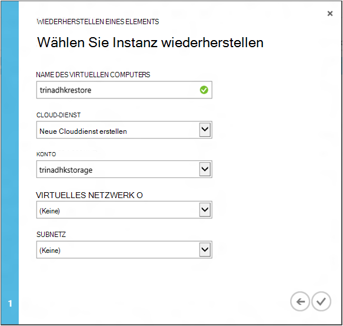
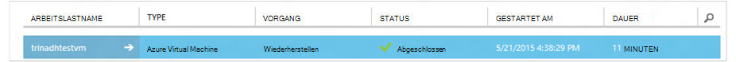

<properties
    pageTitle="Ein virtueller Computer aus einer Sicherung wiederherstellen | Microsoft Azure"
    description="Erfahren Sie, wie Azure virtuellen Computer von einem Wiederherstellungspunkt wiederherstellen"
    services="backup"
    documentationCenter=""
    authors="trinadhk"
    manager="shreeshd"
    editor=""
    keywords="Sicherung; Das Wiederherstellen; Wiederherstellungspunkt;"/>

<tags
    ms.service="backup"
    ms.workload="storage-backup-recovery"
    ms.tgt_pltfrm="na"
    ms.devlang="na"
    ms.topic="article"
    ms.date="08/02/2016"
    ms.author="trinadhk; jimpark;"/>

# Virtuelle Computer in Azure wiederherstellen

> [AZURE.SELECTOR]
- [VMs in Azure-Portal wiederherstellen](backup-azure-arm-restore-vms.md)
- [VMs im klassischen Portal wiederherstellen](backup-azure-restore-vms.md)

Wiederherstellen Sie einen virtuellen Computer einer neuen VM aus Sicherungskopien gespeichert in einer Azure backup Tresor mit den folgenden Schritten.

## Workflow wiederherstellen

### 1. Wählen Sie ein Element wiederherstellen

1. Navigieren Sie zu der Registerkarte **Geschützte Elemente** und den virtuellen Computer zu einer neuen VM wiederherstellen.

    

    Der **Wiederherstellungspunkt** auf **Geschützte Elemente** wird Anzahl der Wiederherstellungspunkte für eine virtuelle Maschine erklärt. **Neueste Recovery Point** -Spalte enthält den Zeitpunkt der letzten Sicherung die virtuellen Computer wiederhergestellt werden können.

2. Klicken Sie zum Öffnen des Assistenten **ein Element wiederherstellen** **Wiederherstellen** .

    

### 2. Wählen Sie einen Wiederherstellungspunkt

1. Im Bildschirm **einen Wiederherstellungspunkt auswählen** können Sie aus dem neuesten Wiederherstellungspunkt oder von einem vorherigen Zeitpunkt wiederherstellen. Die Standardoption ausgewählt, wenn der Assistent geöffnet ist *Neueste Wiederherstellungspunkt*.

    

2. Einen früheren Zeitpunkt Zeitpunkt entnommen, wählen in der Dropdownliste die Option **Wählen** , und wählen Sie ein Datum im Kalender-Steuerelement auf das **Kalendersymbol**. In das Steuerelement alle Wiederherstellungspunkte haben mit einer hellen grau gefüllt und können vom Benutzer ausgewählt werden.

    

    Wenn Sie ein Datum im Kalender-Steuerelement klicken, zeigt die Wiederherstellung verfügbar, Datum im Recovery-Punktetabelle angezeigt werden. **Die Spalte** gibt den Zeitpunkt, an dem die Momentaufnahme erstellt wurde. Die Spalte **Typ** zeigt die [Konsistenz](https://azure.microsoft.com/documentation/articles/backup-azure-vms/#consistency-of-recovery-points) des Wiederherstellungspunkts. Tabelle zeigt die Anzahl der verfügbaren Wiederherstellungspunkte an diesem Tag in Klammern.

    

3. Tabelle **Recovery-Punkte** wählen Sie den Wiederherstellungspunkt aus, und klicken Sie auf den Pfeil, um zum nächsten Bildschirm zu wechseln.

### 3. Geben Sie ein Zielverzeichnis

1. Geben Sie im Fenster **Select Wiederherstellen einer Instanz** Informationen zum Wiederherstellen des virtuellen Computers.

  - Geben Sie den Namen des virtuellen Computers: In einem bestimmten Clouddienst sollte der Name des virtuellen Computers eindeutig sein. Überschreiben die vorhandenen virtuellen Computer unterstützt nicht. 
  - Wählen Sie einen Cloud-Dienst für die VM: Dies ist für einen virtuellen Computer erstellen. Sie können entweder einen vorhandenen Cloud-Dienst oder einen neuen Clouddienst erstellen.

        Whatever cloud service name is picked should be globally unique. Typically, the cloud service name gets associated with a public-facing URL in the form of [cloudservice].cloudapp.net. Azure will not allow you to create a new cloud service if the name has already been used. If you choose to create select create a new cloud service, it will be given the same name as the virtual machine – in which case the VM name picked should be unique enough to be applied to the associated cloud service.

        We only display cloud services and virtual networks that are not associated with any affinity groups in the restore instance details. [Learn More](../virtual-network/virtual-networks-migrate-to-regional-vnet.md).

2. Wählen Sie ein Speicherkonto für die VM: obligatorisch VM erstellen. Sie können vorhandene Speicherkonten in derselben Region als Azure Backup-Depot auswählen. Speicherkonten, die Zone redundante oder Premium Speicher wird nicht unterstützt.

    Sind keine Speicherkonten unterstützte Konfiguration, erstellen Sie ein Speicherkonto unterstützte Konfiguration vor Wiederherstellung.

    

3. Wählen Sie ein virtuelles Netzwerk: das virtuelle Netzwerk (VNET) für den virtuellen Computer zum Zeitpunkt der Erstellung der VM gewählt werden. Die Wiederherstellung Benutzeroberfläche zeigt alle VNETs innerhalb dieses Abonnement verwendet werden kann. Ist nicht notwendig, ein VNET für die wiederhergestellte VM auswählen – Sie können wiederhergestellten virtuellen Computer über das Internet verbunden werden, auch wenn das VNET nicht angewendet wird.

    Wenn ausgewählte Cloud-Dienst ein virtuelles Netzwerk zugeordnet ist, können Sie nicht das virtuelle Netzwerk ändern.

    

4. Wählen Sie ein Subnetz: bei das VNET Subnetze, standardmäßig das erste Subnetz ausgewählt werden. Wählen Sie aus Dropdown-Optionen Subnetz Ihrer Wahl. Subnetdetails finden Sie Netzwerke Erweiterung [Portalhomepage](https://manage.windowsazure.com/) **Virtuelle Netzwerke** und wählen das virtuelle Netzwerk und Drilldown konfigurieren Subnet angezeigt.

    

5. Klicken Sie auf **Absenden** , im Assistenten die Details und erstellen einen Wiederherstellungsauftrag.

## Die Wiederherstellung überwachen
Geben Sie die Informationen in den Assistenten und übermittelt versucht Azure Backup zum Erstellen eines Auftrags, um den Wiederherstellungsvorgang zu verfolgen.

Wenn die Schaffung erfolgreich ist, sehen Sie eine Toast Benachrichtigung angezeigt, dass der Auftrag erstellt wurde. Weitere Details erhalten Schaltfläche **Auftrag anzeigen** , die Sie auf der Registerkarte **Aufträge** ausführen.

Nachdem die Wiederherstellung abgeschlossen ist, wird es als Registerkarte **Aufträge** abgeschlossen gekennzeichnet.

Nach dem Wiederherstellen der virtuelle Computer müssen Sie die Erweiterungen auf ursprünglichen VM und [ändern die Endpunkte](../virtual-machines/virtual-machines-windows-classic-setup-endpoints.md) für den virtuellen Computer in Azure-Portal neu installieren.

## Schritte nach der Wiederherstellung
Bei Verwendung eine Cloud-Init-basierten Linux-Distribution wie Ubuntu, aus Sicherheitsgründen werden Passwort blockiert buchen wiederherstellen. Verwenden Sie VMAccess-Erweiterung auf die wiederhergestellte VM zum [Zurücksetzen des Kennworts](../virtual-machines/virtual-machines-linux-classic-reset-access.md). Wir empfehlen SSH-Schlüssel auf diesen Distributionen zu Post Restore Kennwort zurücksetzen. 

## Sicherung wiederhergestellte VMs
VM auf denselben Clouddienst mit dem gleichen Namen wie VM gesichert wiederhergestellt haben, weiterhin Backups auf VM Post Restore. Wenn Sie über Vm auf andere Cloud-Dienst wiederhergestellt oder einen anderen Namen für die wiederhergestellte VM angegeben, dies als eine neue VM behandelt und müssen Setup Backup für wiederhergestellte VM.

## Eine VM Wiederherstellen bei Azure DataCenter Notfall
Azure Backup ermöglicht die Wiederherstellung gesichert VMs gepaarten Rechenzentrum bei primären Rechenzentren, VMs Erfahrungen Notfall ausführen und Sicherung Depot Geo-redundant zu konfigurieren. Bei solchen Szenarios müssen Sie ein Speicherkonto auswählen in gepaarten Datenzentrum vorhanden und Rest des Wiederherstellungsprozesses bleibt dieselbe. Azure Backup verwendet Compute-Dienst von paarweisen Geo wiederhergestellten virtuellen Computer erstellt. 

## Wiederherstellen virtueller Computer Domäne-Controller
Sicherung der Domänencontroller (DC) virtuelle Computer wird mit Azure Backup unterstützt. Jedoch müssen einige während des Wiederherstellungsvorgangs geachtet werden. Erfahrung Wiederherstellung unterscheidet sich deutlich für Domain Controller VMs in einer Konfiguration mit einem DC und VMs in einer Konfiguration mit Multi-DC.

### Domänencontroller
VM (wie andere VM) wiederhergestellt werden kann, von der Azure-Portal oder mit PowerShell.

### Mehrere Domänencontroller
Bei Multi-DC-Umgebung können die Domänencontroller eigene Daten synchron zu halten. Eine ältere Sicherung wiederhergestellten *ohne Vorsichtsmaßnahmen*ist, kann das USN-Vorgang in einer Multi-DC-Umgebung anrichten. Auf eine VM wiederherstellen werden im DSRM-Modus gestartet.

Die Herausforderung entsteht, weil DSRM-Modus nicht in Azure vorhanden ist. So kann nicht zum Wiederherstellen einer VM Azure-Portal verwenden werden. Der einzige unterstützte Wiederherstellung erfolgt mithilfe von PowerShell festplattenbasierte Wiederherstellung.

>[AZURE.WARNING] Verwenden Sie für Domänencontroller virtuelle Computer in einer Umgebung mit mehreren DC Azure-Portal für Wiederherstellung! Unterstützt nur PowerShell basierend wiederherstellen

Weitere Informationen über das [USN-Rollback-Problem](https://technet.microsoft.com/library/dd363553) und die Strategien um zu korrigieren.

## Wiederherstellen virtueller Computer mit speziellen Konfigurationen
Azure Backup unterstützt Backup für folgende spezielle Konfigurationen virtueller Maschinen.

- VMs unter Lastenausgleich (intern und extern)
- VMs mit mehreren reserviert
- Virtueller Computer mit mehreren Netzwerkkarten

Diese Konfigurationen Mandat folgende Aspekte beim Wiederherstellen.

>[AZURE.TIP] Verwenden Sie PowerShell basierend wiederherstellen besondere Netzwerkkonfiguration VMs Post Wiederherstellung neu erstellen.

### Wiederherstellen von der Benutzeroberfläche:
Beim Wiederherstellen von Benutzeroberfläche **immer neue Cloud-Dienst auswählen**. Hinweis: Da Portal nur obligatorische dauert Parameter während der Wiederherstellung Flow VMs mit Benutzeroberfläche wiederhergestellt besondere Netzwerkkonfiguration verloren, die sie besitzen. In anderen Worten werden Wiederherstellen virtueller Computer normal VMs ohne Konfiguration Lastenausgleich oder Multi NIC oder mehrere reservierte IP-Adresse.

### Wiederherstellen von PowerShell:
PowerShell hat die Möglichkeit, nur die VM-Datenträger aus einer Sicherung wiederherstellen und nicht den virtuellen Computer erstellt. Dies ist nützlich, wenn virtuelle Computer wiederherstellen erfordern spezielle Netzwerk-Konfigurationen ansprechen oben.

Gehen Sie folgendermaßen vor, um Post wiederherstellen virtuellen Datenträger vollständig neu erstellen:

1. Wiederherstellen Sie die Laufwerke von backup Tresor mit [Azure Backup PowerShell](../backup-azure-vms-classic-automation.md#restore-an-azure-vm)

2. Die VS-Konfiguration für Lastenausgleich erforderlich erstellen und mehrere NIC-mehrere reservierte IP-Adresse mit der PowerShell-Cmdlets verwenden die VM erstellen gewünschten Konfiguration.
    - Erstellen Sie virtueller Computer im Cloud-Dienst mit [internen Lastenausgleich](https://azure.microsoft.com/documentation/articles/load-balancer-internal-getstarted/)
    - VM [Lastenausgleich mit Internetzugriff] Verbindung erstellen (https://azure.microsoft.com/en-us/documentation/articles/load-balancer-internet-getstarted/)
    - Erstellen Sie virtueller Computer mit [mehreren Netzwerkkarten](https://azure.microsoft.com/documentation/articles/virtual-networks-multiple-nics/)
    - Erstellen Sie virtueller Computer mit [mehreren reserviert](https://azure.microsoft.com/documentation/articles/virtual-networks-reserved-public-ip/)

## Nächste Schritte
- [Problembehandlung bei Fehlern](backup-azure-vms-troubleshoot.md#restore)
- [Verwaltung virtueller Computer](backup-azure-manage-vms.md)
