<properties
   pageTitle="Wiederherstellen von Daten auf einem Windows Server oder Windows-Client mit dem klassischen Bereitstellungsmodell Azure | Microsoft Azure"
   description="Informationen Sie zum Wiederherstellen von einem Windows-Server oder Windows-Client."
   services="backup"
   documentationCenter=""
   authors="saurabhsensharma"
   manager="shivamg"
   editor=""/>

<tags
   ms.service="backup"
   ms.workload="storage-backup-recovery"
     ms.tgt_pltfrm="na"
     ms.devlang="na"
     ms.topic="article"
     ms.date="08/02/2016"
     ms.author="trinadhk; jimpark; markgal;"/>

# Wiederherstellen von Dateien auf einem WindowsServer oder Windows-Clientcomputer mit dem klassischen Bereitstellungsmodell

> [AZURE.SELECTOR]
- [Verwaltungsportal](backup-azure-restore-windows-server-classic.md)
- [Azure-portal](backup-azure-restore-windows-server.md)

Dieser Artikel behandelt die zwei Arten von Wiederherstellung erforderlichen Schritte:

- Wiederherstellen von Daten auf demselben Computer, den Sicherungen entnommen wurden.
- Wiederherstellen von Daten auf einem anderen Computer.

In beiden Fällen werden die Daten aus dem Azure Backup-Tresor abgerufen.

[AZURE.INCLUDE [learn-about-deployment-models](../../includes/learn-about-deployment-models-classic-include.md)]

## Wiederherstellen von Daten auf dem gleichen Computer
Wenn Sie versehentlich eine Datei gelöscht und auf dem gleichen Computer wiederherstellen (von der die Sicherung stammt), helfen die folgenden Schritte Daten wiederherzustellen.

1. Öffnen Sie das Snap-in **Microsoft Azure Backup** .
2. Klicken Sie auf **Daten wiederherstellen** , um den Workflow zu initiieren.

    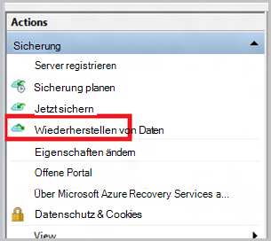

3. Wählen Sie die * *dieser Server (*Yourmachinename*) ** die gesicherte Datei auf demselben Computer wiederherstellen.

    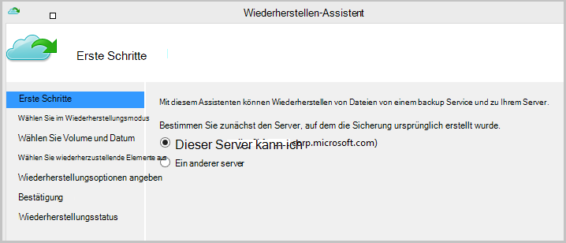

4. Wählen Sie **für Dateien** oder **Dateien suchen**.

    Lassen Sie die Standardoption, möchten Sie eine oder mehrere Dateien wiederherstellen, deren Pfad bekannt ist. Wenn Sie nicht sicher zur Ordnerstruktur sind jedoch nach einer Datei suchen möchten, wählen Sie die Option **Dateien suchen** . In diesem Abschnitt gehen wir mit der Standardoption.

    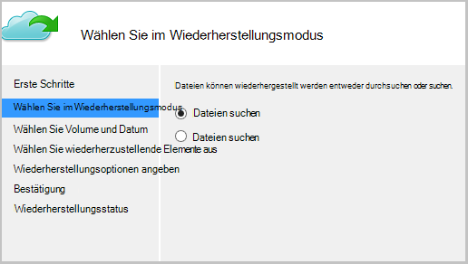

5. Wählen Sie das Volume die Datei wiederherstellen möchten.

    Sie können von einem beliebigen Punkt wiederherstellen. Datumsangaben **Fett** im Calendar-Steuerelement erscheinen geben die Verfügbarkeit eines Wiederherstellungspunkts. Nach einem Datum basierend auf der Sicherungszeitplan und den Erfolg eines Sicherungsvorgangs Sie können einen Zeitpunkt auswählen aus der **Zeit** nach unten.

    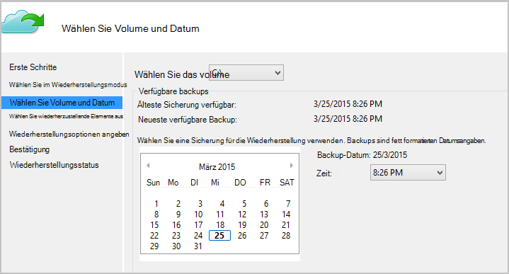

6. Wählen Sie wiederherzustellende Elemente aus. Sie können Ordner/Dateien wiederherstellen möchten.

    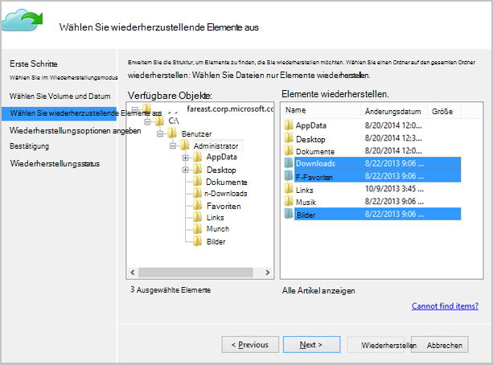

7. Geben Sie die Recovery-Parameter.

    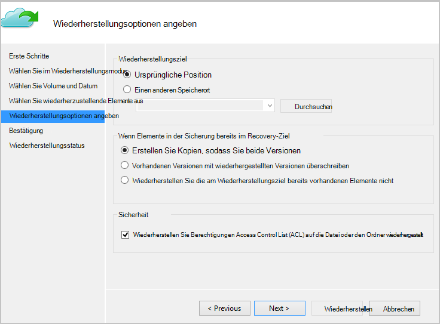

  - Sie können eine Wiederherstellung am ursprünglichen Speicherort (in der Datei oder der Ordner überschrieben werden würden) oder einen anderen Speicherort auf demselben Computer.
  - Wenn Datei oder der Ordner wiederherstellen möchten am Zielspeicherort vorhanden ist, können Sie Kopien (zwei Versionen derselben Datei), die Dateien im Zielverzeichnis überschrieben oder überspringen die Wiederherstellung der Dateien im Ziel vorhanden.
  - Es empfiehlt sich, lassen Sie die Standardoption Wiederherstellen von ACLs auf die Dateien, die wiederhergestellt werden.

8. Diese Eingaben verfügbar sind, klicken Sie auf **Weiter**. Die Dateien auf diesem Computer wieder Recovery-Workflow wird gestartet.

## In einem anderen Computer wiederherstellen
Wenn der gesamte Server ausfällt, können Sie Daten von Azure-Sicherung auf einem anderen Computer wiederherstellen. Die folgenden Schritte beschreiben den Workflow.  

Die Terminologie Schritte umfasst:

- *Quellcomputer* den ursprünglichen Computer der Sicherung und ist zurzeit nicht verfügbar.
- *Zielcomputer* Computer, dem die Daten wiederhergestellt werden.
- *Beispiel-Depot* die Sicherung Depot mit dem *Quellcomputer* und *Zielcomputer* registriert werden.  

> [AZURE.NOTE] Sicherungen von einem Computer können auf einem Computer mit einer früheren Version des Betriebssystems wiederhergestellt werden. Z. B. bei Backups von einem Computer mit Windows 7 können sie auf Windows 8 oder höher Computer wiederhergestellt werden. Allerdings ist die umgekehrt nicht gelten.

1. Öffnen Sie das **Microsoft Azure Backup** Snap-in auf dem *Zielcomputer*.
2. Sicherstellen Sie, dass der *Zielcomputer* und der *Quellcomputer* backup dasselbe Depot registriert werden.
3. Klicken Sie auf **Daten wiederherstellen** , um den Workflow zu initiieren.

    

4. Wählen Sie **einen anderen server**

    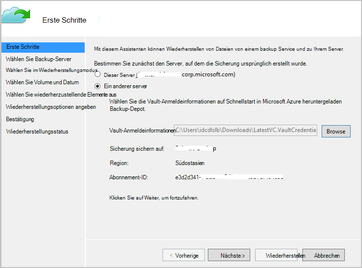

5. Geben Sie den Vault Anmeldeinformationen, das entspricht zum *Beispiel Depot*. Der Anmeldeinformationsdatei Vault ist ungültig (oder abgelaufen) herunterladen Sie eine Anmeldeinformationen Depot aus dem *Beispiel Depot* im klassischen Azure-portal Sobald der Anmeldeinformationsdatei Depot angegeben wird, ist backup Depot Depot Anmeldeinformationen Datei angezeigt.

6. Wählen Sie *Quellcomputer* aus der Liste der Computer angezeigt.

    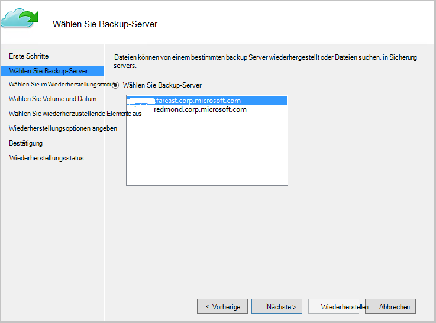

7. Die Option der **Suche nach Dateien** oder **Dateien suchen** . In diesem Abschnitt werden wir die Option **Dateien suchen** verwenden.

    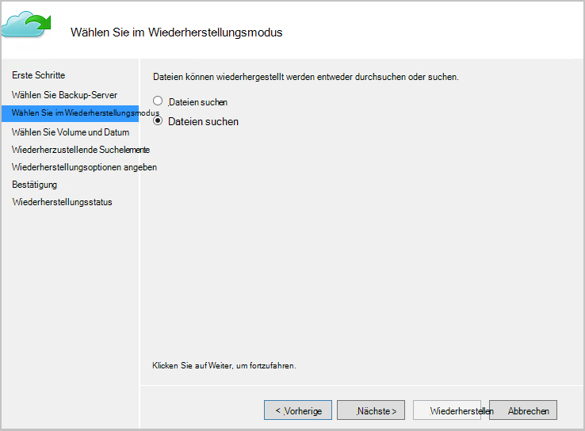

8. Volume und Datum im nächsten Bildschirm auswählen. Suchen Sie nach den Namen Ordner-Datei, die, den Sie wiederherstellen möchten.

    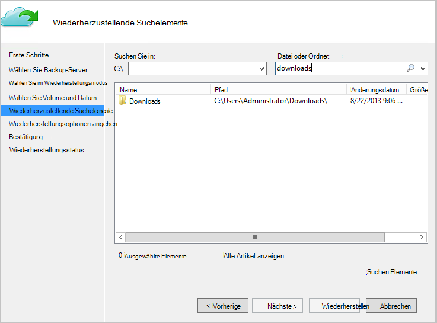

9. Wählen Sie den Speicherort, in dem die Dateien wiederhergestellt werden müssen.

    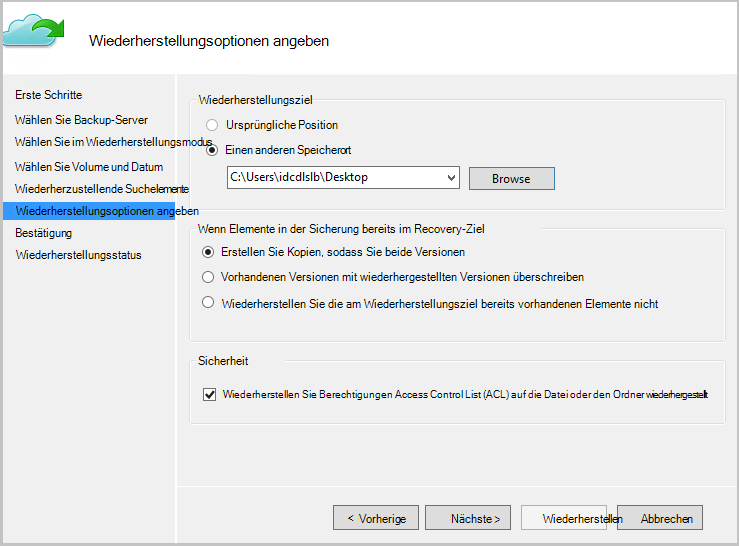

10. Bereitstellen der verschlüsselungspassphrase ein, die während der Registrierung *des Quellcomputers* *Beispiel Depot*bereitgestellt wurde.

    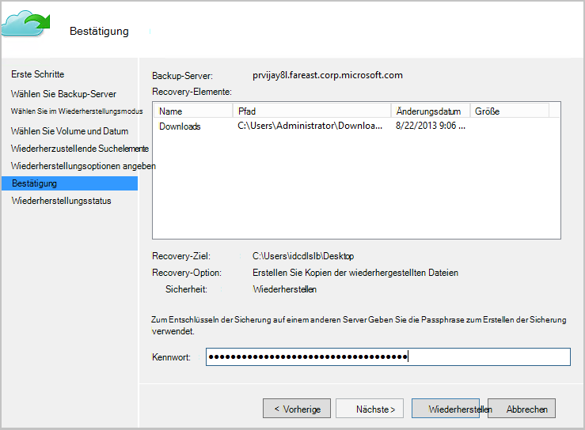

11. Die Eingabe erfolgt, klicken Sie auf **Wiederherstellen**, die Wiederherstellung der gesicherten Dateien zum Ziel bereitgestellt wird.

## Nächste Schritte
- [Azure Backup FAQ](backup-azure-backup-faq.md)
- Besuchen Sie das [Forum Azure Backup](http://go.microsoft.com/fwlink/p/?LinkId=290933).

## Weitere Informationen
- [Azure Sicherung (Übersicht)](http://go.microsoft.com/fwlink/p/?LinkId=222425)
- [Backup Azure virtuelle Computer](backup-azure-vms-introduction.md)
- [Sichern von Microsoft-Arbeitslasten](backup-azure-dpm-introduction.md)
