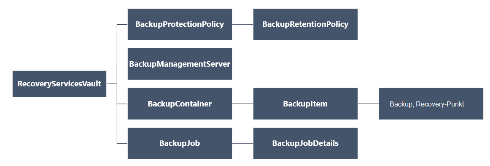

<properties
   pageTitle="Bereitstellen und Verwalten von Sicherungskopien für Ressourcen-Manager bereitgestellte VMs mit PowerShell | Microsoft Azure"
   description="Mithilfe von PowerShell bereitstellen und Verwalten von Backups in Azure für Ressourcen-Manager bereitgestellte VMs"
   services="backup"
   documentationCenter=""
   authors="markgalioto"
   manager="cfreeman"
   editor=""/>

<tags
   ms.service="backup"
   ms.devlang="na"
   ms.topic="article"
   ms.tgt_pltfrm="na"
   ms.workload="storage-backup-recovery"
   ms.date="08/03/2016"
   ms.author="markgal; trinadhk"/>

# <a name="deploy-and-manage-backups-for-resource-manager-deployed-vms-using-powershell"></a>Bereitstellen und Verwalten von Sicherungskopien für Ressourcen-Manager bereitgestellte VMs mit PowerShell

> [AZURE.SELECTOR]
- [Ressourcen-Manager](backup-azure-vms-automation.md)
- [Classic](backup-azure-vms-classic-automation.md)

Dieser Artikel veranschaulicht das Azure PowerShell-Cmdlets zum Sichern und Wiederherstellen einer Azure Virtual Machine (VM) von einem Depot Recovery Services verwenden. Ein Depot Recovery Services ist ein Azure-Ressourcen-Manager und zum Schutz von Daten und Ressourcen in Azure Backup und Azure Site Recovery Services. Ein Depot Recovery Services können VMs Azure Service Manager bereitgestellt, sowie VMs Ressourcenmanager Azure bereitgestellt.

>[AZURE.NOTE] Azure hat zwei Bereitstellungsmodelle für erstellen und Verwenden von Ressourcen: [Ressourcen-Manager und Classic](../resource-manager-deployment-model.md). Dieser Artikel ist für die Verwendung mit VMs mit dem Ressourcen-Manager-Modell erstellt.

Dieser Artikel führt Sie durch einen virtuellen Computer zu schützen und Wiederherstellen von Daten von einem Wiederherstellungspunkt mithilfe von PowerShell.

## <a name="concepts"></a>Konzepte

Sind Sie nicht kennen Azure-Sicherungsdienst Überblick der Dienst Auschecken [Neuigkeiten Azure Backup?](backup-introduction-to-azure-backup.md) Bevor Sie beginnen, sicherzustellen Sie, dass die Grundlagen zum Arbeiten mit Azure Backup und die Grenzen der aktuellen VM backup-Lösung erforderlichen Komponenten behandelt.

Um PowerShell effektiv zu verwenden, muss die Hierarchie von Objekten und von wo zu verstehen.



AzureRmRecoveryServicesBackup PowerShell-Cmdlet Referenz finden Sie unter [Azure Backup - Recovery Services Cmdlets](https://msdn.microsoft.com/library/mt723320.aspx) in der Azure-Bibliothek.
AzureRmRecoveryServicesVault PowerShell-Cmdlet Referenz finden Sie unter [Azure Recovery Service Cmdlets](https://msdn.microsoft.com/library/mt643905.aspx).


## <a name="setup-and-registration"></a>Installation und Registrierung

Starten:

1. [Herunterladen der neuesten Version von PowerShell](https://github.com/Azure/azure-powershell/releases) (die mindestens erforderliche Version ist: 1.4.0)

2. Finden Sie die verfügbaren Azure Backup PowerShell-Cmdlets durch Eingabe des folgenden Befehls:

```
PS C:\> Get-Command *azurermrecoveryservices*

CommandType     Name                                               Version    Source
-----------     ----                                               -------    ------
Cmdlet          Backup-AzureRmRecoveryServicesBackupItem           1.4.0      AzureRM.RecoveryServices.Backup
Cmdlet          Disable-AzureRmRecoveryServicesBackupProtection    1.4.0      AzureRM.RecoveryServices.Backup
Cmdlet          Enable-AzureRmRecoveryServicesBackupProtection     1.4.0      AzureRM.RecoveryServices.Backup
Cmdlet          Get-AzureRmRecoveryServicesBackupContainer         1.4.0      AzureRM.RecoveryServices.Backup
Cmdlet          Get-AzureRmRecoveryServicesBackupItem              1.4.0      AzureRM.RecoveryServices.Backup
Cmdlet          Get-AzureRmRecoveryServicesBackupJob               1.4.0      AzureRM.RecoveryServices.Backup
Cmdlet          Get-AzureRmRecoveryServicesBackupJobDetails        1.4.0      AzureRM.RecoveryServices.Backup
Cmdlet          Get-AzureRmRecoveryServicesBackupManagementServer  1.4.0      AzureRM.RecoveryServices.Backup
Cmdlet          Get-AzureRmRecoveryServicesBackupProperties        1.4.0      AzureRM.RecoveryServices
Cmdlet          Get-AzureRmRecoveryServicesBackupProtectionPolicy  1.4.0      AzureRM.RecoveryServices.Backup
Cmdlet          Get-AzureRMRecoveryServicesBackupRecoveryPoint     1.4.0      AzureRM.RecoveryServices.Backup
Cmdlet          Get-AzureRmRecoveryServicesBackupRetentionPolic... 1.4.0      AzureRM.RecoveryServices.Backup
Cmdlet          Get-AzureRmRecoveryServicesBackupSchedulePolicy... 1.4.0      AzureRM.RecoveryServices.Backup
Cmdlet          Get-AzureRmRecoveryServicesVault                   1.4.0      AzureRM.RecoveryServices
Cmdlet          Get-AzureRmRecoveryServicesVaultSettingsFile       1.4.0      AzureRM.RecoveryServices
Cmdlet          New-AzureRmRecoveryServicesBackupProtectionPolicy  1.4.0      AzureRM.RecoveryServices.Backup
Cmdlet          New-AzureRmRecoveryServicesVault                   1.4.0      AzureRM.RecoveryServices
Cmdlet          Remove-AzureRmRecoveryServicesProtectionPolicy     1.4.0      AzureRM.RecoveryServices.Backup
Cmdlet          Remove-AzureRmRecoveryServicesVault                1.4.0      AzureRM.RecoveryServices
Cmdlet          Restore-AzureRMRecoveryServicesBackupItem          1.4.0      AzureRM.RecoveryServices.Backup
Cmdlet          Set-AzureRmRecoveryServicesBackupProperties        1.4.0      AzureRM.RecoveryServices
Cmdlet          Set-AzureRmRecoveryServicesBackupProtectionPolicy  1.4.0      AzureRM.RecoveryServices.Backup
Cmdlet          Set-AzureRmRecoveryServicesVaultContext            1.4.0      AzureRM.RecoveryServices
Cmdlet          Stop-AzureRmRecoveryServicesBackupJob              1.4.0      AzureRM.RecoveryServices.Backup
Cmdlet          Unregister-AzureRmRecoveryServicesBackupContainer  1.4.0      AzureRM.RecoveryServices.Backup
Cmdlet          Unregister-AzureRmRecoveryServicesBackupManagem... 1.4.0      AzureRM.RecoveryServices.Backup
Cmdlet          Wait-AzureRmRecoveryServicesBackupJob              1.4.0      AzureRM.RecoveryServices.Backup
```


Folgenden Aufgaben können mit PowerShell automatisiert werden:

- Erstellen eines Depots Recovery Services
- Sichern oder Azure VMs schützen
- Auslösen eines Sicherungsauftrags
- Überwachen eines Sicherungsauftrags
- Eine Azure VM wiederherstellen

## <a name="create-a-recovery-services-vault"></a>Erstellen eines Depots Recovery services

Die folgenden Schritte führen Sie durch das Erstellen eines Depots Recovery Services. Ein Depot Recovery Services unterscheidet sich ein Depot Backup.

1. Bei Verwendung von Azure Backup zum ersten Mal verwenden Sie **[Register-AzureRMResourceProvider](https://msdn.microsoft.com/library/mt679020.aspx)** -Cmdlet, Azure Recovery Service Provider mit Ihrem Abonnement registrieren.

    ```
    PS C:\> Register-AzureRmResourceProvider -ProviderNamespace "Microsoft.RecoveryServices"
    ```

2. Recovery Services Vault ist eine Ressource Ressourcenmanager müssen innerhalb einer Ressourcengruppe zu platzieren. Sie können eine vorhandene Ressourcengruppe verwenden oder erstellen eine neue Ressourcengruppe mit dem **[New-AzureRmResourceGroup](https://msdn.microsoft.com/library/mt678985.aspx)** -Cmdlet. Wenn Sie eine neue Ressourcengruppe erstellen, geben Sie den Namen und Speicherort für die Ressourcengruppe.  

    ```
    PS C:\> New-AzureRmResourceGroup –Name "test-rg" –Location "West US"
    ```

3. Verwenden Sie das Cmdlet **[Neu AzureRmRecoveryServicesVault](https://msdn.microsoft.com/library/mt643910.aspx)** neue Depot erstellen. Achten Sie an demselben Speicherort für das Depot für die Ressourcengruppe verwendet wurde.

    ```
    PS C:\> New-AzureRmRecoveryServicesVault -Name "testvault" -ResourceGroupName " test-rg" -Location "West US"
    ```

4. Geben Sie den Speicherredundanz verwenden; Sie können [Lokal redundanter Speicher (LRS)](../storage/storage-redundancy.md#locally-redundant-storage) oder [Geo redundanten Speicher (GRS)](../storage/storage-redundancy.md#geo-redundant-storage). Das folgende Beispiel zeigt, dass die Option BackupStorageRedundancy - TestVault GeoRedundant ist.

    ```
    PS C:\> $vault1 = Get-AzureRmRecoveryServicesVault –Name "testVault"
    PS C:\> Set-AzureRmRecoveryServicesBackupProperties  -Vault $vault1 -BackupStorageRedundancy GeoRedundant
    ```

    > [AZURE.TIP] Viele Azure Backup-Cmdlets erfordern Recovery Services Vault-Objekt als Eingabe. Aus diesem Grund empfiehlt es sich, das Backup Recovery Services Vault-Objekt in einer Variablen speichern.

## <a name="view-the-vaults-in-a-subscription"></a>Anzeigen von Depots in einem Abonnement
Verwenden Sie **[Get-AzureRmRecoveryServicesVault](https://msdn.microsoft.com/library/mt643907.aspx)** alle +++ Liste in das aktuelle Abonnement anzeigen. Sie können diesen Befehl verwenden, zu überprüfen, ob ein neues Depot erstellt wurde und welche Depots im Abonnement verfügbar sind.

Führen Sie den Befehl Get-AzureRmRecoveryServicesVault und alle Depots im Abonnement aufgelistet.

```
PS C:\> Get-AzureRmRecoveryServicesVault
Name              : Contoso-vault
ID                : /subscriptions/1234
Type              : Microsoft.RecoveryServices/vaults
Location          : WestUS
ResourceGroupName : Contoso-docs-rg
SubscriptionId    : 1234-567f-8910-abc
Properties        : Microsoft.Azure.Commands.RecoveryServices.ARSVaultProperties
```


## <a name="backup-azure-vms"></a>Backup Azure VMs
Erstellung einer Recovery Services Vault können Sie zu einem virtuellen Computer. Jedoch vor dem Anwenden des Schutzes muss den Vault-Kontext festgelegt und möchten die Schutzrichtlinie überprüfen. Depot Kontext definiert den Typ der Daten, die geschützt werden im Tresor. Die Schutzrichtlinie ist bei der Sicherungsauftrag ausgeführt wird und wie lange jeder Sicherung Snapshot gespeichert sind.

Bevor auf einen virtuellen Computer aktivieren, müssen Sie den Vault-Kontext festlegen. Der Kontext wird auf alle nachfolgenden Cmdlets angewendet.

```
PS C:\> Get-AzureRmRecoveryServicesVault -Name testvault | Set-AzureRmRecoveryServicesVaultContext
```

### <a name="create-a-protection-policy"></a>Erstellen einer

Wenn Sie ein neues Depot erstellen, enthält eine Standardrichtlinie. Diese Richtlinie löst einen Sicherungsauftrag täglich zu einem bestimmten Zeitpunkt. Snapshot backup wird pro die Standardrichtlinie für 30 Tage beibehalten. Die Standardrichtlinie können Sie schnell schützen die VM und die Richtlinie später mit anderen.

Verwenden Sie **[Get-AzureRmRecoveryServicesBackupProtectionPolicy](https://msdn.microsoft.com/library/mt723300.aspx)** auf die Liste der Richtlinien im Depot angezeigt:

```
PS C:\> Get-AzureRmRecoveryServicesBackupProtectionPolicy -WorkloadType AzureVM
Name                 WorkloadType       BackupManagementType BackupTime                DaysOfWeek
----                 ------------       -------------------- ----------                ----------
DefaultPolicy        AzureVM            AzureVM              4/14/2016 5:00:00 PM
```

> [AZURE.NOTE] Die Zeitzone im Feld BackupTime in PowerShell ist UTC. Wenn backup in Azure-Portal angezeigt wird, wird die Zeit an Ihre lokale Zeitzone angepasst.

Backup-Schutz-Richtlinie ist mindestens eine Aufbewahrungsrichtlinie zugeordnet.  Aufbewahrungsrichtlinie definiert, wie lange ein Wiederherstellungspunkt mit Azure Backup gespeichert ist. Verwenden Sie **Get-AzureRmRecoveryServicesBackupRetentionPolicyObject** Aufbewahrungsrichtlinie standardmäßig anzeigen.  **Get-AzureRmRecoveryServicesBackupSchedulePolicyObject** können Sie auch die Standardrichtlinie Zeitplan erhalten. Gruppenrichtlinienobjekte und einer Aufbewahrungsrichtlinie werden als Eingaben für das Cmdlet " **New AzureRmRecoveryServicesBackupProtectionPolicy** " verwendet.

Eine backup-Schutzrichtlinie definiert, wann und wie oft die Sicherung eines Artikels erfolgt. Neu-AzureRmRecoveryServicesBackupProtectionPolicy-Cmdlet erstellt ein PowerShell-Objekt, der backup-Richtlinie enthält. Backup-Richtlinie dient als Eingabe für das Cmdlet "AzureRmRecoveryServicesBackupProtection aktivieren".

```
PS C:\> $schPol = Get-AzureRmRecoveryServicesBackupSchedulePolicyObject -WorkloadType "AzureVM"
PS C:\>  $retPol = Get-AzureRmRecoveryServicesBackupRetentionPolicyObject -WorkloadType "AzureVM"
PS C:\>  New-AzureRmRecoveryServicesBackupProtectionPolicy -Name "NewPolicy" -WorkloadType AzureVM -RetentionPolicy $retPol -SchedulePolicy $schPol
Name                 WorkloadType       BackupManagementType BackupTime                DaysOfWeek
----                 ------------       -------------------- ----------                ----------
NewPolicy           AzureVM            AzureVM              4/24/2016 1:30:00 AM
```

### <a name="enable-protection"></a>Schutz aktivieren

Ermöglicht Schutz umfasst zwei Objekte - Elements und der Richtlinie. Beide Objekte müssen auf das Depot zu aktivieren. Nach die Richtlinie das Depot zugeordnet ist backup Workflow im Richtlinienzeitplan definierten Zeitpunkt ausgelöst.

So aktivieren Sie den Schutz auf unverschlüsselte ARM VMs

```
PS C:\> $pol=Get-AzureRmRecoveryServicesBackupProtectionPolicy -Name "NewPolicy"
PS C:\> Enable-AzureRmRecoveryServicesBackupProtection -Policy $pol -Name "V2VM" -ResourceGroupName "RGName1"
```

Um den Schutz auf verschlüsselte VMs [verschlüsselt BEK mit KEK] aktivieren, müssen Sie Berechtigungen für Azure Sicherungsdienst Schlüssel und geheime Schlüssel Depot gelesen. 

```
PS C:\> Set-AzureRmKeyVaultAccessPolicy -VaultName 'KeyVaultName' -ResourceGroupName 'RGNameOfKeyVault' -PermissionsToKeys backup,get,list -PermissionsToSecrets get,list -ServicePrincipalName 262044b1-e2ce-469f-a196-69ab7ada62d3
PS C:\> $pol=Get-AzureRmRecoveryServicesBackupProtectionPolicy -Name "NewPolicy"
PS C:\> Enable-AzureRmRecoveryServicesBackupProtection -Policy $pol -Name "V2VM" -ResourceGroupName "RGName1"
```

ASM-basierte VMs

```
PS C:\>  $pol=Get-AzureRmRecoveryServicesBackupProtectionPolicy -Name "NewPolicy"
PS C:\>  Enable-AzureRmRecoveryServicesBackupProtection -Policy $pol -Name "V1VM" -ServiceName "ServiceName1"
```

### <a name="modify-a-protection-policy"></a>Ändern einer

Ändern Sie die Richtlinie, BackupSchedulePolicyObject oder BackupRetentionPolicy bearbeiten und ändern Sie die Richtlinie mit Set-AzureRmRecoveryServicesBackupProtectionPolicy

Im folgenden Beispiel wird die Anzahl der Aufbewahrung 365.

```
PS C:\> $retPol = Get-AzureRmRecoveryServicesBackupRetentionPolicyObject -WorkloadType "AzureVM"
PS C:\> $retPol.DailySchedule.DurationCountInDays = 365
PS C:\> $pol= Get-AzureRmRecoveryServicesBackupProtectionPolicy -Name NewPolicy
PS C:\> Set-AzureRmRecoveryServicesBackupProtectionPolicy -Policy $pol  -RetentionPolicy  $RetPol
```

## <a name="run-an-initial-backup"></a>Führen Sie eine anfängliche Sicherung

Sicherungszeitplan löst eine vollständige Sicherung auf die für den Artikel. Sichern Sie auf nachfolgende USV Backup ist eine inkrementelle Kopie. Wenn Sie die erste Sicherung zu einem bestimmten Zeitpunkt oder auch sofort erzwingen möchten verwenden Sie das Cmdlet **[Backup-AzureRmRecoveryServicesBackupItem](https://msdn.microsoft.com/library/mt723312.aspx)** :

```
PS C:\> $namedContainer = Get-AzureRmRecoveryServicesBackupContainer -ContainerType "AzureVM" -Status "Registered" -Name "V2VM"
PS C:\> $item = Get-AzureRmRecoveryServicesBackupItem -Container $namedContainer -WorkloadType "AzureVM"
PS C:\> $job = Backup-AzureRmRecoveryServicesBackupItem -Item $item
WorkloadName     Operation            Status               StartTime                 EndTime                   JobID
------------     ---------            ------               ---------                 -------                   ----------
V2VM              Backup               InProgress            4/23/2016 5:00:30 PM                       cf4b3ef5-2fac-4c8e-a215-d2eba4124f27
```

> [AZURE. Hinweis: Die Zeitzone die Felder Startzeit und Endzeit in PowerShell ist UTC. Wenn in Azure-Portal angezeigt wird, wird die Zeit an Ihre lokale Zeitzone angepasst.

## <a name="monitoring-a-backup-job"></a>Überwachen eines Sicherungsauftrags

Die meisten umfangreichen Vorgänge in Azure Backup werden als Auftrag modelliert. Dies erleichtert verfolgen ohne Azure-Portal zu öffnen jederzeit.

Um den aktuellen Status einer laufenden Auftrags abzurufen, verwenden Sie das Cmdlet "Get-AzureRmRecoveryservicesBackupJob".

```
PS C:\ > $joblist = Get-AzureRmRecoveryservicesBackupJob –Status InProgress
PS C:\ > $joblist[0]
WorkloadName     Operation            Status               StartTime                 EndTime                   JobID
------------     ---------            ------               ---------                 -------                   ----------
V2VM             Backup               InProgress            4/23/2016 5:00:30 PM           cf4b3ef5-2fac-4c8e-a215-d2eba4124f27
```

Verwenden Sie statt dieser Aufträge abgeschlossen, unnötige zusätzliche Code - polling **[Wait-AzureRmRecoveryServicesBackupJob](https://msdn.microsoft.com/library/mt723321.aspx)** -Cmdlet. Dieses Cmdlet hält die Ausführung, bis der Auftrag abgeschlossen ist oder der angegebene Timeoutwert erreicht.

```
PS C:\> Wait-AzureRmRecoveryServicesBackupJob -Job $joblist[0] -Timeout 43200
```

## <a name="restore-an-azure-vm"></a>Eine Azure VM wiederherstellen

Es ist ein entscheidender Unterschied zwischen eine VM mit Azure-Portal wiederherstellen und Wiederherstellen einer VM mit PowerShell. Mit PowerShell ist Wiederherstellung abgeschlossen, sobald die Festplatten und Konfigurationsinformationen aus dem Wiederherstellungspunkt erstellt werden. Der Wiederherstellungsvorgang wird keinen virtuellen Computer erstellen. Die Schritte zum Erstellen der virtuellen Maschine von Festplatten dienen. Um einen virtuellen Computer vollständig wiederherstellen zu können, müssen Sie jedoch durch die folgenden Verfahren verwenden:

- Wählen Sie die VM
- Wählen Sie einen Wiederherstellungspunkt
- Der Laufwerke
- Die VM aus gespeicherten Datenträger erstellen

Die folgende Grafik zeigt die Hierarchie von RecoveryServicesVault auf der BackupRecoveryPoint.


Um Daten wiederherzustellen, identifizieren Sie gesicherten Element und Wiederherstellungspunkt, der Point-in-Time-Daten enthält. Können Sie **[Wiederherstellen-AzureRmRecoveryServicesBackupItem](https://msdn.microsoft.com/library/mt723316.aspx)** -Cmdlet die Debitorenkonto aus dem Tresor wiederherstellen.

### <a name="select-the-vm"></a>Wählen Sie die VM

Um das PowerShell-Objekt erhalten, das richtige backup Element identifiziert, aus dem Container im Tresor starten und Funktionsweise der Objekthierarchie. Um den Container auszuwählen, der die VM darstellt, verwenden Sie das Cmdlet " **[Get-AzureRmRecoveryServicesBackupContainer](https://msdn.microsoft.com/library/mt723319.aspx)** " und leiten Sie das Cmdlet " **[Get-AzureRmRecoveryServicesBackupItem](https://msdn.microsoft.com/library/mt723305.aspx)** ".

```
PS C:\> $namedContainer = Get-AzureRmRecoveryServicesBackupContainer  -ContainerType AzureVM –Status Registered -Name 'V2VM'
PS C:\> $backupitem = Get-AzureRmRecoveryServicesBackupItem –Container $namedContainer  –WorkloadType "AzureVM"
```

### <a name="choose-a-recovery-point"></a>Wählen Sie einen Wiederherstellungspunkt

Verwenden Sie das Cmdlet " **[Get-AzureRmRecoveryServicesBackupRecoveryPoint](https://msdn.microsoft.com/library/mt723308.aspx)** ", um alle Wiederherstellungspunkte für das backup Element aufzulisten. Wählen Sie den Wiederherstellungspunkt wiederherstellen. Wenn Sie die zu verwendende Wiederherstellungspunkt kennen, wird empfohlen, die neuesten RecoveryPointType wählen = AppConsistent Stelle in der Liste.

Im folgenden Skript ist die Variable **$rp**ein Array von Wiederherstellungspunkten für die Sicherung ausgewählte Element. Das Array wird mit der letzte Wiederherstellungspunkt am Index 0 in umgekehrter Reihenfolge sortiert. Mit der standardmäßigen PowerShell Arrayindizierung den Wiederherstellungspunkt auswählen. Beispiel: $rp [0] wird den letzten Wiederherstellungspunkt ausgewählt.

```
PS C:\> $startDate = (Get-Date).AddDays(-7)
PS C:\> $endDate = Get-Date
PS C:\> $rp = Get-AzureRmRecoveryServicesBackupRecoveryPoint -Item $backupitem -StartDate $startdate.ToUniversalTime() -EndDate $enddate.ToUniversalTime()
PS C:\> $rp[0]
RecoveryPointAdditionalInfo :
SourceVMStorageType         : NormalStorage
Name                        : 15260861925810
ItemName                    : VM;iaasvmcontainer;RGName1;V2VM
RecoveryPointId             : /subscriptions/XX/resourceGroups/ RGName1/providers/Microsoft.RecoveryServices/vaults/testvault/backupFabrics/Azure/protectionContainers/IaasVMContainer;iaasvmcontainer;RGName1;V2VM/protectedItems/VM;iaasvmcontainer; RGName1;V2VM
                              /recoveryPoints/15260861925810
RecoveryPointType           : AppConsistent
RecoveryPointTime           : 4/23/2016 5:02:04 PM
WorkloadType                : AzureVM
ContainerName               : IaasVMContainer;iaasvmcontainer; RGName1;V2VM
ContainerType               : AzureVM
BackupManagementType        : AzureVM
```


### <a name="restore-the-disks"></a>Der Laufwerke

Verwenden Sie das Cmdlet **[Wiederherstellung AzureRmRecoveryServicesBackupItem](https://msdn.microsoft.com/library/mt723316.aspx)** Daten und Konfigurationsinformationen für eine Sicherung Element einem Wiederherstellungspunkt wiederherstellen. Nachdem Sie ermittelt haben ein Wiederherstellungspunkt verwenden als Wert für den Parameter **- RecoveryPoint** . Im vorherigen Beispielcode wurde **$rp [0]** als Wiederherstellungspunkt ausgewählt. Im folgenden Beispielcode wird **$rp [0]** als Wiederherstellungspunkt zur Wiederherstellung auf Datenträger angegeben.

Festplatten und Konfigurationsinformationen

```
PS C:\> $restorejob = Restore-AzureRmRecoveryServicesBackupItem -RecoveryPoint $rp[0] -StorageAccountName DestAccount -StorageAccountResourceGroupName DestRG
PS C:\> $restorejob
WorkloadName     Operation          Status               StartTime                 EndTime            JobID
------------     ---------          ------               ---------                 -------          ----------
V2VM              Restore           InProgress           4/23/2016 5:00:30 PM                        cf4b3ef5-2fac-4c8e-a215-d2eba4124f27
```

Nachdem der Wiederherstellungsauftrag abgeschlossen wurde, verwenden Sie das Cmdlet " **[Get-AzureRmRecoveryServicesBackupJobDetails](https://msdn.microsoft.com/library/mt723310.aspx)** " die Details des Wiederherstellungsvorgangs. Die Eigenschaft JobDetails hat die Informationen für die VM neu erstellen.

```
PS C:\> $restorejob = Get-AzureRmRecoveryServicesBackupJob -Job $restorejob
PS C:\> $details = Get-AzureRmRecoveryServicesBackupJobDetails
```

Nachdem Sie den Datenträger wiederherstellen, wechseln Sie zum nächsten Abschnitt Informationen zum Erstellen von VM

### <a name="create-a-vm-from-restored-disks"></a>Erstellen einer VM aus wiederhergestellten Laufwerke

Nachdem Sie die Datenträger wiederhergestellt haben, folgendermaßen Sie erstellen und konfigurieren den virtuellen Computer von der Festplatte.

1. Abfrage der wiederhergestellten Datenträgereigenschaften für die Auftragsdetails.

    ```
    PS C:\> $properties = $details.properties
    PS C:\> $storageAccountName = $properties["Target Storage Account Name"]
    PS C:\> $containerName = $properties["Config Blob Container Name"]
    PS C:\> $blobName = $properties["Config Blob Name"]
    ```

2. Azure-Speicher-Kontext festlegen und die JSON-Konfigurationsdatei.

    ```
    PS C:\> Set-AzureRmCurrentStorageAccount -Name $storageaccountname -ResourceGroupName testvault
    PS C:\> $destination_path = "C:\vmconfig.json"
    PS C:\> Get-AzureStorageBlobContent -Container $containerName -Blob $blobName -Destination $destination_path
    PS C:\> $obj = ((Get-Content -Path $destination_path -Encoding Unicode)).TrimEnd([char]0x00) | ConvertFrom-Json
    ```

3. Verwenden Sie JSON-Konfigurationsdatei, um die VM-Konfiguration erstellen.

    ```
  PS C:\> $vm = New-AzureRmVMConfig -VMSize $obj.HardwareProfile.VirtualMachineSize -VMName "testrestore"
    ```

4. Legen Sie die Betriebssystem-Datenträger und Datenträger.

      Für virtuelle Computer nicht verschlüsselt

       ```
       PS C:\> Set-AzureRmVMOSDisk -VM $vm -Name "osdisk" -VhdUri $obj.StorageProfile.OSDisk.VirtualHardDisk.Uri -CreateOption “Attach”
       PS C:\> $vm.StorageProfile.OsDisk.OsType = $obj.StorageProfile.OSDisk.OperatingSystemType foreach($dd in $obj.StorageProfile.DataDisks)
       {
       $vm = Add-AzureRmVMDataDisk -VM $vm -Name "datadisk1" -VhdUri $dd.VirtualHardDisk.Uri -DiskSizeInGB 127 -Lun $dd.Lun -CreateOption Attach
       }
       ```
      Für verschlüsselte VMs müssen Sie [Vault Informationen](https://msdn.microsoft.com/library/dn868052.aspx) angeben, bevor Sie Laufwerke zuordnen können.
      
      ```
      PS C:\> Set-AzureRmVMOSDisk -VM $vm -Name "osdisk" -VhdUri $obj.StorageProfile.OSDisk.VirtualHardDisk.Uri -DiskEncryptionKeyUrl "https://ContosoKeyVault.vault.azure.net:443/secrets/ContosoSecret007" -DiskEncryptionKeyVaultId "/subscriptions/abcdedf007-4xyz-1a2b-0000-12a2b345675c/resourceGroups/ContosoRG108/providers/Microsoft.KeyVault/vaults/ContosoKeyVault" -KeyEncryptionKeyUrl "https://ContosoKeyVault.vault.azure.net:443/keys/ContosoKey007" -KeyEncryptionKeyVaultId "subscriptions/abcdedf007-4xyz-1a2b-0000-12a2b345675c/resourceGroups/ContosoRG108/providers/Microsoft.KeyVault/vaults/ContosoKeyVault" -CreateOption "Attach" -Windows
      PS C:\> $vm.StorageProfile.OsDisk.OsType = $obj.StorageProfile.OSDisk.OperatingSystemType foreach($dd in $obj.StorageProfile.DataDisks)
       {
       $vm = Add-AzureRmVMDataDisk -VM $vm -Name "datadisk1" -VhdUri $dd.VirtualHardDisk.Uri -DiskSizeInGB 127 -Lun $dd.Lun -CreateOption Attach
       }
      ```
      
5. Das Netzwerk einstellen.

    ```
    PS C:\> $nicName="p1234"
    PS C:\> $pip = New-AzureRmPublicIpAddress -Name $nicName -ResourceGroupName "test" -Location "WestUS" -AllocationMethod Dynamic
    PS C:\> $vnet = Get-AzureRmVirtualNetwork -Name "testvNET" -ResourceGroupName "test"
    PS C:\> $nic = New-AzureRmNetworkInterface -Name $nicName -ResourceGroupName "test" -Location "WestUS" -SubnetId $vnet.Subnets[$subnetindex].Id -PublicIpAddressId $pip.Id
    PS C:\> $vm=Add-AzureRmVMNetworkInterface -VM $vm -Id $nic.Id
    ```

6. Erstellen Sie den virtuellen Computer.

    ```
    PS C:\> $vm.StorageProfile.OsDisk.OsType = $obj.StorageProfile.OSDisk.OperatingSystemType
    PS C:\> New-AzureRmVM -ResourceGroupName "test" -Location "WestUS" -VM $vm
    ```

## <a name="next-steps"></a>Nächste Schritte

Auf Wunsch mit PowerShell mit Azure Ressourcen checken Sie PowerShell Artikel zum Schutz von Windows Server, [Bereitstellen und Verwalten von Backup für Windows Server](./backup-client-automation.md). Gibt auch ein Artikel PowerShell zum Verwalten von DPM Backups, [Bereitstellen und Verwalten von Backup für DPM](./backup-dpm-automation.md). Beide Artikel ist eine Version für Ressourcenmanager Bereitstellung sowie Classic.  
