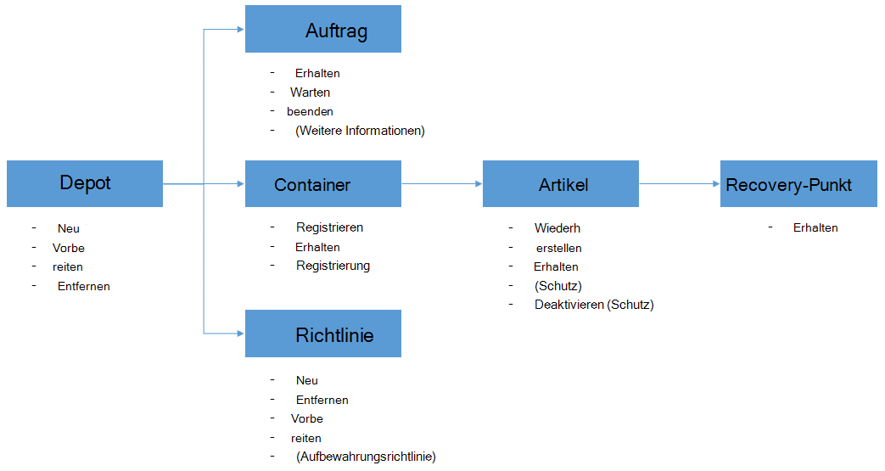

<properties
    pageTitle="Bereitstellen und Verwalten von Backup für Azure VMs mit PowerShell | Microsoft Azure"
    description="Informationen Sie zum Bereitstellen und Verwalten von Azure Backup mit PowerShell"
    services="backup"
    documentationCenter=""
    authors="markgalioto"
    manager="cfreeman"
    editor=""/>

<tags
    ms.service="backup"
    ms.workload="storage-backup-recovery"
    ms.tgt_pltfrm="na"
    ms.devlang="na"
    ms.topic="article"
    ms.date="08/08/2016"
    ms.author="markgal;trinadhk;jimpark" />


# <a name="deploy-and-manage-backup-for-azure-vms-using-powershell"></a>Bereitstellen und Verwalten von Backup für Azure VMs mit PowerShell

> [AZURE.SELECTOR]
- [Ressourcen-Manager](backup-azure-vms-automation.md)
- [Classic](backup-azure-vms-classic-automation.md)

Dieser Artikel beschreibt wie Sie Azure PowerShell für Backup und Recovery von Azure VMs. Azure hat zwei verschiedene Bereitstellungsmodelle für erstellen und Verwenden von Ressourcen: Ressourcen-Manager und Classic. Dieser Artikel behandelt die Bereitstellung Klassisch verwenden. Microsoft empfiehlt, die neue Ressourcen-Manager-Modell verwendet.

## <a name="concepts"></a>Konzepte


Dieser Artikel enthält Informationen zu den PowerShell-Cmdlets verwendet virtuelle Computer. Einführende Informationen zum Schützen von Azure VMs finden Sie in [der Sicherungsinfrastruktur VM in Azure planen](backup-azure-vms-introduction.md).

> [AZURE.NOTE] Bevor Sie beginnen, lesen Sie Arbeit mit Azure Backup und [Grenzen](backup-azure-vms-prepare.md#limitations) der aktuellen VM backup-Lösung erforderliche [Komponenten](backup-azure-vms-prepare.md) .

Zur effektiven Verwendung von PowerShell in Ruhe die Hierarchie von Objekten und von wo zu verstehen.



Die zwei wichtigsten Flüsse sind Aktivieren des Schutzes für einen virtuellen Computer und Daten von einem Wiederherstellungspunkt wiederherstellen. Dieser Artikel ist mit der PowerShell-Cmdlets ermöglichen diese beiden Szenarien geschickt werden.


## <a name="setup-and-registration"></a>Installation und Registrierung
Starten:

1. [Herunterladen der neuesten PowerShell](https://github.com/Azure/azure-powershell/releases) (erforderliche Mindestversion ist: 1.0.0)

2. Finden Sie die verfügbaren Azure Backup PowerShell-Cmdlets durch Eingabe des folgenden Befehls:

```
PS C:\> Get-Command *azurermbackup*

CommandType     Name                                               Version    Source
-----------     ----                                               -------    ------
Cmdlet          Backup-AzureRmBackupItem                           1.0.1      AzureRM.Backup
Cmdlet          Disable-AzureRmBackupProtection                    1.0.1      AzureRM.Backup
Cmdlet          Enable-AzureRmBackupContainerReregistration        1.0.1      AzureRM.Backup
Cmdlet          Enable-AzureRmBackupProtection                     1.0.1      AzureRM.Backup
Cmdlet          Get-AzureRmBackupContainer                         1.0.1      AzureRM.Backup
Cmdlet          Get-AzureRmBackupItem                              1.0.1      AzureRM.Backup
Cmdlet          Get-AzureRmBackupJob                               1.0.1      AzureRM.Backup
Cmdlet          Get-AzureRmBackupJobDetails                        1.0.1      AzureRM.Backup
Cmdlet          Get-AzureRmBackupProtectionPolicy                  1.0.1      AzureRM.Backup
Cmdlet          Get-AzureRmBackupRecoveryPoint                     1.0.1      AzureRM.Backup
Cmdlet          Get-AzureRmBackupVault                             1.0.1      AzureRM.Backup
Cmdlet          Get-AzureRmBackupVaultCredentials                  1.0.1      AzureRM.Backup
Cmdlet          New-AzureRmBackupProtectionPolicy                  1.0.1      AzureRM.Backup
Cmdlet          New-AzureRmBackupRetentionPolicyObject             1.0.1      AzureRM.Backup
Cmdlet          New-AzureRmBackupVault                             1.0.1      AzureRM.Backup
Cmdlet          Register-AzureRmBackupContainer                    1.0.1      AzureRM.Backup
Cmdlet          Remove-AzureRmBackupProtectionPolicy               1.0.1      AzureRM.Backup
Cmdlet          Remove-AzureRmBackupVault                          1.0.1      AzureRM.Backup
Cmdlet          Restore-AzureRmBackupItem                          1.0.1      AzureRM.Backup
Cmdlet          Set-AzureRmBackupProtectionPolicy                  1.0.1      AzureRM.Backup
Cmdlet          Set-AzureRmBackupVault                             1.0.1      AzureRM.Backup
Cmdlet          Stop-AzureRmBackupJob                              1.0.1      AzureRM.Backup
Cmdlet          Unregister-AzureRmBackupContainer                  1.0.1      AzureRM.Backup
Cmdlet          Wait-AzureRmBackupJob                              1.0.1      AzureRM.Backup
```

Installation und Registrierung gehen können mit PowerShell automatisiert werden:

- Erstellen Sie ein backup Depot
- Der Sicherungsdienst Azure registrieren VMs

### <a name="create-a-backup-vault"></a>Erstellen Sie ein backup Depot

> [AZURE.WARNING] Für Kunden mit Azure Backup zum ersten Mal müssen Sie mit Ihrem Abonnement Azure Backup-Anbieter registrieren. Dies kann durch Ausführen des folgenden Befehls: Register-AzureRmResourceProvider - ProviderNamespace "Microsoft.Backup"

Erstellen Sie ein neues backup Depot mit dem **New-AzureRmBackupVault** -Cmdlet. Backup Vault ist eine Ressource ARM müssen innerhalb einer Ressourcengruppe zu platzieren. Führen Sie in einer erweiterten Azure PowerShell-Konsole die folgenden Befehle:

```
PS C:\> New-AzureRmResourceGroup –Name “test-rg” –Location “West US”
PS C:\> $backupvault = New-AzureRmBackupVault –ResourceGroupName “test-rg” –Name “test-vault” –Region “West US” –Storage GeoRedundant
```

Sie erhalten eine Liste von backup Depots im eines Abonnements mit dem Cmdlet **Get-AzureRmBackupVault** .

> [AZURE.NOTE] Es empfiehlt sich, backup Vault-Objekt in einer Variablen speichern. Vault-Objekt wird als Eingabe für viele Cmdlets Azure Sicherung benötigt.


### <a name="registering-the-vms"></a>VMs registrieren
Der erste Schritt beim Konfigurieren der Sicherung mit Azure Backup ist der Computer oder die VM mit einer Azure Backup registrieren. **Register-AzureRmBackupContainer** -Cmdlet wird die eingegebenen Informationen eines virtuellen Computers Azure IaaS und mit der angegebenen registriert. Der Registrierungsvorgang backup Depot Azure VM zugeordnet und überwacht die VM im backup-Zyklus.

Registrieren Ihrer VM Azure Backup-Dienst erstellt ein Objekt Container auf oberster Ebene. Ein Container enthält in der Regel mehrere Elemente, die gesichert werden können, aber bei VMs werden nur ein Eintrag für den Container sichern.

```
PS C:\> $registerjob = Register-AzureRmBackupContainer -Vault $backupvault -Name "testvm" -ServiceName "testvm"
```

## <a name="backup-azure-vms"></a>Backup Azure VMs

### <a name="create-a-protection-policy"></a>Erstellen einer
Es ist nicht notwendig, eine neue Schutzrichtlinie backup Ihrer virtuellen Computer zu erstellen. Das Depot enthält eine 'Standardrichtlinie', die zum Schutz schnell aktivieren und dann später mit den richtigen Details bearbeitet werden kann. Eine Liste der Richtlinien für das Depot erhalten mit dem Cmdlet **Get-AzureRmBackupProtectionPolicy** :

```
PS C:\> Get-AzureRmBackupProtectionPolicy -Vault $backupvault

Name                      Type               ScheduleType       BackupTime
----                      ----               ------------       ----------
DefaultPolicy             AzureVM            Daily              26-Aug-15 12:30:00 AM
```

> [AZURE.NOTE] Die Zeitzone im Feld BackupTime in PowerShell ist UTC. Wenn die backup-Zeit im Azure-Portal angezeigt wird, wird die Zeitzone auf dem lokalen System mit UTC-Offset ausgerichtet.

Backup-Richtlinie ist mindestens eine Aufbewahrungsrichtlinie zugeordnet. Die Aufbewahrungsrichtlinie definiert, wie lange ein Wiederherstellungspunkt mit Azure Backup gespeichert ist. **Neu-AzureRmBackupRetentionPolicy** -Cmdlet erstellt PowerShell-Objekten, die Informationen zu Aufbewahrungsrichtlinien enthalten. Diese Gruppenrichtlinienobjekte Aufbewahrung dienen als Eingaben *Neu-AzureRmBackupProtectionPolicy* -Cmdlet oder direkt mit dem Cmdlet *AzureRmBackupProtection aktivieren* .

Backup-Richtlinie definiert, wann und wie oft die Sicherung eines Artikels erfolgt. **Neu-AzureRmBackupProtectionPolicy** -Cmdlet erstellt ein PowerShell-Objekt, der backup-Richtlinie enthält. Backup-Richtlinie dient als Eingabe für das Cmdlet " *AzureRmBackupProtection aktivieren* ".

```
PS C:\> $Daily = New-AzureRmBackupRetentionPolicyObject -DailyRetention -Retention 30
PS C:\> $newpolicy = New-AzureRmBackupProtectionPolicy -Name DailyBackup01 -Type AzureVM -Daily -BackupTime ([datetime]"3:30 PM") -RetentionPolicy $Daily -Vault $backupvault

Name                      Type               ScheduleType       BackupTime
----                      ----               ------------       ----------
DailyBackup01             AzureVM            Daily              01-Sep-15 3:30:00 PM
```

### <a name="enable-protection"></a>Schutz aktivieren
Ermöglicht Schutz umfasst zwei Objekte - das Element und die Richtlinie und beide dasselbe Depot gehören. Wurde die Richtlinie mit dem Element verknüpft, wird der backup Workflow definierten Zeitplan kick.

```
PS C:\> Get-AzureRmBackupContainer -Type AzureVM -Status Registered -Vault $backupvault | Get-AzureRmBackupItem | Enable-AzureRmBackupProtection -Policy $newpolicy
```

### <a name="initial-backup"></a>Erste backup
Der Sicherungszeitplan wird der vollständige Kopie für den Artikel und die inkrementelle Kopie bei nachfolgenden Backups kümmern. Jedoch zwingen die anfängliche Sicherung zu einer bestimmten Zeit oder sogar unmittelbar dann verwenden Sie das Cmdlet " **Backup-AzureRmBackupItem** ":

```
PS C:\> $container = Get-AzureRmBackupContainer -Vault $backupvault -Type AzureVM -Name "testvm"
PS C:\> $backupjob = Get-AzureRmBackupItem -Container $container | Backup-AzureRmBackupItem
PS C:\> $backupjob

WorkloadName    Operation       Status          StartTime              EndTime
------------    ---------       ------          ---------              -------
testvm          Backup          InProgress      01-Sep-15 12:24:01 PM  01-Jan-01 12:00:00 AM
```

> [AZURE.NOTE] Die Zeitzone der Felder Startzeit und Endzeit in PowerShell ist UTC. Wenn ähnliche Informationen in Azure-Portal angezeigt wird, wird die Zeitzone auf die lokale Systemuhr ausgerichtet.

### <a name="monitoring-a-backup-job"></a>Überwachen eines Sicherungsauftrags
Die meisten umfangreichen Vorgänge in Azure Backup werden als Auftrag modelliert. Dies erleichtert verfolgen ohne Azure-Portal zu öffnen jederzeit.

Um den aktuellen Status einer laufenden Auftrags abzurufen, verwenden Sie das Cmdlet " **Get-AzureRmBackupJob** ".

```
PS C:\> $joblist = Get-AzureRmBackupJob -Vault $backupvault -Status InProgress
PS C:\> $joblist[0]

WorkloadName    Operation       Status          StartTime              EndTime
------------    ---------       ------          ---------              -------
testvm          Backup          InProgress      01-Sep-15 12:24:01 PM  01-Jan-01 12:00:00 AM
```

Statt diese Aufträge abgeschlossen, unnötige zusätzliche Code - Abfrage ist es einfacher, **Wait-AzureRmBackupJob** -Cmdlet verwenden. Bei Verwendung in einem Skript wird das Cmdlet die Ausführung angehalten, bis der Auftrag abgeschlossen ist oder der angegebene Timeoutwert erreicht.

```
PS C:\> Wait-AzureRmBackupJob -Job $joblist[0] -Timeout 43200
```


## <a name="restore-an-azure-vm"></a>Eine Azure VM wiederherstellen

Um Daten wiederherzustellen, müssen Sie Artikel gesichert und Wiederherstellungspunkt, die Point-in-Time-Daten enthält. Diese Angaben wiederherstellen AzureRmBackupItem Cmdlet eine Wiederherstellung von Daten aus dem Tresor des Debitorenkontos initiieren.

### <a name="select-the-vm"></a>Wählen Sie die VM

Um das PowerShell-Objekt erhalten, das richtige backup Element identifiziert, müssen Sie aus dem Container im Tresor beginnen und nach unten-Objekthierarchie. Um den Container auszuwählen, der die VM darstellt, verwenden Sie das Cmdlet " **Get-AzureRmBackupContainer** " und leiten Sie das Cmdlet " **Get-AzureRmBackupItem** ".

```
PS C:\> $backupitem = Get-AzureRmBackupContainer -Vault $backupvault -Type AzureVM -name "testvm" | Get-AzureRmBackupItem
```

### <a name="choose-a-recovery-point"></a>Wählen Sie einen Wiederherstellungspunkt

Sie können jetzt alle Wiederherstellungspunkte für das backup mit dem Cmdlet **Get-AzureRmBackupRecoveryPoint-** Element aufgeführt und Wiederherstellungspunkt wiederherstellen wählen. In der Regel wählen Benutzer die jüngsten *AppConsistent* Point in der Liste.

```
PS C:\> $rp =  Get-AzureRmBackupRecoveryPoint -Item $backupitem
PS C:\> $rp

RecoveryPointId    RecoveryPointType  RecoveryPointTime      ContainerName
---------------    -----------------  -----------------      -------------
15273496567119     AppConsistent      01-Sep-15 12:27:38 PM  iaasvmcontainer;testvm;testv...
```

Die Variable ```$rp``` ist ein Array von Wiederherstellungspunkten für die ausgewählte Sicherung, in umgekehrter Reihenfolge der Zeit sortiert-der letzte Wiederherstellungspunkt am Index 0 ist. Mit der standardmäßigen PowerShell Arrayindizierung den Wiederherstellungspunkt auswählen. Beispiel: ```$rp[0]``` wird den letzten Wiederherstellungspunkt ausgewählt.

### <a name="restoring-disks"></a>Datenträger wiederherstellen

Es ist ein entscheidender Unterschied zwischen Wiederherstellungsoperationen Azure-Portal und Azure PowerShell durchgeführt. Mit PowerShell beendet die Wiederherstellung der Festplatten und Konfigurationsinformationen aus dem Wiederherstellungspunkt wiederhergestellt. Eine virtuelle Maschine wird nicht erstellt.

> [AZURE.WARNING] Wiederherstellen-AzureRmBackupItem wird einen virtueller Computer nicht erstellt. Datenträger werden nur auf das angegebene Speicherkonto wiederhergestellt. Dies ist nicht das gleiche Verhalten in Azure-Portal erleben.

```
PS C:\> $restorejob = Restore-AzureRmBackupItem -StorageAccountName "DestAccount" -RecoveryPoint $rp[0]
PS C:\> $restorejob

WorkloadName    Operation       Status          StartTime              EndTime
------------    ---------       ------          ---------              -------
testvm          Restore         InProgress      01-Sep-15 1:14:01 PM   01-Jan-01 12:00:00 AM
```

Sie erhalten die Details des Wiederherstellungsvorgangs das Cmdlet " **Get-AzureRmBackupJobDetails** " verwenden, nachdem der Wiederherstellungsauftrag abgeschlossen wurde. *ErrorDetails* müssen die Informationen für die VM neu erstellen.

```
PS C:\> $restorejob = Get-AzureRmBackupJob -Job $restorejob
PS C:\> $details = Get-AzureRmBackupJobDetails -Job $restorejob
```

### <a name="build-the-vm"></a>Erstellen Sie den virtuellen Computer

Erstellen der VM aus der wiederhergestellten Laufwerke erfolgt die ältere Azure Service Management PowerShell-Cmdlets neue Azure Ressourcenmanager Vorlagen oder sogar Azure-Portal. In einem Beispiel zeigen wir, wie zu Azure Service Management-Cmdlets verwenden.

```
 $properties  = $details.Properties

 $storageAccountName = $properties["Target Storage Account Name"]
 $containerName = $properties["Config Blob Container Name"]
 $blobName = $properties["Config Blob Name"]

 $keys = Get-AzureStorageKey -StorageAccountName $storageAccountName
 $storageAccountKey = $keys.Primary
 $storageContext = New-AzureStorageContext -StorageAccountName $storageAccountName -StorageAccountKey $storageAccountKey


 $destination_path = "C:\Users\admin\Desktop\vmconfig.xml"
 Get-AzureStorageBlobContent -Container $containerName -Blob $blobName -Destination $destination_path -Context $storageContext


$obj = [xml](((Get-Content -Path $destination_path -Encoding UniCode)).TrimEnd([char]0x00))
 $pvr = $obj.PersistentVMRole
 $os = $pvr.OSVirtualHardDisk
 $dds = $pvr.DataVirtualHardDisks
 $osDisk = Add-AzureDisk -MediaLocation $os.MediaLink -OS $os.OS -DiskName "panbhaosdisk"
 $vm = New-AzureVMConfig -Name $pvr.RoleName -InstanceSize $pvr.RoleSize -DiskName $osDisk.DiskName

 if (!($dds -eq $null))
 {
     foreach($d in $dds.DataVirtualHardDisk)
     {
         $lun = 0
         if(!($d.Lun -eq $null))
         {
             $lun = $d.Lun
         }
         $name = "panbhadataDisk" + $lun
     Add-AzureDisk -DiskName $name -MediaLocation $d.MediaLink
     $vm | Add-AzureDataDisk -Import -DiskName $name -LUN $lun
    }
}

New-AzureVM -ServiceName "panbhasample" -Location "SouthEast Asia" -VM $vm
```

Weitere Informationen zu VM vom wiederhergestellten Laufwerke finden Sie die folgenden Cmdlets:

- [Hinzufügen AzureDisk](https://msdn.microsoft.com/library/azure/dn495252.aspx)
- [Neue AzureVMConfig](https://msdn.microsoft.com/library/azure/dn495159.aspx)
- [Neue AzureVM](https://msdn.microsoft.com/library/azure/dn495254.aspx)

## <a name="code-samples"></a>Code-Beispiele

### <a name="1-get-the-completion-status-of-job-sub-tasks"></a>1 erhalten Sie 1 den Status der untergeordneten Aufgaben

Um den Status der einzelnen untergeordneten Aufgaben nachzuverfolgen, können Sie das Cmdlet " **Get-AzureRmBackupJobDetails** ":

```
PS C:\> $details = Get-AzureRmBackupJobDetails -JobId $backupjob.InstanceId -Vault $backupvault
PS C:\> $details.SubTasks

Name                                                        Status
----                                                        ------
Take Snapshot                                               Completed
Transfer data to Backup vault                               InProgress
```

### <a name="2-create-a-dailyweekly-report-of-backup-jobs"></a>2. erstellen Sie Bericht tägliche/wöchentliche Sicherungsaufträge

Normalerweise möchten Administratoren wissen, was in den letzten 24 Stunden den Status dieser Sicherungsaufträge Sicherungsaufträge ausgeführt. Darüber hinaus ermöglicht die Datenmenge Administratoren Schätzung ihrer monatlichen Datennutzung. Das folgende Skript ruft die Rohdaten aus dem Azure Backup-Dienst und zeigt die Informationen in der PowerShell-Konsole.

```
param(  [Parameter(Mandatory=$True,Position=1)]
        [string]$backupvaultname,

        [Parameter(Mandatory=$False,Position=2)]
        [int]$numberofdays = 7)


#Initialize variables
$DAILYBACKUPSTATS = @()
$backupvault = Get-AzureRmBackupVault -Name $backupvaultname
$enddate = ([datetime]::Today).AddDays(1)
$startdate = ([datetime]::Today)

for( $i = 1; $i -le $numberofdays; $i++ )
{
    # We query one day at a time because pulling 7 days of data might be too much
    $dailyjoblist = Get-AzureRmBackupJob -Vault $backupvault -From $startdate -To $enddate -Type AzureVM -Operation Backup
    Write-Progress -Activity "Getting job information for the last $numberofdays days" -Status "Day -$i" -PercentComplete ([int]([decimal]$i*100/$numberofdays))

    foreach( $job in $dailyjoblist )
    {
        #Extract the information for the reports
        $newstatsobj = New-Object System.Object
        $newstatsobj | Add-Member -Type NoteProperty -Name Date -Value $startdate
        $newstatsobj | Add-Member -Type NoteProperty -Name VMName -Value $job.WorkloadName
        $newstatsobj | Add-Member -Type NoteProperty -Name Duration -Value $job.Duration
        $newstatsobj | Add-Member -Type NoteProperty -Name Status -Value $job.Status

        $details = Get-AzureRmBackupJobDetails -Job $job
        $newstatsobj | Add-Member -Type NoteProperty -Name BackupSize -Value $details.Properties["Backup Size"]
        $DAILYBACKUPSTATS += $newstatsobj
    }

    $enddate = $enddate.AddDays(-1)
    $startdate = $startdate.AddDays(-1)
}

$DAILYBACKUPSTATS | Out-GridView
```

Wenn Sie Diagrammfunktionen zu Bericht hinzufügen möchten, erfahren Sie von TechNet Blogbeitrag [beträgt mit PowerShell](http://blogs.technet.com/b/richard_macdonald/archive/2009/04/28/3231887.aspx)

## <a name="next-steps"></a>Nächste Schritte

Auf Wunsch mit PowerShell mit Azure Ressourcen checken Sie PowerShell Artikel zum Schutz von Windows Server, [Bereitstellen und Verwalten von Backup für Windows Server](./backup-client-automation-classic.md). Gibt auch ein Artikel PowerShell zum Verwalten von DPM Backups, [Bereitstellen und Verwalten von Backup für DPM](./backup-dpm-automation-classic.md). Beide Artikel ist eine Version für Ressourcenmanager Bereitstellung sowie Classic.
