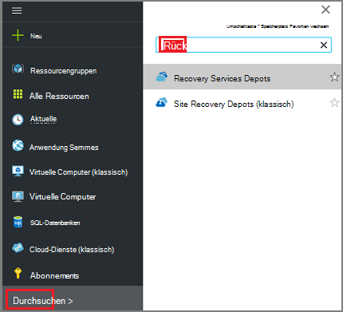
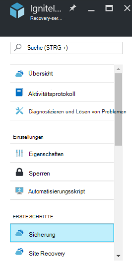
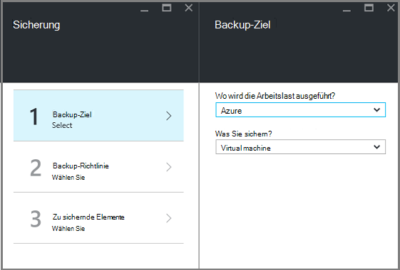
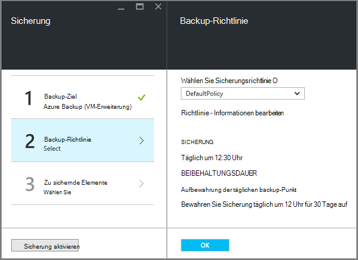
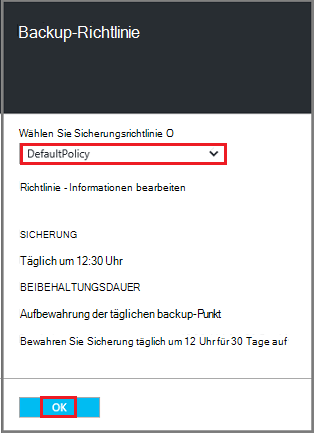
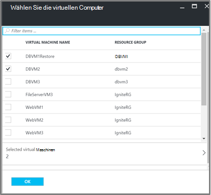
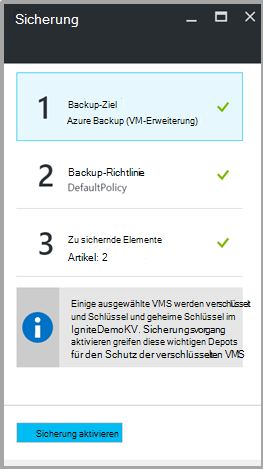

<properties
   pageTitle="Sicherung und Wiederherstellung verschlüsselt VMs mit Azure Backup"
   description="Dieser Artikel spricht über die Sicherung und Wiederherstellung Erfahrung für VMs mit Azure Datenträgerverschlüsselung verschlüsselt."
   services="backup"
   documentationCenter=""
   authors="JPallavi"
   manager="vijayts"
   editor=""/>
<tags
   ms.service="backup"
   ms.devlang="na"
   ms.topic="article"
   ms.tgt_pltfrm="na"
   ms.workload="storage-backup-recovery"
   ms.date="10/25/2016"
   ms.author="markgal; jimpark; trinadhk"/>

# Sicherung und Wiederherstellung verschlüsselt VMs mit Azure Backup

Dieser Artikel spricht über Schritte zur Sicherung und Wiederherstellung virtueller Maschinen mit Azure Backup. Darüber hinaus Informationen über unterstützte Szenarios erforderlichen Komponenten und Schritte zur Problembehandlung für Fehler.

## Unterstützte Szenarios

> [AZURE.NOTE]
1.  Sicherung und Wiederherstellung der verschlüsselten VMs werden nur für virtuelle Maschinen Ressourcen-Manager bereitgestellt. Es wird nicht für klassische virtuelle Maschinen unterstützt.  
2.  Es werden nur für virtuelle Maschinen mit BitLocker-Verschlüsselungsschlüssel und Verschlüsselungsschlüssel verschlüsselt. Es nicht für virtuelle Computer nur mit BitLocker Schlüssel verschlüsselt werden.  

## Erforderliche Komponenten

1.  Virtual Machine wurde [Azure Datenträger](../security/azure-security-disk-encryption.md)Verschlüsselung verschlüsselt. Sie sollten mit BitLocker-Verschlüsselungsschlüssel und Verschlüsselungsschlüssel verschlüsselt werden.
2.  Recovery Services Depot erstellt wurde und Speicherreplikation legen mithilfe der Schritte im Artikel [Vorbereiten Ihrer Umgebung für die Sicherung](backup-azure-arm-vms-prepare.md).

## Sicherung VM
Gehen Sie backup Ziel Definieren von Richtlinien, Elemente und Trigger Sicherung konfigurieren.

### Konfigurieren Sie die Sicherung

1. Haben Sie bereits einen Recovery Services Tresor öffnen, fahren Sie mit Schritt. Wenn Sie keinen Recovery-Services offen vault, aber im Azure-Portal den Hub klicken Sie auf **Durchsuchen**.

  - Geben Sie in der Liste der Ressourcen **Recovery Services**.
  - Wie Sie mit der Eingabe beginnen, die Liste Filter basierend auf Ihrer Eingabe. Wenn **Recovery Services Depots**angezeigt wird, klicken Sie darauf.
  
        

    Recovery Services Depots angezeigt. Wählen Sie aus der Liste der Recovery Services Depots ein Depot.

    Das ausgewählte Depot-Schaltpult wird geöffnet.

2. Klicken Sie aus der Liste der Elemente, die unter Depot angezeigt wird auf **Sicherungskopie** öffnen Backup-Blade.

       
    
3. Klicken Sie auf Blade Sicherung **Backup-Ziel** um das Backup-Ziel-Blatt öffnen.

       
    
4.   -Blade Backup-Ziel in Azure festgelegt **, auf dem Ihre Arbeitslast ausgeführt** und **möchten, Sichern** virtuellen Computer klicken Sie auf **OK**.

    Das Backup-Ziel-Blade geschlossen und das Sicherung Blatt geöffnet.

       

5. Wählen Sie Richtlinie Backup-Blade Sicherungsrichtlinie, **Depot gelten soll**.

       

    Details der Standardrichtlinie sind im Detail aufgeführt. Wenn Sie eine Richtlinie erstellen möchten, wählen Sie im Dropdown-Menü **Neu erstellen** . Sobald Sie auf **OK**klicken, wird die Sicherungsrichtlinie Tresor zugeordnet.

    Als nächstes wählen Sie VMs Tresor zuordnen.
    
6. Wählen Sie die verschlüsselten virtuellen Computer mit der angegebenen Richtlinie und klicken Sie auf **OK**.

      
   
7. Diese Seite zeigt eine Meldung über Schlüssel Depot zugeordnete verschlüsselte VMs ausgewählt. Backup-Service benötigt Lesezugriff auf Schlüssel und geheime Schlüssel im Schlüssel Tresor. Diese Berechtigungen Sicherungsschlüssel und Schlüssel zusammen mit den zugehörigen VMs verwendet. 

      

      Sie definiert klicken alle für das Depot in der Sicherung Blade-Sicherung am unteren Rand der Seite aktivieren. Sicherung aktivieren wird die Richtlinie das Depot und die VMs bereitgestellt.

8. Die nächste Phase zur Vorbereitung Installation des VM-Agenten oder Sicherstellen der VM-Agent installiert ist. Um diesen Vorgang auszuführen, gehen Sie gemäß Artikel [Vorbereiten Ihrer Umgebung für die Sicherung](backup-azure-arm-vms-prepare.md). 

### Sicherungsauftrag auslösen
Gehen Sie gemäß Artikel [Backup Azure VMs Recovery Services Depot](backup-azure-arm-vms.md) auf Trigger Sicherungsauftrag.

## Wiederherstellen von verschlüsselten VM
Wiederherstellung für verschlüsselte und unverschlüsselte virtuelle Computer genügt. Gehen Sie gemäß der [virtuelle Computer in Azure-Portal wiederherstellen](backup-azure-arm-restore-vms.md) verschlüsselte VM wiederherstellen. Falls Sie Schlüssel und geheime Schlüssel wiederherstellen müssen, müssen Sie dieses wichtigsten Depot Wiederherstellen bereits vorhanden ist.

## Problembehandlung bei Fehlern

| Vorgang | Fehlerdetails | Auflösung |
| -------- | -------- | -------|
| Sicherung | Fehler bei der Überprüfung, virtuelle Computer mit BEK allein verschlüsselt ist. Backups können nur für virtuelle Maschinen mit BEK und KEK verschlüsselt aktiviert werden. | Virtual Machine sollte BEK mit KEK verschlüsselt werden. Danach sollten Sicherung aktiviert. |
| Wiederherstellen | Diese verschlüsselte VM können nicht wiederhergestellt werden, da wichtige Vault diese VM zugeordnet nicht vorhanden ist. | Erstellen Sie Schlüssel Tresor mit [Einstieg mit Azure Schlüssel](../key-vault/key-vault-get-started.md). Finden Sie im Artikel [Key Vault Schlüssel und Schlüssel Azure Backup wiederherstellen](backup-azure-restore-key-secret.md) , Schlüssel und Schlüssel wiederherstellen, wenn sie nicht vorhanden sind. |
| Wiederherstellen | Diese verschlüsselte VM können nicht wiederhergestellt werden, da Schlüssel und diesem virtuellen Computer zugeordnete Schlüssel nicht vorhanden sind. | Finden Sie im Artikel [Key Vault Schlüssel und Schlüssel Azure Backup wiederherstellen](backup-azure-restore-key-secret.md) , Schlüssel und Schlüssel wiederherstellen, wenn sie nicht vorhanden sind. |
