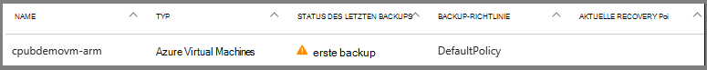
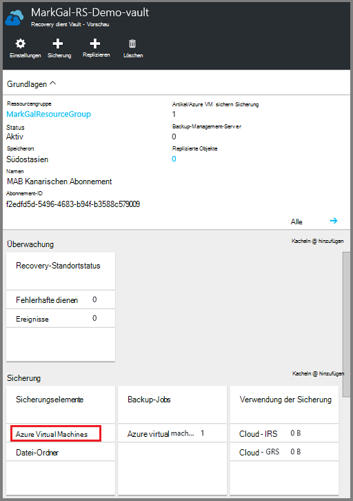
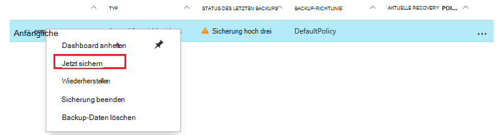
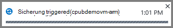
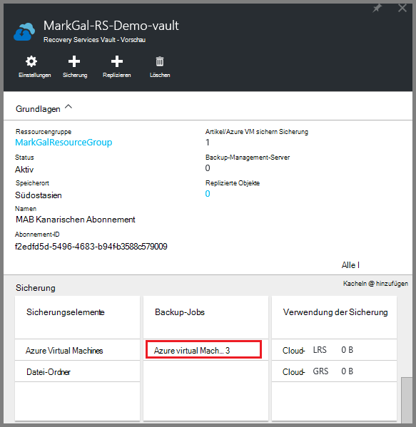
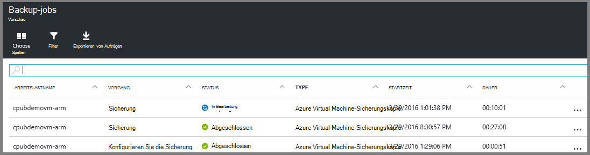

<properties
    pageTitle="Zunächst: Schützen von Azure VMs mit einem Recovery Services | Microsoft Azure"
    description="Azure-VMs mit einem Recovery Services schützen. Verwenden Sie Sicherungskopien der VMs Ressourcenmanager bereitgestellt, VMs Classic bereitgestellt und Premium Speicher VMs zum Schutz Ihrer Daten. Erstellen und Registrieren eines Depots Recovery Services. VMs registrieren, Richtlinie und VMs in Azure zu schützen."
    services="backup"
    documentationCenter=""
    authors="markgalioto"
    manager="cfreeman"
    editor=""
    keyword="backups; vm backup"/>

<tags
    ms.service="backup"
    ms.workload="storage-backup-recovery"
    ms.tgt_pltfrm="na"
    ms.devlang="na"
    ms.topic="hero-article"
    ms.date="10/13/2016"
    ms.author="markgal; jimpark"/>

# Zunächst: Azure VMs mit einem Recovery Services schützen

> [AZURE.SELECTOR]
- [Schützen von VMs mit einem Recovery services](backup-azure-vms-first-look-arm.md)
- [Schützen von VMs mit einem backup](backup-azure-vms-first-look.md)

Dieses Lernprogramm führt Sie durch die Schritte zum Erstellen eines Depots Recovery Services und ein Azure Virtual Machine (VM) sichern. Recovery Services Depots schützen:

- Azure Ressourcenmanager bereitgestellte VMs
- Klassische VMs
- Standardspeicher VMs
- Premium-Speicher VMs
- VMs mit Azure Datenträgerverschlüsselung BEK mit KEK verschlüsselt

Weitere Informationen zum Schützen von Premium-Speicher virtueller Computer finden Sie unter [Sichern und Wiederherstellen von Storage Premium VMs](backup-introduction-to-azure-backup.md#back-up-and-restore-premium-storage-vms)

>[AZURE.NOTE] Diese praktische Einführung geht bereits eine VM in Azure-Abonnement und der Sicherungsdienst auf die VM zu Maßnahmen haben.

[AZURE.INCLUDE [learn-about-Azure-Backup-deployment-models](../../includes/backup-deployment-models.md)]

Folgen Sie auf hohem Niveau die Schritte werden.  

1. Erstellen Sie ein Depot Recovery Services für einen virtuellen Computer.
2. Verwenden des Azure-Portals ein Szenario auswählen, Politik und Elemente zu identifizieren.
3. Die erste Sicherung ausgeführt.

## Ein Depot Recovery Services für einen virtuellen Computer erstellen

Ein Depot Recovery Services ist eine Entität, die speichert alle Backup- und Recovery-Punkte, die mit der Zeit erstellt wurden. Recovery Services Depot enthält auch die Sicherungsrichtlinie geschützten VMs angewendet.

>[AZURE.NOTE] Sichern virtueller Computer ist ein lokaler Prozess. Sie können nicht VMs von einer Position in ein Depot Recovery Services an einem anderen Speicherort sichern. Daher muss für jede Azure Speicherort mit VMs gesichert werden, mindestens Recovery Services Depot an diesem Speicherort vorhanden sein.

So erstellen Sie ein Depot Recovery Services:

1. Mit der [Azure-Portal](https://portal.azure.com/)anmelden.

2. Im Hub klicken Sie auf **Durchsuchen** , und geben Sie in der Liste der Ressourcen **Recovery Services**. Wie Sie mit der Eingabe beginnen, die Liste Filter basierend auf Ihrer Eingabe. Klicken Sie auf **Recovery Services Tresor**.

      

    Recovery Services Depots werden angezeigt.

3. Klicken Sie im Menü **Recovery Services Depots** **Hinzufügen**.

    

    Recovery Services Depot Blade geöffnet, **Name**, **Abonnements**, **Ressourcengruppe**und **Speicherort**angeben.

    

4. **Name**Geben Sie einen Anzeigenamen zu Tresor. Der Name muss eindeutig für den Azure-Abonnement. Geben Sie einen Namen ein, der zwischen 2 und 50 Zeichen enthält. Sie müssen mit einem Buchstaben beginnen und darf nur Buchstaben, Zahlen und Bindestriche.

5. Klicken Sie auf **Abonnement** finden in der Liste der Abonnements. Wenn Sie nicht sicher, welches Abonnement zu verwenden sind, verwenden Sie die Standardeinstellung (oder vorgeschlagene) Abonnement. Gibt es mehrere Optionen nur, wenn Ihre Organisation Konto mehrere Azure-Abonnements zugeordnet ist.

6. Klicken Sie auf **Gruppe** finden in der Liste der Ressourcengruppen, oder klicken Sie auf **neu** , um eine Ressourcengruppe erstellen. Vollständige Informationen zu Ressourcengruppen finden Sie in [Azure-Ressourcen-Manager (Übersicht)](../azure-resource-manager/resource-group-overview.md)

7. Klicken Sie auf **Speicherort** wählen geografische Region für das Depot. Das Depot **muss** sein im Bereich der virtuellen Computer, die Sie schützen möchten.

    >[AZURE.IMPORTANT] Wenn Sie den Speicherort nicht in denen VM vorhanden ist kennen, schließen das Dialogfeld Depot erstellen und die Liste der virtuellen Maschinen im Portal. Haben Sie virtuelle Computer in mehreren Regionen, erstellen Sie ein Depot Recovery Services in jeder Region. Erstellen Sie das Depot an der ersten Stelle vor der nächsten Position Speicherkonten zum Speichern von backup-Daten - Recovery Services Depot angegeben ist und der Azure-Sicherungsdienst automatisch umgehen.

8. Klicken Sie auf **Erstellen**. Es dauert eine Weile Recovery Services Depot erstellt werden. Überwachen Sie Status Benachrichtigung im oberen rechten Bereich des Portals. Erstellte Ihrem Tresor in der Liste der Recovery Services Depots angezeigt.

    

Erstellung der Vault erlernen Sie die Speicherreplikation.

### Festlegen der Speicherreplikation

Storage Replication-Option können Sie zwischen Geo-redundant und lokal redundanter Speicher auswählen. Standardmäßig hat der Tresor Geo redundanten Speicher. Lassen Sie die Option Geo redundante Speicherung ist dies die primäre Sicherung. Wählen Sie lokal redundanten Speicher, wenn Sie ein billiger, der haltbar ist. Lesen Sie mehr über [Geo-redundant](../storage/storage-redundancy.md#geo-redundant-storage) und [lokal redundanter](../storage/storage-redundancy.md#locally-redundant-storage) Speicher in [Azure Storage Replication Overview](../storage/storage-redundancy.md).

Einstellung für die Speicherung zu bearbeiten:

1. Wählen Sie den Tresor öffnen Vault-Dashboard und Blade-Einstellungen. Wenn Blatt **Einstellungen** öffnet, klicken Sie auf **Alle** Vault-Dashboard.

2. Klicken Sie auf Blatt **Einstellungen** auf **Backup-Infrastruktur** > **Sicherungskonfiguration** **Sicherungskonfiguration** Blade geöffnet. -Blade **Sicherungskonfiguration** die Option Storage Replication für den Tresor.

    

    Nach dem Auswählen der Speicheroption für Ihr Depot, können Sie die VM Tresor zuordnen. Die Zuordnung zunächst Sie entdecken und Azure virtuelle Computer registrieren.

## Wählen Sie ein backup-Ziel, Politik und Elemente zu definieren

Führen Sie vor der Registrierung einer VM mit einem Erkennungsprozess um sicherzustellen, dass alle neuen virtuellen Computer, die das Abonnement hinzugefügt wurden, identifiziert werden. Prozess Abfragen Azure für die Liste der virtuellen Computer im Abonnement sowie zusätzliche Informationen wie den Namen Cloud und der Region. In Azure-Portal bezieht Szenario Sie was Recovery Services Depot abgelegt. Richtlinie ist sind, wann und wie oft Wiederherstellungspunkte ergriffen werden. Richtlinie auch die Beibehaltungsdauer für die Wiederherstellungspunkte.

1. Wenn bereits ein Recovery Services Tresor öffnen, fahren Sie mit Schritt 2. Wenn Sie eine Wiederherstellung keinen Dienstleistungen Tresor öffnen, sind aber in Azure-Portal den Hub klicken Sie auf **Durchsuchen**.

  - Geben Sie in der Liste der Ressourcen **Recovery Services**.
  - Wie Sie mit der Eingabe beginnen, die Liste Filter basierend auf Ihrer Eingabe. Wenn **Recovery Services Depots**angezeigt wird, klicken Sie darauf.

      

    Recovery Services Depots angezeigt.
  - Wählen Sie aus der Liste der Recovery Services Depots ein Depot aus.

    Das ausgewählte Depot-Schaltpult wird geöffnet.

    

2. Klicken Sie im Schaltpult Depot auf **Sicherung** Backup-Blade öffnen.

    

    Wenn das Blade geöffnet wird, sucht der Sicherungsdienst neue VMs im Abonnement.

    

3. Klicken Sie auf Blade Sicherung **Backup-Ziel** um das Backup-Ziel-Blatt öffnen.

    

4. -Blade Backup-Ziel in Azure festgelegt **, auf dem Ihre Arbeitslast ausgeführt** und **möchten, Sichern** virtuellen Computer klicken Sie auf **OK**.

    Das Backup-Ziel-Blade geschlossen und das Sicherung Blatt geöffnet.

    

5. Wählen Sie Richtlinie Backup-Blade Sicherungsrichtlinie, **Depot gelten soll**.

    

    Details der Standardrichtlinie sind im Detail aufgeführt. Wenn Sie eine Richtlinie erstellen möchten, wählen Sie im Dropdown-Menü **Neu erstellen** . Klicken Sie im Dropdown-Menü bietet auch eine Option, wenn der Snapshot, 7 Uhr erstellt wurde, schalten. Informationen zum Definieren einer Sicherungsrichtlinie finden Sie unter [Definieren einer Sicherungsrichtlinie](backup-azure-vms-first-look-arm.md#defining-a-backup-policy). Sobald Sie auf **OK**klicken, wird die Sicherungsrichtlinie Tresor zugeordnet.

    Als nächstes wählen Sie VMs Tresor zuordnen.

6. Wählen Sie die virtuellen Computer mit der angegebenen Richtlinie und klicken Sie auf **auswählen**.

    

    Die gewünschte VM nicht angezeigt wird, sicher, dass in Azure dort als Recovery Services Depot vorhanden ist.

7. Sie definiert klicken alle für das Depot in der Sicherung Blade- **Sicherung aktivieren Sie** am unteren Rand der Seite. Die Richtlinie wird in das Depot und den VMs bereitgestellt.

    

## Erste backup

Nachdem eine Sicherungsrichtlinie auf dem virtuellen Computer bereitgestellt wurde, die nicht bedeutet wurde die Daten gesichert. Standardmäßig ist die erste geplante Sicherung (definiert die Sicherungsrichtlinie) der ersten Sicherung. Bis der ersten Sicherung zeigt den Status des letzten Backups auf der **Sicherungsaufträge** als **Warnung (erste Backup ausstehend)**.

Sei die erste Sicherung schnell beginnen, sollten **Jetzt sichern**ausführen.

**Jetzt sichern**ausführen:

1. Klicken Sie im Schaltpult Depot auf der Kachel **Backup** auf **Azure Virtual Machines**  
    

    Das **Sicherung Elemente** Blatt wird geöffnet.

2. Blade **Sicherung Elemente** Maustaste auf Vault sichern möchten, und klicken Sie auf **Jetzt sichern**.

    

    Der Sicherungsauftrag wird ausgelöst.  

    

3. Die erste Sicherung im Schaltpult Depot auf der Kachel **Sicherungsaufträge** abgeschlossen hat klicken Sie **Azure virtuelle Computer**.

    

    Backup-Jobs-Blatt wird geöffnet.

4. Backup Jobs Blatt sehen Sie den Status aller Projekte.

    

    >[AZURE.NOTE] Als Teil des Sicherungsvorgangs Befehl Azure Backup Service ein backup Erweiterung in jede VM alle Schreibvorgänge und eine konsistente Momentaufnahme.

    Nach Abschluss des Sicherungsauftrags lautet der Status *abgeschlossen*.

[AZURE.INCLUDE [backup-create-backup-policy-for-vm](../../includes/backup-create-backup-policy-for-vm.md)]

## VM-Agent auf dem virtuellen Computer installieren

Diese Informationen bei Bedarf. Der Azure-VM-Agent muss auf Azure Virtual Machine für die Backup-Erweiterung zu installiert. Allerdings ist die VM aus dem Azure-Katalog erstellt wurde, der VM-Agent bereits auf dem virtuellen Computer. VMs, die von lokalen Rechenzentren migriert werden nicht der VM-Agent installiert wird. In diesem Fall muss der VM-Agent installiert werden. Haben Sie Probleme beim Sichern der Azure-VM auf dem virtuellen Computer ordnungsgemäß Azure VM-Agent überprüfen (siehe Tabelle unten). Wenn Sie eine benutzerdefinierte VM erstellen, ist [sicherzustellen, dass das Kontrollkästchen **den VM-Agent installieren** ausgewählt ist](../virtual-machines/virtual-machines-windows-classic-agents-and-extensions.md) , bevor Sie den virtuellen Computer bereitgestellt.

Informationen Sie zu [VM-Agent](https://go.microsoft.com/fwLink/?LinkID=390493&clcid=0x409) und [die Installation](../virtual-machines/virtual-machines-windows-classic-manage-extensions.md).

Folgende Tabelle enthält zusätzliche Informationen zu den VM-Agent für Windows und Linux VMs.

| **Vorgang** | **Windows** | **Linux** |
| --- | --- | --- |
| Installieren Sie den Agent VM | <li>Downloaden Sie und installieren Sie den [Agent MSI](http://go.microsoft.com/fwlink/?LinkID=394789&clcid=0x409). Sie benötigen Administratorrechte, um die Installation abzuschließen. <li>[Aktualisieren Sie die VM-Eigenschaft](http://blogs.msdn.com/b/mast/archive/2014/04/08/install-the-vm-agent-on-an-existing-azure-vm.aspx) an, dass der Agent installiert ist. | <li> Installieren Sie den neuesten [Linux-Agent](https://github.com/Azure/WALinuxAgent) von GitHub. Sie benötigen Administratorrechte, um die Installation abzuschließen. <li> [Aktualisieren Sie die VM-Eigenschaft](http://blogs.msdn.com/b/mast/archive/2014/04/08/install-the-vm-agent-on-an-existing-azure-vm.aspx) an, dass der Agent installiert ist. |
| VM-Agent aktualisieren | Aktualisieren der VM-Agent ist so einfach wie die [VM-Agent Binärdateien](http://go.microsoft.com/fwlink/?LinkID=394789&clcid=0x409)installieren.  Stellen Sie sicher, dass kein Sicherungsvorgang ausgeführt wird, während der VM-Agent aktualisiert wird. | Gehen Sie [das Linux VM-Agent aktualisieren ](../virtual-machines-linux-update-agent.md).  Stellen Sie sicher, dass kein Sicherungsvorgang ausgeführt wird, während die VM-Agent aktualisiert wird. |
| Die VM-Agenteninstallation überprüfen | <li>Navigieren Sie zum Ordner *C:\WindowsAzure\Packages* in Azure VM. <li>Finden Sie die Datei WaAppAgent.exe.<li> Maustaste auf die Datei, **Eigenschaften Sie**und wählen Sie die Registerkarte **Details** . Das Feld Produktversion sollte 2.6.1198.718 oder höher. | N/A |

### Backup-Erweiterung

Sobald der VM-Agent auf dem virtuellen Computer installiert ist, installiert der Azure-Sicherungsdienst backup Erweiterung VM-Agent. Der Azure-Sicherungsdienst nahtlos upgrades und patches backup Erweiterung ohne weiteren Benutzereingriff.

Backup-Erweiterung wird von der Sicherungsdienst installiert, ob die VM ausgeführt wird. Eine laufende VM bietet die größte Chance anwendungskonsistente Recovery-Punkt. Weiterhin der Azure-Sicherungsdienst VM sichern, auch wenn ausgeschaltet und die Erweiterung nicht installiert werden konnte. Dies wird als Offline VM bezeichnet. In diesem Fall werden der Wiederherstellungspunkt *absturzkonsistent*.

## Informationen zur Problembehandlung
Haben Sie Probleme, die Erledigung der Aufgaben in diesem Artikel finden Sie [Problembehandlung Anleitung](backup-azure-vms-troubleshoot.md).

## Preisgestaltung
Azure VM Backup auf geschützte Instanzen Modell berechnet. Weitere [Preise sichern](https://azure.microsoft.com/pricing/details/backup/)

## Haben Sie Fragen?
Wenn Sie Fragen haben oder gibt es Funktion enthalten, angezeigt werden soll [uns Feedback senden](http://aka.ms/azurebackup_feedback).
