<properties
    pageTitle="Blick: Schützen Azure VMs mit einem backup | Microsoft Azure"
    description="Schützen Sie Azure VMs mit Sicherung. Tutorial erklärt Tresors VMs registrieren, Richtlinie erstellen und VMs in Azure zu schützen."
    services="backup"
    documentationCenter=""
    authors="markgalioto"
    manager="cfreeman"
    editor=""/>

<tags
    ms.service="backup"
    ms.workload="storage-backup-recovery"
    ms.tgt_pltfrm="na"
    ms.devlang="na"
    ms.topic="hero-article"
    ms.date="09/15/2016"
    ms.author="markgal; jimpark"/>

# Zunächst: Azure virtuelle Computer sichern

> [AZURE.SELECTOR]
- [Schützen von VMs mit einem Recovery services](backup-azure-vms-first-look-arm.md)
- [Schützen von Azure VMs mit einem backup](backup-azure-vms-first-look.md)

Dieses Lernprogramm führt Sie durch die Schritte zum Sichern einer Azure Virtual Machine (VM) backup Tresor in Azure. Dieser Artikel beschreibt die Klassisch oder Service Manager-Bereitstellungsmodell für VMs sichern. Wenn Sie in einer VM in ein Depot Recovery Services sichern möchten, die zu einer Ressourcengruppe gehört, sehen [zuerst: schützen VMs mit einem Recovery Services](backup-azure-vms-first-look-arm.md). Um dieses Lernprogramm erfolgreich abzuschließen, müssen Folgendes vorhanden sein:

- Sie haben eine VM in Azure-Abonnement.
- Die VM hat Konnektivität Azure öffentlicher IP-Adressen. Weitere Informationen finden Sie in der [Netzwerkkonnektivität](./backup-azure-vms-prepare.md#network-connectivity).

Zum Sichern einer VM sind fünf Schritte:  

 backup Depot erstellen oder identifizieren Sie eine vorhandene Sicherung Depot.  
 der Azure-Verwaltungsportal zu entdecken und registrieren Sie die virtuellen Computer verwenden.  
 den VM-Agent installieren.  
 die Richtlinie zum Schutz virtueller Computer erstellen.  
 führen Sie die Sicherung.

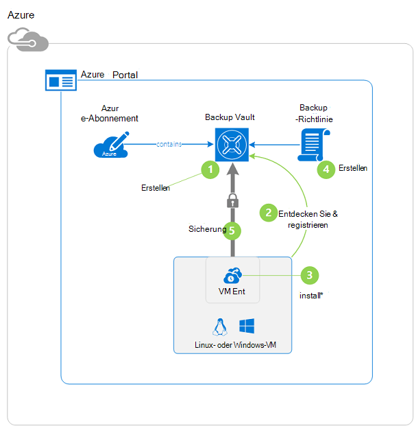

>[AZURE.NOTE] Azure hat zwei Bereitstellungsmodelle für erstellen und Verwenden von Ressourcen: [Ressourcen-Manager und Classic](../resource-manager-deployment-model.md). Dieses Lernprogramm ist für die Verwendung mit VMs in Azure-Verwaltungsportal erstellt werden können. Azure Backup-Dienst unterstützt VMs Ressourcenmanager basiert. Informationen zum Sichern von VMs in ein Depot Recovery Services finden Sie unter [First Look: schützen VMs mit einem Recovery Services](backup-azure-vms-first-look-arm.md).

## Schritt 1 - Erstellen eines backup-Depots für eine VM

Ein backup Vault ist eine Entität, die speichert alle Backup- und Recovery-Punkte, die mit der Zeit erstellt wurden. Backup Depot enthält auch backup-Policies, die den zu sichernden virtuellen Maschinen angewendet werden.

1. Melden Sie sich bei [Azure-Verwaltungsportal](http://manage.windowsazure.com/)an.

2. Klicken Sie unten links im Azure-Portal **neu**

    

3. Klicken Sie im Assistenten zum schnellen Erstellen auf **Datendienste** > **Recovery Services** > **Sicherung Vault** > **Schnell erstellen**.

    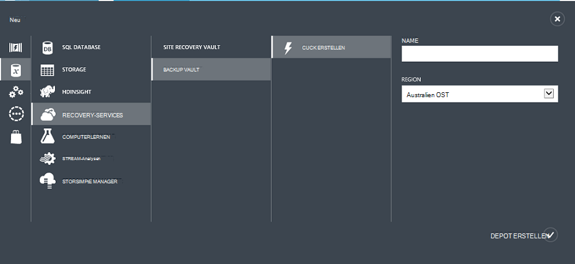

    Der Assistent fordert Sie für **Name** und **Region**. Wenn Sie mehrere Abonnements verwalten, erscheint ein Dialogfeld zum Auswählen des Abonnements.

4. **Name**Geben Sie einen Anzeigenamen zu Tresor. Der Name muss eindeutig für den Azure-Abonnement.

5. Wählen Sie im **Bereich**geografische Region für das Depot. **Muss** Vault ist im Bereich der virtuellen Computer schützt.

    Sollten Sie den Bereich nicht in dem VM vorhanden ist, schließen Sie den Assistenten und klicken Sie auf **virtuellen Computern** in der Liste der Azure-Dienste. Die Spalte enthält den Namen des Bereichs. Haben Sie virtuelle Computer in mehreren Regionen erstellen Sie ein backup Depot in jeder Region.

6. Liegt kein **Abonnement** -Dialogfeld des Assistenten, fahren Sie mit dem nächsten Schritt. Bei der Arbeit mit mehreren Abonnements wählen Sie ein Abonnement mit der neuen Sicherung zuordnen.

    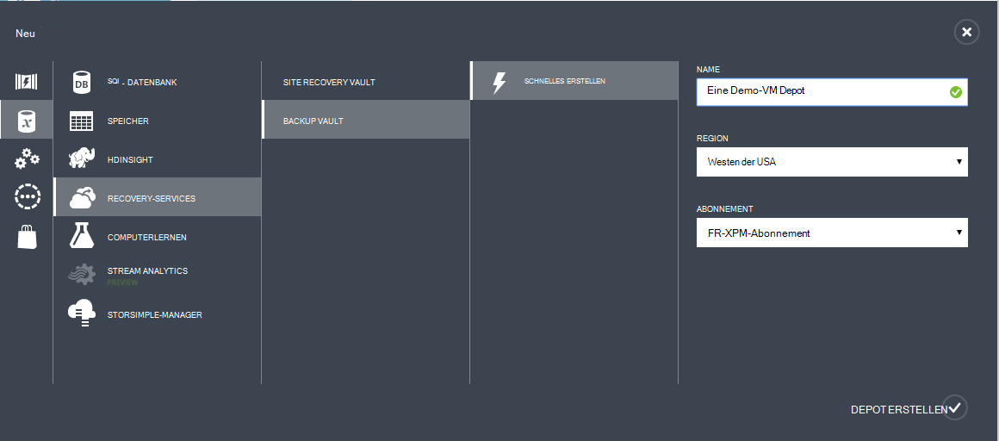

7. Klicken Sie auf **Vault**. Es dauert eine Weile backup Depot erstellt werden. Überwachen Sie Status Notifications am unteren Rand des Portals.

    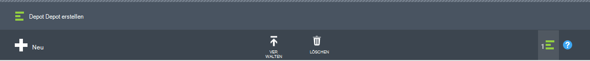

    Eine Meldung bestätigt, dass das Depot erfolgreich erstellt wurde. Es wird als **aktiv**auf **Recovery Services** aufgeführt.

    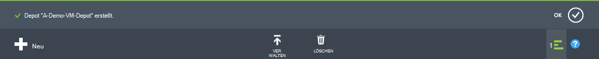

8. Wählen Sie in der Depots auf **Recovery-** Seite das Depot erstellt, um die Seite **Quick Start** starten.

    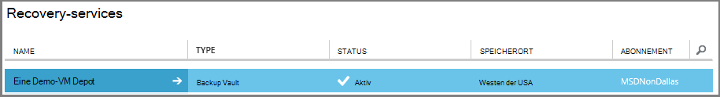

9. Der **Schnellstart** klicken Sie auf **Konfigurieren** , um die Option Storage Replication öffnen.
    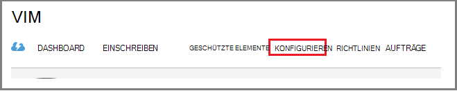

10. Die Option **Storage-Replikation** die Option Replikation für Vault.

    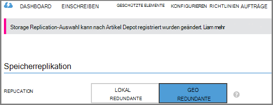

    Standardmäßig hat der Tresor Geo redundanten Speicher. Wählen Sie Geo-redundanten Speicher ist dies die primäre Sicherung aus Wählen Sie lokal redundanten Speicher, wenn Sie ein billiger, die sehr langlebig. Weitere Informationen über Geo-redundant und lokal redundanten Speicheroptionen in [Azure Storage Replication Overview](../storage/storage-redundancy.md).

Nach dem Auswählen der Speicheroption für Ihr Depot, können Sie die VM Tresor zuordnen. Die Zuordnung zunächst entdecken und Azure virtuelle Computer registrieren.

## Schritt 2: ermitteln und Azure registrieren-Computer
Führen Sie vor der Registrierung der VM mit einem Erkennungsprozess um neue VMs zu identifizieren. Dies gibt eine Liste von virtuellen Maschinen im Abonnement zusätzliche Informationen wie den Namen Cloud und der Region.

1. Melden Sie sich bei [Azure-Verwaltungsportal](http://manage.windowsazure.com/)

2. Klicken Sie in der Azure-Verwaltungsportal auf **Recovery Services** Recovery Services +++ Liste öffnen.
    

3. Wählen Sie +++ Liste Depot, um einen virtuellen Computer zu sichern.

    Wenn Sie Ihrem Tresor auswählen, wird auf **Schnellstart**

4. Klicken Sie im Depot auf **Elemente registriert**.

    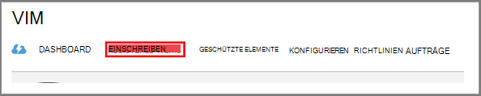

5. Wählen Sie im Menü **Typ** **Azure Virtual Machine**.

    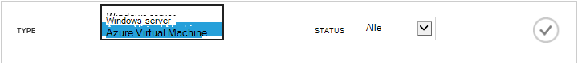

6. Klicken Sie auf **DISCOVER** am unteren Rand der Seite.
    

    Der Erkennungsvorgang kann einige Minuten dauern virtuelle Computer aufgelistet sind. Es ist eine Benachrichtigung am unteren Bildschirmrand, die Sie informiert, dass der Prozess ausgeführt wird.

    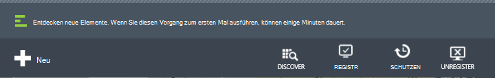

    Benachrichtigung geändert wird, wenn der Prozess abgeschlossen.

    

7. Klicken Sie unten auf der Seite **Registrieren** .
    

8. Wählen Sie im Kontextmenü **Elemente registrieren** der virtuellen Computer, die Sie registrieren möchten.

    >[AZURE.TIP] Mehrere virtuelle Maschinen können gleichzeitig registriert werden.

    Ein Auftrag wird für jeden virtuellen Computer erstellt, die Sie ausgewählt haben.

9. Klicken Sie in der Benachrichtigung der Seite **Projekte** zu **Auftrag anzeigen** .

    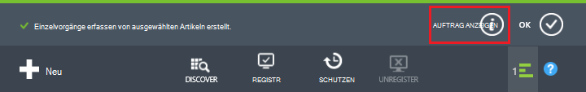

    Der virtuelle Computer wird auch in der Liste der registrierten Objekte zusammen mit dem Status des Vorgangs Registrierung.

    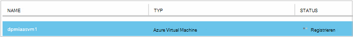

    Wenn der Vorgang abgeschlossen ist, ändert sich der *registrierte* Status widerspiegelt.

    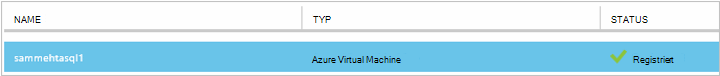

## Schritt 3: Installieren der VM-Agent auf dem virtuellen Computer

Der Azure-VM-Agent muss auf Azure Virtual Machine für die Backup-Erweiterung zu installiert. Wenn die VM aus dem Azure-Katalog erstellt wurde, ist VM-Agent bereits auf dem virtuellen Computer vorhanden. Sie können zum [Schutz der VMs](backup-azure-vms-first-look.md#step-4-protect-azure-virtual-machines)überspringen.

Wenn die VM aus einem lokalen Rechenzentrum migriert, wird die VM VM Agent installiert wahrscheinlich nicht. Sie müssen den VM-Agent auf dem virtuellen Computer zunächst die VM zu installieren. Ausführliche Anleitung zum Installieren des Agenten VM finden Sie unter [VM-Agent Abschnitt Backup VMs](backup-azure-vms-prepare.md#vm-agent).

## Schritt 4 - die Sicherungsrichtlinie erstellen
Vor dem Auslösen des ursprünglichen Sicherungsauftrags Festlegen der bei backup-Snapshots. Der Zeitplan Sicherungssnapshots sind, und die Dauer dieser Momentaufnahmen bleiben ist die Sicherungsrichtlinie. Die Aufbewahrung Informationen basiert auf Großvater-Vater und Sohn Sicherungsrotationsplan aus.

1. Backup Depot unter **Recovery Services** in Azure-Verwaltungsportal navigieren Sie und auf **Elemente registriert**.
2. Wählen Sie im Dropdown-Menü **Azure Virtual Machine** .

    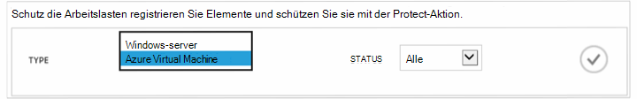

3. Klicken Sie auf **Schutz** am unteren Rand der Seite.
    

    **Elemente schützen-Assistent** wird angezeigt und listet *nur* virtuelle Computer, die registriert sind und nicht geschützt.

    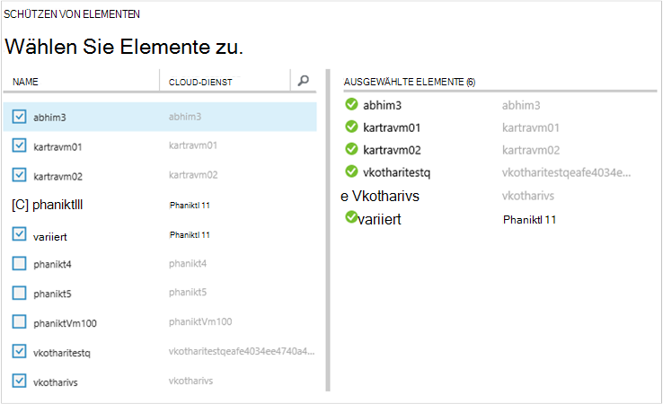

4. Wählen Sie die virtuellen Computer, die Sie schützen möchten.

    Verwenden Sie zwei oder mehrere virtuelle Computer mit demselben Namen vorhanden sind, Cloud-Dienst die virtuellen Computer unterscheiden.

5. Wählen Sie eine vorhandene Richtlinie im **Schutz konfigurieren** oder Erstellen einer neuen Richtlinie zum Schutz der virtuellen Computer, die Sie identifiziert.

    Neue Backup-Depots haben eine Standardrichtlinie Tresor zugeordnet. Diese Richtlinie wird täglich abends snapshot und der Snapshot für 30 Tage beibehalten. Jede backup-Richtlinie können mehrere virtuelle Computer zugeordnet. Jedoch kann der virtuelle Computer nur eine Richtlinie gleichzeitig zugeordnet.

    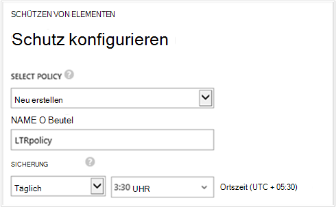

    >[AZURE.NOTE] Backup-Richtlinie umfasst eine Aufbewahrung für geplante Backups. Bei Auswahl eine vorhandene backup-Richtlinie wird im nächsten Schritt Aufbewahrung Optionen möglich.

6. **Beibehaltungsdauer** definiert den täglichen, wöchentlichen, monatlichen und jährlichen Bereich backup Punkte.

    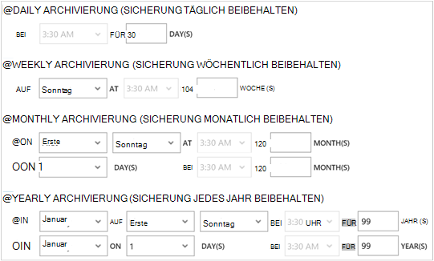

    Aufbewahrungsrichtlinie gibt die Zeitspanne für das Speichern einer Sicherung. Sie können unterschiedliche Aufbewahrungsrichtlinien basierend darauf, wann die Sicherung ausgeführt wird.

7. Klicken Sie auf **Aufträge** **Konfigurieren** Schutzaufträge anzeigen.

    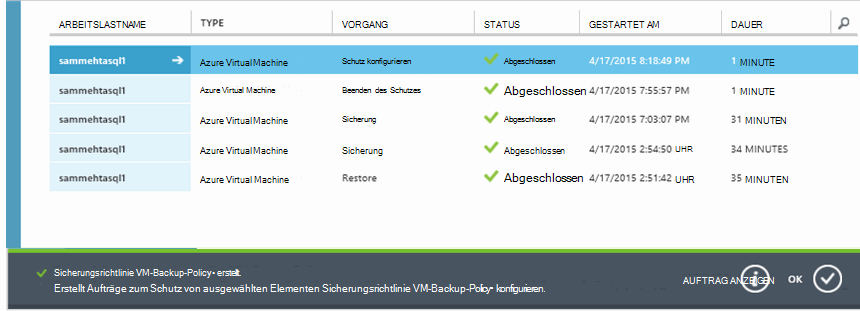

    Nachdem die Richtlinie festgelegt haben, zum nächsten Schritt und führen anfängliche Backup.

## Schritt 5: erste backup

Nach mit ein virtuellen Computer geschützt ist, können Sie diese Beziehung auf der Registerkarte **Geschützte Elemente** anzeigen. Bis der ersten Sicherung zeigt den **Schutzstatus** als **Protected - (ausstehende anfänglichen Backup)**. Standardmäßig ist die erste geplante Sicherung der *ersten Sicherung*.

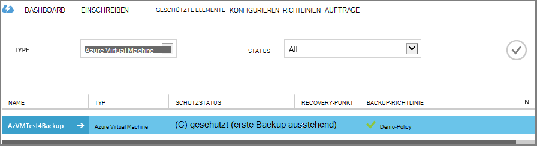

Die erste Sicherung jetzt starten:

1. Klicken Sie auf **Geschützte Elemente** auf **Jetzt sichern** am unteren Rand der Seite.
    

    Der Azure-Sicherungsdienst erstellt einen Sicherungsauftrag für die anfängliche Sicherung.

2. Klicken Sie auf der Registerkarte **Aufträge** , um die Liste der Projekte anzuzeigen.

    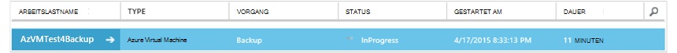

    Nach Abschluss der ersten Sicherung ist der Status des virtuellen Computers auf der Registerkarte **Geschützte Elemente** *geschützt*.

    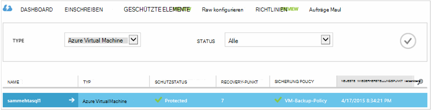

    >[AZURE.NOTE] Sichern virtueller Computer ist ein lokaler Prozess. Sie können nicht virtuelle Computer aus einem backup Tresor in anderen sichern. Für jede Azure Region mit VMs, die gesichert werden müssen, muss also mindestens backup Depot in diesem Bereich erstellt werden.

## Nächste Schritte
Da ein virtueller Computer erfolgreich gesichert wurden, sind mehrere Nächstes von Interesse sein könnten. Der logische Schritt ist Wiederherstellung der Daten einer VM vertraut. Allerdings gibt es Aufgaben, mit denen Sie verstehen, wie Ihre Daten schützen und Kosten.

- [Verwalten Sie und überwachen Sie die virtuellen Computer](backup-azure-manage-vms.md)
- [Virtuelle Computer wiederherstellen](backup-azure-restore-vms.md)
- [Hinweise zur Problembehandlung](backup-azure-vms-troubleshoot.md)

## Haben Sie Fragen?
Wenn Sie Fragen haben oder gibt es Funktion enthalten, angezeigt werden soll [uns Feedback senden](http://aka.ms/azurebackup_feedback).
